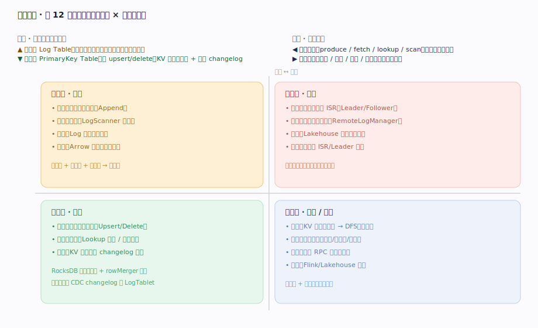
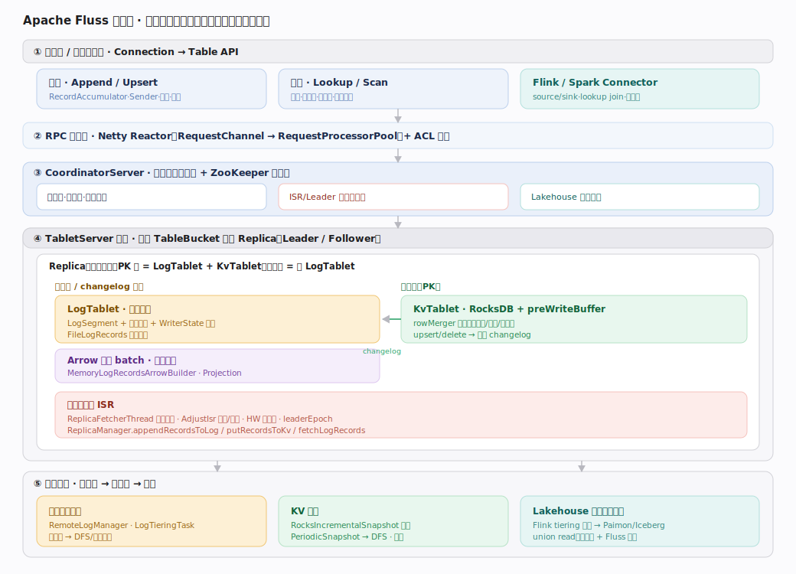
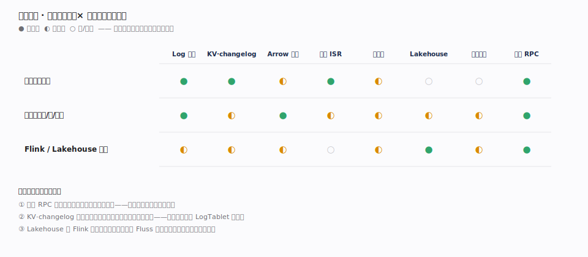
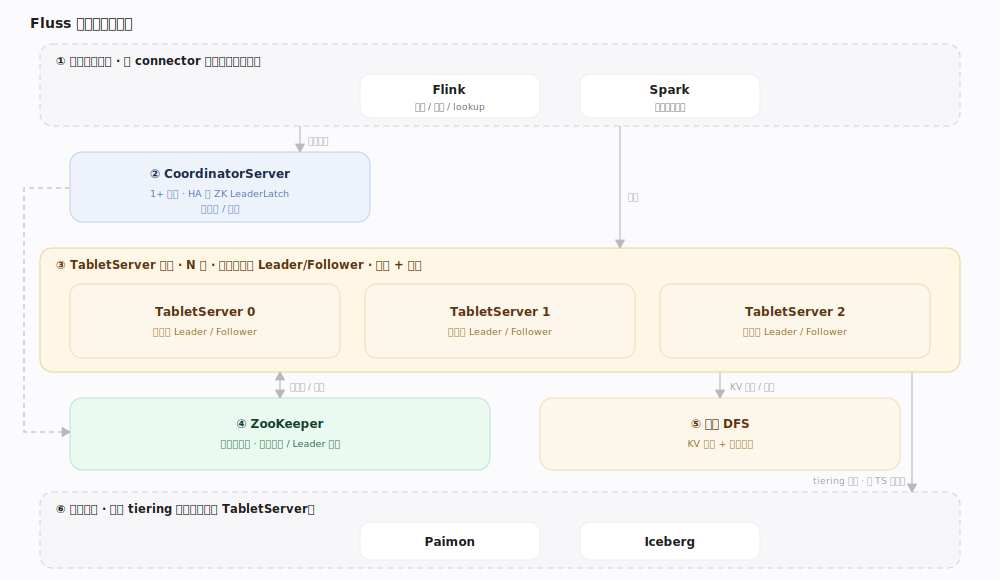

# Fluss 原理 · 全景主线框架

> **定位**：统领全部原理文档。Apache Fluss 是**面向 Flink 的流式存储（streaming storage）**——介于「消息/事件流平台（家族 9 · Kafka）」与「分布式存储（家族 4）」之间：接触面是 Table API（写 Append/Upsert、读 Lookup/Scan）而非 SQL；核心抽象是**分区桶（TableBucket）上的追加日志 + 可选 KV 物化**；靠**副本 ISR** 容错、**ZooKeeper** 管元数据、**分层存储**打通湖仓。源码基准 Apache Fluss（`/tmp/fluss-src`，`apache/fluss` commit `e1a70de`）。

Fluss 的世界观是**两种表模型共用一套桶副本**：**日志表（Log Table）**只追加、无更新，天然是流；**主键表（PrimaryKey Table）**可 upsert/delete，用 RocksDB 物化最新值，写入即产出 CDC changelog 追加回同一条 LogTablet。理解「LogTablet 追加日志 + KvTablet 物化 + 副本 ISR + 分层到湖仓」四根支柱，就理解了 Fluss。

> **结构提示（写文档必看）**：① 元数据仍用 **ZooKeeper**（`server/zk/`），不是 KRaft；② 一个 `TableBucket` = 一个 `Replica`，PK 表 = `LogTablet + KvTablet`，日志表 = 仅 `LogTablet`；③ **KvTablet 不直接写 RocksDB**，而是先追加 WAL（LogTablet）→ 进 `preWriteBuffer` → high-watermark 推进后才 flush 落 RocksDB（RocksDB 自身 WAL 被关闭，一致性由 Fluss WAL 保证）；④ 日志表默认列存格式 **Arrow**，投影下推直接在服务端裁列；⑤ 分层（tiering）是**独立 Flink 作业**读 Fluss 写 Paimon/Iceberg，湖里存快照 + 每桶 log offset 分界点。

---

## 一、双维模型：表模型 × 执行时机

- **表模型（世界观）**：日志表（仅追加，一切是分区追加日志）vs 主键表（可 upsert/delete，KV 物化最新值 + 生成 changelog）。
- **执行时机**：前台请求（produce / fetch / lookup / scan，同步、低延迟）vs 后台异步（复制 / 快照 / 分层 / 清理，吞吐、可靠）。

---

## 二、总架构图（位置即语义）

客户端 `Connection → Table` 发起写读 → 经 Netty RPC（`ApiKeys` 分派）到 `TabletServer` → Leader 的 `Replica` 把记录追加到 `LogTablet`（日志表）或经 `KvTablet` upsert（主键表，产 changelog 回 LogTablet）→ Follower 用 `ReplicaFetcherThread` pull 复制、进 ISR → HW 推进后对读可见 → 冷段由 `LogTieringTask` 上传 DFS、独立 Flink 作业分层到 Paimon/Iceberg。集群元数据（表/schema/桶/leader/ISR）由 `CoordinatorServer` 单线程事件循环维护、落 **ZooKeeper**。

---

## 三、12 条主线的分层归位

| 层 | 主线 | 一句话职责 |
|---|---|---|
| 接触面 | **表模型与写入** | Append 攒批 / Upsert 经 KV 物化 + 幂等分桶 |
| 接触面 | **读取 Lookup 与 Scan** | LogScanner 流式 / Lookuper 点查前缀 / 快照批读 |
| 接触面 | **Flink 与 Lakehouse 集成** | source/sink、lookup join、历史+实时联合读 |
| 存储 | **Log 追加存储引擎** | LogTablet→LogSegment 追加日志 + 稀疏索引 + 幂等 |
| 存储 | **KV 主键表与 changelog** | RocksDB 物化 + preWriteBuffer + rowMerger + CDC |
| 存储 | **Arrow 列存与投影下推** | 行攒 Arrow batch + 服务端裁列 + 零拷贝 |
| 复制 | **副本复制与 ISR** | Leader/Follower pull、ISR、HW、AdjustIsr |
| 协调 | **协调器元数据与调度** | 单线程事件循环 + 状态机 + Leader 选举 + ZK |
| 分层 | **分层存储与 Lakehouse** | 远程日志 tiering + 独立作业写湖 + 联合读 |
| 恢复 | **KV 快照与恢复** | 增量快照到 DFS + 下载快照回放 changelog |
| 通信 | **网络 RPC 与安全** | Netty Reactor + ApiKeys 分派 + ACL/SASL |

---

## 四、接触面 × 能力域 依赖矩阵

写入依赖 Log 存储（追加）+ KV·changelog（主键表物化）+ 副本 ISR（acks=all 等 ISR 确认）+ 网络 RPC；读取依赖 Log/KV 存储 + Arrow 列存（投影裁列）；Flink 集成最强依赖 Lakehouse（联合读历史）。协调器与网络 RPC 是全列高亮的横切底座。

---

## 五、部署与运行形态

一个 Fluss 集群 = 1+ `CoordinatorServer`（元数据/调度，HA 靠 ZK `LeaderLatch`）+ N `TabletServer`（承载桶副本，做读写与复制）+ ZooKeeper（元数据真源）+ 远程 DFS（KV 快照 + 远程日志）+ 外部湖仓（Paimon/Iceberg，独立 tiering 作业写入）。计算引擎（Flink/Spark）经 connector 接入，是 Fluss 之上的消费者/生产者，不属于集群本体。

---

## 六、三条贯穿声明（Fluss 区别于消息队列/纯存储）

1. **两种表模型在 LogTablet 汇合**：主键表的每次 upsert/delete 都被翻译成 changelog（+I/-U/+U/-D）追加到同一条 LogTablet——所以「主键表写入」本质仍是「日志表追加」，KvTablet 只是 LogTablet 的一个物化视图。这是 Fluss 与「只有日志」的 Kafka 的关键区别。
2. **先持久化 WAL、再落 KV**：KvTablet 的写从不直接落 RocksDB，而是 `putAsLeader` 先 `logTablet.appendAsLeader(walBuilder.build())` 追加日志 → 进 `preWriteBuffer` → HW 推进（数据已复制到 ISR）后 `flush` 落 RocksDB。崩溃恢复 = 下载 DFS 快照 + 从快照 offset 回放 changelog，快照严格对应一个 `flushedLogOffset`。
3. **本地热 → 远程冷 → 湖仓**：日志段先在 TabletServer 本地（保留 `table.log.tiered.local-segments` 段，默认 2），冷段异步 tier 到 DFS（`LogTieringTask`，manifest 落 ZK），再由独立 Flink 分层作业写入 Paimon/Iceberg；读时 union read 以「每桶 log offset」为分界拼接历史（湖）与实时（log）。这是 Fluss 区别于纯消息队列、成为「流式湖仓存储」的价值落点。

---

## 一句话总纲

**Fluss = 分区桶上的追加日志（LogTablet）+ 可选 KV 物化（KvTablet，写即产 changelog）+ 副本 ISR 容错 + ZK 协调 + 本地热到湖仓冷的分层存储——面向 Flink 的流式湖仓存储。**
