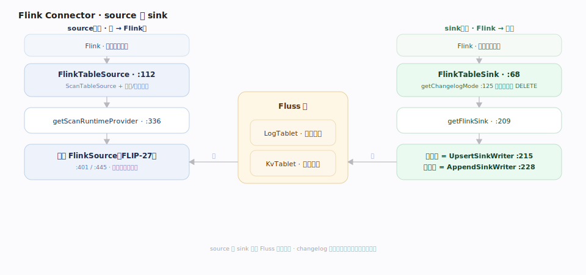
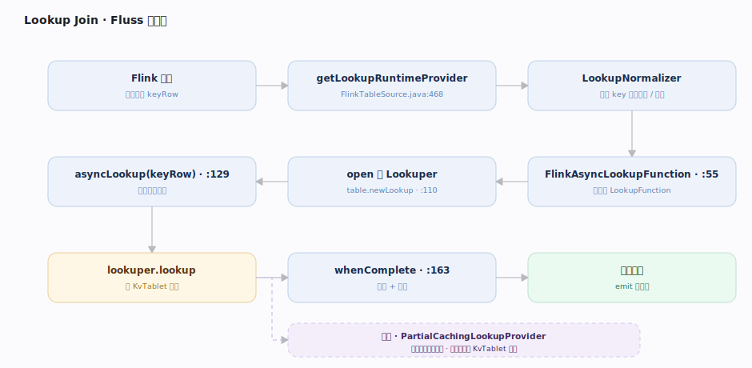
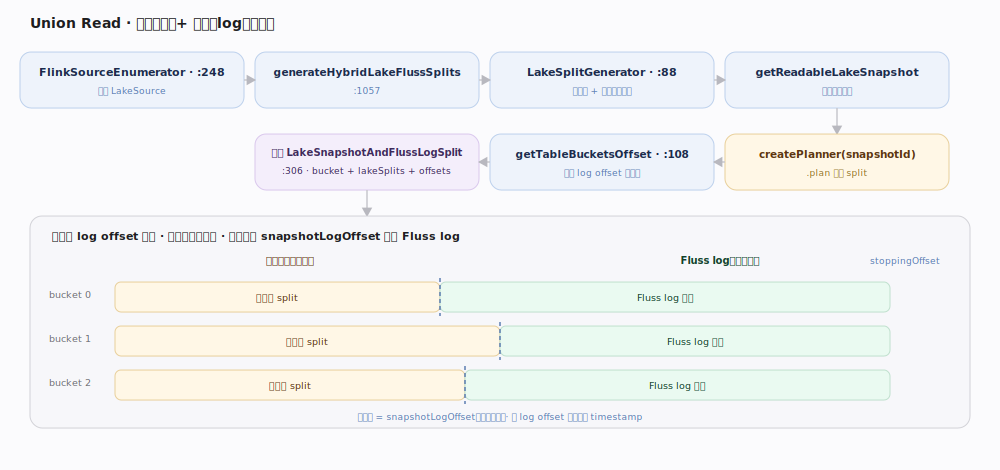

# Fluss 原理 · Flink 与 Lakehouse 集成（接触面）

> **定位**：接触面主线之一——Fluss 如何作为 Flink 的流式存储被使用。三件事：**connector source/sink**（流式读写 Fluss 表）、**lookup join**（用 Fluss 点查做维表关联）、**union read 联合读**（把湖仓历史 + Fluss 实时 log 无缝拼成一张表）。这是 Fluss 区别于纯消息队列、成为「流式湖仓」的价值出口。

Fluss 与 Flink 的集成不是简单的读写 connector，而是三层能力叠加：作为 source/sink 承载流式 pipeline；作为维表被 lookup join；作为「实时层」与湖仓「历史层」联合，用一张逻辑表同时覆盖历史全量与实时增量——分界点是每个 bucket 的 log offset。

---

## 一、Connector：source 与 sink

`FlinkTableSource`（`fluss-flink/fluss-flink-common/src/main/java/org/apache/fluss/flink/source/FlinkTableSource.java:112`）实现 `ScanTableSource`+多种下推接口；`getScanRuntimeProvider`（`:336`）流式返回基于 FLIP-27 的 `FlinkSource`（`:401`/`:445`）。`FlinkTableSink`（`flink/sink/FlinkTableSink.java:68`）的 `getFlinkSink`（`:209`）按有无主键选 `UpsertSinkWriterBuilder`（upsert）或 `AppendSinkWriterBuilder`（append，`:215`/`:228`）；`getChangelogMode`（`:125`）决定是否接受 DELETE。

---

## 二、Lookup join：Fluss 作维表

`getLookupRuntimeProvider`（`FlinkTableSource.java:468`）先用 `LookupNormalizer` 校验 lookup key 命中主键/bucket key/前缀，再据 `lookupAsync` 选 `FlinkAsyncLookupFunction`（`flink/source/lookup/FlinkAsyncLookupFunction.java:55`）或同步版。`open()` 建 `Lookuper`（`table.newLookup()`，前缀 join 时 `lookupBy(fieldNames)`，`:110-118`）；`asyncLookup(keyRow)` 归一化 key 后 `lookuper.lookup(...)` 走 KvTablet 点查，`whenComplete` 里做剩余过滤与投影（`:129-163`）。可选客户端缓存包成 `PartialCachingLookupProvider`。

---

## 三、Union read：历史（湖）+ 实时（log）联合读

`FlinkSourceEnumerator` 持 `LakeSource`（`flink/source/enumerator/FlinkSourceEnumerator.java:248`），`generateHybridLakeFlussSplits`（`:1057`）经 `LakeSplitGenerator`（`flink/lake/LakeSplitGenerator.java:88`）：`getReadableLakeSnapshot` 取湖快照 → `lakeSource.createPlanner(snapshotId).plan()` 得湖侧 split → `getTableBucketsOffset()` 得**每桶的 log offset 分界点**（`:108`）→ 构造 `LakeSnapshotAndFlussLogSplit(bucket, lakeSplits, snapshotLogOffset, stoppingOffset)`（`:306`）。湖快照读历史，Fluss log 从该 offset 起接续实时——按 **offset 分界**而非 timestamp。startup 为 FULL 且有 lake 时 `enableLakeSource=true`（`FlinkTableSource.java:381`）。

---

## 深化 · connector 下推能力

| 下推接口 | 效果 | 说明 |
|---|---|---|
| `SupportsProjectionPushDown` | 列裁剪下推到 Fluss 服务端 | 走 `FileLogProjection` |
| `SupportsFilterPushDown` / `SupportsLimitPushDown` | 谓词/limit 下推 | 单行点查走 `PushdownUtils`（`FlinkTableSource.java:349`） |
| `SupportsAggregatePushDown` | count 等聚合下推 | 快路径避免全扫 |
| `SupportsRowLevelModificationScan` | 行级更新/删除 | 配合 sink 的 delete/update 下推 |

## 拓展 · 关键配置（`fluss-common/.../config/ConfigOptions.java`）

| 配置项 | 默认 | 含义 |
|---|---|---|
| `table.datalake.enabled` | false | 表级 lakehouse 开关（`:1724`） |
| `table.datalake.freshness` | 3min | 湖表落后 Fluss 的最大时延（分层触发阈值，`:1745`） |
| `datalake.format` | 无默认 | 集群级湖格式 paimon/iceberg/lance（`:2350`） |

---

## 调优要点

- **维表 join 首选异步 + 缓存**：`FlinkAsyncLookupFunction` + `PartialCachingLookupProvider` 显著降维表访问延迟与 QPS。
- **联合读靠 datalake 开关**：批模式无 datalake 会直接抛错要求开 `table.datalake.enabled`；需要「历史+实时」一张表时务必启用并让 tiering 服务在线。
- **freshness 权衡**：`table.datalake.freshness` 越小分层越频繁、湖越新鲜但作业压力大；越大湖滞后越多。
- **投影/谓词尽量下推**：让 Fluss 服务端裁列裁行，减少进 Flink 的数据量。

## 常见误区

- **误以为 tiering 是 Fluss server 内置线程**：分层写湖是**独立的 Flink 作业**（`LakeTieringJobBuilder`），读 Fluss 写 Paimon/Iceberg；server 只调度与记录元数据。
- **误以为联合读按时间戳拼接**：分界是**每桶 log offset**（`snapshotLogOffset`），不是 timestamp。
- **误以为湖里存的是 changelog**：湖里存的是快照 + 每桶 log end offset，历史看快照、增量从该 offset 起读 Fluss log。
- **误以为无主键表能 upsert sink**：sink 是否 upsert 取决于表有无主键；无主键表只能 append。

---

## 一句话总纲

**Fluss 经 connector 作 Flink 的 source/sink，经 Lookuper 作维表 lookup join，经 LakeSplit 把湖仓历史与 Fluss 实时 log 以每桶 offset 为界联合成一张表——这套「实时+历史一体」是 Fluss 作为流式湖仓存储的价值出口。**
