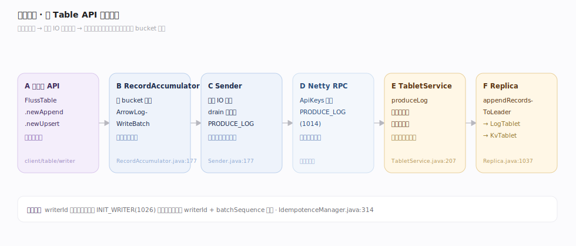
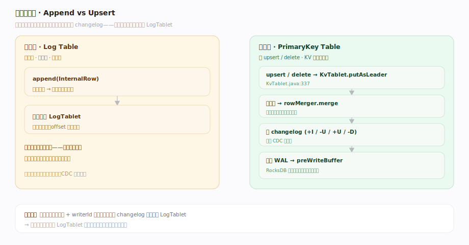
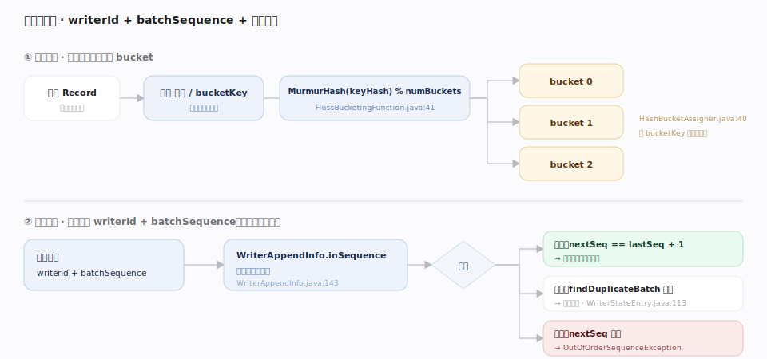

# Fluss 原理 · 表模型与写入（接触面）

> **定位**：接触面主线之一——应用如何往 Fluss 写数据。入口是 `Table.newAppend()`（日志表追加）与 `Table.newUpsert()`（主键表更新/删除）；客户端 `RecordAccumulator` 按桶攒批、`Sender` 独立线程发 `PRODUCE_LOG`，服务端 `TabletService` 落到 Leader 的 LogTablet 或 KvTablet。核心分水岭：**写什么表模型，决定走 LogTablet 追加还是 KvTablet 物化**。

Fluss 写入的第一性问题是「这是日志表还是主键表」：日志表只追加、无主键、天然有序流；主键表可 upsert/delete，服务端用 RocksDB 物化最新值、并把每次变更翻译成 changelog 追加回 LogTablet。两者共用同一套客户端攒批/分桶/幂等机制，只是服务端落点不同。

---

## 一、写入链路：从 Table API 到桶副本

`FlussTable.newAppend()/newUpsert()` 造 `AppendWriterImpl`/`UpsertWriterImpl`（`fluss-client/src/main/java/org/apache/fluss/client/table/writer/TableAppend.java:38`、`TableUpsert.java:107`）→ `WriterClient.send(WriteRecord, callback)`（`client/write/WriterClient.java:139`）→ `RecordAccumulator` 按 bucket 攒批（`client/write/RecordAccumulator.java:177`，日志表用 `ArrowLogWriteBatch`）→ 独立 IO 线程 `Sender.runOnce()` `drain` 后发 RPC（`client/write/Sender.java:177`、`:245`）→ 服务端 `TabletService.produceLog`（`fluss-server/.../server/tablet/TabletService.java:207`）→ `Replica.appendRecordsToLeader`（`server/replica/Replica.java:1037`）。

---

## 二、两种表模型：Append vs Upsert

日志表 `append(InternalRow)` 直接追加 LogTablet；主键表 `upsert`/`delete` 经 `KvTablet.putAsLeader`（`server/kv/KvTablet.java:337`）：读旧值 → `rowMerger.merge` → 产 changelog（`applyInsert/applyUpdate/applyDelete`，`KvTablet.java:561-605`）→ 追加 WAL → 进 preWriteBuffer。删除在无旧值时被忽略，`deleteBehavior` 可禁用删除。

---

## 三、幂等与分桶：writerId + batchSequence + 哈希分桶

客户端首次写向服务端申请全局 `writerId`（`INIT_WRITER(1026)`，`client/write/IdempotenceManager.java:314`）；每批带 `batchSequence`。服务端 `WriterAppendInfo.inSequence` 校验（`server/log/WriterAppendInfo.java:143`）：`nextSeq==lastSeq+1` 才算有序，重复批被 `WriterStateEntry.findDuplicateBatch` 识别并跳过（`WriterStateEntry.java:113`），乱序抛 `OutOfOrderSequenceException`。分桶由 `HashBucketAssigner`（`client/write/HashBucketAssigner.java:40`）用 `MurmurHash(keyHash) % numBuckets`（`bucketing/FlussBucketingFunction.java:41`）决定。

---

## 深化 · 写入器类型与批格式

| WriteFormat | 用途 | 服务端落点 | 说明 |
|---|---|---|---|
| `ARROW_LOG` | 日志表默认 | LogTablet | Arrow 列存 batch，投影下推友好（`client/write/WriteFormat.java`） |
| `INDEXED_LOG` | 日志表行存 | LogTablet | 索引行格式，低延迟单行 |
| `INDEXED_KV`/`COMPACTED_KV` | 主键表 | KvTablet | 经 KV 物化 + 产 changelog |
| `COMPACTED_LOG` | 日志表压缩 | LogTablet | 紧凑行格式 |

## 拓展 · 关键默认值（回源码 `fluss-common/.../config/ConfigOptions.java`）

| 配置项 | 默认 | 含义 |
|---|---|---|
| `client.writer.batch-size` | 2mb | 单桶攒批大小上限（`:1188`） |
| `client.writer.dynamic-batch-size.enabled` | true | 动态批大小，上限为 batch-size（`:1197`） |
| `client.writer.buffer.memory-size` | 64mb | 写缓冲总内存（`:1153`） |
| `client.writer.acks` | all(-1) | 确认级别，all 等 ISR（`:1249`） |
| `default.bucket.number` | 1 | 建表默认桶数（`:74`） |

---

## 调优要点

- **acks 与延迟权衡**：`acks=all`（默认）等 ISR 复制到 HW，最安全但延迟高；仅在可容忍丢数时降级。服务端 `validateInSyncReplicaSize` 会在 ISR 不足 `min.insync.replicas` 时对 acks=-1 直接拒写。
- **批大小**：增大 `client.writer.batch-size` 提吞吐、增延迟；开 `dynamic-batch-size` 让小流量自动用小批降延迟。
- **分桶键选择**：主键表 upsert 的 bucket 由主键（或指定 bucket key）哈希决定，热点键会让单桶副本成瓶颈——设计主键要散列。
- **日志表用 Arrow**：批读/投影场景保持 `table.log.format=ARROW`（默认），列裁剪可在服务端生效。

## 常见误区

- **误以为主键表写入不经日志**：主键表每次 upsert/delete 都先追加 WAL（LogTablet）再落 KV，changelog 就是这条 WAL；不是「直接改 RocksDB」。
- **误以为 writerId 是客户端本地生成**：它是向服务端 `INIT_WRITER` 申请的全局 id，用于跨会话幂等去重。
- **误以为同一主键的更新会乱序**：同一主键必定映射到同一 bucket、同一 Leader，单桶内 batchSequence 保序；跨桶无全局序。
- **误把 `default.bucket.number=1` 当生产配置**：默认单桶无并行度，生产建表须显式设桶数。

---

## 一句话总纲

**写入按表模型分流：日志表 Append 直接追加 LogTablet，主键表 Upsert 经 KvTablet 物化并把变更翻译成 changelog 追加回 LogTablet；两者共享客户端攒批、哈希分桶与 writerId+batchSequence 幂等。**
