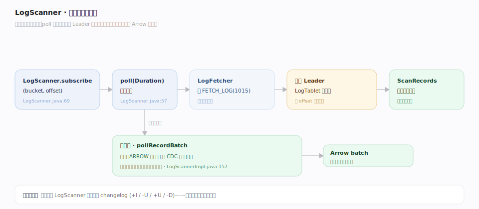
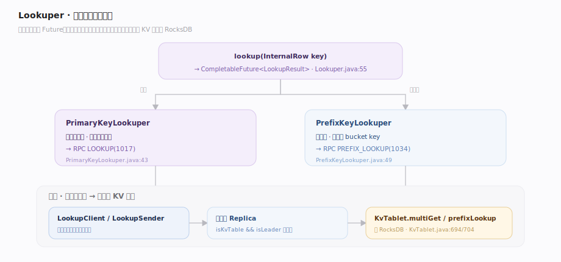
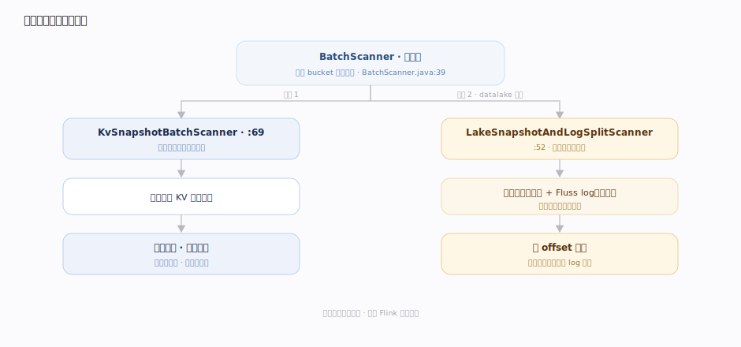

# Fluss 原理 · 读取 Lookup 与 Scan（接触面）

> **定位**：接触面主线之一——应用如何从 Fluss 读数据。三条读路径：**LogScanner** 流式顺序读日志（含主键表的 changelog）、**Lookuper** 主键点查/前缀查（走 KvTablet 的 RocksDB）、**BatchScanner** 快照批读（下载 KV 快照文件有界扫描）。读什么、要不要最新值、要不要有界，决定走哪条。

Fluss 读取的分水岭是「要流还是要点」：要**连续变更流**（订阅一段 offset 之后所有记录）走 LogScanner；要**按主键取最新值**走 Lookuper（这是 Fluss 支撑 Flink 维表 join 的关键能力）；要**一次性读全量快照**走 BatchScanner。三者都能把投影（列裁剪）下推到服务端。

---

## 一、LogScanner：流式顺序读日志

`Table.newScan()` → `LogScanner`（`fluss-client/src/main/java/org/apache/fluss/client/table/scanner/log/LogScanner.java:30`）：`subscribe(bucket, offset)`（`:69`）指定从哪个桶的哪个 offset 起读，`poll(Duration)`（`:57`）拉一批 `ScanRecords`。底层 `LogFetcher` 发 `FETCH_LOG(1015)` 到各桶 Leader；当日志是 ARROW 格式、无 CDC、无投影时可走 `pollRecordBatch` 直接返回 Arrow batch（`LogScannerImpl.java:157`）。主键表的 LogScanner 读到的就是 changelog（+I/-U/+U/-D）。

---

## 二、Lookuper：主键点查与前缀查

`Table.newLookup()` → `Lookuper.lookup(InternalRow key)`（`client/lookup/Lookuper.java:55`）返回 `CompletableFuture<LookupResult>`。两种实现：`PrimaryKeyLookuper`（全主键点查，`client/lookup/PrimaryKeyLookuper.java:43`）与 `PrefixKeyLookuper`（前缀查，`:49`，须前缀命中 bucket key）。请求经 `LookupClient`/`LookupSender` 攒批发 `LOOKUP(1017)`/`PREFIX_LOOKUP(1034)`，服务端 `Replica` 要求 `isKvTable() && isLeader()`，落到 `KvTablet.multiGet`/`prefixLookup`（`server/kv/KvTablet.java:694`、`:704`）读 RocksDB。

---

## 三、快照批读与联合读入口

`BatchScanner`（`client/table/scanner/batch/BatchScanner.java:39`）是有界读：读完 bucket 即停。`KvSnapshotBatchScanner`（`:69`）先从远端下载 KV 快照文件再扫描，给主键表提供「读某一致快照全量」的能力。当 datalake 启用时，`LakeSnapshotAndLogSplitScanner`（`client/table/scanner/batch/LakeSnapshotAndLogSplitScanner.java:52`）把湖快照（历史）+ Fluss log（实时）按 offset 拼接——这就是联合读的客户端底座（详见「Flink 与 Lakehouse 集成」主线）。

---

## 深化 · 三条读路径对比

| 路径 | 入口 | 服务端 | 语义 | 典型场景 |
|---|---|---|---|---|
| LogScanner | `newScan` | `FETCH_LOG` → LogTablet | 流式、按 offset 顺序、含 changelog | 实时消费、CDC 订阅 |
| Lookuper | `newLookup` | `LOOKUP`/`PREFIX_LOOKUP` → KvTablet | 按主键取最新值、点查/前缀 | Flink 维表 lookup join |
| BatchScanner | `newScan`(有界) | KV 快照下载 / lake split | 有界、一致快照 | 批处理、全量导出 |

## 拓展 · 投影与起始位点

| 能力 | 机制 | 锚点 |
|---|---|---|
| 投影下推 | `LogScan.withProjectedFields(int[])` → 服务端 `FileLogProjection` 裁列 | `client/.../log/LogScan.java:48` |
| 起始位点 | EARLIEST/LATEST/FULL/TIMESTAMP（Flink 侧 `OffsetsInitializer`） | 见 Flink 主线 |
| 远程日志预取 | 读到已 tier 的冷段时 `RemoteLogFetcher` 滑窗预取 | `server/kv/RemoteLogFetcher.java:69` |

---

## 调优要点

- **维表 join 用异步 Lookuper**：Flink 侧优先 `lookupAsync`，配合客户端点查缓存，减少同步阻塞。
- **投影尽早下推**：`withProjectedFields` 让服务端 `FileLogProjection` 只读投影列（Arrow 二进制上裁列），省网络与反序列化。
- **poll 超时与批量**：`poll(Duration)` 的超时影响端到端延迟；批量拉取 Arrow batch（满足条件时）避免逐行开销。
- **点查只对主键表**：Lookuper 要求 KV 表且目标是 Leader，日志表不支持点查。

## 常见误区

- **误以为 LogScanner 能点查**：LogScanner 是顺序流式读，不能按主键随机取；点查必须用 Lookuper（KvTablet）。
- **误以为前缀查任意列可用**：`PrefixKeyLookuper` 要求前缀恰好命中 bucket key，否则无法定位桶。
- **误以为批读一定读湖**：`KvSnapshotBatchScanner` 读的是 Fluss 自己的 KV 快照；只有 datalake 启用时才走 lake split 联合读。
- **误以为读远程冷段和本地一样快**：冷段需 `RemoteLogFetcher` 从 DFS 下载并预取，延迟高于本地页缓存命中。

---

## 一句话总纲

**读分三路——LogScanner 顺序流式读日志（含 changelog）、Lookuper 按主键点查前缀查（走 KvTablet/RocksDB）、BatchScanner 有界读一致快照；三者都能把投影下推到服务端，联合读则以每桶 log offset 拼接湖的历史与 log 的实时。**
