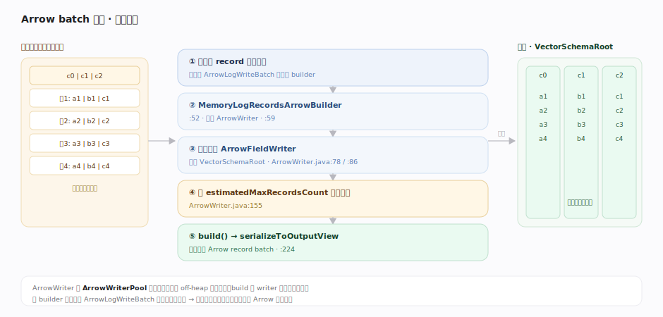
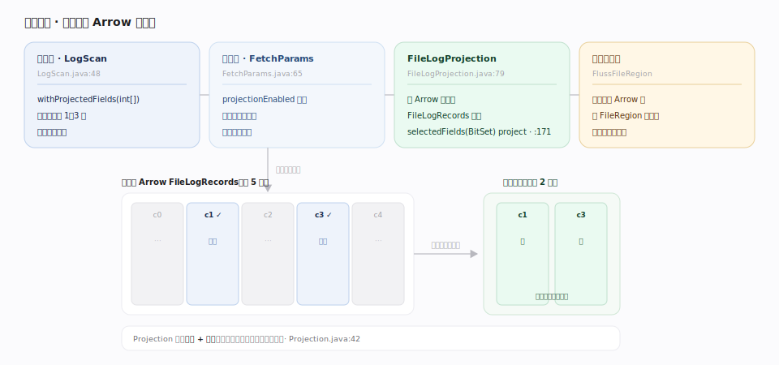

# Fluss 原理 · Arrow 列存与投影下推（支撑）

> **定位**：支撑能力域之一，Fluss 面向分析的列存底座。日志表默认以 **Apache Arrow** 列存格式攒批落盘（`table.log.format=ARROW`）——行数据经 `MemoryLogRecordsArrowBuilder` 攒成 Arrow record batch，读时可在服务端直接对 Arrow 二进制**只读投影列**，无需反序列化全部字段。这是 Fluss 区别于「纯行存消息队列」、支撑高效列裁剪的关键。

Arrow 列存回答的是「分析型读取如何少读数据」。行存日志读一行要拉全部列，而列存把同列数据连续存放，投影下推能让服务端只 transfer 需要的列。Fluss 把 Arrow 织进日志批格式，使得同一条 LogTablet 既能顺序流式读、又能列式裁剪读。

---

## 一、Arrow batch 构建：行攒成列

`MemoryLogRecordsArrowBuilder`（`fluss-common/.../record/MemoryLogRecordsArrowBuilder.java:52`）持有 `ArrowWriter`（`:59`）：写入的行经每列一个 `ArrowFieldWriter` 写进 `VectorSchemaRoot`（`row/arrow/ArrowWriter.java:78`、`:86`）；到 `estimatedMaxRecordsCount` 触发写满（`:155`）；`build` 时 `arrowWriter.serializeToOutputView`（`MemoryLogRecordsArrowBuilder.java:224`）把列向量序列化为 Arrow record batch。`ArrowWriter` 由 `ArrowWriterPool` 池化复用，避免反复分配 off-heap 内存。客户端 `ArrowLogWriteBatch` 即用此 builder 攒批。

---

## 二、投影下推：服务端在 Arrow 上裁列

客户端 `LogScan.withProjectedFields(int[])`（`client/.../log/LogScan.java:48`）把投影经 `FETCH_LOG` 下推。服务端 `FileLogProjection`（`fluss-common/.../record/FileLogProjection.java:79`）直接在 Arrow 格式的 `FileLogRecords` 二进制消息上按 `selectedFields`（BitSet）**只读投影列**（`project(FileChannel, start, end, maxBytes)`，`:171`），避免读全部列。`FetchParams.projectionEnabled`（`server/log/FetchParams.java:65`）在 fetch 时初始化投影，`Projection`（`fluss-common/.../utils/Projection.java:42`）支持选列 + 重排。裁列后仍走 `FlussFileRegion` 零拷贝发送。

---

## 深化 · Arrow 相关默认值与压缩

| 配置项 | 默认 | 含义 | 锚点 |
|---|---|---|---|
| `table.log.format` | ARROW | 日志表存储格式 | `ConfigOptions.java:1554` |
| `table.log.arrow.compression.type` | ZSTD | Arrow batch 压缩算法 | `:1562` |
| `table.log.arrow.compression.zstd.level` | 3 | ZSTD 压缩级别 | `:1571` |

## 拓展 · 投影模型

| 概念 | 说明 | 锚点 |
|---|---|---|
| `Projection` | 选列 + 是否需重排（reorderingNeeded） | `utils/Projection.java:42` |
| `ProjectedRow` | 行视图按投影裁列/重排 | `row/ProjectedRow.java` |
| `ProjectionPushdownCache` | 缓存投影解析，重复 fetch 免重建 | `FileLogProjection` 内 |

---

## 调优要点

- **投影尽早下推**：只选需要的列，服务端 `FileLogProjection` 在 Arrow 二进制上裁列，省网络 + 反序列化。
- **压缩级别权衡**：`table.log.arrow.compression.zstd.level` 越高压缩率越好但 CPU 越贵；默认 3 是平衡点。
- **列存适合分析、行存适合点写**：分析/批读场景保持 ARROW；若极端低延迟单行写，可选 INDEXED 行格式。
- **复用 ArrowWriter**：池化已内置，避免手动频繁创建 builder 造成 off-heap 抖动。

## 常见误区

- **误以为投影在客户端裁列**：投影下推到**服务端** `FileLogProjection`，直接在 Arrow 二进制上裁，网络上只传投影列。
- **误以为 Arrow batch 是行存**：Arrow 是列式内存/序列化格式，同列连续存放才使列裁剪高效。
- **误以为投影裁列会破坏零拷贝**：`FileLogProjection` 裁列后仍经 `FlussFileRegion.transferTo` 发送；只有 CDC 转换才绕过零拷贝。
- **误以为所有表都用 Arrow**：Arrow 是日志表默认格式，主键表值走 KV（RocksDB），二者不同。

---

## 一句话总纲

**日志表默认用 Arrow 列存攒批（MemoryLogRecordsArrowBuilder + 池化 ArrowWriter），读时投影下推让服务端 FileLogProjection 直接在 Arrow 二进制上只读投影列——列裁剪 + 零拷贝让同一条日志既能流式读又能高效分析读。**
