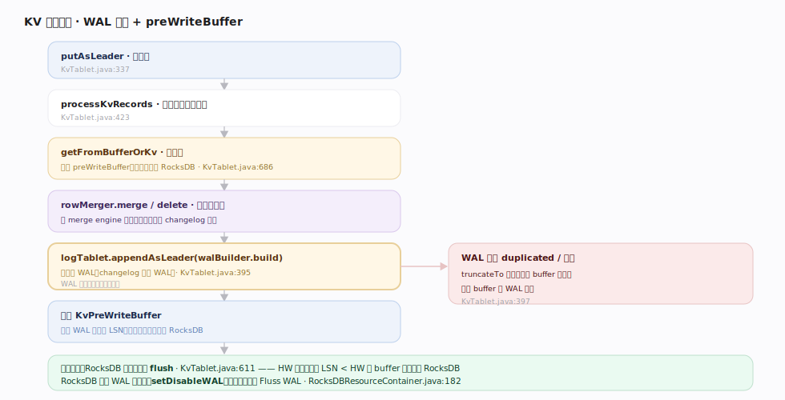
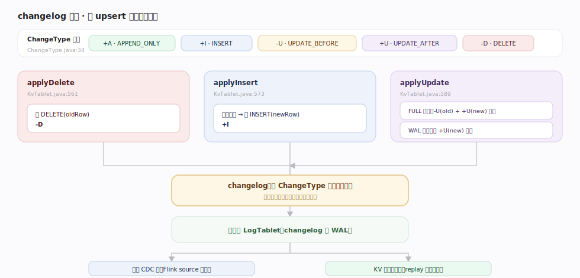
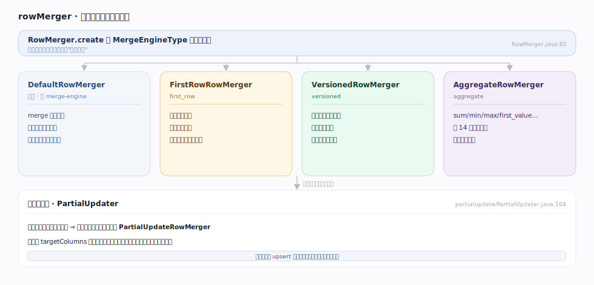

# Fluss 原理 · KV 主键表与 changelog（支撑）

> **定位**：支撑能力域之一，主键表的灵魂。主键表在每个桶上除 LogTablet 外多一个 `KvTablet`——用 RocksDB 物化每个主键的最新值，支持 upsert/delete/点查。关键机制：**写从不直接落 RocksDB**，而是「产 changelog → 追加 WAL（LogTablet）→ 进 preWriteBuffer → HW 推进后 flush 落 RocksDB」，把主键表变更翻译成日志表追加。

主键表回答的是「按主键取最新值」的需求，而 Fluss 用一个巧妙的设计统一了它与日志表：KvTablet 不是独立存储，而是 LogTablet 的物化视图。每次 upsert 都先算出 changelog（旧值→新值的 +I/-U/+U/-D）写进 WAL，RocksDB 只是这条 changelog 的物化结果。这保证了「主键表的变更也是一条可订阅的流」。

---

## 一、KV 写入路径：WAL 先行 + preWriteBuffer

`KvTablet.putAsLeader`（`server/kv/KvTablet.java:337`）全程持写锁：取 schema → 逐条 `processKvRecords`（`:423`），`row==null` 走 `processDeletion`（`:478`）否则 `processUpsert`（`:516`）→ 读旧值 `getFromBufferOrKv`（`:686`，先查 buffer 再查 RocksDB）→ `rowMerger.merge`/`delete` → 产 changelog → `logTablet.appendAsLeader(walBuilder.build)`（`:395`，先追加 WAL）→ 值进 `KvPreWriteBuffer`（`kv/prewrite/KvPreWriteBuffer.java`）。若 WAL 返回 duplicated/异常则 `truncateTo` 回滚脏值（`:397-410`）。**RocksDB 落盘发生在 flush**（见深化）。

---

## 二、changelog 生成：把 upsert 翻译成变更流

三个 `apply*` 产 changelog（`ChangeType`：+A/+I/-U/+U/-D，`fluss-common/.../record/ChangeType.java:34`）：`applyDelete` 产 `DELETE(oldRow)`（`KvTablet.java:561`）；`applyInsert` 填自增列后产 `INSERT(newRow)`（`:573`）；`applyUpdate` 在 **FULL 镜像**下产 `UPDATE_BEFORE(old)+UPDATE_AFTER(new)` 两条、**WAL 镜像**下只产 `UPDATE_AFTER`（`:589`）。镜像模式由 `TableConfig.getChangelogImage` 决定。这条 changelog 追加到 LogTablet 后，既是 CDC 流、也是崩溃恢复的重放源。

---

## 三、rowMerger：合并引擎与部分列更新

`RowMerger.create`（`server/kv/rowmerger/RowMerger.java:82`）按 `MergeEngineType` 分派：**默认 `DefaultRowMerger`**（`merge` 恒取新值，保留最新行）；**`FirstRowRowMerger`**（保留旧行、禁删）；**`VersionedRowMerger`**（按版本列比较，新版本才覆盖）；**`AggregateRowMerger`**（sum/min/max/first_value/… 14 种聚合函数）。部分列更新经 `PartialUpdater`（`kv/partialupdate/PartialUpdater.java:104`）：目标列不覆盖全字段时包成 `PartialUpdateRowMerger`，只更新指定列。

---

## 深化 · flush 与 RocksDB 落盘

| 环节 | 机制 | 锚点 |
|---|---|---|
| flush 触发 | high-watermark 推进（数据已复制到 ISR）后 `KvTablet.flush` 把 LSN < HW 的 buffer 项落 RocksDB | `KvTablet.java:611` |
| preWriteBuffer 双职责 | ① 缓冲已写 WAL 未落 RocksDB 的对；② 作 CDC 读旧值的临时缓存 | `kv/prewrite/KvPreWriteBuffer.java:41` |
| RocksDB 关 WAL | `WriteOptions.setDisableWAL(true)`——一致性由 Fluss WAL 保证 | `kv/rocksdb/RocksDBResourceContainer.java:182` |
| 一桶一 RocksDB | 每个 KvTablet 独占一个 RocksDB 实例、用 default column family | `kv/rocksdb/RocksDBKv.java:64` |

## 拓展 · 合并引擎选型

| MergeEngine | 行为 | 禁用项 | 场景 |
|---|---|---|---|
| （默认） | 保留最新行 | — | 一般 upsert |
| `first_row` | 保留首次写入行 | delete、部分更新 | 去重取首条 |
| `versioned` | 按版本列择大 | delete、部分更新 | 乱序更新去旧 |
| `aggregation` | 按列聚合 | — | 实时聚合宽表 |

---

## 调优要点

- **主键选择即分桶键**：主键决定 bucket 与 RocksDB key，热点主键会让单桶 RocksDB 成瓶颈。
- **changelog 镜像模式**：WAL 镜像只产 UPDATE_AFTER，日志量小但下游拿不到旧值；FULL 镜像产前后镜像，适合需要 -U 的下游（如撤回聚合）。
- **部分列更新省带宽**：只写变化列（`PartialUpdater`），但每次要读旧值合并，读放大增加。
- **RocksDB 写批**：`kv.rocksdb.write-batch-size` 默认 2mb，flush 时批量落盘。

## 常见误区

- **误以为 upsert 直接改 RocksDB**：写先落 WAL 进 buffer，HW 推进后才 flush 到 RocksDB；崩溃时未 flush 的靠回放 WAL 恢复。
- **误以为 changelog 是额外开销可关**：changelog 就是主键表的 WAL，是恢复与 CDC 的同一份数据，不可省。
- **误以为 versioned/first_row 支持删除**：这两种合并器禁用 delete 与部分更新。
- **误以为 RocksDB 有自己的 WAL 保命**：Fluss 主动关掉了 RocksDB WAL，一致性完全由 LogTablet 的 WAL + 快照承担。

---

## 一句话总纲

**主键表 = LogTablet 之上的 RocksDB 物化视图：每次 upsert 先算 changelog 追加 WAL、进 preWriteBuffer，HW 推进后才 flush 落 RocksDB；rowMerger 决定新旧行如何合并，changelog 同时充当 CDC 流与恢复重放源。**
