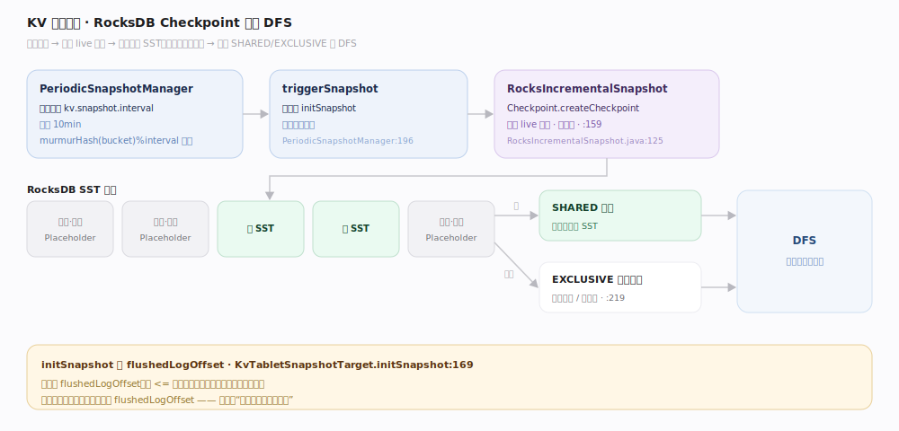
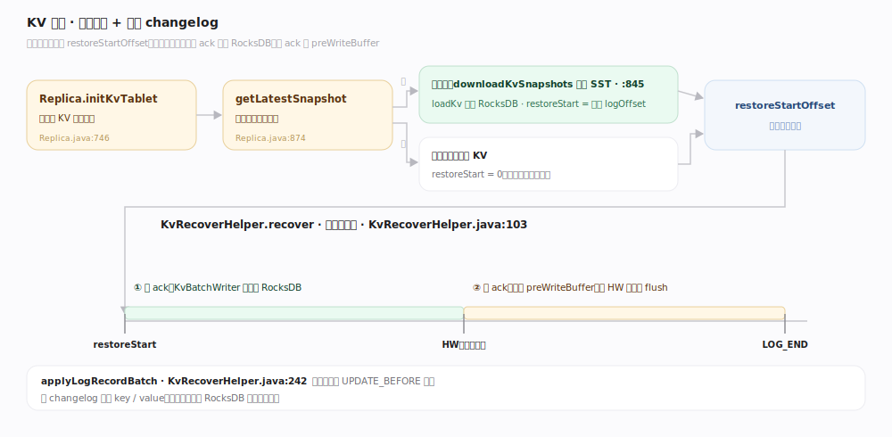

# Fluss 原理 · KV 快照与恢复（支撑）

> **定位**：支撑能力域之一，主键表的持久化与崩溃恢复。KvTablet 的 RocksDB 是「LogTablet changelog 的物化」，为避免重启时从头回放全部 changelog，Fluss 周期给 RocksDB 做**增量快照**上传 DFS（复用未变的 SST）；恢复时下载最近快照 + **从快照对应的 log offset 回放后续 changelog**。快照严格对应一个 `flushedLogOffset` 是这套机制的锚点。

KV 快照回答的是「主键表重启后如何快速恢复到最新」。纯回放 changelog 太慢，纯依赖 RocksDB 文件又不安全（RocksDB WAL 被关）。Fluss 的答案是「快照 + 增量 offset 回放」：快照捕获某个 offset 时的全量 KV，恢复只需从该 offset 补上后续变更。理解「快照点=flushedLogOffset → 上传增量 SST → 恢复=下载+回放」这条闭环即可。

---

## 一、增量快照：RocksDB Checkpoint 上传 DFS

`PeriodicSnapshotManager`（`server/kv/snapshot/PeriodicSnapshotManager.java`）周期调度（`kv.snapshot.interval` 默认 10min，用 `murmurHash(bucket)%interval` 打散初始延迟）；`triggerSnapshot`（`:196`）在写锁 executor 内 `initSnapshot`，无更新则跳过。`RocksIncrementalSnapshot`（`kv/snapshot/RocksIncrementalSnapshot.java:125`）用 RocksDB `Checkpoint.createCheckpoint` 硬链 live 文件（`:159`）；上传时**已上传过的 `.sst` 复用 `PlaceholderKvFileHandler`（增量）**，新 SST 传 SHARED 目录、其余传 EXCLUSIVE 私有目录（`:219`）。`KvTabletSnapshotTarget.initSnapshot`（`kv/snapshot/KvTabletSnapshotTarget.java:169`）读 `flushedLogOffset`，`<=` 上次快照 offset 则跳过——**快照严格对应一个 flushedLogOffset**。

---

## 二、恢复：下载快照 + 回放 changelog

`Replica.initKvTablet`（`server/replica/Replica.java:746`）：`getLatestSnapshot` 取最近 `CompletedSnapshot`（`:874`）→ 有快照则下载 SST/misc 到本地 `db` 目录（`downloadKvSnapshots`，`:845`）+ `loadKv` 打开 RocksDB，`restoreStartOffset=快照的 logOffset`；无快照则建空 kv、`restoreStartOffset=0`。`KvRecoverHelper.recover`（`server/kv/KvRecoverHelper.java:103`）**两阶段回放**：① 从 restoreStart 读到 **HW**（已 ack）经 KvBatchWriter 直接落 RocksDB；② 从 HW 读到 **LOG_END**（未 ack）放回 preWriteBuffer 等 HW 推进再 flush。`applyLogRecordBatch`（`:242`）跳过 UPDATE_BEFORE，按 changelog 反算 key/value。

---

## 深化 · 快照生命周期与提交

| 环节 | 机制 | 锚点 |
|---|---|---|
| 提交 | `handleSnapshotResult` 构造 `CompletedSnapshot` → `commitKvSnapshot` 提交协调器/ZK | `KvTabletSnapshotTarget.java:212` |
| 保留窗口 | `CompletedSnapshotStore` 保留 `kv.snapshot.num-retained`（默认 2）份，超出 subsume | `snapshot/CompletedSnapshotStore.java:63` |
| 更新截断点 | 提交成功后 `updateMinRetainOffset(flushedLogOffset)` 告知 LogTablet 可截断的最低 offset | `KvTabletSnapshotTarget.java:279` |
| 幂等提交 | 提交失败走 ZK 双检幂等（issue #1304） | `:298` |

## 拓展 · 关键默认值（`ConfigOptions.java`）

| 配置项 | 默认 | 含义 | 锚点 |
|---|---|---|---|
| `kv.snapshot.interval` | 10min | 快照周期 | `:1845` |
| `kv.snapshot.num-retained` | 2 | 保留快照份数 | `:1872` |
| `kv.snapshot.scheduler-thread-num` | 1 | 快照调度线程数 | `:1853` |
| `kv.rocksdb.write-batch-size` | 2mb | 落盘写批大小 | `:1949` |

---

## 调优要点

- **快照周期权衡**：`kv.snapshot.interval`（默认 10min）越短恢复回放越少、DFS 写越频繁；越长恢复越慢、存储省。
- **保留份数**：`kv.snapshot.num-retained`（默认 2）多一份多一层回滚余地，占更多 DFS。
- **增量复用靠 SST 不变**：RocksDB compaction 频繁会让 SST 大量重写、削弱增量效果；权衡 compaction 与快照增量率。
- **快照点约束日志截断**：LogTablet 不能截掉最新快照 offset 之后的 changelog（`minRetainOffset`），否则恢复会缺数据。

## 常见误区

- **误以为快照是全量上传**：是**增量**——未变的 SST 复用 placeholder，只传新 SST。
- **误以为恢复只靠 RocksDB 文件**：RocksDB WAL 被关，恢复 = 下载快照 + 从 offset 回放 changelog（HW 以上放回 buffer）。
- **误以为快照与 offset 无关**：快照严格对应一个 `flushedLogOffset`，是恢复回放的起点。
- **误以为快照点可随意 GC 日志**：截断点受 `updateMinRetainOffset` 约束，保证快照 + 后续 changelog 能覆盖恢复。

---

## 一句话总纲

**主键表周期给 RocksDB 做增量快照（复用未变 SST）上传 DFS，快照严格对应一个 flushedLogOffset；崩溃恢复 = 下载最近快照 + 从该 offset 两阶段回放 changelog（HW 以下落库、HW 以上进 buffer）——快照点同时约束 LogTablet 的日志截断下界。**
