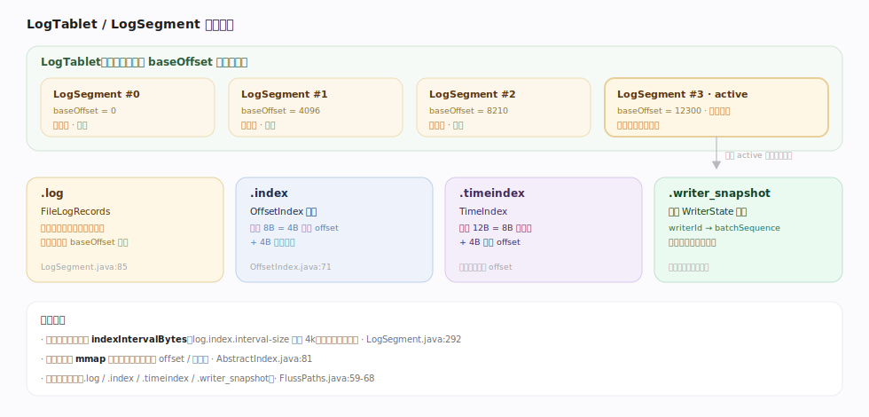
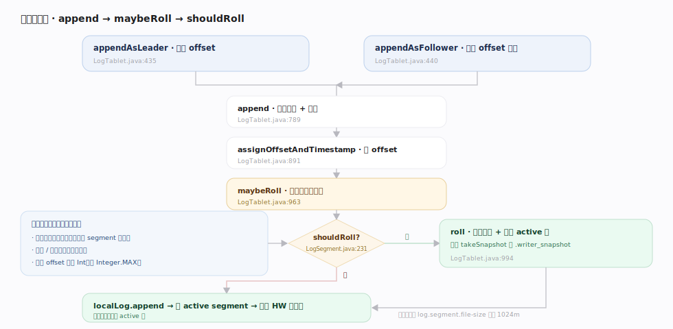
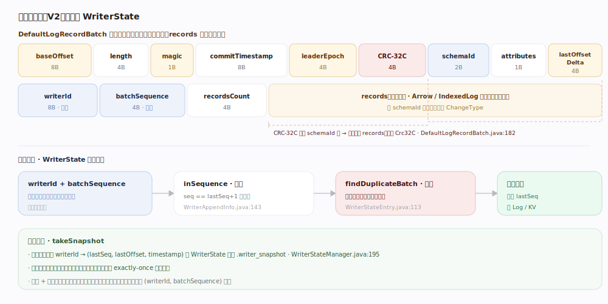

# Fluss 原理 · Log 追加存储引擎（支撑）

> **定位**：支撑能力域之一，也是 Fluss 的存储心脏。无论日志表还是主键表的 changelog，最终都落到 `LogTablet`——一条只追加、切成不可变 `LogSegment` 的日志，配 `.log` 数据文件 + `.index` 稀疏偏移索引 + `.timeindex` 时间索引 + `.writer_snapshot` 幂等快照。顺序写 + 稀疏索引 + 零拷贝读是它高吞吐的根基。

Fluss 的 Log 存储直接对标 Kafka：`LogTablet` ≈ Kafka 的 `UnifiedLog`，一个 TableBucket 一条。追加只发生在 active segment 尾部，写满或索引满就滚段（roll）成新段；旧段只读、可被 tier 到远程。理解「追加→滚段→稀疏索引→零拷贝」这条主干路径，就理解了 Fluss 的存储层。

---

## 一、LogTablet / LogSegment 文件结构

`LogSegment` 三大组成：`FileLogRecords`（`.log`，`server/log/LogSegment.java:85`）+ `LazyIndex<OffsetIndex>`（`.index`，`:88`）+ `LazyIndex<TimeIndex>`（`.timeindex`，`:91`）。索引是**稀疏**的：每写满 `indexIntervalBytes`（`log.index.interval-size` 默认 4k）才加一条索引项（`LogSegment.java:292`）。`OffsetIndex` 每项 8B（4B 相对 offset + 4B 物理位置，`OffsetIndex.java:71`），`TimeIndex` 每项 12B；索引用 mmap（`AbstractIndex.java:81`）。文件后缀常量在 `fluss-common/.../utils/FlussPaths.java:59-68`。

---

## 二、追加与滚段：append → maybeRoll → shouldRoll

`LogTablet.appendAsLeader`（`server/log/LogTablet.java:435`）由 leader 分配 offset；`appendAsFollower`（`:440`）不分配、只校验 offset 单调（`offsetsMonotonic`，`:815`）。核心 `append`（`:789`）：校验记录 → 加锁 → leader 分支 `assignOffsetAndTimestamp`（`:891` 给 batch 设 baseOffset/commitTimestamp）→ `maybeRoll`（`:963`）→ 幂等校验 → `localLog.append` → 更新 HW。滚段条件 `LogSegment.shouldRoll`（`:231`）：段放不下这批 **或** 索引写满 **或** 相对 offset 溢出 Int。段大小上限 `log.segment.file-size` 默认 1024m。

---

## 三、记录批格式与幂等 WriterState

磁盘批格式 V2（`fluss-common/.../record/LogRecordBatchFormat.java`）：baseOffset(8B)→length→magic→commitTimestamp→leaderEpoch→**CRC-32C**→schemaId→attributes→lastOffsetDelta→**writerId**→**batchSequence**→recordsCount→records。CRC 覆盖 schemaId 起至批尾（`DefaultLogRecordBatch.computeChecksum`，`:182`，用 `Crc32C`）。幂等：`WriterAppendInfo.inSequence`（`server/log/WriterAppendInfo.java:143`）判序，重复批被 `WriterStateEntry.findDuplicateBatch`（`:113`）识别跳过；滚段时 `WriterStateManager.takeSnapshot()`（`:195`）落 `.writer_snapshot`。

---

## 深化 · 恢复与本地清理

| 机制 | 做法 | 锚点 |
|---|---|---|
| recovery point | 每 `log.flush.offset.checkpoint-interval`（默认 60s）写 `recovery-point-offset-checkpoint` | `server/log/LogManager.java:86`、`:156` |
| 启动恢复 | 从 checkpoint 读各桶 recoveryPoint，clean-shutdown 则跳过大部扫描 | `LogManager.java:198`、`:214` |
| 本地段删除 | **非纯 TTL**：保留末尾 `table.log.tiered.local-segments`（默认 2）段，且仅删已 tier 到远程的段 | `LogTablet.java:1261`、`:1272` |
| 远程段 TTL | `table.log.ttl`（默认 7 天，-1 不删）作用于**远程**段 | `RemoteLogTablet.java:171`、`Replica.java:379` |

## 拓展 · 零拷贝读路径

| 环节 | 机制 | 锚点 |
|---|---|---|
| 写盘 | `records.writeFullyTo(channel)`（普通 write，非零拷贝） | `fluss-common/.../record/FileLogRecords.java:173` |
| flush | `channel.force(true)` | `FileLogRecords.java:187` |
| 零拷贝发送 | `FlussFileRegion.transferTo` → `FileChannel.transferTo`（文件→socket 免用户态拷贝） | `record/bytesview/FlussFileRegion.java:83` |

---

## 调优要点

- **段大小与索引**：`log.segment.file-size`（默认 1024m）越大段越少、元数据开销低但滚段/tier 粒度粗；`log.index.interval-size`（默认 4k）越小索引越密、查 offset 越快但索引文件越大。
- **flush 策略**：`log.flush.interval-messages` 默认 `Long.MAX_VALUE`（几乎不按条数强制 fsync），依赖 OS 页缓存刷盘 + 副本冗余保数据——追求吞吐而非单机持久。
- **本地保留段数**：`table.log.tiered.local-segments`（默认 2，须 >0）决定热数据在本地保留多少段，影响本地命中率与磁盘占用。
- **零拷贝生效条件**：读路径经 `FlussFileRegion` 才零拷贝；投影/CDC 转换会绕过零拷贝。

## 常见误区

- **误以为本地段按大小/时间直接删**：Fluss 本地段删除是「保留 N 段 + 仅删已 tier 段」，纯时间 TTL 作用于**远程**段，与 Kafka 语义不同。
- **误找 cleaner-offset-checkpoint**：Fluss 只有 `recovery-point-offset-checkpoint`，没有 Kafka 的 log cleaner checkpoint。
- **误以为索引是稠密的**：offset/time 索引都是稀疏的（每 `indexIntervalBytes` 一条），查找先二分索引再顺序扫段。
- **误以为 append 就零拷贝**：写盘是普通 `channel.write`；零拷贝只在读/网络发送（`transferTo`）。

---

## 一句话总纲

**LogTablet 是一条只追加、切成不可变 LogSegment 的日志，配稀疏 offset/time 索引与 writer 幂等快照；追加→写满滚段→冷段 tier 到远程，顺序写 + 稀疏索引 + FileChannel 零拷贝是它高吞吐的三根支柱。**
