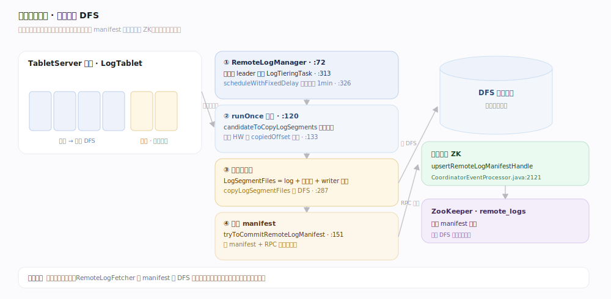
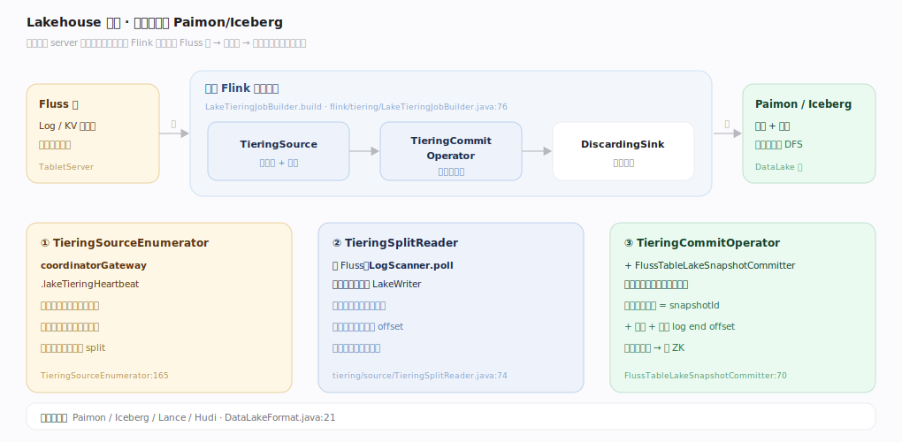

# Fluss 原理 · 分层存储与 Lakehouse（支撑）

> **定位**：支撑能力域之一，Fluss「流式湖仓存储」的价值支柱。数据在 TabletServer 本地是热的（保留末尾几段），冷段由 `LogTieringTask` 异步上传 DFS（远程日志分层，manifest 落 ZK）；更进一步，独立的 **Flink 分层作业**读 Fluss 写 Paimon/Iceberg（Lakehouse tiering），湖里存快照 + 每桶 log offset 分界点，供联合读拼接历史与实时。

分层存储回答的是「热数据低延迟、冷数据低成本、历史数据可分析」如何兼得。Fluss 用三级分层：本地热（页缓存 + 零拷贝）→ 远程冷（DFS，省本地磁盘）→ 湖仓（Paimon/Iceberg，供批分析 + 联合读）。理解「本地保留 N 段 → LogTieringTask 传 DFS → 独立作业写湖 → 两阶段提交 offset 元数据」这条冷却链，就理解了 Fluss 与纯消息队列的分水岭。

---

## 一、远程日志分层：本地冷段上传 DFS

`RemoteLogManager`（`server/log/remote/RemoteLogManager.java:72`）为每个 leader replica 建 `LogTieringTask`（`:313`），`scheduleWithFixedDelay`（`:326`，周期 `remote.log.task-interval-duration` 默认 1min）。`LogTieringTask.runOnce`（`server/log/remote/LogTieringTask.java:120`）：选待上传段（`candidateToCopyLogSegments`，基于 HW 与 copiedOffset，`:133`）→ 封 `LogSegmentFiles`（log+两索引+writer 快照）→ `remoteLogStorage.copyLogSegmentFiles` 传 DFS（`:287`）→ `tryToCommitRemoteLogManifest`（`:151`）传 manifest 并 RPC 提交给协调器，协调器 `upsertRemoteLogManifestHandle` 落 ZK（`CoordinatorEventProcessor.java:2121`）。读冷段经 `RemoteLogFetcher` 从 DFS 预取。

---

## 二、Lakehouse tiering：独立作业写 Paimon/Iceberg

分层到湖是**独立 Flink 作业**（非 server 内置）：`LakeTieringJobBuilder.build`（`fluss-flink/.../flink/tiering/LakeTieringJobBuilder.java:76`）建 `TieringSource → TieringCommitOperator → DiscardingSink`。`TieringSourceEnumerator` 经 `coordinatorGateway.lakeTieringHeartbeat`（`:165`）向协调器申领待分层表；`TieringSplitReader`（`.../tiering/source/TieringSplitReader.java:74`）**读 Fluss（LogScanner poll）写湖**（每桶一 `LakeWriter`）；`TieringCommitOperator` + `FlussTableLakeSnapshotCommitter`（`:70`）**两阶段提交**，把湖快照元数据（snapshotId + 文件 + 各桶 log end offset）回提协调器落 ZK。支持格式：Paimon/Iceberg/Lance/Hudi（`DataLakeFormat` 枚举，`fluss-common/.../metadata/DataLakeFormat.java:21`）。

---

## 深化 · 湖里存什么 + 联合读拼接

| 概念 | 内容 | 锚点 |
|---|---|---|
| 湖存快照 + offset | `LakeTableSnapshot(snapshotId, Map<TableBucket,Long> bucketLogEndOffset)` | `zk/data/lake/LakeTableSnapshot.java:38` |
| 客户端读到分界 | `LakeSnapshot.getTableBucketsOffset` = 湖已消费到的 log offset | `client/.../metadata/LakeSnapshot.java:49` |
| 联合读拼接 | 湖快照读历史，Fluss log 从 `snapshotLogOffset` 起接读实时（按 offset 而非 timestamp） | `LakeSplitGenerator.java:306` |
| 协调器调度 | `LakeTableTieringManager` 状态机：New→Scheduled→Pending→Tiering→Tiered | `coordinator/LakeTableTieringManager.java:110` |

## 拓展 · 关键配置

| 配置项 | 默认 | 含义 | 锚点 |
|---|---|---|---|
| `remote.log.task-interval-duration` | 1min | 远程日志任务周期（0=禁用远程日志） | `ConfigOptions:1011` |
| `remote.log.task-max-upload-segments` | 5 | 单次任务最大上传段数 | `:1020` |
| `remote.log-manager.thread-pool-size` | 4 | 远程日志管理线程池 | `:1038` |
| `table.datalake.enabled` | false | 表级 lakehouse 开关 | `:1724` |
| `table.datalake.freshness` | 3min | 湖表落后阈值（分层触发） | `:1745` |
| `datalake.format` | 无默认 | 集群湖格式 | `:2350` |

---

## 调优要点

- **本地保留段数 vs 远程分层周期**：`table.log.tiered.local-segments`（默认 2）决定本地热窗口；`remote.log.task-interval-duration`（默认 1min）决定冷却速度。
- **freshness 决定湖新鲜度**：`table.datalake.freshness`（默认 3min）越小湖越新鲜、分层作业压力越大。
- **tiering 作业要常驻**：湖分层是独立 Flink 作业，必须在线，否则湖不更新、批模式联合读会失败。
- **远程存储可负载均衡**：多 `remote.data.dirs` 经 `RemoteDirSelector`（round-robin/加权）分摊 IO。

## 常见误区

- **误以为分层到湖由 server 线程做**：远程日志 tiering 是 server 内 `LogTieringTask`；但**写 Paimon/Iceberg 是独立 Flink 作业**，两者不同层。
- **误以为湖存 changelog**：湖存快照 + 每桶 log end offset，不是 changelog；增量从 offset 起读 Fluss log。
- **误以为联合读按时间拼接**：分界是 **log offset**（`snapshotLogOffset`），不是 timestamp。
- **误以为远程日志和 lakehouse 是一回事**：远程日志分层是「冷段搬 DFS 仍是 Fluss 格式」；lakehouse tiering 是「转成湖表格式供外部引擎读」，是两级。

---

## 一句话总纲

**三级分层：本地热段 → LogTieringTask 冷段搬 DFS（manifest 落 ZK）→ 独立 Flink 作业读 Fluss 写 Paimon/Iceberg（两阶段提交，湖存快照+每桶 offset）；联合读以每桶 log offset 为界拼接湖的历史与 log 的实时——这是 Fluss 成为流式湖仓的价值支柱。**
