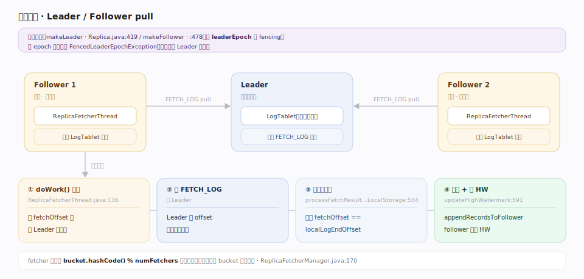
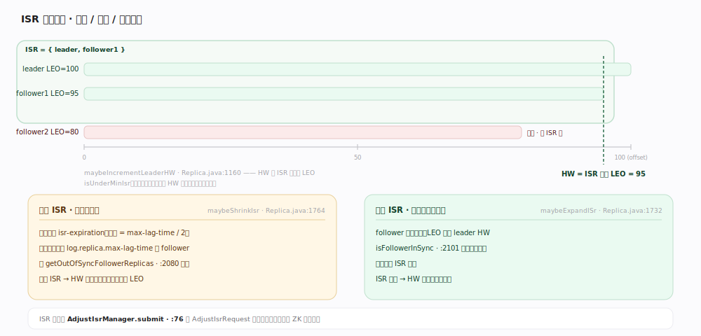
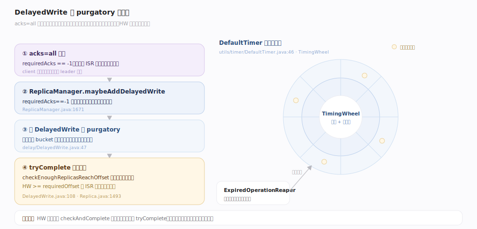

# Fluss 原理 · 副本复制与 ISR（支撑）

> **定位**：支撑能力域之一，Fluss 的容错灵魂。每个 `TableBucket` 有多个副本，一个 Leader + 若干 Follower；Follower 用 `ReplicaFetcherThread` 主动 pull Leader 的日志复制，跟上进度的副本组成 **ISR（In-Sync Replicas）**；**高水位 HW = ISR 内所有副本 LEO 的最小值**，是「已复制、可见」的边界。`acks=all` + `min.insync.replicas` 共同定义「不丢」。

副本复制回答的是「一台机器挂了数据还在吗」。Fluss 沿用 Kafka 的 ISR 模型（pull 复制、HW 可见边界、AdjustIsr 上报协调器），但适配到「桶副本 + 单线程协调器」的架构。理解「pull 复制 → 更新 LEO → 推进 HW → ISR 收缩扩张 → AdjustIsr 落 ZK」这条闭环，就理解了 Fluss 的一致性保证。

---

## 一、Leader / Follower 与 pull 复制

`Replica`（`server/replica/Replica.java:158`）一桶一实例；`makeLeader`（`:419`）/`makeFollower`（`:478`）按 `leaderEpoch` fencing 切换角色（更小 epoch 抛 `FencedLeaderEpochException`）。Follower 的 `ReplicaFetcherThread`（`server/replica/fetcher/ReplicaFetcherThread.java:79`）循环 `doWork`（`:136`）→ 发 `FETCH_LOG` 给 Leader → `processFetchResultFromLocalStorage`（`:554`）校验 `fetchOffset==localLogEndOffset` → `appendRecordsToFollower` → `updateHighWatermark`（`:591`，follower 先更 HW）。fetcher 线程按 `bucket.hashCode % numFetchers` 分配（`ReplicaFetcherManager.java:170`）。

---

## 二、ISR 与高水位：收缩、扩张、可见边界

HW 计算 `maybeIncrementLeaderHW`（`Replica.java:1160`）：从 leader LEO 起取 ISR 内所有副本 LEO 的最小值；`isUnderMinIsr` 时不推进（`:1162`）。**收缩**：周期任务（`isr-expiration`，周期 = `max-lag-time/2`）调 `maybeShrinkIsr`（`:1764`），落后超 `log.replica.max-lag-time` 的 follower 被踢出（`getOutOfSyncFollowerReplicas`，`:2080`）。**扩张**：follower fetch 追上 HW（`isFollowerInSync`，`:2101`）→ `maybeExpandISr`（`:1732`）。变更经 `AdjustIsrManager.submit`（`server/replica/AdjustIsrManager.java:76`）发 `AdjustIsrRequest` 给协调器落 ZK。

---

## 三、DelayedWrite 与 purgatory 时间轮

`acks=all` 时写入不能立即返回，要等 ISR 复制到 requiredOffset。`ReplicaManager.maybeAddDelayedWrite`（`:1671`）在 `requiredAcks==-1` 时建 `DelayedWrite`（`server/replica/delay/DelayedWrite.java:47`）挂到 purgatory；`tryComplete`（`:108`）对每桶调 `checkEnoughReplicasReachOffset`（`Replica.java:1493`，`HW>=requiredOffset` 且 ISR 足够才满足）。purgatory 由分层时间轮实现（`server/utils/timer/DefaultTimer.java:46` + `TimingWheel`），到期由 `ExpiredOperationReaper` 清理；HW 推进后 `checkAndComplete` 主动唤醒。

---

## 深化 · 一致性保证与已知边界

| 机制 | 保证 | 锚点/备注 |
|---|---|---|
| acks=all + min.insync.replicas | 写入 ISR 达 min 数才算成功，否则 `NotEnoughReplicasException` | `Replica.java:2118`；`min.insync.replicas` `ConfigOptions:992` |
| HW = ISR 最小 LEO | 消费者只见 HW 以下，未复制到 ISR 的不可见 | `Replica.java:1160` |
| leaderEpoch fencing | 旧 epoch 的 leader 请求被拒，防脑裂 | `makeLeader/makeFollower` |
| Follower 截断 | 成为 follower 时截到 HW（`truncateToHighWatermark`） | `ReplicaManager.java:1244` |
| 已知边界 | 无 leader-epoch cache，靠 end-offset snapshot 截断（issue #673）；flushKV 与 updateHW 未原子（#513） | 代码 TODO |

## 拓展 · 关键默认值

| 配置项 | 默认 | 含义 | 锚点 |
|---|---|---|---|
| `default.replication.factor` | 1 | 建表默认副本数 | `ConfigOptions:84` |
| `log.replica.min-in-sync-replicas-number` | — | ISR 最小同步副本数 | `:992` |
| `log.replica.max-lag-time` | — | follower 落后超此值踢出 ISR | `:906` |
| `log.replica.fetcher.number` | — | 每 server 的 fetcher 线程数 | `ReplicaFetcherManager.java:82` |

---

## 调优要点

- **replication.factor 与 min.insync.replicas 配对**：常用 factor=3 + min.insync=2，容忍一台挂而不丢、不阻塞。
- **max-lag-time 权衡**：太小频繁误踢慢副本、ISR 抖动；太大故障副本长期滞留 ISR 拖慢 HW。
- **fetcher 线程数**：`log.replica.fetcher.number` 影响复制并行度；桶多时适当增大。
- **acks 降级需谨慎**：acks=1/0 提吞吐降延迟但可能丢已确认数据。

## 常见误区

- **误以为 HW 是 leader LEO**：HW 是 ISR 内**最小** LEO，是可见边界；leader LEO 可能超前于 HW。
- **误以为 Follower 也能读写**：只有 Leader 处理读写，Follower 只 pull 复制。
- **误以为 ISR 变更由 TabletServer 自决**：TabletServer 只 `submit` AdjustIsr，最终由**协调器**校验并落 ZK。
- **误以为 min.insync 保证任意时刻副本齐**：它保证「写入成功时」ISR 达标；ISR 可能因慢副本临时收缩。

---

## 一句话总纲

**每桶一 Leader 多 Follower，Follower pull 复制更新 LEO，HW = ISR 最小 LEO 作可见边界；跟得上的进 ISR、落后的被周期任务踢出，变更经 AdjustIsr 落 ZK，acks=all + min.insync.replicas 共同定义「不丢」。**
