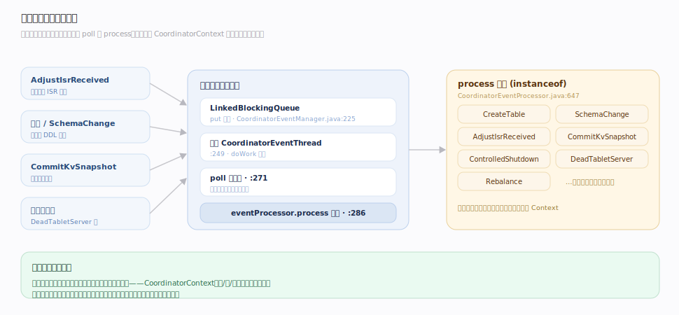
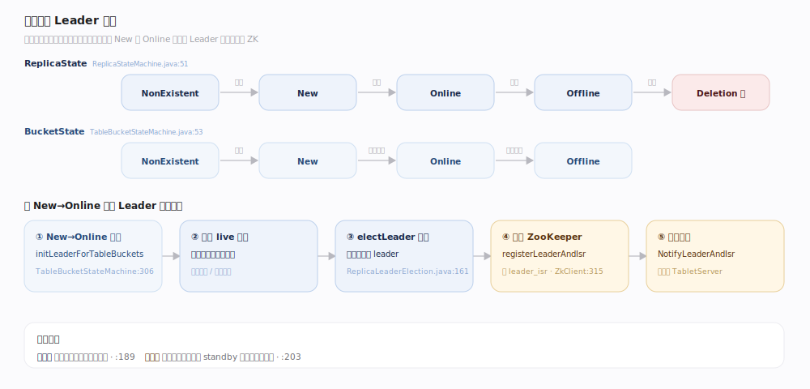
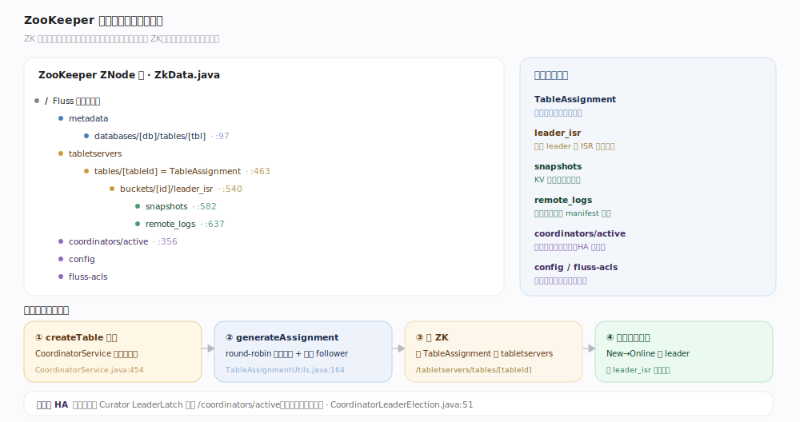

# Fluss 原理 · 协调器元数据与调度（支撑）

> **定位**：支撑能力域之一，Fluss 的控制平面。`CoordinatorServer` 用**单线程事件循环**串行处理所有集群级事件（建表、Leader 选举、ISR 调整、快照提交、节点上下线），用**状态机**驱动桶/副本在 New→Online→Offline 间转换，所有元数据（表/schema/桶/leader/ISR）落 **ZooKeeper**。单线程串行是它避免并发竞争的根本手段。

协调器回答的是「谁是 Leader、桶放在哪、元数据存哪」。与 Kafka 4.x 的 KRaft 不同，Fluss 仍用 ZooKeeper 作元数据真源 + 协调器 HA 选举。理解「事件入队 → 单线程 process → 状态机转换 → 写 ZK → 通知 TabletServer」这条控制链，就理解了 Fluss 的调度。

---

## 一、单线程事件循环

`CoordinatorEventManager`（`server/coordinator/event/CoordinatorEventManager.java:49`）用 `LinkedBlockingQueue` + 单一 `CoordinatorEventThread`（`:249`）：`put(event)` 入队（`:225`），`doWork` 用 `queue.poll` 取事件后 `eventProcessor.process(event)` **串行**处理（`:271`、`:286`）——保证 `CoordinatorContext` 与状态机只在此单线程被修改。`CoordinatorEventProcessor.process`（`server/coordinator/CoordinatorEventProcessor.java:647`）一长串 `instanceof` 分派：CreateTable / SchemaChange / AdjustIsrReceived / CommitKvSnapshot / ControlledShutdown / DeadTabletServer / Rebalance 等。

---

## 二、状态机与 Leader 选举

两台状态机：`ReplicaStateMachine`（副本 New/Online/Offline/Deletion…，`server/coordinator/statemachine/ReplicaStateMachine.java:51`）与 `TableBucketStateMachine`（桶 NonExistent/New/Online/Offline，`TableBucketStateMachine.java:53`）。`NewBucket→OnlineBucket` 走 `initLeaderForTableBuckets`（`:306`）：过滤 live 副本 → `electLeader`（`ReplicaLeaderElection.java:161`）→ `zk.registerLeaderAndIsr`（`:315`）持久化 → 批量下发 `NotifyLeaderAndIsr` 给持有副本的 TabletServer。选举策略：日志表取可用副本首个（`:189`），主键表优先提升存活 standby（`:203`）。

---

## 三、ZooKeeper 元数据与建表副本放置

元数据全落 ZK（`server/zk/data/ZkData.java`）：`/metadata/databases/[db]/tables/[tbl]`、schemas、`/tabletservers/tables/[tableId]`（TableAssignment）、`.../buckets/[id]/leader_isr`（LeaderAndIsr）、`/coordinators/active`（HA leader）、`/config`、`/fluss-acls`。建表时 `CoordinatorService.createTable`（`server/coordinator/CoordinatorService.java:454`）→ `generateAssignment`（`server/utils/TableAssignmentUtils.java:164`，Kafka 式 round-robin：随机起点 + 每绕圈错开 follower）分配桶副本到 TabletServer → 落 ZK → 事件驱动状态机上线桶（New→Online 时选 leader 写 leader_isr）。协调器 HA 靠 Curator `LeaderLatch`（`CoordinatorLeaderElection.java:51`）。

---

## 深化 · 关键 ZNode 路径

| ZNode | 存什么 | 锚点 |
|---|---|---|
| `/metadata/databases/[db]/tables/[tbl]` | 表注册信息 | `ZkData.java:97` |
| `/tabletservers/tables/[tableId]` | TableAssignment（桶→副本） | `:463` |
| `.../buckets/[id]/leader_isr` | LeaderAndIsr（leader+ISR+epoch） | `:540` |
| `/coordinators/active` | 当前活跃协调器 leader | `:356` |
| `.../buckets/[id]/snapshots` | KV 快照句柄 | `:582` |
| `.../remote_logs` | 远程日志 manifest | `:637` |

## 拓展 · AdjustIsr 处理与 fencing

| 环节 | 机制 | 锚点 |
|---|---|---|
| ISR 调整 | `tryProcessAdjustIsr` 校验后 `zk.batchUpdateLeaderAndIsr`，bucketEpoch+1 | `CoordinatorEventProcessor.java:1896` |
| epoch fencing | 事件带 coordinatorEpoch，旧 epoch 被拒 | `LeaderAndIsr.java:31` |
| 副本放置算法 | rack-unaware round-robin，随机 startIndex + nextReplicaShift | `TableAssignmentUtils.java:176` |

---

## 调优要点

- **协调器不是数据面瓶颈**：单线程只处理集群级元数据事件（建表、选举、ISR），不在读写热路径；但事件积压会拖慢 Leader 切换。
- **ZK 是元数据真源**：ZK 抖动/慢会影响建表、Leader 选举、ISR 提交；生产要给 ZK 独立可靠部署。
- **副本放置靠随机错开**：桶数远大于 server 数时分布均匀；桶数少时可能不均，需关注。
- **协调器 HA**：多协调器经 `LeaderLatch` 选主，只有 active 处理事件；standby 热备。

## 常见误区

- **误以为 Fluss 用 KRaft**：Fluss 用 **ZooKeeper**，不是 Kafka 4.x 的 KRaft。
- **误以为 ISR 由 TabletServer 直接写 ZK**：TabletServer submit AdjustIsr，由**协调器**校验后统一写 ZK。
- **误以为单线程是性能短板**：单线程避免并发竞争、简化正确性；集群级事件频率远低于数据读写。
- **误以为 Leader 选举是 ZK 自动做**：ZK 只存状态，选举逻辑在协调器状态机（`electLeader`），日志表取首个可用副本、主键表优先 standby。

---

## 一句话总纲

**CoordinatorServer 用单线程事件循环串行处理所有集群级事件，用状态机驱动桶/副本上下线并选 Leader，所有元数据落 ZooKeeper；建表经 round-robin 把桶副本放置到 TabletServer，协调器自身靠 ZK LeaderLatch 做 HA。**
