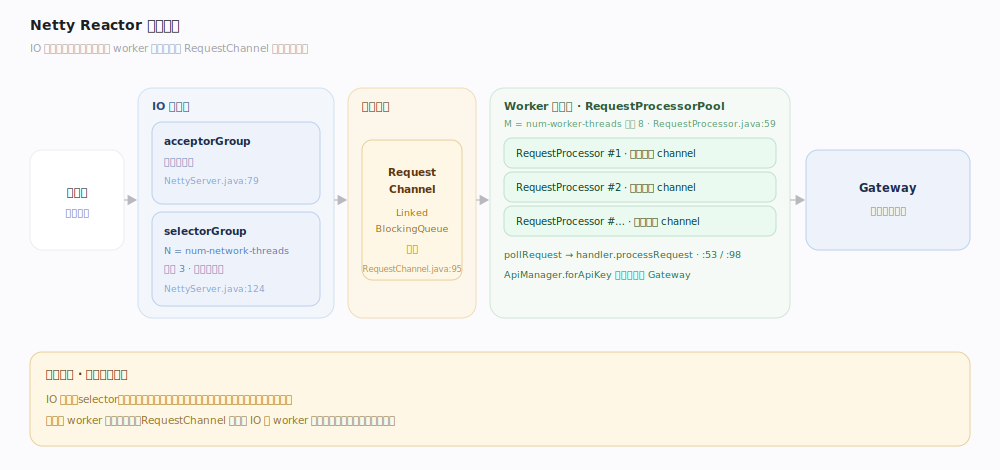
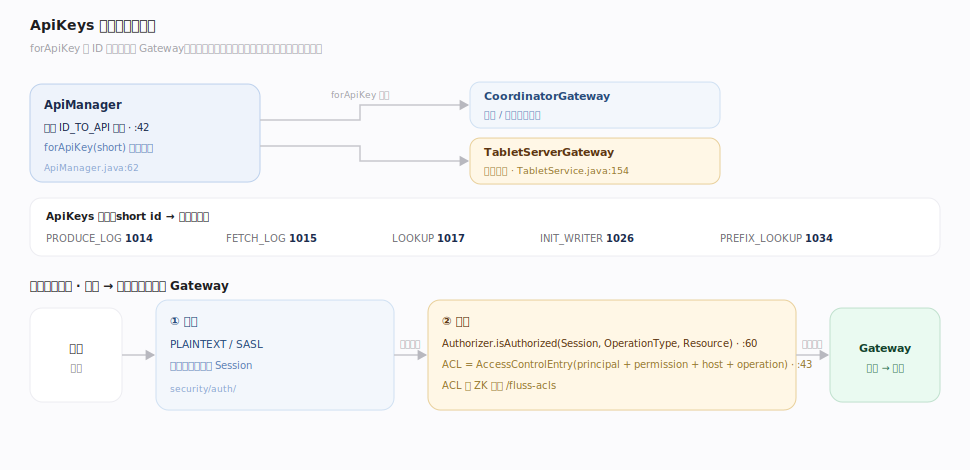

# Fluss 原理 · 网络 RPC 与安全（支撑）

> **定位**：支撑能力域之一，Fluss 一切读写的通信底座。服务端用 **Netty Reactor 线程模型**：acceptor 收连接、selector 收发字节、`RequestChannel` 队列解耦、`RequestProcessorPool` worker 线程处理，`ApiManager` 按 `ApiKeys` 把请求分派到 `TabletServerGateway`/`CoordinatorGateway`。安全侧提供可插拔认证（PLAINTEXT/SASL）+ ACL 授权（存 ZK）。

网络 RPC 回答的是「请求怎么进来、怎么并发处理、怎么鉴权」。Fluss 的 RPC 层是典型的多级 Reactor：IO 线程只做字节收发不阻塞，业务处理交给 worker 池，队列削峰。理解「acceptor → selector → RequestChannel → RequestProcessor → Gateway 分派」这条请求路径，就理解了 Fluss 的通信面。

---

## 一、Netty Reactor 线程模型

`NettyServer`（`fluss-rpc/.../rpc/netty/server/NettyServer.java:67`）双 EventLoopGroup：`acceptorGroup` 接受连接、`selectorGroup`（`netty.server.num-network-threads` 默认 3 个 selector 收发字节，`:124`）。收到的请求入 `RequestChannel`（`LinkedBlockingQueue`，`server/RequestChannel.java:46`、`:95`）；`RequestProcessorPool`（`server/RequestProcessorPool.java:38`）起 `netty.server.num-worker-threads`（默认 8）个 `RequestProcessor`，每个绑一个 channel（`:59`）循环 `pollRequest` → `handler.processRequest`（`RequestProcessor.java:53`、`:98`）。这样 IO 与业务处理分离、队列削峰。

---

## 二、ApiKeys 分派与安全鉴权

`ApiManager`（`fluss-rpc/.../rpc/protocol/ApiManager.java:42`）维护 `ID_TO_API` 映射，`forApiKey(short)`（`:62`）按 apiKey 查方法并分派到 `CoordinatorGateway`/`TabletServerGateway` 实现（业务在 `server/tablet/TabletService.java:154`：produceLog/fetchLog/lookup）。协议在 `fluss-rpc/src/main/proto/FlussApi.proto`，`ApiKeys` 枚举含 `PRODUCE_LOG(1014)`/`FETCH_LOG(1015)`/`LOOKUP(1017)`/`INIT_WRITER(1026)`/`PREFIX_LOOKUP(1034)`。鉴权：`Authorizer.isAuthorized(Session, OperationType, Resource)`（`server/authorizer/Authorizer.java:60`），ACL 经 `AccessControlEntry`（principal+permission+host+operation，`fluss-common/.../security/acl/AccessControlEntry.java:43`）存 ZK `/fluss-acls`；认证插件 PLAINTEXT / SASL（`security/auth/`）。

---

## 深化 · 请求路径与线程职责

| 层 | 职责 | 线程 | 锚点 |
|---|---|---|---|
| acceptor | 接受 TCP 连接 | acceptorGroup | `NettyServer.java:79` |
| selector | 字节收发、编解码 | selectorGroup（N=network-threads） | `:80`、`:124` |
| RequestChannel | 请求队列削峰 | — | `RequestChannel.java:95` |
| RequestProcessor | 业务处理、调 Gateway | worker 池（M=worker-threads） | `RequestProcessor.java:53` |
| Gateway 分派 | apiKey → 方法 | worker 线程 | `ApiManager.java:62` |

## 拓展 · 安全机制与配置

| 机制 | 说明 | 锚点 |
|---|---|---|
| PLAINTEXT | 不鉴权，明文 | `security/auth/PlainTextAuthenticationPlugin.java:27` |
| SASL/PLAIN | 用户名密码认证，JAAS 配置 | `security/auth/sasl/plain/` |
| ACL 授权 | user→操作→资源，存 ZK | `zk/data/ResourceAcl.java`、`/fluss-acls` |
| 线程配置 | network-threads 默认 3 / worker-threads 默认 8 | `ConfigOptions:1064`、`:1072` |

---

## 调优要点

- **network vs worker 线程**：`netty.server.num-network-threads`（默认 3）管字节收发，`num-worker-threads`（默认 8）管业务处理；CPU 密集/慢请求多时增 worker，连接/吞吐高时增 network。
- **RequestChannel 队列**：队列削峰但过深会积压增延迟；监控队列长度判断是否 worker 不足。
- **零拷贝发送**：fetch 响应经 `FlussFileRegion` 零拷贝，别在响应路径引入用户态拷贝。
- **生产必开鉴权**：默认 PLAINTEXT 不鉴权仅适合内网测试；生产用 SASL + ACL。

## 常见误区

- **误以为 IO 线程处理业务**：selector 只做字节收发，业务在 worker 池，防止慢请求阻塞 IO。
- **误以为 ApiKeys 和 Kafka 一样**：Fluss 有自己的 ApiKeys 编号（如 PRODUCE_LOG=1014），协议独立。
- **误以为 ACL 存在配置文件**：ACL 存 ZooKeeper `/fluss-acls`，动态生效。
- **误以为默认就有安全**：默认 PLAINTEXT 无认证无授权，需显式配置 SASL + Authorizer。

---

## 一句话总纲

**Netty 多级 Reactor：acceptor 收连接、selector 收发字节、RequestChannel 队列削峰、RequestProcessor worker 池处理业务，ApiManager 按 ApiKeys 分派到 Tablet/Coordinator Gateway；安全靠可插拔认证（PLAINTEXT/SASL）+ 存 ZK 的 ACL 授权。**
