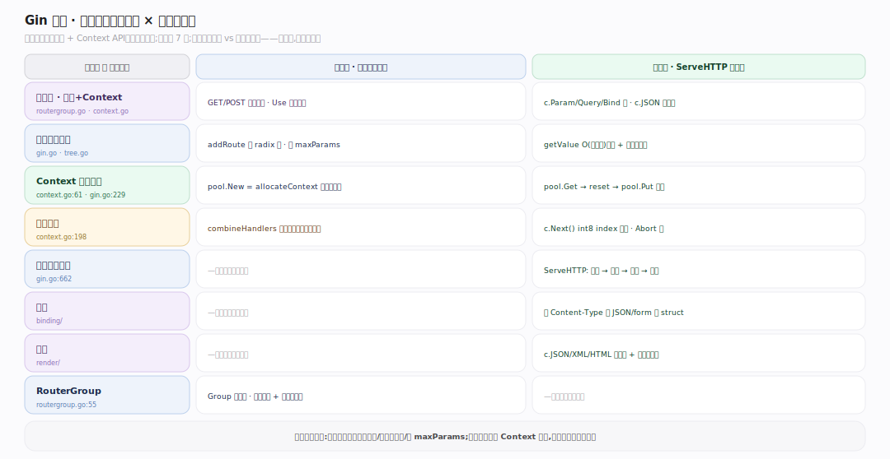
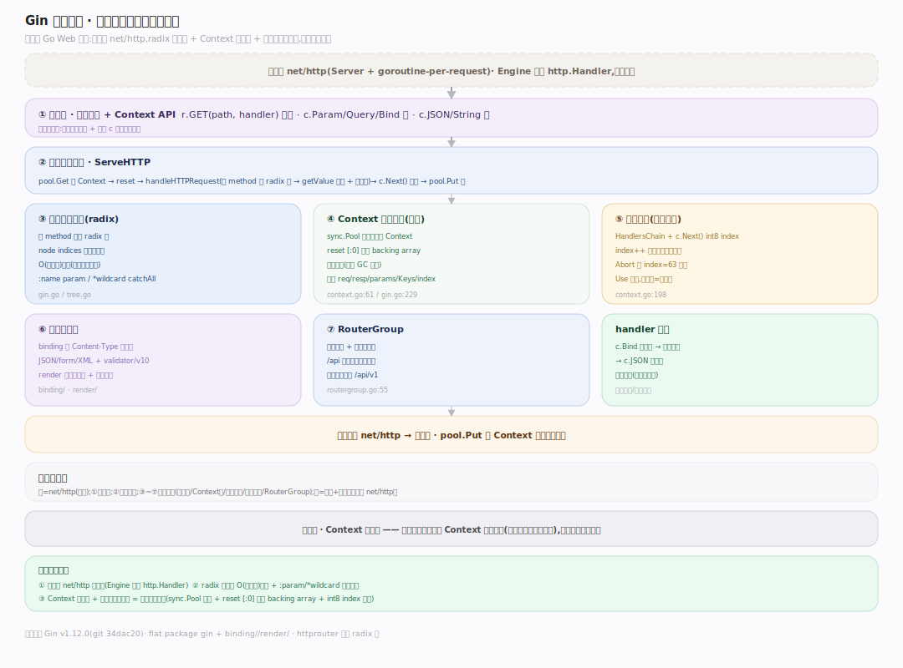
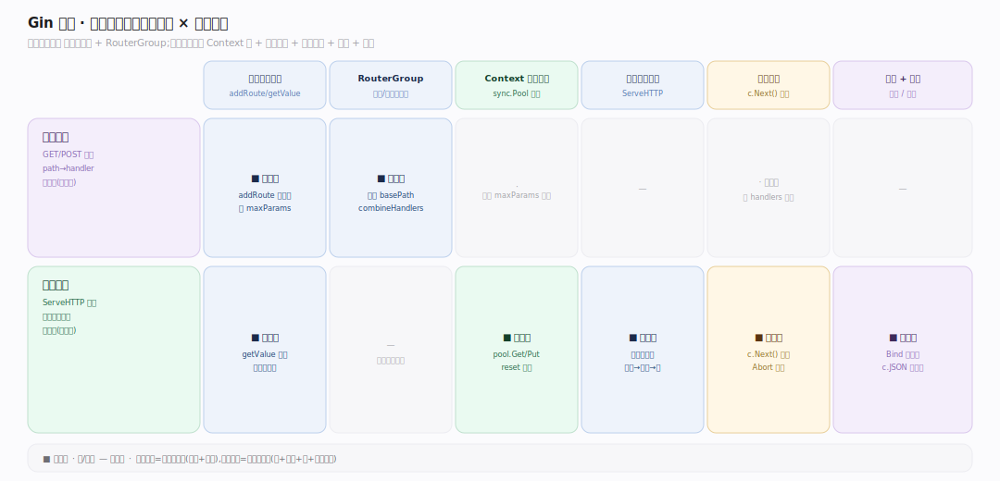
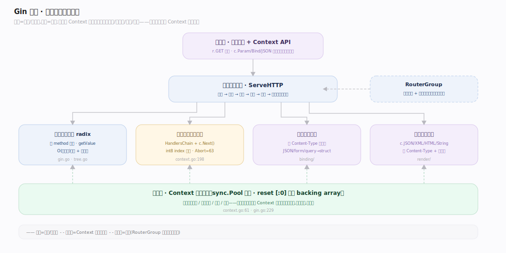

# Gin 原理 · 全景主线框架

> 统领全部原理文档:Gin 是**高性能 Go Web 框架**(家族:Go 库生态/Web 框架——基于 net/http,用 radix 树路由 + Context 对象池 + 索引式中间件链把请求处理做到低分配高吞吐)。源码基准 **Gin v1.12.0**(`~/workdir/gin`,git 34dac20;flat package gin + binding//render/)。

Gin 的世界观:**薄而快的 HTTP 路由 + 中间件框架**。它不重造 HTTP(用标准库 net/http),而在其上加三样让它快:**radix 树路由**(O(路径长)匹配 + 路径参数)、**Context 对象池**(每请求复用 Context,零重分配)、**索引式中间件链**(HandlersChain + c.Next() 的 int8 索引推进)。理解"路由树 + Context 池 + 中间件链"三点,就懂了 Gin。

> **结构提示(写文档必看)**:① Engine 嵌 RouterGroup(engine.GET 继承自 group);② 路由是 httprouter 派生的 radix 树(每 method 一棵,node 有 indices 首字节索引);③ Context(context.go:61)由 sync.Pool 复用,reset() 复用 backing array;④ 中间件链 HandlersChain + c.Next() 用 int8 index 推进,Abort 设 index=abortIndex(63);⑤ ServeHTTP:pool.Get→reset→handleHTTPRequest→tree lookup→Next→pool.Put;⑥ binding(JSON/form/…自动选)+ render(JSON/XML/…);⑦ RouterGroup 前缀+共享中间件。

---

## 一、双维模型:能力域 × 执行时机

- **能力域**:接触面(路由注册 + Context API)面向开发者;支撑侧——引擎与路由树、Context 与对象池、中间件链、请求处理流程、绑定、渲染、RouterGroup。
- **执行时机**:注册期(启动时 GET/POST 建路由树、Use 挂中间件)vs 请求期(ServeHTTP:池取 Context→树查→跑中间件链→绑定→渲染→池还)。全同步,无后台守护。

---

## 二、总架构图(位置即语义)

请求到 net/http → **Engine.ServeHTTP**:`pool.Get()` 取复用 Context → reset → **handleHTTPRequest**:按 method 找 radix 树 → `root.getValue` O(路径长)匹配路由 + 提取路径参数 → 设 handlers 链 → **c.Next()** 索引推进跑中间件链(中间件 + 最终 handler,c.Abort 可中断)→ handler 内 c.Bind 绑定请求、c.JSON 渲染响应 → `pool.Put()` 还 Context。**RouterGroup** 提供前缀分组 + 共享中间件;**Context 对象池**是低分配的关键。

---

## 三、主线的分层归位(接触面 + 7 支撑域)

| 层 | 主线 | 一句话职责 |
|---|---|---|
| 接触面 | **路由与 Context API** | GET/POST 注册路由 + c.Param/JSON/Bind |
| 路由 | **引擎与路由树(radix)** | 每 method 一棵 radix 树,O(路径长)匹配 |
| 状态 | **Context 与对象池** | 每请求复用 Context,reset 复用 backing array |
| 链 | **中间件链** | HandlersChain + c.Next() int8 索引推进 |
| 流程 | **请求处理流程** | ServeHTTP:池取→树查→链跑→池还 |
| 输入 | **绑定** | JSON/form/query 按 Content-Type 自动绑 |
| 输出 | **渲染 + RouterGroup** | JSON/XML/HTML 渲染;分组前缀+共享中间件 |

---

## 四、接触面 × 能力域 依赖矩阵

注册路由依赖引擎与路由树(addRoute)+ RouterGroup(前缀/中间件);处理请求依赖 Context 池 + 请求流程(ServeHTTP)+ 中间件链(Next)+ 绑定(输入)+ 渲染(输出)。

---

## 五、能力域依赖关系图

实线=调用/数据流,虚线=约束。贯穿层:**Context 对象池** 横切请求流程/中间件/绑定/渲染——每请求从池取一个 Context 贯穿始终、承载状态、结束还池,低分配是它带来的。

---

## 六、三条贯穿声明(Gin 区别于裸 net/http/其它框架)

1. **薄封装 net/http,不重造**:Gin 用标准库 net/http 的 Server/Handler,只加路由 + 中间件 + Context 便利层;Engine 实现 http.Handler(ServeHTTP)——可无缝嵌入任何 net/http 生态。

2. **radix 树路由 + 路径参数**:每个 HTTP method 一棵 radix(压缩前缀树),node 带 indices 首字节索引快速分支;O(路径长)匹配(与路由数无关),支持 `:name`(param)/`*wildcard`(catchAll)路径参数——比线性遍历/正则路由快。

3. **Context 对象池 + 索引中间件链 = 低分配高吞吐**:每请求从 sync.Pool 取复用 Context(reset 复用 backing array,零重分配)、中间件链用 int8 index 推进(c.Next 递增、Abort 设 63)——把每请求的分配压到极低,这是 Gin 高性能的根。

---

**一句话定位**:Gin 是高性能 Go Web 框架——薄封装 net/http(Engine 实现 http.Handler),加 radix 树路由(每 method 一棵、node indices 首字节索引、O(路径长)匹配 + :param/*wildcard)、Context 对象池(sync.Pool 每请求复用、reset 复用 backing array 零重分配)、索引式中间件链(HandlersChain + c.Next() int8 index 推进、Abort 设 63);请求流程 ServeHTTP 池取 Context→树查路由→跑中间件链→绑定输入(JSON/form 自动选)→渲染输出→池还;RouterGroup 分组前缀+共享中间件——低分配高吞吐是立身之本。
