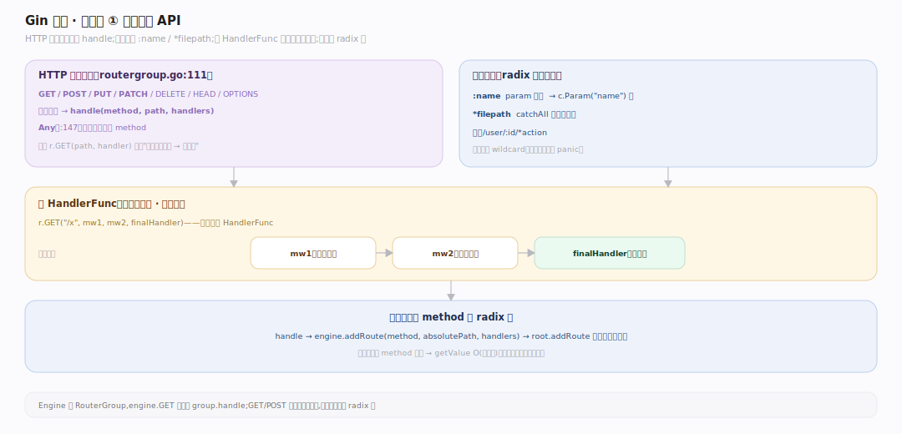
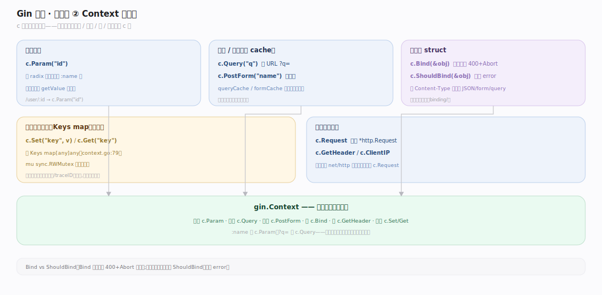
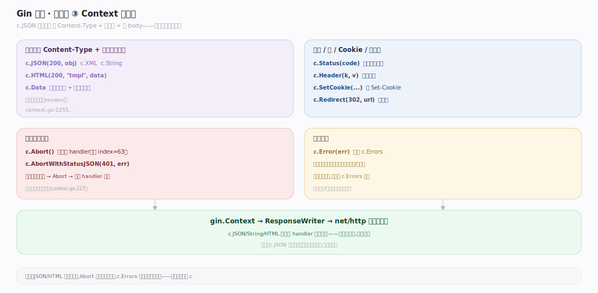

# Gin 原理 · 接触面主线 · 路由注册与 Context API

> **定位**：属"接触面主线"(开发者可见)。Gin 的接触面是**路由注册 + Context API**:GET/POST 注册路由、c.Param/Query/Bind 读请求、c.JSON/String 写响应。是开发者写 web 服务的入口。调用【引擎与路由树】注册、【Context】读写、【绑定】【渲染】。源码基准 **Gin v1.12.0**(`routergroup.go`、`context.go`)。

开发者用 Gin:`r.GET("/user/:id", handler)` 注册路由,handler 里用 `c.Param("id")` 取路径参数、`c.JSON(200, data)` 返响应。接触面两半:**路由注册**(声明路径→handler)+ **Context API**(handler 里读请求写响应)。理解注册 API + Context 常用方法,就懂了 Gin 怎么写服务。

---

## 一、路由注册 API

- **HTTP 动词方法**:`GET/POST/PUT/PATCH/DELETE/HEAD/OPTIONS`(`routergroup.go:111`)都委托 `handle(method, path, handlers)`;`Any` 循环注册所有 method(`:147`)。
- **路径参数**:`:name`(一段,c.Param 取)、`*filepath`(catchAll,吞剩余)。如 `/user/:id/*action`。
- **中间件 + handler**:`r.GET("/x", mw1, mw2, finalHandler)`——多个 HandlerFunc,前面是中间件、最后是业务(见中间件链篇)。
- 注册进对应 method 的 radix 树(见引擎路由树篇)。

一行 `r.GET(path, handler)` 声明"这路径这方法→这处理"——radix 树承载,请求来时匹配。

---

## 二、Context API:读请求

handler 里 c 读请求的常用 API:

- **路径参数**:`c.Param("id")`——radix 匹配提取的 :name。
- **查询/表单**:`c.Query("q")`、`c.PostForm("name")`(带 cache queryCache/formCache)。
- **绑定**:`c.Bind(&obj)`/`c.ShouldBind(&obj)`——按 Content-Type 自动绑 JSON/form/query 到 struct(见绑定篇)。
- **跨中间件传值**:`c.Set("key", v)` / `c.Get("key")`——存 Keys map(有锁并发安全)。
- **请求信息**:`c.Request`(原始 *http.Request)、`c.GetHeader`、`c.ClientIP`。

c 是请求的统一入口——所有输入(路径/查询/体/头)都从 c 取。

---

## 三、Context API:写响应

handler 里 c 写响应:

- **渲染**:`c.JSON(200, obj)`、`c.XML`、`c.String`、`c.HTML(200, "tmpl", data)`、`c.Data`(见渲染篇)——设 Content-Type + 序列化写出。
- **状态/头**:`c.Status(code)`、`c.Header(k, v)`、`c.SetCookie`。
- **重定向**:`c.Redirect(302, url)`。
- **中断**:`c.Abort()`/`c.AbortWithStatusJSON(401, err)`——停中间件链(见中间件链篇)。
- **错误**:`c.Error(err)` 挂到 c.Errors 供后续中间件统一处理。

c.JSON 等一行完成"设 Content-Type + 序列化 + 写 body"——最常用的响应出口。

---

## 拓展 · 接触面关键 API 一览

| API | 定义 | 职责 |
|---|---|---|
| GET/POST/… | `routergroup.go:111` | 注册路由(→radix 树) |
| c.Param | `context.go` | 取路径参数(:name) |
| c.Query/PostForm | `context.go` | 取查询/表单(带 cache) |
| c.Bind/ShouldBind | `context.go:780/861` | 绑请求体到 struct |
| c.JSON/String/HTML | `context.go:1255…` | 渲染响应 |
| c.Set/Get | `context.go` | 跨中间件传值(Keys) |

## 调优要点（理解要点）

- **Bind vs ShouldBind**:Bind 出错自动 400 + Abort;ShouldBind 只返 error 不写响应(自己控制)——要自定义错误响应用 ShouldBind。
- **c.Query 有 cache**:queryCache 首次解析后复用;多次取同参数不重复解析。
- **路径参数设计**:高频过滤段做路径参数(:id),radix 匹配快;别用查询串做路由分发。
- **c.Set/Get 传上下文**:请求级数据(用户身份/traceID)用 c.Set,不用全局变量。

## 常见误区与工程要点

- **误区:c.Bind 不出错就没事。** Bind 失败会自动 400+Abort 写响应;要自己控错误响应用 ShouldBind(只返 error)。
- **误区:c.JSON 后还能写别的。** 响应已提交;c.JSON/String 等应是 handler 最后一步,别重复写。
- **误区:goroutine 里用 c 读请求。** c 请求后还池被复用;goroutine 里须 c.Copy()。
- **误区:路径参数和查询参数一样取。** :name 用 c.Param,?q= 用 c.Query——不同来源不同方法。
- **归属提醒**:注册进【引擎与路由树】;c 的状态在【Context 与对象池】;Bind 实现在【绑定】;JSON/HTML 在【渲染】;Abort 在【中间件链】。

## 一句话总纲

**Gin 接触面是路由注册 + Context API:注册用 HTTP 动词方法(GET/POST/…委托 handle,:name/*filepath 路径参数,多 HandlerFunc 前中间件后业务)进 radix 树;handler 里 c 统一读请求(c.Param 路径参数/c.Query 查询/c.Bind 绑 body/c.Set-Get 跨中间件传值)写响应(c.JSON/String/HTML 渲染/c.Status/c.Redirect/c.Abort 中断);Bind 出错自动 400、ShouldBind 只返 error——一行 r.GET + 一个 c 写完一个 web 接口。**
