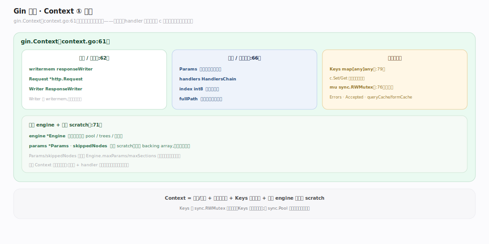
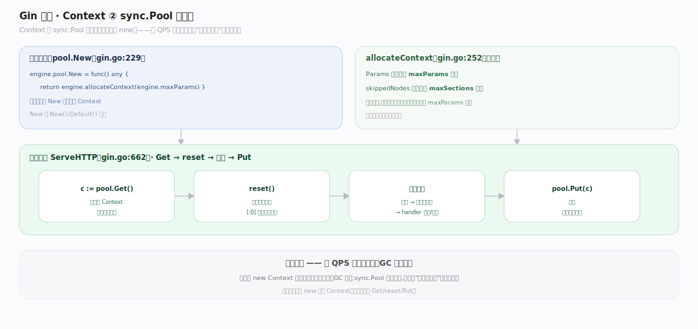
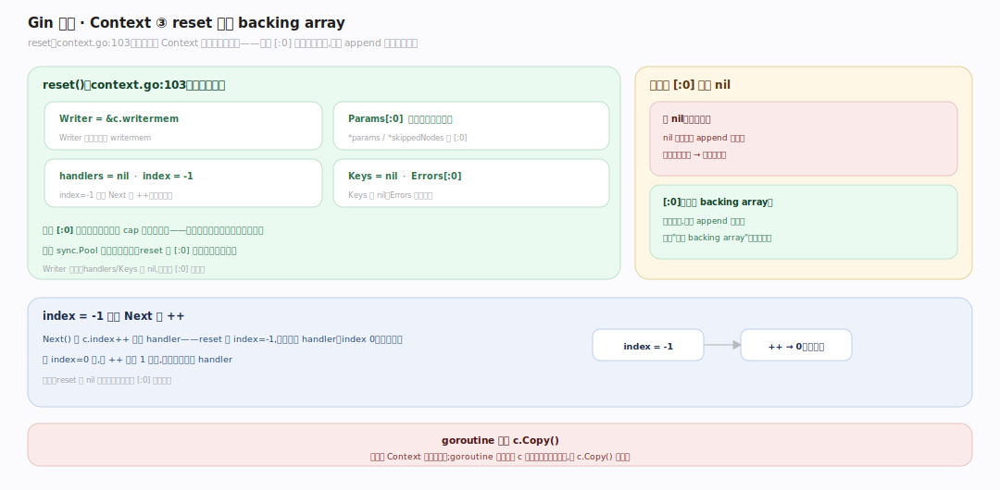

# Gin 原理 · 支撑主线 · Context 与对象池

> **定位**：属"状态能力域"。管每请求的状态载体与复用:gin.Context 结构、sync.Pool 复用、reset 复用 backing array。是低分配的关键。承载【中间件链】的推进状态、【绑定】【渲染】的入出口。源码基准 **Gin v1.12.0**(`context.go`、`gin.go`)。

Gin 高性能的一半在 **Context 对象池**:每个请求需要一个 Context 承载 request/response/参数/状态,若每请求 new 一个则 GC 压力大。Gin 用 sync.Pool 复用——请求来 `pool.Get()` 取一个、`reset()` 清空复用(切片 `[:0]` 复用底层数组、不重分配)、请求完 `pool.Put()` 还。理解 Context 结构 + 池复用 + reset,就懂了 Gin 低分配。

---

## 一、gin.Context:请求状态载体

`gin.Context`(`context.go:61`)包一次请求的全部状态:

- **请求/响应**:`writermem responseWriter`、`Request *http.Request`、`Writer ResponseWriter`(`:62`)。
- **路由/链状态**:`Params`(路径参数)、`handlers HandlersChain`(中间件链)、`index int8`(链推进位置)、`fullPath`(`:66`)。
- **每请求状态**:`Keys map[any]any`(`:79`,c.Set/Get 存跨中间件数据)由 `mu sync.RWMutex`(`:76`)守并发;`Errors`、`Accepted`、`queryCache/formCache`。
- 回指 `engine *Engine` + 池化 scratch `params *Params`/`skippedNodes`(`:71`)。

一个 Context 贯穿请求始终——中间件、handler 都拿同一个 c,靠它传状态(c.Set/Get)、读请求、写响应。

---

## 二、sync.Pool 复用

Context 由 **sync.Pool 复用**(不是每请求 new):

- 池 New:`engine.pool.New = func() any { return engine.allocateContext(engine.maxParams) }`(`gin.go:229`)。
- `allocateContext`(`:252`):预分配 `Params` 到 maxParams 容量、`skippedNodes` 到 maxSections 容量——一次分配,请求间复用。
- 请求流程(`ServeHTTP` `gin.go:662`):`c := pool.Get()`(取复用或新建)→ reset → 处理 → `pool.Put(c)`(还池)。

**为什么池**:高 QPS 下每请求 new Context 会产生大量短命对象、GC 频繁;sync.Pool 复用一批 Context,分配次数从"每请求一次"降到"接近零"——GC 压力骤降,吞吐升。

---

## 三、reset:复用 backing array

`reset()`(`context.go:103`)让复用的 Context 干净且**零重分配**:

- Writer 重指 `&c.writermem`;`Params[:0]`(截断但**保留底层数组**)、`handlers=nil`、`index=-1`(首 handler 前);`Keys=nil`、`Errors[:0]`;`*params`/`*skippedNodes` 也 `[:0]`。
- 关键:切片 `[:0]` 只重置长度、**保留 cap 和底层数组**——下个请求填充时复用同一块内存,不重新分配。
- `index=-1`:因 `Next()` 先 `index++` 再跑,-1 让第一个 handler(index 0)正确执行。

**为什么 [:0] 而非 nil**:nil 切片下次 append 要重新分配底层数组;`[:0]` 保留数组,下次 append 直接用——这是"复用 backing array"的低分配核心,配合池达到近零分配。

---

## 拓展 · Context 关键结构一览

| 结构 | 定义 | 职责 |
|---|---|---|
| gin.Context | `context.go:61` | 请求状态载体(req/resp/params/keys) |
| engine.pool | `gin.go:229` | sync.Pool 复用 Context |
| allocateContext | `gin.go:252` | 预分配 Params/skippedNodes 容量 |
| reset | `context.go:103` | 清空 + [:0] 复用 backing array |
| Copy | `context.go:122` | 协程安全副本(index=abortIndex) |

## 调优要点（理解要点）

- **不要长持 Context**:Context 请求完还池、会被复用;要在 goroutine 里用须 `c.Copy()`(深拷贝,避免复用污染)。
- **c.Set/Get 传状态**:跨中间件传数据用 Keys(有锁,并发安全);别用全局变量。
- **maxParams 自动**:池预分配容量由路由注册时的 maxParams 定,无需手调。
- **零分配意识**:reset 的 [:0] 复用是 Gin 低分配根;自定义中间件避免每请求大量分配。

## 常见误区与工程要点

- **误区:每请求 new 一个 Context。** 用 sync.Pool 复用——Get 取、reset 清、Put 还,近零分配。
- **误区:goroutine 里直接用 c。** 请求完 c 还池被复用,goroutine 里用会读到别的请求数据;须 c.Copy()。
- **误区:reset 用 nil 清空。** 用 `[:0]`(保留 backing array),下次 append 复用内存——nil 会重新分配。
- **误区:Keys 无并发问题。** 有 sync.RWMutex 守(:76);多 goroutine 访问同 Context 的 Keys 靠它安全。
- **归属提醒**:Context 承载的 handlers 链由【中间件链】推进;req 绑定在【绑定】、resp 渲染在【渲染】;池取还嵌在【请求处理流程】ServeHTTP;Params 来自【引擎与路由树】匹配。

## 一句话总纲

**Gin 用 Context 对象池达低分配:gin.Context(context.go:61)包一次请求全部状态(req/resp/Params/handlers 链/index/Keys 跨中间件传数据),由 sync.Pool 复用(pool.Get 取→reset→处理→pool.Put 还,allocateContext 预分配 Params/skippedNodes 容量);reset(:103)用切片 [:0] 截断但保留 backing array——下请求 append 复用同块内存零重分配,index=-1 配合 Next() 先++;goroutine 里用须 c.Copy()——这是 Gin 高 QPS 低 GC 的根。**
