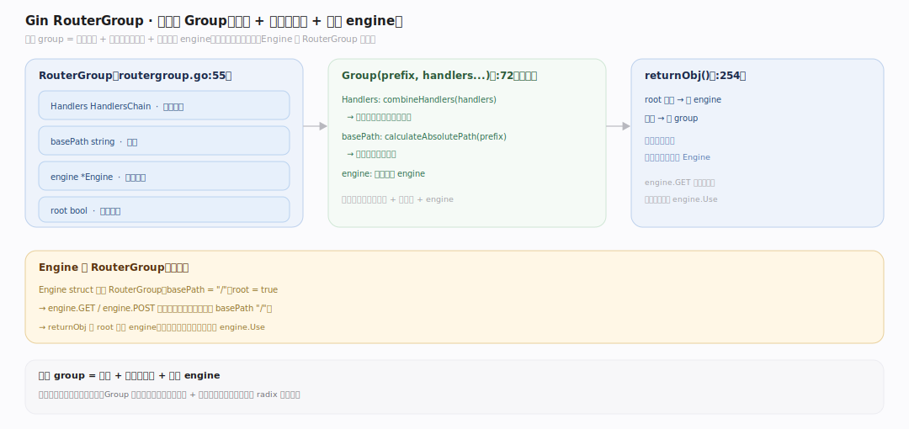
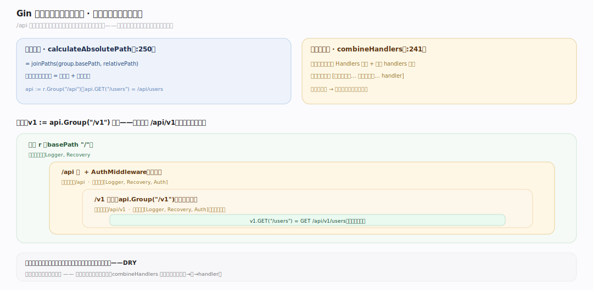
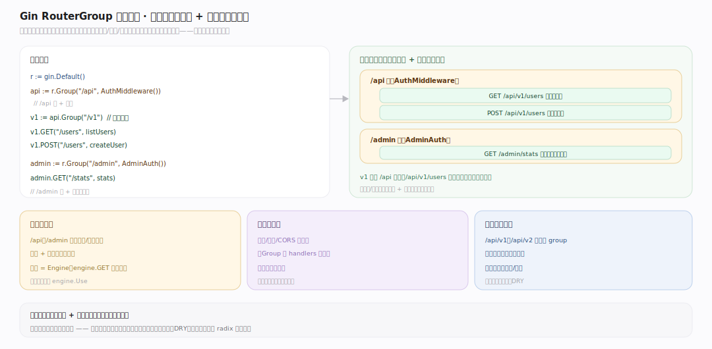

# Gin 原理 · 支撑主线 · RouterGroup

> **定位**：属"组织能力域"。管路由分组:前缀共享、中间件继承、嵌套。让 /api/v1 一组路由共前缀 + 共中间件。被【接触面】注册、组装【中间件链】。源码基准 **Gin v1.12.0**(`routergroup.go`)。

大型 web 服务路由多,要按模块分组(/api/v1/users、/admin/…),每组共前缀 + 共中间件(如 /api 组统一鉴权)。**RouterGroup** 就是这个:`r.Group("/api")` 建子组,子组路由自动带 /api 前缀 + 继承父组中间件。Engine 本身嵌 RouterGroup(根组)。理解分组前缀 + 中间件继承,就懂了 Gin 路由组织。

---

## 一、RouterGroup 结构与 Group



`RouterGroup`(`routergroup.go:55`):`Handlers HandlersChain`(组中间件)、`basePath string`(前缀)、`engine *Engine`、`root bool`。

- **Group(prefix, handlers...)**(`:72`)建子组:`Handlers: combineHandlers(handlers)`(前置父组中间件)、`basePath: calculateAbsolutePath(prefix)`(拼父前缀)、共享同一 engine。
- Engine 嵌 RouterGroup(根组,basePath="/", root:true)——`engine.GET` 就是根组的。
- `returnObj()`(`:254`):root 返 engine、否则返 group——支持链式(根组方法解析到 Engine)。

一个 group = 一个前缀 + 一组共享中间件 + 指向同一 engine;子组继承父组两者。

---

## 二、前缀与中间件继承



- **前缀拼接**:`calculateAbsolutePath` = `joinPaths(group.basePath, relativePath)`(`:250`)——子组路由的绝对路径 = 父前缀 + 相对路径。`api := r.Group("/api")` 后 `api.GET("/users")` = `/api/users`。
- **中间件继承**:`combineHandlers`(`:241`)新建切片、**父组 Handlers 在前** + 本次 handlers 在后——子组路由执行 [父组中间件…, 子组中间件…, handler]。
- **嵌套**:`v1 := api.Group("/v1")` 再嵌——前缀累积 /api/v1,中间件层层继承。

**为什么继承**:/api 组挂鉴权中间件,组内所有路由(含嵌套子组)自动带鉴权——不用每路由重复挂;前缀同理省重复写 /api/v1。

---

## 三、典型用法



```
r := gin.Default()
api := r.Group("/api", AuthMiddleware())   // /api 组 + 鉴权
{
  v1 := api.Group("/v1")                    // /api/v1 继承鉴权
  v1.GET("/users", listUsers)               // GET /api/v1/users(带鉴权)
  v1.POST("/users", createUser)
}
admin := r.Group("/admin", AdminAuth())     // /admin 组 + 管理员鉴权
admin.GET("/stats", stats)
```

分组让路由按模块聚合、前缀和横切中间件(鉴权/限流/日志)在组级声明一次、组内共享——大型服务路由清晰可维护。

---

## 拓展 · RouterGroup 关键结构一览

| 结构 | 定义 | 职责 |
|---|---|---|
| RouterGroup | `routergroup.go:55` | Handlers+basePath+engine+root |
| Group | `routergroup.go:72` | 建子组(继承中间件+拼前缀) |
| calculateAbsolutePath | `routergroup.go:250` | 拼父前缀+相对路径 |
| combineHandlers | `routergroup.go:241` | 父组中间件在前+本次 handlers |
| returnObj | `routergroup.go:254` | root 返 engine 支持链式 |

## 调优要点（理解要点）

- **按模块分组**:/api、/admin 等按业务/版本分组,前缀+中间件组级声明。
- **组级中间件**:鉴权/限流/CORS 挂组级(Group 的 handlers 参数),组内路由自动带。
- **嵌套版本控制**:/api/v1、/api/v2 用嵌套 group,前缀累积、中间件继承。
- **根组=Engine**:engine.GET 直接注册到根组(basePath /);全局中间件用 engine.Use。

## 常见误区与工程要点

- **误区:子组不继承父中间件。** combineHandlers 前置父组 Handlers,子组(含嵌套)继承父组所有中间件。
- **误区:Group 会立即匹配。** Group 只是注册期组织(拼前缀+攒中间件);运行期仍是 radix 树匹配。
- **误区:组中间件顺序随意。** 父组中间件在子组之前(combineHandlers 前置)——执行序父→子→handler。
- **误区:每路由重复挂鉴权。** 挂组级一次,组内所有路由(含嵌套)自动带——DRY。
- **归属提醒**:注册最终进【引擎与路由树】的 radix 树;组中间件组装成【中间件链】;注册 API 在【接触面】;前缀影响路由匹配路径。

## 一句话总纲

**RouterGroup 管路由分组:结构含 Handlers(组中间件)+basePath(前缀)+engine+root,Group(prefix, mw...)建子组——combineHandlers 前置父组中间件(继承)、calculateAbsolutePath 拼父前缀(累积);Engine 嵌根组(basePath /,engine.GET 即根组);子组路由执行序 [父组中间件…子组中间件…handler],嵌套则前缀累积中间件层层继承——/api 组挂鉴权则组内所有路由(含嵌套 /api/v1)自动带,前缀和横切中间件组级声明一次共享。**
