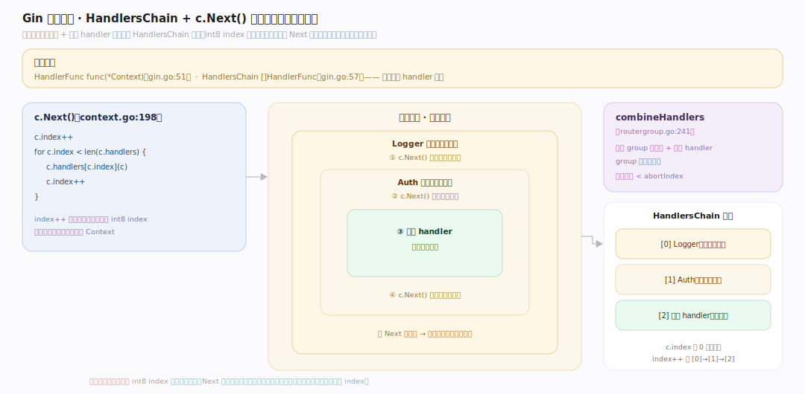
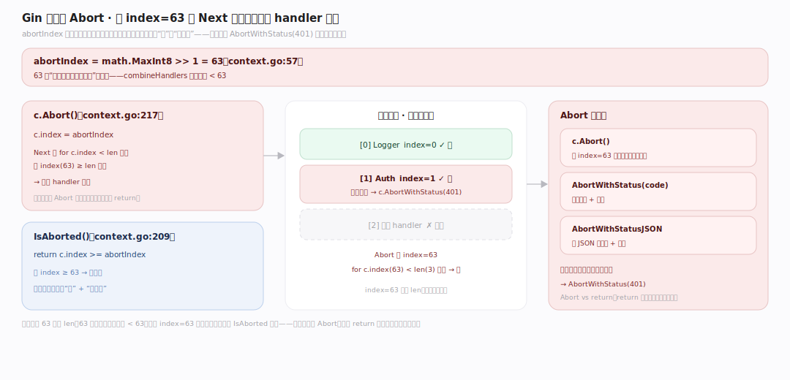
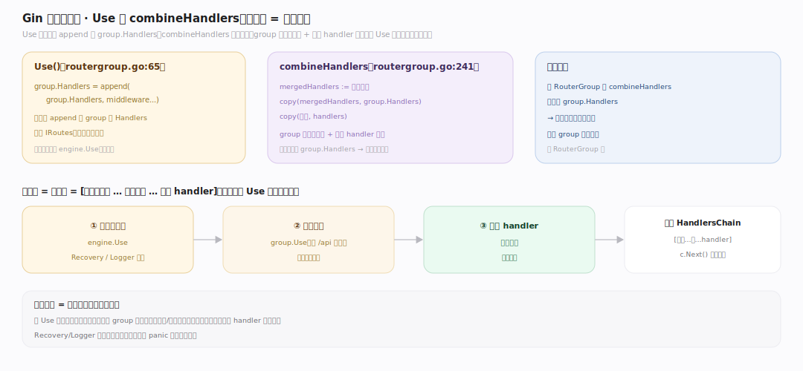

# Gin 原理 · 支撑主线 · 中间件链

> **定位**：属"控制流能力域"。管中间件与 handler 的执行:HandlersChain、c.Next() 索引推进、Abort 中断、Use 注册。是"洋葱模型"中间件的实现。用【Context】的 index 状态、被【请求流程】驱动。源码基准 **Gin v1.12.0**(`context.go`、`gin.go`、`routergroup.go`)。

Gin 的中间件是**索引式链**:一次请求的中间件 + 最终 handler 合成一条 `HandlersChain`(切片),`c.Next()` 用一个 int8 `index` 推进——中间件里调 c.Next() 跑下游、返回后继续跑自己剩余代码(洋葱模型)。c.Abort() 设 index 到最大值中断链。理解 HandlersChain + Next 索引 + Abort,就懂了 Gin 中间件。

---

## 一、HandlersChain 与 Next 索引推进

- **类型**:`HandlerFunc func(*Context)`(`gin.go:51`)、`HandlersChain []HandlerFunc`(`gin.go:57`)——一条链是 handler 切片。
- **c.Next()**(`context.go:198`):`c.index++` 后 `for c.index < len(c.handlers) { c.handlers[c.index](c); c.index++ }` 顺序跑。
- **洋葱模型**:中间件里调 `c.Next()` → 跑下游 handler → 返回后继续跑中间件 c.Next() 之后的代码。如 Logger:记开始时间 → c.Next()(跑业务)→ 记耗时。
- 组合:`combineHandlers`(`routergroup.go:241`)把 group 中间件 + 路由 handler 合成一条链(group 在前),断言总数 < abortIndex。

**为什么索引式**:一个 int8 index 记录链推进位置——Next 递增、下游跑完回到中间件继续;比嵌套闭包/回调简单,状态就一个 index,存 Context 里。

---

## 二、Abort 中断

- **abortIndex = math.MaxInt8 >> 1 = 63**(`context.go:57`)。
- **c.Abort()**(`context.go:217`):设 `c.index = abortIndex`——Next 的 `for c.index < len` 循环因 index(63)≥ len 而停,后续 handler 不跑。
- `IsAborted()`(`:209`)判 index ≥ abortIndex;`AbortWithStatus(code)` 写状态+中断;`AbortWithStatusJSON`/`AbortWithError` 类似。
- 典型:鉴权中间件校验失败 → `c.AbortWithStatus(401)` → 后续业务 handler 不执行。

**为什么设 63 而非 len**:63 是"远大于任何合法链长"的哨兵(链长断言 < 63);设 index=63 让循环立即停、且 IsAborted 可判——一个值同时表达"停"和"已中断"。

---

## 三、Use 注册与执行顺序

- **Use()**(`routergroup.go:65`)把中间件 append 到 group 的 `Handlers`,返回 IRoutes(可链)。
- **顺序**:`combineHandlers` 新建切片、group 中间件在前、路由 handler 在后(`routergroup.go:241`)——执行序 = [全局中间件…, 组中间件…, 路由 handler]。
- **分组继承**:子 RouterGroup 的 combineHandlers 前置父 group.Handlers,故子路由继承父中间件(见 RouterGroup 篇)。

**执行顺序 = 注册顺序**:先 Use 的先跑(洋葱外层);嵌套 group 从外到内。鉴权/日志等横切中间件在外层,业务 handler 在最内。

---

## 拓展 · 中间件链关键结构一览

| 结构 | 定义 | 职责 |
|---|---|---|
| HandlersChain | `gin.go:57` | []HandlerFunc 一条链 |
| c.Next() | `context.go:198` | index++ 推进跑下游 |
| abortIndex | `context.go:57` | 63,中断哨兵 |
| c.Abort() | `context.go:217` | 设 index=63 停链 |
| Use() | `routergroup.go:65` | 注册中间件到 group |
| combineHandlers | `routergroup.go:241` | 合并 group 中间件+路由 handler |

## 调优要点（理解要点）

- **中间件顺序**:先 Use 的外层先跑;Recovery/Logger 通常最外(捕获全部);鉴权在业务前。
- **c.Next() vs 不调**:中间件调 c.Next() 才跑下游+回来(洋葱);不调则直接返回(阻断下游,但非 Abort)。
- **Abort vs return**:阻止后续用 c.Abort()(设 index=63);单纯 return 只结束当前中间件,下游仍跑(除非没调 Next)。
- **组级中间件**:用 RouterGroup + Use 给一组路由挂共享中间件(如 /api 组统一鉴权)。

## 常见误区与工程要点

- **误区:中间件是嵌套回调。** 是索引式链(HandlersChain + int8 index),c.Next() 递增推进;比嵌套闭包简单,状态就一个 index。
- **误区:return 能阻止后续 handler。** 中间件里若已调 c.Next() 则下游已跑;要阻止用 c.Abort()(设 index=63)。
- **误区:Abort 立即停止当前函数。** Abort 只设 index=63 阻止后续 handler;当前中间件 Abort 后的代码仍执行(需自己 return)。
- **误区:中间件顺序无关。** 执行序=注册序(洋葱模型),Recovery/Logger 要最外层才能兜住内层。
- **归属提醒**:index 状态存【Context】;链由【请求处理流程】的 c.Next() 启动;handler 里绑定在【绑定】、渲染在【渲染】;组中间件在【RouterGroup】。

## 一句话总纲

**Gin 中间件是索引式链(洋葱模型):中间件+最终 handler 合成 HandlersChain([]HandlerFunc,combineHandlers 组中间件在前),c.Next()(context.go:198)用 int8 index 推进(index++ 跑下游、返回后继续跑自己剩余代码);c.Abort()(:217)设 index=abortIndex(63)让 Next 循环停、后续 handler 不跑(IsAborted 判);Use() 注册中间件、执行序=注册序(外层先跑,Recovery/Logger 最外);状态就一个 index 存 Context——简单高效。**
