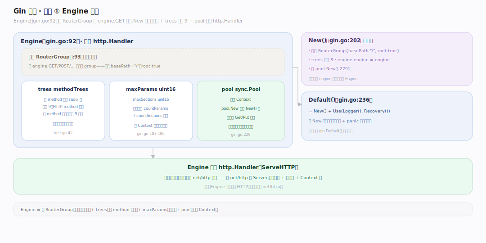
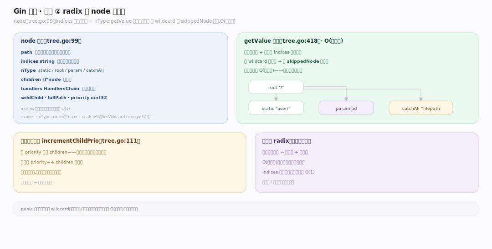
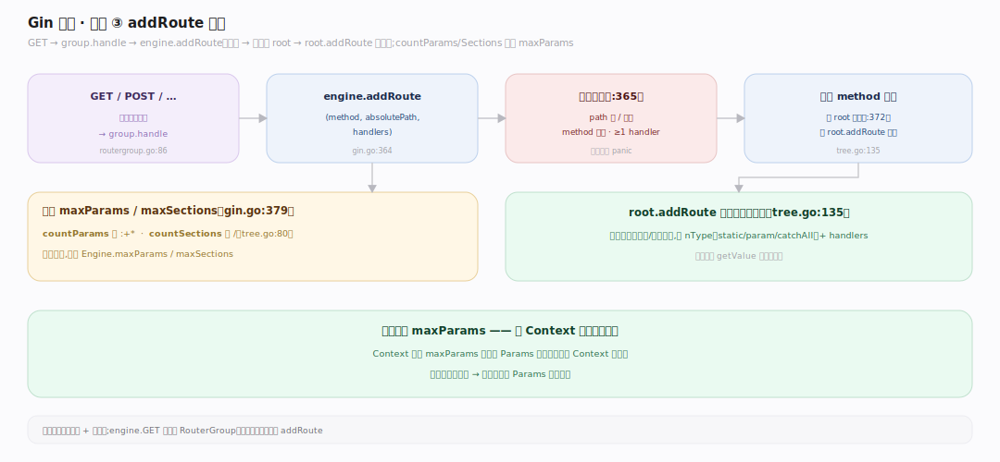

# Gin 原理 · 支撑主线 · 引擎与路由树（radix）

> **定位**：属"路由能力域"。管路由匹配:Engine 结构、每 method 一棵 radix 树、node 结构(indices 首字节索引)、路径参数(:param/*wildcard)、addRoute 注册。是请求分发到 handler 的核心。被【请求流程】查询、【RouterGroup】注册。源码基准 **Gin v1.12.0**(`gin.go`、`tree.go`)。

Gin 路由快在 **radix 树**(压缩前缀树,httprouter 派生):每个 HTTP method 一棵树,匹配复杂度 O(路径长)——与路由总数无关(不像线性遍历越加越慢)。node 带 `indices` 首字节索引快速选分支,支持 `:name`(param)/`*wildcard`(catchAll)路径参数。理解树结构 + 匹配,就懂了 Gin 路由。

---

## 一、Engine:嵌 RouterGroup + 每 method 一树

`Engine`(`gin.go:92`)**嵌入 RouterGroup**(`:93`)——所以 `engine.GET(...)` 继承自 group。字段:`trees methodTrees`(每 method 一棵树)、`maxParams uint16`、`maxSections uint16`、`pool sync.Pool`(`:183-186`)。

- `New()`(`gin.go:202`):初始化根 RouterGroup{basePath:"/", root:true}、`trees` 容量 9(HTTP method 数)、`engine.engine=engine`、装 pool(`:229`)。
- `Default()`(`gin.go:236`)= New() + Use(Logger(), Recovery())。
- 每 method(GET/POST/…)独立一棵 radix 树(`methodTrees []methodTree`,`tree.go:45`),按 method 线性查(只 9 个)。

Engine 实现 http.Handler(ServeHTTP)——可无缝嵌 net/http 生态。

---

## 二、radix 树 node 与匹配

**node 结构**(`tree.go:99`):`path`、`indices string`(子节点首字节索引,快速分支)、`wildChild bool`、`nType`(static/root/param/catchAll)、`children []*node`、`handlers HandlersChain`、`fullPath`、`priority uint32`。

- **匹配** `getValue`(`tree.go:418`):按公共前缀 + 单字节 `indices` 逐节点走,遇 wildcard 子节点压 `skippedNode` 供回溯——O(路径长)。
- **优先级** `incrementChildPrio`(`tree.go:111`)按 priority 重排子节点,热路由先查。
- **路径参数**:`:name`→nType param、`*name`→catchAll(`findWildcard` `tree.go:371`);panic 强制"每段一个 wildcard"、名非空。

**为什么 radix**:压缩前缀树共享公共前缀,O(路径长)匹配(与路由数无关);indices 首字节索引让分支选择近 O(1)——比正则/线性路由快得多。

---

## 三、addRoute 注册

`GET/POST/…` → `group.handle`(`routergroup.go:86`)→ `engine.addRoute(method, absolutePath, handlers)`(`gin.go:364`):

- 断言 path 以 `/` 开头、method 非空、≥1 handler(`:365`)。
- 无该 method 树则建 root(`:372`),再 `root.addRoute`(`tree.go:135`)插入。
- 更新 `maxParams`/`maxSections`:`countParams`(数 `:`+`*`)、`countSections`(数 `/`)(`gin.go:379`,`tree.go:80`)——供 Context 池预分配容量。

**为什么算 maxParams**:Context 池预分配 Params 切片到 maxParams 容量(见 Context 池篇)——注册期算好,请求期零重分配。

---

## 拓展 · 引擎路由关键结构一览

| 结构 | 定义 | 职责 |
|---|---|---|
| Engine | `gin.go:92` | 嵌 RouterGroup + trees + pool |
| methodTrees | `tree.go:45` | 每 method 一棵 radix 树 |
| node | `tree.go:99` | radix 节点(indices/nType/handlers) |
| addRoute | `gin.go:364` / `tree.go:135` | 注册路由到树 |
| getValue | `tree.go:418` | O(路径长)匹配 + 提参数 |

## 调优要点（理解要点）

- **路由设计**:公共前缀路由(/api/v1/…)共享树节点,内存省 + 匹配快;避免过多顶层不同前缀。
- **路径参数 vs 通配**:`:id` 精确一段,`*filepath` 吞剩余;每段只能一个 wildcard。
- **优先级自适应**:热路由(高频命中)priority 升、children 中前移——无需手动调。
- **method 数固定 9**:trees 容量预设 9,新增自定义 method 也走同机制。

## 常见误区与工程要点

- **误区:路由越多匹配越慢。** radix 树 O(路径长)匹配(与路由总数无关);不像线性遍历/正则路由越加越慢。
- **误区:Engine 自己实现 HTTP。** Engine 实现 http.Handler(ServeHTTP),用标准库 net/http Server;只加路由+中间件层。
- **误区:每 method 共用一棵树。** 每 HTTP method(GET/POST…)一棵独立 radix 树,先按 method 选树再匹配路径。
- **误区:路径参数用正则。** 用 radix 的 param/catchAll 节点类型(:name/*name),非正则——更快。
- **归属提醒**:匹配出的 handlers 链交【中间件链】跑;Context 池容量由此处 maxParams 定(【Context 与对象池】);注册入口在【RouterGroup】;请求分发在【请求处理流程】。

## 一句话总纲

**Gin 路由是每 HTTP method 一棵 radix 树(httprouter 派生,压缩前缀树):Engine(gin.go:92 嵌 RouterGroup、持 trees+pool)实现 http.Handler;node(tree.go:99)带 indices 首字节索引快速分支、nType(static/param/catchAll)支持 :name/*wildcard 路径参数;getValue O(路径长)匹配(与路由数无关,indices 近 O(1) 选分支、priority 热路由前移),addRoute 注册时算 maxParams 供 Context 池预分配——O(路径长)匹配是它路由快的根。**
