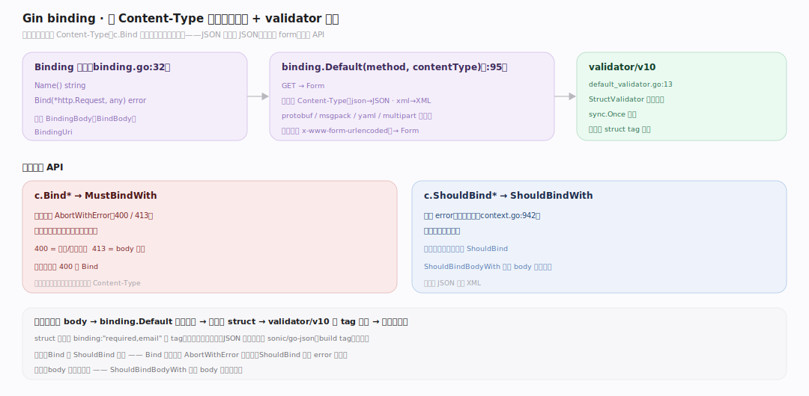
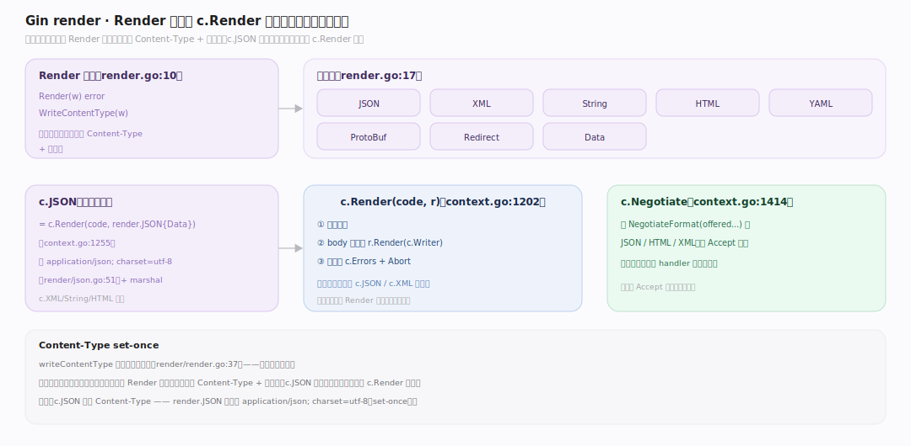
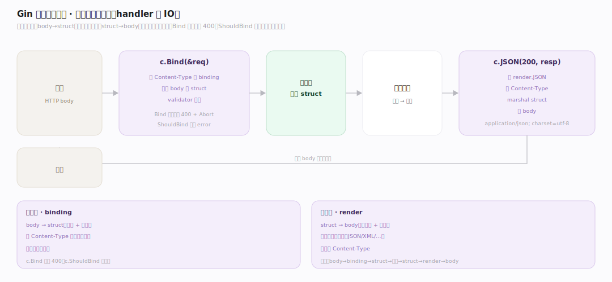

# Gin 原理 · 支撑主线 · 绑定与渲染

> **定位**：属"输入输出能力域"。管请求体解析(binding)与响应生成(render):按 Content-Type 自动选绑定器、按类型选渲染器 + 内容协商。是 handler 的输入解析与输出格式化。被【接触面】c.Bind/c.JSON 调用。源码基准 **Gin v1.12.0**(`binding/`、`render/`)。

handler 要把请求体解析成 struct(输入)、把结果格式化成响应(输出)。**binding** 按 Content-Type 自动选解析器(JSON/form/XML…)绑到 struct + validator 校验;**render** 按调用选渲染器(JSON/XML/HTML…)设 Content-Type + 序列化。理解自动选绑定 + 渲染分发,就懂了 Gin 的输入输出。

---

## 一、binding:按 Content-Type 自动绑

- **Binding 接口**:`Name()` + `Bind(*http.Request, any)`(`binding/binding.go:32`);扩展 BindingBody(BindBody)、BindingUri。
- **自动选** `binding.Default(method, contentType)`(`:95`):GET→Form;否则按 Content-Type——`application/json`→JSON、`xml`→XML、protobuf/msgpack/yaml/multipart 各对应,默认(含 x-www-form-urlencoded)→Form。
- **两族**:`c.Bind*`→MustBindWith,出错 AbortWithError(400/413)写响应;`c.ShouldBind*`→ShouldBindWith 只返 error 不写(`context.go:942`)。
- **validator**:StructValidator 默认 go-playground/validator/v10(`binding/default_validator.go:13`),`sync.Once` 懒建,绑后 `validate(obj)` 按 struct tag 校验。

**为什么自动选**:开发者不用手判 Content-Type,c.Bind 按请求头自动选解析器——JSON 请求绑 JSON、表单绑 form,统一 API。

---

## 二、render:按类型渲染 + 内容协商

- **Render 接口**:`Render(w)` + `WriteContentType(w)`(`render/render.go:10`);实现 JSON/XML/String/HTML/YAML/ProtoBuf/Redirect/Data 等(`:17`)。
- **中枢** `c.Render(code, r)`(`context.go:1202`):设状态,body 允许则 `r.Render(c.Writer)`,出错挂 c.Errors + Abort。所有 c.JSON 等走这。
- **c.JSON** = `c.Render(code, render.JSON{Data})`(`:1255`)→ 设 `Content-Type: application/json; charset=utf-8`(`render/json.go:51`)+ marshal。c.XML/String/HTML 类似。
- **内容协商** `c.Negotiate`(`context.go:1414`):按 `NegotiateFormat(offered...)` 选 JSON/HTML/XML(按 Accept 头)。
- Content-Type **set-once**:`writeContentType` 只在头未设时写(`render/render.go:37`)。

**为什么渲染器抽象**:每种响应格式(JSON/XML/HTML)一个 Render 实现、自己会设 Content-Type + 序列化;c.JSON 等是便捷入口,统一走 c.Render 中枢。

---

## 三、输入输出闭环

一个 handler 的 IO:

`请求` → **c.Bind(&req)**:按 Content-Type 选 binding → 解析 body 到 struct → validator 校验 → 得强类型输入 → **业务逻辑** → **c.JSON(200, resp)**:选 render.JSON → 设 Content-Type → marshal struct → 写 body → `响应`。

绑定(输入:body→struct)与渲染(输出:struct→body)对称;中间是业务。Bind 失败自动 400,ShouldBind 让你自定义错误响应。

---

## 拓展 · 绑定与渲染关键结构一览

| 结构 | 定义 | 职责 |
|---|---|---|
| Binding 接口 | `binding/binding.go:32` | Name+Bind |
| binding.Default | `binding/binding.go:95` | 按 method+Content-Type 选 |
| StructValidator | `binding/default_validator.go` | validator/v10 校验 |
| Render 接口 | `render/render.go:10` | Render+WriteContentType |
| c.Render | `context.go:1202` | 渲染中枢(所有 c.JSON 等走它) |
| c.Negotiate | `context.go:1414` | Accept 头内容协商 |

## 调优要点（理解要点）

- **Bind vs ShouldBind**:要框架自动 400 用 Bind;要自定义错误响应用 ShouldBind(只返 error)。
- **ShouldBindBodyWith**:需多次绑同 body 时缓存原始 body(BodyBytesKey)重复绑。
- **validator tag**:struct 字段加 `binding:"required,email"` 等,绑定时自动校验。
- **JSON 编码器可换**:json.API 可插 sonic/go-json(build tag),高性能场景提速序列化。

## 常见误区与工程要点

- **误区:c.Bind 要手判 Content-Type。** binding.Default 按 method+Content-Type 自动选(GET→Form,json→JSON…),不用手判。
- **误区:Bind 和 ShouldBind 一样。** Bind 出错自动 AbortWithError(400/413)写响应;ShouldBind 只返 error 不写——自定义错误用后者。
- **误区:c.JSON 不设 Content-Type。** render.JSON 自动设 application/json; charset=utf-8;set-once(已设则不覆盖)。
- **误区:body 只能绑一次。** ShouldBindBodyWith 缓存 body 可多次绑(如先试 JSON 再试 XML)。
- **归属提醒**:c.Bind/c.JSON 入口在【接触面】;绑定读的 c.Request、渲染写的 c.Writer 在【Context】;校验用 validator/v10 外部库。

## 一句话总纲

**Gin 绑定与渲染是 handler 的对称输入输出:binding 按 method+Content-Type 自动选解析器(binding.Default:GET→Form/json→JSON/xml→XML…)绑 body 到 struct + validator/v10 按 tag 校验(c.Bind 出错自动 400+Abort、c.ShouldBind 只返 error);render 按类型选渲染器(JSON/XML/HTML…各实现 Render+自设 Content-Type,统一走 c.Render 中枢,c.Negotiate 按 Accept 内容协商);闭环:body→binding→struct→业务→struct→render→body。**
