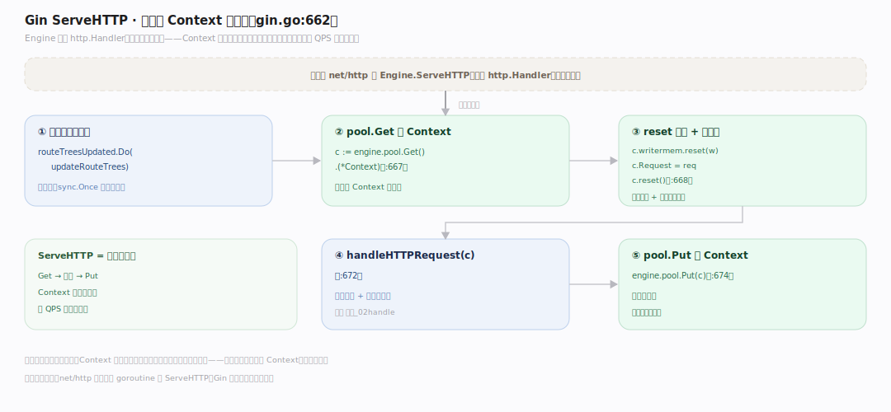
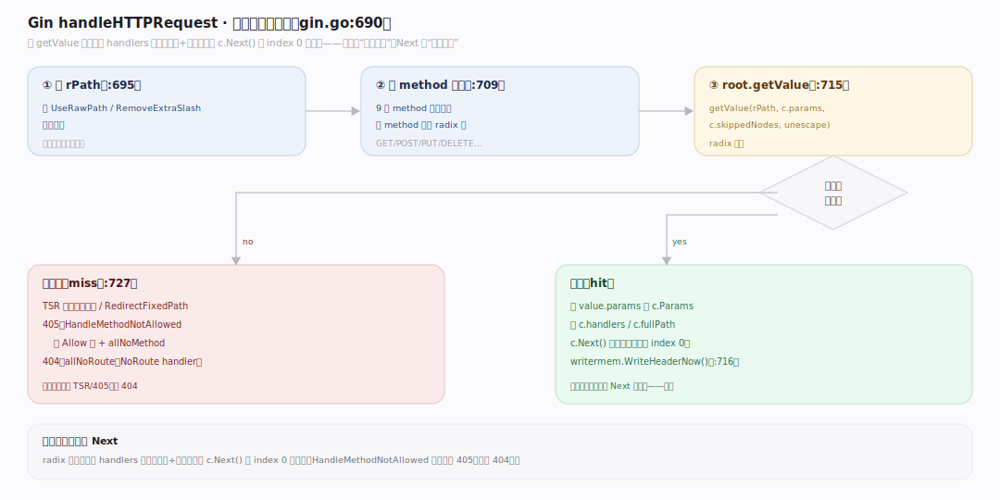
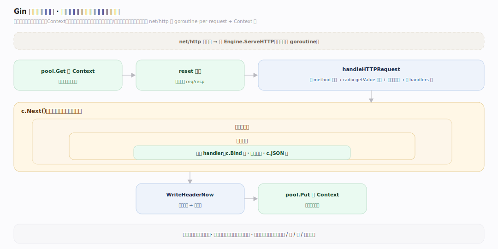

# Gin 原理 · 支撑主线 · 请求处理流程

> **定位**：属"流程能力域"。管一次请求的完整生命周期:ServeHTTP → 池取 Context → 路由匹配 → 跑中间件链 → 池还。串起所有能力域。源码基准 **Gin v1.12.0**(`gin.go`)。

一次 HTTP 请求在 Gin 走完整流程:标准库 net/http 调 `Engine.ServeHTTP` → 从 Context 池取一个复用 Context → reset 清空 → `handleHTTPRequest` 按 method 找 radix 树匹配路由 → 设 handlers 链 → `c.Next()` 跑中间件+handler → 请求完把 Context 还池。理解这条主流程,就把路由/Context/中间件串起来了。

---

## 一、ServeHTTP:入口与池管理

`ServeHTTP`(`gin.go:662`,实现 http.Handler):

1. 一次性 `routeTreesUpdated.Do(updateRouteTrees)`(懒初始化路由树)。
2. `c := engine.pool.Get().(*Context)`(`:667`)——取复用 Context 或新建。
3. `c.writermem.reset(w)`、`c.Request = req`、`c.reset()`(`:668`)——绑本请求 + 清空复用状态。
4. `handleHTTPRequest(c)`(`:672`)——路由匹配 + 跑链。
5. `engine.pool.Put(c)`(`:674`)——请求完还池,供下个请求复用。

**为什么池取还包裹全程**:Context 一次请求一个,取自池(复用)、用完还池——高 QPS 下分配近零。ServeHTTP 是每请求的框(Get→处理→Put)。

---

## 二、handleHTTPRequest:匹配与执行

`handleHTTPRequest`(`gin.go:690`):

- 算 `rPath`(按 UseRawPath/RemoveExtraSlash 处理路径,`:695`)。
- 按 method 线性找树(9 个 method,`:709`)→ `root.getValue(rPath, c.params, c.skippedNodes, unescape)`(`:715`)radix 匹配。
- **命中**:拷 `value.params` 进 `c.Params`、设 `c.handlers`/`c.fullPath` → **`c.Next()`** 跑中间件链 → `writermem.WriteHeaderNow()`(`:716`)。
- **未命中**:TSR 尾斜杠重定向 / RedirectFixedPath / 405(HandleMethodNotAllowed,建 Allow 头 + allNoMethod)/ 404(allNoRoute)(`:727`)。

**为什么先匹配后 Next**:radix 匹配定位到 handlers 链(中间件+业务),再 c.Next() 从 index 0 依次跑——匹配是"找谁处理",Next 是"依次处理"。

---

## 三、完整生命周期

一次请求端到端:

`net/http 收请求` → `ServeHTTP` → `pool.Get` 取 Context → `reset` 清空 → `handleHTTPRequest`:按 method 选树 → radix `getValue` 匹配 + 提路径参数 → 设 handlers 链 → `c.Next()`:依次跑全局中间件→组中间件→业务 handler(handler 内 c.Bind 读、c.JSON 写)→ 链跑完 → `WriteHeaderNow` 写响应头 → `pool.Put` 还 Context。

全同步(无后台守护),每步串起一个能力域:池(Context)、树(路由)、链(中间件)、绑定/渲染(输入输出)。

---

## 拓展 · 请求流程关键结构一览

| 结构 | 定义 | 职责 |
|---|---|---|
| ServeHTTP | `gin.go:662` | http.Handler 入口 + 池 Get/Put |
| handleHTTPRequest | `gin.go:690` | 路由匹配 + 跑链 + 404/405 |
| getValue | `tree.go:418` | radix 匹配提参数 |
| c.Next() | `context.go:198` | 跑中间件链 |
| pool.Get/Put | `gin.go:667/674` | Context 池取还 |

## 调优要点（理解要点）

- **404/405 处理**:HandleMethodNotAllowed 开启才返 405(否则 404);NoRoute/NoMethod 挂自定义 handler。
- **路径规范化**:RedirectTrailingSlash(尾斜杠重定向)、RemoveExtraSlash——影响匹配,按需配。
- **UseRawPath/UnescapePathValues**:路径含转义字符时的处理,默认解转义。
- **全同步无后台**:Gin 无后台守护,每请求同步走完;并发靠 net/http 的 goroutine-per-request + Context 池。

## 常见误区与工程要点

- **误区:每请求都建新 Context。** ServeHTTP 从池 Get 复用、Put 还——分配近零。
- **误区:匹配即执行。** 先 getValue 匹配定位 handlers 链,再 c.Next() 依次跑——两步。
- **误区:404 一定返回。** 无匹配时按配置可能先 TSR 重定向/405,才 404;HandleMethodNotAllowed 控 405。
- **误区:Gin 有后台线程处理请求。** 全同步,net/http 每连接一 goroutine 调 ServeHTTP;Gin 不额外起后台。
- **归属提醒**:池取还的 Context 在【Context 与对象池】;树匹配在【引擎与路由树】;链执行在【中间件链】;handler 内绑定渲染在【绑定与渲染】。

## 一句话总纲

**Gin 请求流程:net/http 调 Engine.ServeHTTP(gin.go:662)→pool.Get 取复用 Context→reset 清空(绑本请求 req/resp)→handleHTTPRequest(:690)按 method 选 radix 树、getValue 匹配路由+提路径参数→设 handlers 链→c.Next() 依次跑全局/组中间件+业务 handler(handler 内 c.Bind 读 c.JSON 写)→WriteHeaderNow→pool.Put 还 Context;无匹配走 TSR 重定向/405/404;全同步、池取还包裹全程实现近零分配。**
