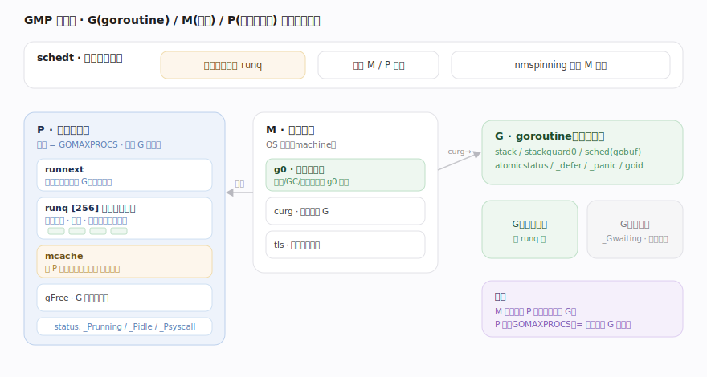
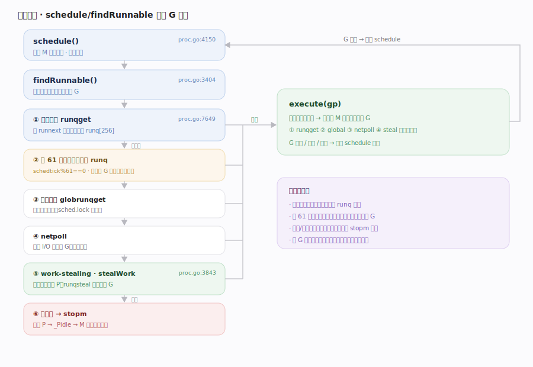
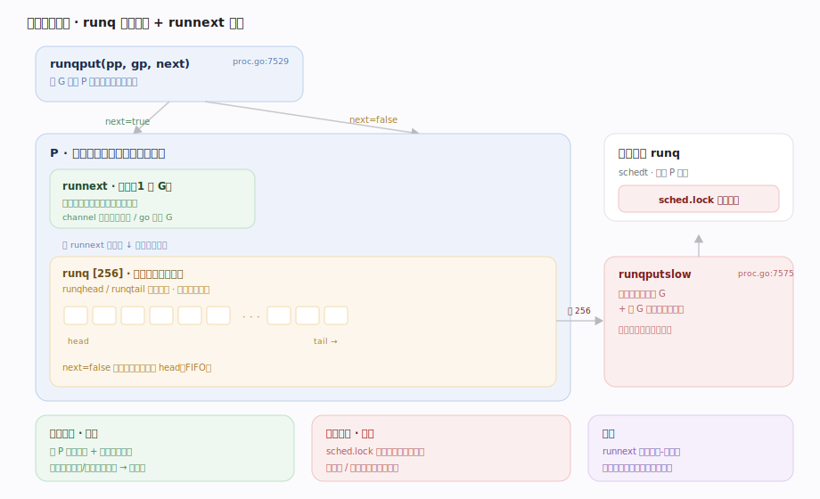
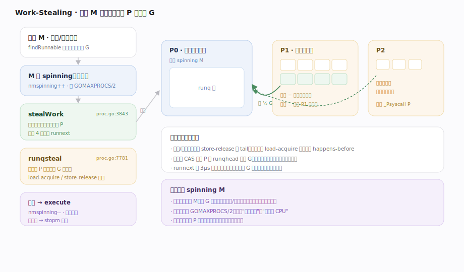
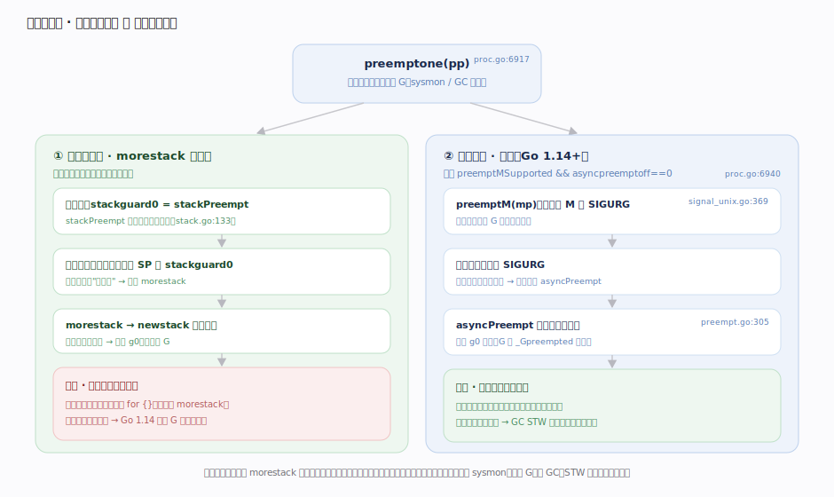
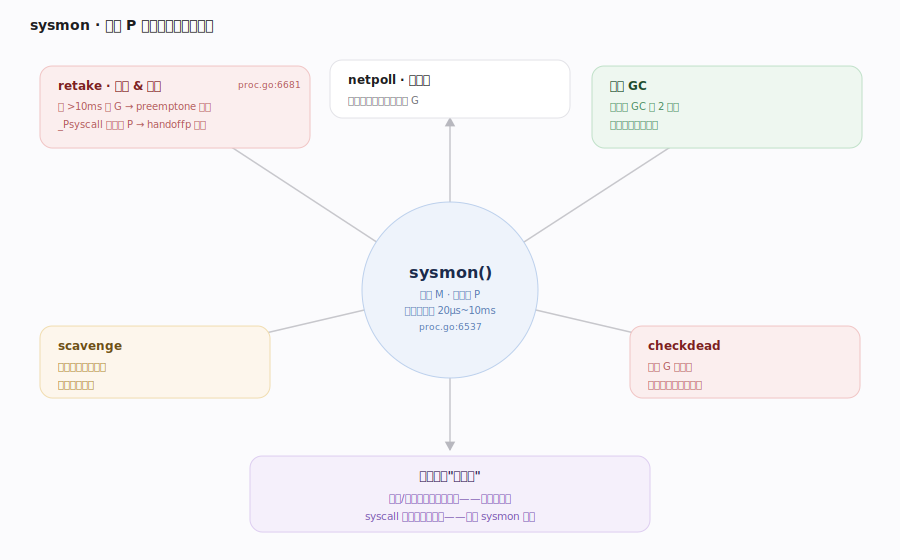
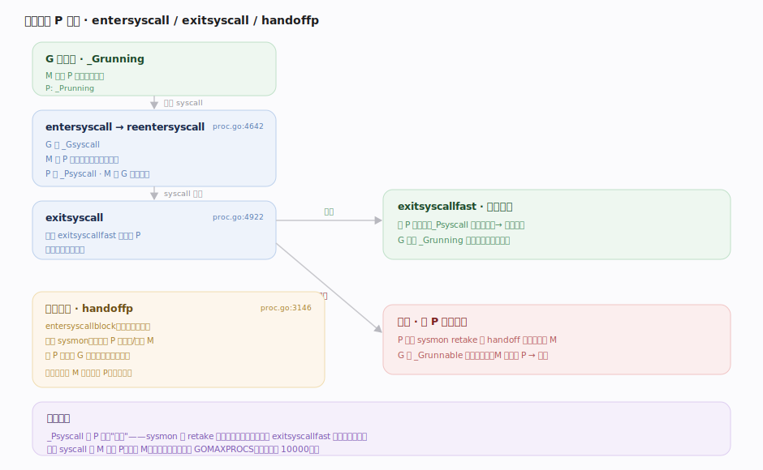
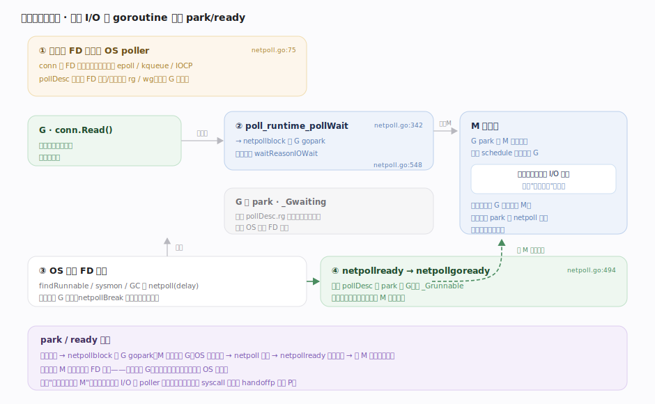

# Go 原理 · GMP 调度

> **定位**：本篇是**运行期的灵魂主线**——goroutine 如何被多路复用到 OS 线程上跑。属"调度能力域"的核心，向下依赖【栈管理】（抢占靠栈检查、切换栈靠 g0）、【分配器】（P 持有 mcache），向上被【goroutine 生命周期】【并发原语】驱动（park/ready 都经调度器）。系统调用移交与网络 poller 是它的两个深化，不单列主线。源码基准 **go1.26.4**（`~/workdir/go/src/runtime`）。

Go 用**用户态 M:N 调度**把大量 goroutine 映射到少量 OS 线程。核心是 **GMP** 三元组（`proc.go:25` 的权威术语表）：**G** = goroutine、**M** = 工作线程（machine/OS 线程）、**P** = 逻辑处理器（processor，"执行 G 的许可 + 本地资源"）。调度循环 `schedule` 反复找可运行的 G 交给当前 M 执行；找不到就 work-stealing、查全局队列、轮询网络。

---

## 一、GMP 三元组：结构与关系

- **G**（`g`，runtime2.go:471）：一个 goroutine。关键字段 `stack`（栈边界 lo/hi）、`stackguard0`（栈溢出/抢占哨兵）、`sched`（`gobuf`：切出时保存 sp/pc/bp）、`atomicstatus`（状态机）、`goid`、`m`（当前所在 M）、`_panic`/`_defer`（panic/defer 链）、`schedlink`（入队链指针）。
- **M**（`m`，runtime2.go:616）：一个 OS 线程。关键字段 `g0`（**调度专用栈**，所有调度/GC/栈增长都在 g0 上跑）、`curg`（当前用户 G）、`p`（绑定的 P）、`morebuf`（morestack 现场）、`tls`（线程本地存储）、`spinning`（自旋找活）、`lockedg`（`LockOSThread` 绑定）。
- **P**（`p`，runtime2.go:774）：逻辑处理器，数量 = `GOMAXPROCS`。关键字段 `runqhead`/`runqtail`/`runq [256]`（**本地运行队列**环形数组，256 定长）、`runnext`（下一个优先跑的 G，用于唤醒局部性）、`gFree`（G 空闲复用池）、`m`、`mcache`（无锁分配缓存）、`status`（`_Pidle`/`_Prunning`/`_Psyscall`…）。

关系铁律：**M 必须持有一个 P 才能执行用户 G**；P 的数量（GOMAXPROCS）就是并行执行 goroutine 的上限。`sysmon` 是不占 P 的特例。全局状态在 `schedt`（runtime2.go:932）：全局运行队列 `runq`、空闲 M/P 列表、`nmspinning`（自旋 M 计数）。

---

## 二、调度循环：schedule → findRunnable → execute

`schedule()`（proc.go:4150）是每个 M 的主循环，永不返回——选一个 G，`execute` 它；G 让出后再回到 `schedule`。选 G 的核心是 `findRunnable()`（proc.go:3404），按**固定优先级**找：

1. **本地队列**：`runqget`（proc.go:7649）——先 `runnext` 再环形 `runq`。
2. **全局队列**：周期性（每 61 次调度）先查一次全局 `runq`（防饥饿），否则本地空了才查 `globrunqget`。
3. **网络轮询**：`netpoll` 拿因 I/O 就绪的 G。
4. **work-stealing**：`stealWork`（proc.go:3843）从**其他 P** 偷一半 G（`runqsteal` proc.go:7781，load-acquire/store-release 无锁窃取）。
5. 都没有 → M 解绑 P、进 `_Pidle`、M 休眠（`stopm`）。

> **每 61 次查全局队列**是关键防饥饿常量（`schedtick%61==0`）：若只查本地，全局队列的 G 可能被本地热点饿死。

---

## 三、入队与本地队列：runqput / runnext

`runqput(pp, gp, next)`（proc.go:7529）把 G 放进 P 的本地队列：

- `next=true`（如 channel 唤醒的接收者、`go` 语句新 G）→ 放进 `runnext` 快槽，**下一轮优先执行**（利用生产者-消费者局部性，避免刚唤醒的 G 排到队尾）。原 `runnext` 被挤到普通队列。
- `next=false` → 放进 `runq` 环形数组尾部；**本地队列满（256）**时，`runqputslow`（proc.go:7575）把本地一半 G + 新 G 打包甩进全局队列（否则本地队列会无限膨胀）。

本地队列**无锁**（单 P 单消费者 + 头尾原子），全局队列有锁（`sched.lock`）。这是 Go 调度可扩展的关键：绝大多数入队/出队走无锁本地路径。

---

## 四、work-stealing：负载均衡

当一个 M 的本地队列和全局队列都空，它不立刻休眠——先变**自旋 M（spinning）**尝试 work-stealing：`stealWork` 随机遍历所有 P，用 `runqsteal` 从目标 P 偷走**约一半** G 到自己队列。窃取用原子 load-acquire/store-release，与被偷 P 的 `runqget` 无锁并发安全。

- 自旋 M 数量受控（`nmspinning`），避免忙等空耗 CPU；找到活或超时就停止自旋。
- `runnext` 有 3µs 保护窗口：刚放入 runnext 的 G 短时间内不被偷，保护唤醒局部性。
- 也会偷 timer（定时器分布在各 P）。

work-stealing 让空闲 M 主动"找活干"，而非等待分配——这是 M:N 调度器负载均衡的核心。

---

## 五、抢占：异步信号 + 协作式 morestack

Go 的 goroutine 不能无限占用 M（否则 GC 无法 STW、其他 G 饿死）。两种抢占并存：

- **协作式抢占（morestack 检查）**：编译器在每个函数序言插入栈检查（比较 SP 与 `g.stackguard0`）。要抢占某 G 时，`preemptone`（proc.go:6917）把它的 `stackguard0` 置为哨兵 `stackPreempt`（stack.go:133），下次函数调用进 `morestack` → `newstack` 发现哨兵就让出。**缺陷**：无函数调用的紧密循环（如 `for {}`）永远进不了 morestack，抢占不了。
- **异步抢占（信号）**：Go 1.14+ 引入。`preemptone` 若目标满足条件，走 `preemptM`（signal_unix.go:369）向目标 M 发 `SIGURG` 信号；信号处理器注入调用 `asyncPreempt`（preempt.go:305），在安全点保存寄存器、切到 g0 让出。这解决了紧密循环抢占不了的问题。门控 `preemptMSupported && debug.asyncpreemptoff==0`（proc.go:6940）。

抢占的发起者主要是 `sysmon`（长跑 G）和 GC（STW 前要停所有 G 到安全点）。

---

## 六、sysmon：不占 P 的后台监控

`sysmon()`（proc.go:6537）是一个**不绑定 P、独立运行**的后台 M，周期性（自适应 20µs~10ms）巡检：

- **retake**（proc.go:6681）：抢占跑太久的 G（>10ms 触发 `preemptone`）；回收陷在系统调用太久的 P（`_Psyscall` 状态超时 → `handoffp` 交给别的 M）。
- **netpoll**：若网络已久未轮询，主动 `netpoll` 收就绪 G。
- **强制 GC**：距上次 GC 超 2 分钟强制触发。
- **scavenge**：把长期空闲的堆内存归还 OS。
- **checkdead**：检测全部 G 阻塞的死锁。

sysmon 是调度器的"安全网"：本地/偷取路径推不动的事（超时抢占、syscall 回收、死锁检测）都由它兜底。

---

## 深化 · 系统调用的 P 移交

G 进系统调用会阻塞 M（OS 线程陷内核），不能让 P 也跟着闲置：

- **进入**：`entersyscall`（proc.go:4776）→ `reentersyscall`（proc.go:4642）把 G 置 `_Gsyscall`、**M 与 P 解除强绑但保留关联**（P 进 `_Psyscall`），M 带着 G 陷入内核。
- **快速返回**：`exitsyscall`（proc.go:4922）先试 `exitsyscallfast`——若原 P 还空着就直接抢回，G 继续跑（最快路径，无调度开销）。
- **慢速/移交**：原 P 已被 sysmon 或 handoff 拿走 → G 置 `_Grunnable` 入全局队列，M 找不到 P 就休眠。
- **主动移交**：`entersyscallblock`（已知会长阻塞，如某些阻塞 syscall）直接 `handoffp`（proc.go:3146）把 P 交给新/空闲 M，不等 sysmon。

关键区分：**`_Psyscall` 的 P 不算真闲**，sysmon 的 retake 只在其超时后才回收，给快速返回留窗口。

---

## 深化 · 集成网络轮询器（netpoll）

Go 的网络 I/O 看似阻塞（`conn.Read`），实则**非阻塞 FD + goroutine park**——这是 goroutine 能"千万并发"的关键：

- FD 设为非阻塞并注册进 OS poller（epoll/kqueue/IOCP），`pollDesc`（netpoll.go:75）持有该 FD 的读/写等待者（`rg`/`wg` 原子 G 指针）。
- 读未就绪 → `poll_runtime_pollWait`（netpoll.go:342）→ `netpollblock`（netpoll.go:548）把当前 G `gopark`（等待原因 `waitReasonIOWait`），**M 释放去跑别的 G**——不阻塞线程。
- OS 通知 FD 就绪 → `netpoll(delay)` 返回就绪 G 列表 → `netpollready`（netpoll.go:494）→ `netpollgoready` 把 G 重新置 `_Grunnable` 入队。
- 谁来调 `netpoll`？调度循环 `findRunnable`、`sysmon`、GC 都会。`netpollBreak` 用于打断阻塞的 poller。

于是一万个网络 goroutine 只需极少 M：绝大多数 park 在 netpoll 里，就绪一个跑一个。

---

## 拓展 · goroutine 状态一览（与生命周期篇共用）

| 状态常量 | 值 | 含义 |
|---|---|---|
| `_Gidle` | 0 | 刚分配未初始化 |
| `_Grunnable` | 1 | 在运行队列中，等待被调度 |
| `_Grunning` | 2 | 正在某 M 上执行（持有 P） |
| `_Gsyscall` | 3 | 陷入系统调用 |
| `_Gwaiting` | 4 | 阻塞中（channel/锁/GC 等），不在运行队列 |
| `_Gdead` | 6 | 已退出或刚分配，可复用 |
| `_Gcopystack` | 8 | 正在被搬移栈（copystack） |
| `_Gpreempted` | 9 | 被异步抢占，等待恢复 |
| `_Gscan`（位 0x1000） | — | 与其他状态叠加，表示 GC 正扫描其栈 |

（常量块 runtime2.go:35；状态转换统一走 `casgstatus` proc.go:1290。）

## 调优要点（关键开关，均源码核实）

- `GOMAXPROCS`（P 的数量，默认 = CPU 核数）——并行执行 G 的上限。1.26 起可感知 cgroup CPU 配额。
- `GODEBUG=schedtrace=1000`（每 1000ms 打印调度器状态）、`scheddetail=1`（详细）——观测 M/P/G 数量与队列。
- `GODEBUG=asyncpreemptoff=1`——关异步抢占（调试用，会退回纯协作式）。
- `runtime.LockOSThread`/`UnlockOSThread`——把 G 钉在特定 M（cgo、OpenGL 等需线程亲和的场景）。
- `runtime.Gosched()`——主动让出，把当前 G 放回全局队列。

## 常见误区与工程要点

- **误区：GOMAXPROCS 是线程数上限。** 不是。它是 **P 的数量 = 并行执行 G 的上限**；M（线程）数量可远超它（陷入 syscall 的 M 不占 P，数量由 syscall 并发决定，上限默认 10000）。
- **误区：goroutine 由 OS 调度。** 不是。goroutine 是**用户态**调度（GMP 在 runtime 内），OS 只调度 M（线程）。M:N 就是"N 个 G 映射到 M 个线程"。
- **误区：`for {}` 死循环能被抢占（老 Go）。** Go 1.14 前**不能**（纯协作式，无 morestack 检查点）；1.14+ 靠异步信号抢占才可以。
- **误区：网络 I/O 阻塞会占满线程。** 不会。阻塞的网络 G 被 `netpollblock` park，M 去跑别的 G——这正是 Go 高并发网络的根基。
- 归属提醒：栈增长/抢占哨兵机制在【栈管理】展开，本篇只讲调度侧触发；channel 的 park/ready 由本篇的 `gopark`/`goready` 承载但语义在【并发原语】。

## 一句话总纲

**Go 用用户态 M:N 的 GMP 调度器把海量 goroutine 多路复用到少量 OS 线程：M 必须持 P（数量=GOMAXPROCS）才能跑 G，`schedule`→`findRunnable` 按「本地 runq/runnext → 每 61 次查全局 → netpoll → work-stealing 偷半数」找活，`runqput` 用 runnext 快槽保唤醒局部性、本地队列满则甩一半进全局；跑太久的 G 靠「协作式 morestack 栈检查哨兵 + 异步 SIGURG 信号」双机制抢占，系统调用时 M 带 G 陷内核但 P 经 `handoffp` 移交不空转、网络 I/O 则用非阻塞 FD + `netpollblock` 让 G park 而 M 不阻塞，`sysmon` 不占 P 兜底超时抢占/syscall 回收/死锁检测——全程绝大多数入队出队走无锁本地路径。**
