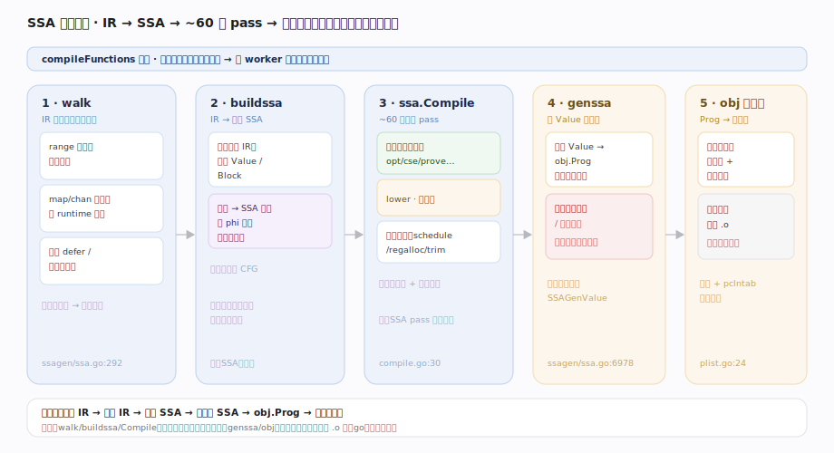
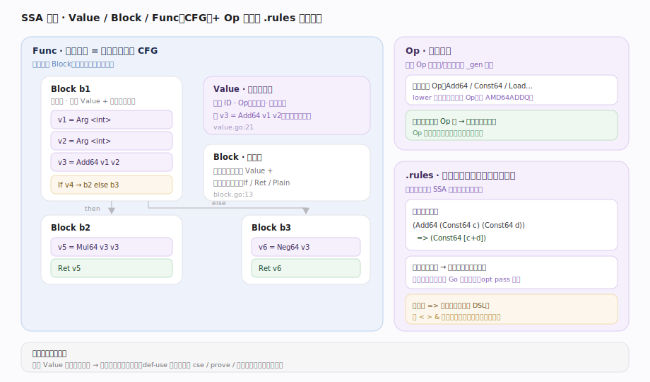
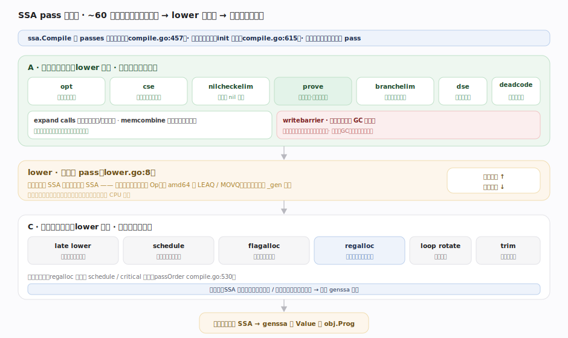
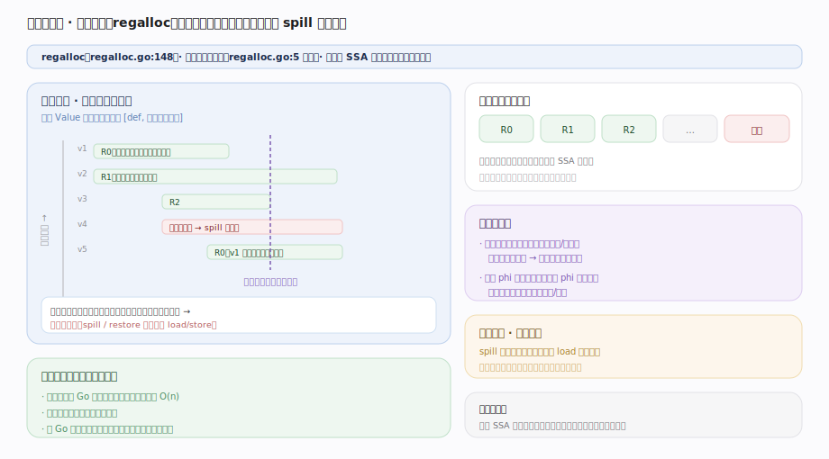
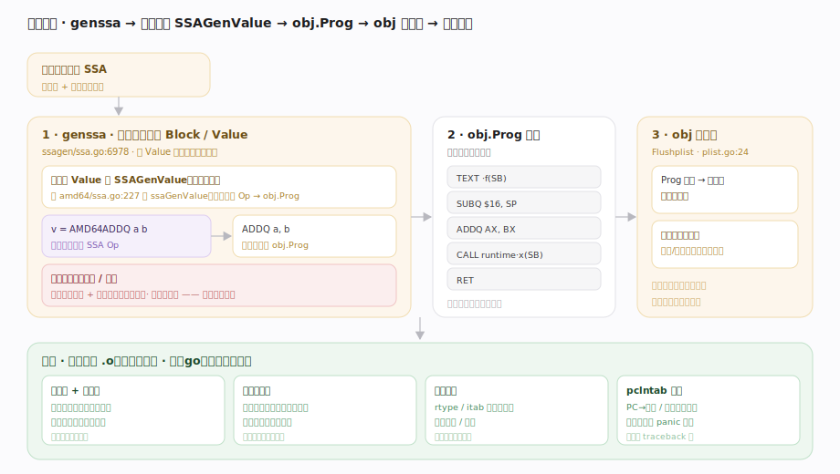

# Go 原理 · SSA 后端

> **定位**：本篇是编译期工具链的第二段——把前端 IR 编译成机器码。属"编译能力域"，上游是【编译前端】（消费其 IR）、下游是【go命令与链接】（产目标文件供链接）。它是【GC】写屏障、【栈管理】栈检查、【defer/panic】open-coded defer 的**编译期插桩点**。源码基准 **go1.26.4**（`~/workdir/go/src/cmd/compile/internal/ssa`、`ssagen`）。

Go 后端用 **SSA（静态单赋值）** 形式做优化与代码生成。IR 先转成 SSA（`buildssa`），过一串约 60 遍**有序 pass**（机器无关优化 → lower 到机器相关 → 寄存器分配 → 调度），最后发射成目标机器指令（`genssa` → `obj` 汇编器）。SSA 的"每个变量只赋值一次"特性让数据流分析和优化极为规整。

---

## 一、SSA 后端全景

后端主链（由 `compileFunctions` 触发，每个函数独立、可并行编译）：

1. **walk**：把高层 IR 结点降级为更接近机器的形式（如 `range` 展开、map/channel 操作换成 runtime 调用、**插入 defer/panic 处理**）。
2. **buildssa**（ssagen/ssa.go:292）：把 walk 后的 IR 转成初始 SSA（`ssa.Func`：Block + Value 图）。
3. **`ssa.Compile`**（compile.go:30）：跑约 60 遍 pass（下节）。
4. **genssa**（ssagen/ssa.go:6978）：把最终 lower + 分配寄存器后的 SSA，逐 Value 经各架构后端翻译成 `obj.Prog` 指令。
5. **obj 汇编器**（`Flushplist` plist.go:24）：`Prog` 列表 → 机器码字节 + 重定位，写进目标文件。

---

## 二、SSA 是什么：Value / Block / Func

- **Value**（value.go:21）：一条 SSA 指令/值，如 `v3 = Add64 v1 v2`。每个 Value **只被定义一次**（静态单赋值），有唯一 ID、操作码 Op、参数、类型。
- **Block**（block.go:13）：基本块，含一串 Value + 一个控制流出口（如 `If`/`Plain`/`Ret`）。
- **Func**（func.go:23）：一个函数的 SSA——Block 组成的**控制流图（CFG）**。
- **Op 与规则**：Op 语义由 `_gen/*Ops.go` 生成；优化用**重写规则** `_gen/*.rules`（模式匹配 → 替换）生成成 `rewrite*.go`。如 `(Add64 (Const64 [c]) (Const64 [d])) => (Const64 [c+d])` 就是常量折叠规则。

单赋值 + 显式数据流让"这个值从哪来、被谁用"一目了然，是所有优化的基础。

---

## 三、pass 流水线：约 60 遍有序优化

`ssa.Compile`（compile.go:30）按 `passes` 列表（compile.go:457）顺序跑（非优化模式跳过非必需 pass）。关键 pass（保留英文原名）：

- **机器无关优化**：`opt`（通用重写规则，常量折叠/强度削弱/代数化简）、`generic cse`（公共子表达式消除）、`nilcheckelim`（消冗余 nil 检查）、**`prove`**（值域推断，消除可证明的边界检查——bounds-check elimination）、`branchelim`（分支转条件移动）、`dse`（死存储消除）、`generic deadcode`（死代码消除）。
- **调用与内存**：`expand calls`（展开调用的参数/返回布局）、**`writebarrier`**（**为指针写插入 GC 写屏障**——【GC】的编译期接合点）、`memcombine`（合并相邻内存访问）。
- **lower**（lower.go:8）：**分水岭 pass**——把机器无关 SSA 转成**机器相关** SSA（用目标架构的具体指令 Op，如 amd64 的 `LEAQ`/`MOVQ`），用各架构的 `_gen/AMD64.rules` 等。
- **机器相关收尾**：`late lower`、`addressing modes`（合并地址计算进寻址模式）、`schedule`（块内指令调度）、**`flagalloc`**（标志寄存器分配）、**`regalloc`**（寄存器分配）、`loop rotate`、`trim`。

pass 顺序有硬约束（`passOrder` compile.go:530 + init 自检 compile.go:615），如 regalloc 必须在 schedule/critical 之后。

---

## 四、寄存器分配：线性扫描

`regalloc`（regalloc.go:148）用**线性扫描寄存器分配器**（regalloc.go:5 注释）把无限的 SSA 值映射到有限的物理寄存器：

- 按程序顺序线性扫描每个 Value 的活跃区间，给活跃值分配寄存器；寄存器不够时**溢出（spill）** 到栈。
- 处理 Value 的"期望寄存器"（如调用约定要求参数在特定寄存器）、跨块的寄存器一致性（`phi` 值合并）。
- 比图着色分配器快（编译速度是 Go 的重要目标），质量略逊但对 Go 足够。

寄存器分配后，SSA 值都落到了具体寄存器或栈槽，才能发射机器指令。

---

## 五、代码发射：genssa → obj

- **genssa**（ssagen/ssa.go:6978）：遍历调度好的 Block/Value，对每个 Value 调**架构后端**的 `SSAGenValue`（如 amd64/ssa.go:227 的 `ssaGenValue`）——把一个机器相关 SSA Op 翻译成一条或几条 `obj.Prog`（抽象机器指令）。同时**插入函数序言/尾声**（栈检查、栈帧分配——【栈管理】的接合点）。
- **obj 汇编器**（`Flushplist` plist.go:24）：把 `Prog` 列表最终编码成**机器码字节** + **重定位记录**（调用别的符号、引用全局变量的地址待链接期填），连同符号信息写进 `.o` 目标文件。

产物是一个**目标文件**（含机器码 + 符号表 + 重定位 + 类型信息 + `pclntab` 素材），交给链接器（见【go命令与链接】）。

---

## 拓展 · 编译期插桩点（后端为运行期缝合）

| 插桩 | pass/位置 | 服务于 |
|---|---|---|
| GC 写屏障 | `writebarrier` pass | 【GC】并发标记正确性 |
| 栈增长/抢占检查 | genssa 函数序言 | 【栈管理】【GMP调度】 |
| open-coded defer | walk + 函数尾声 | 【defer/panic】 |
| 边界检查 | 前端插入，`prove` 消冗余 | 内存安全 |
| 竞争检测插桩 | `-race` 时插入 | 【并发原语】数据竞争检测 |
| 类型描述符引用 | genssa 重定位 | 【接口与反射】 |

## 调优要点（关键开关，均源码核实）

- `-gcflags=-S`：打印生成的汇编；`GOSSAFUNC=FuncName go build` 生成该函数的 **SSA 各 pass HTML 可视化**（`ssa.html`，逐 pass 看 IR 变化——极强的学习/调试工具）。
- `-gcflags="-N -l"`：禁优化禁内联，配 delve 调试（否则变量被优化掉）。
- `-gcflags=-d=ssa/check/on`：开 SSA 一致性检查。
- 边界检查开销：`prove` pass 已消大量冗余；`-gcflags=-B` 可禁边界检查（危险，一般不用）。
- SIMD：1.26 有 `cpufeatures`/SIMD 相关 pass；向量化优化按架构启用。

## 常见误区与工程要点

- **误区：Go 优化很弱。** Go 优先**编译速度**，但 SSA 后端有常量折叠、CSE、边界检查消除（prove）、内联、逃逸分析等主流优化——只是不做激进的 LTO/PGO 级全局优化（PGO 1.21+ 已支持）。
- **误区：每个函数编译要串行。** 不。函数级 SSA 编译**可并行**（`compileFunctions` 多 worker）。
- **误区：写屏障是运行时自己加的。** 不。是**编译器 `writebarrier` pass** 在每个指针写处插入的——运行期只是执行被插入的屏障代码。
- **误区：lower 之前的 SSA 就是最终形态。** 不。lower 是分水岭——之前机器无关，之后才用目标架构具体指令。
- 归属提醒：IR 来源在【编译前端】；写屏障算法在【GC】、栈检查机制在【栈管理】（本篇只讲"在哪插入"）；目标文件如何链接成二进制在【go命令与链接】。

## 一句话总纲

**Go 后端把前端 IR 经 walk 降级后 `buildssa` 转成 SSA（Value/Block 组成的 CFG，每个值只赋值一次），由 `ssa.Compile` 跑约 60 遍有序 pass——先机器无关优化（`opt` 重写规则做常量折叠/强度削弱、`cse` 消公共子表达式、`prove` 消边界检查、`writebarrier` 为指针写插 GC 写屏障、`deadcode` 消死码），再经分水岭 pass `lower` 转成机器相关 SSA（目标架构具体指令），后接 `schedule` 调度、`flagalloc`、线性扫描 `regalloc`（寄存器不够则溢出到栈）；`genssa` 逐 Value 调架构后端翻成 `obj.Prog` 并插入函数序言的栈检查/尾声，`obj` 汇编器编码成机器码字节 + 重定位写进目标文件——后端还是 GC 写屏障、栈抢占检查、open-coded defer、race 插桩的编译期插桩点，把运行期机制缝进代码。**
