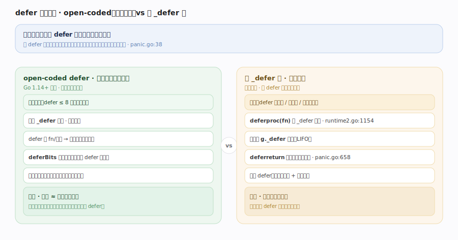
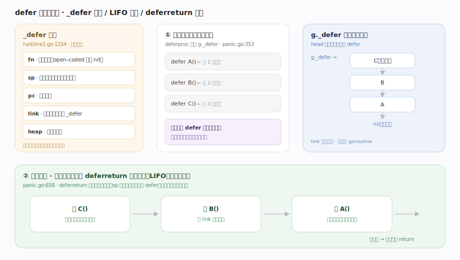
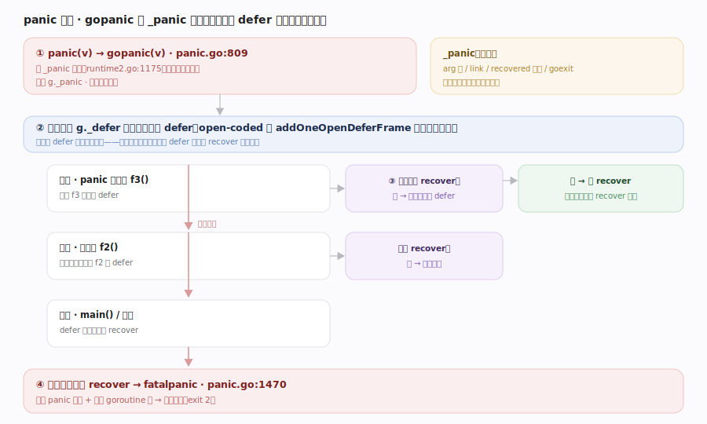
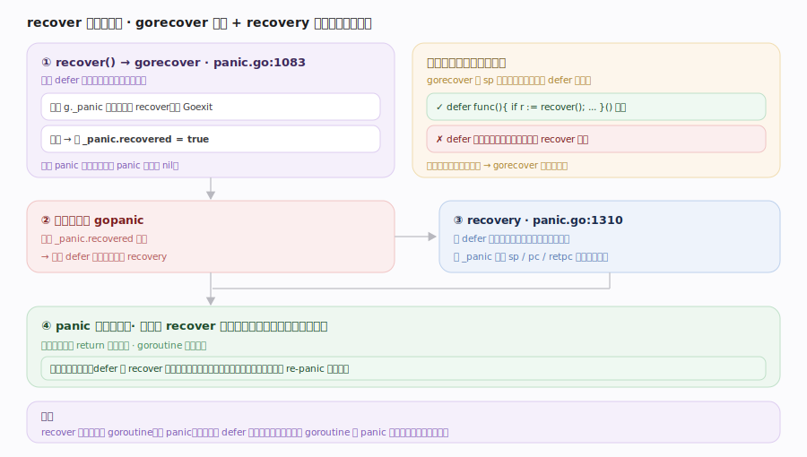

# Go 原理 · defer / panic / recover

> **定位**：本篇讲 Go 的延迟调用与异常机制——`defer` 如何注册、`panic` 如何沿 defer 链展开、`recover` 如何拦截。属"执行控制能力域"，依赖【栈管理】（`_defer`/`_panic` 记录在栈上、panic 展开要遍历栈帧）、【SSA后端】（open-coded defer 由编译器在函数出口内联）、被【goroutine 生命周期】依赖（`goexit` 时跑完 defer）。源码基准 **go1.26.4**（`~/workdir/go/src/runtime/panic.go`）。

`defer` 注册"函数返回前必执行"的调用（常用于释放锁、关文件）；`panic` 中断正常流程、沿调用栈逆序执行已注册的 defer；`recover` 只在 defer 中有效，能拦住 panic 让 goroutine 恢复正常。Go 用**两套 defer 实现**——性能敏感的 open-coded defer 与通用的堆 defer 链。

---

## 一、defer 全景：两套实现

`panic.go:38` 头注释说明两条路径：

- **open-coded defer（开放编码，最快）**：Go 1.14+ 默认。当函数里 defer **数量少（≤8）且不在循环中**时，编译器**不建 `_defer` 记录**，而是把 defer 的函数/参数存进**栈上固定槽位**，用一个 **`deferBits` 位掩码**记录哪些 defer 已激活；函数正常退出时，编译器在出口处**内联**展开这些 defer 调用（按位检查）。几乎零运行时开销。
- **堆 defer 链（通用）**：defer 在循环里、或数量多、或 open-coded 条件不满足时回退。每个 defer 建一个 `_defer` 记录（runtime2.go:1154，`deferproc` panic.go:353 分配），头插进 `g._defer` 链表；函数返回时 `deferreturn`（panic.go:658）遍历链表逆序执行。

**为什么两套**：open-coded 覆盖了绝大多数常见场景（简单函数里一两个 defer），把 defer 成本降到接近零；堆链保证语义完备（循环 defer 等）。

---

## 二、defer 的注册与执行

- **`_defer`**（runtime2.go:1154）：字段 `fn`（延迟函数，open-coded 时可为 nil）、`sp`/`pc`（注册点栈指针/返回地址，用于匹配栈帧）、`link`（链下一个）、`heap`（是否堆分配）。
- **注册**：堆路径 `deferproc(fn)` 建记录头插 `g._defer`；栈路径 `deferprocStack` 用栈上预留的 `_defer`。**LIFO**——后注册的先执行。
- **执行**：函数正常返回时，`deferreturn`（panic.go:658）驱动一个 `_panic{deferreturn:true}` 遍历、逐个跑本函数注册的 defer（sp 匹配），跑完真正返回。open-coded 则由编译器在出口按 `deferBits` 内联执行。

defer 的参数在 **注册时求值**（`defer f(x)` 里 x 当场算），但函数体到 return 前才执行——这是常见困惑点。

---

## 三、panic：沿 defer 链展开

`panic(v)` 编译成 `gopanic(v)`（panic.go:809）：

1. 建一个 `_panic` 记录（runtime2.go:1175，**只存在于栈上**）头插 `g._panic`。
2. **逆序遍历 `g._defer` 链**，逐个执行 defer 函数（open-coded 的也会被 `addOneOpenDeferFrame` 收进来统一跑）。
3. 每执行一个 defer，检查它是否调用了 `recover`：
   - **未 recover** → 继续展开下一个 defer，跨越栈帧向上。
   - **被 recover** → 停止展开（见下节）。
4. defer 全跑完仍无 recover → panic 到达栈顶 → `fatalpanic`（panic.go:1470）打印 panic 信息 + 所有 goroutine 栈 → 进程崩溃（exit 2）。

panic 展开是"边跑 defer 边爬栈"，不是先爬完再跑——因为 defer 里可能 recover 从而中止爬栈。

---

## 四、recover：拦截与恢复

`recover` 编译成 `gorecover`（panic.go:1083）——**只在 defer 函数中直接调用才有效**：

1. `gorecover` 检查当前是否正在 panic（`g._panic` 非空）且该 panic 未被 recover、非 Goexit；满足则把 `_panic.recovered = true`、返回 panic 的值。
2. 控制权回到 `gopanic`，它见 `recovered` 为真 → 调 `recovery`（panic.go:1310）：**把该 defer 所在函数的栈帧「伪装成正常返回」**——用 `_panic` 里记录的 `sp`/`pc`/`retpc` 恢复到那个函数的返回点，让它像正常 return 一样继续。
3. 于是 panic 被"吞掉"，程序从 recover 所在函数的调用者处继续正常执行。

**recover 必须在 defer 里直接调**：`if r := recover; r != nil` 写在被 defer 的函数体内。间接调（如 defer 里再调一个函数、那函数里 recover）无效——因为 `gorecover` 靠栈帧位置判定合法性。

---

## 拓展 · defer/panic/recover 要点

| 要点 | 说明 |
|---|---|
| defer 参数求值时机 | **注册时**求值，非执行时（`defer f(i)` 捕获当时的 i） |
| defer 执行顺序 | LIFO，后进先出 |
| `runtime.Goexit` | 用一个 `_panic{goexit:true}` 走 defer 链但**不可被 recover**，跑完 defer 后终止 G |
| recover 返回值 | panic 传入的值；无 panic 时返回 nil |
| 命名返回值 + defer | defer 可修改命名返回值（recover 后返回错误的常见手法） |
| re-panic | recover 后可再 `panic` 重新抛出 |
| open-coded 上限 | defer 数 ≤ 8 且不在循环、无 recover 干扰时启用 |

## 调优要点（关键开关，均源码核实）

- `GOTRACEBACK`（none/single/all/system/crash）：控制 panic 时打印栈的详细度；`crash` 会生成 core dump。
- open-coded defer 已让"简单函数里的 defer"几乎零成本——**不必为性能刻意避免 defer**（老 Go 的建议已过时）。
- 热点循环里的 defer 会走堆链（较慢），必要时手动在循环外释放或改结构。
- panic/recover **不是常规错误处理**——Go 用返回 `error`；panic 留给"不可恢复的程序错误"（越界、nil 解引用）或跨多层的少数场景（如解析器）。

## 常见误区与工程要点

- **误区：defer 很慢，热路径要避免。** Go 1.14+ 的 **open-coded defer** 让简单场景几乎零开销，这条老建议已过时；只有循环里的 defer 才走较慢的堆链。
- **误区：defer 参数在执行时求值。** 不。**注册时**就求值并拷贝（`defer fmt.Println(i)` 打印的是 defer 那行的 i）。
- **误区：recover 能拦任何地方的 panic。** 只能拦**同一 goroutine**、且必须在 defer 函数里**直接**调用。别的 goroutine 的 panic 拦不住（会崩整个进程）。
- **误区：recover 可以嵌套间接调用。** 不。`gorecover` 靠调用栈帧位置判定，必须是被 defer 的函数直接调 recover。
- **误区：panic 是异常，应像 try/catch 那样用。** 不。Go 惯用返回 `error`；panic 仅用于不可恢复错误或极少数跨层场景。
- 归属提醒：open-coded defer 的**编译期内联**在【SSA后端】；`_defer`/`_panic` 栈上记录的搬移在【栈管理】的 copystack；`goexit` 时跑 defer 在【goroutine 生命周期】。

## 一句话总纲

**Go 的延迟与异常用两套 defer 实现：简单函数（defer≤8、不在循环）走 open-coded——编译器把 defer 存进栈上槽位 + `deferBits` 位掩码、在函数出口内联展开，几乎零开销；否则回退堆 `_defer` 链（`deferproc` 头插、`deferreturn` LIFO 执行，参数注册时即求值）；`panic` 经 `gopanic` 建栈上 `_panic` 记录并逆序遍历 defer 链「边跑边爬栈」，每个 defer 里若 `gorecover`（仅在 defer 内直接调有效）标记 `recovered`，则 `recovery` 把该函数栈帧伪装成正常返回、吞掉 panic 继续执行，否则展开到栈顶 `fatalpanic` 打印栈并崩溃——`Goexit` 借同一机制走 defer 但不可被 recover。**
