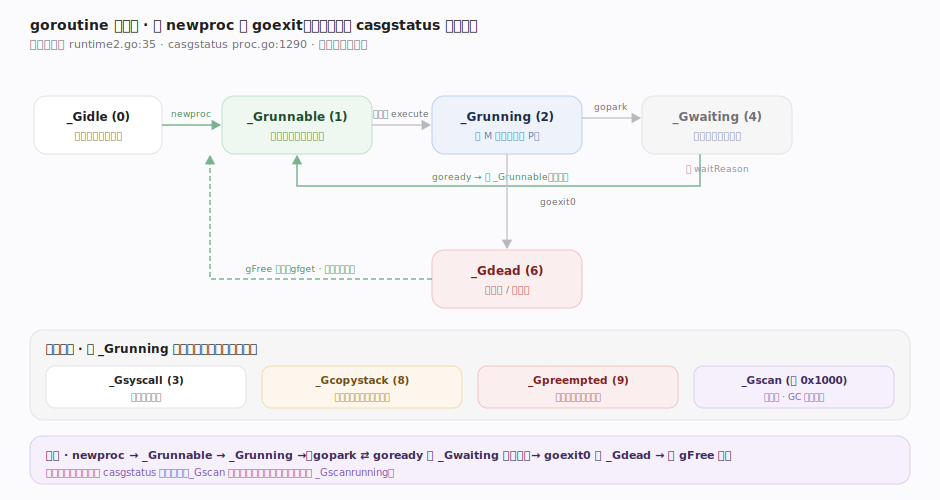
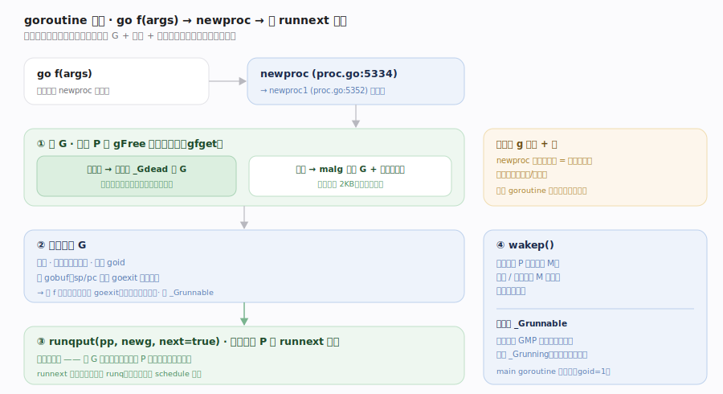
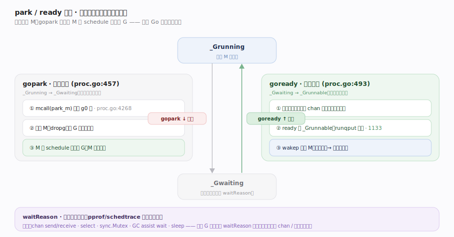
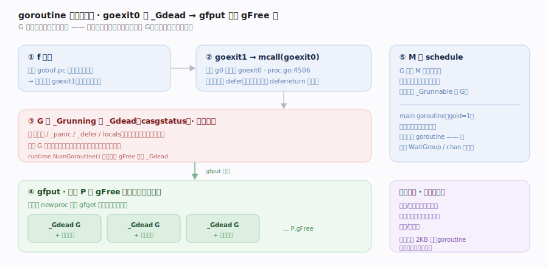

# Go 原理 · goroutine 生命周期

> **定位**：本篇讲一个 goroutine 从 `go f` 诞生到 `goexit` 消亡的全过程与状态机。属"调度能力域"，是【GMP调度】的"被调度对象"视角补充——调度篇讲"怎么选 G 跑"，本篇讲"G 怎么生、怎么在运行/阻塞/就绪间转、怎么死并被复用"。依赖【栈管理】（生时分配栈）、承载【defer/panic】（退出时执行 defer）、被【并发原语】驱动状态转换（park/ready）。源码基准 **go1.26.4**（`~/workdir/go/src/runtime/proc.go`）。

一个 goroutine 就是一个 `g` 结构 + 一段栈 + 一个状态。它的一生是状态机的迁移：诞生（`newproc`）→ 可运行 → 运行 →（阻塞 ⇄ 就绪）→ 死亡（`goexit`）→ 被复用。所有状态转换统一走 `casgstatus`（proc.go:1290）原子完成。

---

## 一、生命周期全景：状态机

核心状态（常量块 runtime2.go:35）：

- `_Gidle`(0)：刚分配、未初始化。
- `_Grunnable`(1)：在运行队列里，等待被调度。
- `_Grunning`(2)：正在某 M 上执行（持有 P）。
- `_Gsyscall`(3)：陷入系统调用。
- `_Gwaiting`(4)：阻塞中（channel/锁/GC/timer），不在运行队列。
- `_Gdead`(6)：已退出或刚分配，可被复用。
- `_Gcopystack`(8)：正在被搬移栈。
- `_Gpreempted`(9)：被异步抢占，等待恢复。
- `_Gscan`(位 0x1000)：叠加位，GC 正扫描其栈。

主干迁移：`newproc` 造出 `_Grunnable` → 被调度进 `_Grunning` → 阻塞 `gopark` 转 `_Gwaiting` → 唤醒 `goready` 回 `_Grunnable` → 结束 `goexit0` 转 `_Gdead` 入 gFree 复用池。

---

## 二、诞生：go 语句 → newproc

`go f(args)` 被编译成对 `newproc`（proc.go:5334）的调用：

1. `newproc1`（proc.go:5352）**先从 P 的 `gFree` 空闲池取一个 `_Gdead` 的 G 复用**（`gfget`）——避免频繁分配；池空才新建并分配初始栈。
2. 设置新 G 的栈、`gobuf`（sp/pc 指向 `goexit` 的调用点，使 f 返回后自动进 `goexit`）、拷贝参数到新栈、置 `_Grunnable`、分配 goid。
3. `runqput(pp, newg, next=true)` 放进当前 P 的 `runnext` 快槽（利用局部性，新 G 大概率马上被跑）。
4. `wakep` 若有空闲 P 且无自旋 M，唤醒/新建一个 M 来跑（提高并行度）。

**关键**：`go` 语句成本极低——多数时候只是"取复用 G + 拷参 + 入本地队列"，无系统调用、无锁（本地队列无锁）。

---

## 三、阻塞与唤醒：gopark / goready

goroutine 阻塞不是占着 M 干等，而是**让出 M 去跑别的 G**：

- **park（阻塞）**：`gopark`（proc.go:457）——当前 G 从 `_Grunning` 转 `_Gwaiting`，`mcall(park_m)` 切到 g0 栈，`park_m`（proc.go:4268）解除 G 与 M 的绑定、把 G 挂到等待处（channel 的 sendq/recvq、semaRoot 等），然后 M 回 `schedule` 找别的 G 跑。`gopark` 带一个 `waitReason`（如 `waitReasonChanReceive`），供调试观测。
- **ready（唤醒）**：`goready`（proc.go:493）→ `ready`（proc.go:1133）——把 G 从 `_Gwaiting` 转回 `_Grunnable`（proc.go:1145）、放进某 P 的运行队列（常用 runnext 保局部性）、必要时 `wakep` 唤醒 M。

park/ready 是一对对称操作，是 channel 收发、锁等待、`time.Sleep`、netpoll 的公共底座——所有"阻塞"最终都归到 `gopark`。

---

## 四、死亡与复用：goexit → gFree

f 返回后（`gobuf.pc` 预设的返回地址）自动进入 `goexit1` → `mcall(goexit0)`（proc.go:4506）：

1. 执行剩余的 defer（若 f 正常返回则 defer 已在 `deferreturn` 跑完；panic 路径见【defer/panic】）。
2. G 从 `_Grunning` 转 `_Gdead`，清空字段（栈、_panic、_defer、locals）。
3. `gfput` 把这个 `_Gdead` 的 G **放回 P 的 gFree 池**（栈也可能保留一部分供复用），供下次 `newproc` 快速取用。
4. M 回 `schedule` 继续找活。

**G 结构与栈是复用的**——这是 goroutine 频繁创建销毁（如每请求一个 G）却开销低的原因：多数是池化对象的取还，而非真正的分配/释放。

---

## 拓展 · 特殊 goroutine 与操作

| 对象/操作 | 说明 |
|---|---|
| `g0` | 每个 M 的**调度栈 goroutine**，不是用户 G；调度、GC、栈增长都在 g0 上执行 |
| `main goroutine` | 运行 `main.main` 的 G，goid=1；它返回则整个程序退出 |
| `runtime.Goexit` | 终止当前 G 但**先执行完所有 defer**（不同于 return，可在任意深度调用；见【defer/panic】） |
| `runtime.Gosched` | 主动让出，G 回全局队列（协作式让路，不阻塞） |
| `runtime.NumGoroutine` | 当前存活 G 数（不含 gFree 里的 _Gdead） |
| goid | 每个 G 唯一，但**故意不暴露 API**（防止基于 goid 的 goroutine-local 滥用） |

## 调优要点（关键开关，均源码核实）

- `GODEBUG=schedtrace=1000`：观测 G 的运行/可运行/等待数量随时间变化。
- `runtime/pprof` 的 goroutine profile：dump 所有 G 的栈，定位泄漏（大量 G 卡在同一 `waitReason`）。
- `GODEBUG=gctrace=1` 间接反映 G 栈扫描量。
- goroutine 泄漏排查：看 pprof 里 `_Gwaiting` 且 `waitReason` 集中的 G——通常是没关的 channel、没超时的等待。

## 常见误区与工程要点

- **误区：goroutine 创建很贵。** 不。多数是从 gFree 池**取复用 G + 拷参 + 无锁入队**，成本远低于 OS 线程创建；初始栈仅 2KB。
- **误区：阻塞的 goroutine 占着线程。** 不。`gopark` 让 G 让出 M，M 去跑别的 G——阻塞的是 G 不是 M。
- **误区：可以用 goid 做 goroutine-local storage。** Go 故意不暴露 goid（`getg.goid` 是内部字段），因为它鼓励用 channel/context 传递而非线程本地状态。
- **误区：主 goroutine 阻塞了别的 goroutine 还能跑完。** `main.main` 返回程序立即退出，**不等**其他 goroutine——需要显式 `sync.WaitGroup`/channel 等待。
- 归属提醒：G 被"怎么选中执行"在【GMP调度】；park/ready 的**具体触发者**（channel/锁）在【并发原语】；退出时 defer 的执行细节在【defer/panic】；栈的分配/搬移在【栈管理】。

## 一句话总纲

**一个 goroutine 是「`g` 结构 + 连续栈 + 状态」：`go f` 编译成 `newproc`，优先从 P 的 gFree 池取复用 `_Gdead` 的 G（池空才新建）、拷参并预设返回地址指向 `goexit`、置 `_Grunnable` 入 runnext 快槽并按需 `wakep`；被调度进 `_Grunning` 后，阻塞走 `gopark`（转 `_Gwaiting`、带 waitReason、让出 M 去跑别的 G、挂到 channel/semaRoot 等待处），唤醒走 `goready`（转回 `_Grunnable` 入队）——所有阻塞最终归到这对 park/ready；f 返回进 `goexit0` 转 `_Gdead`、经 `gfput` 连同栈放回 gFree 池复用——状态转换统一由 `casgstatus` 原子完成，「池化复用 + 阻塞即让出」使 goroutine 廉价到可百万并发。**
