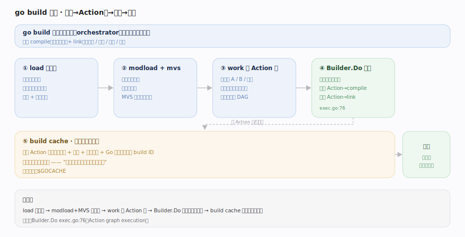
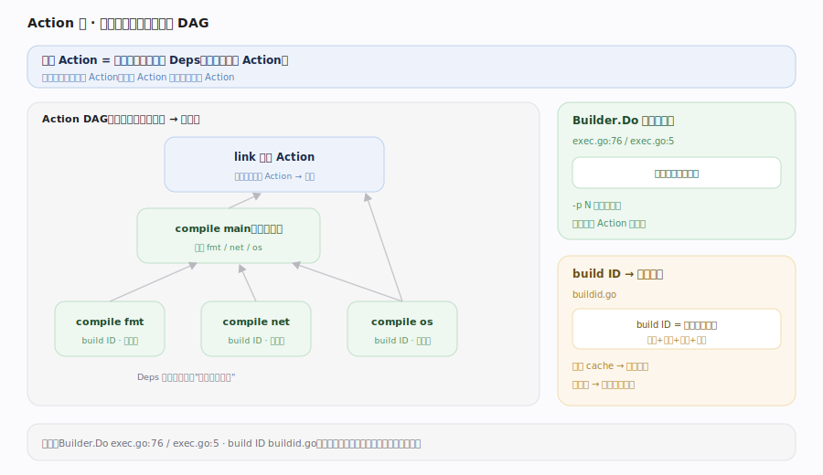
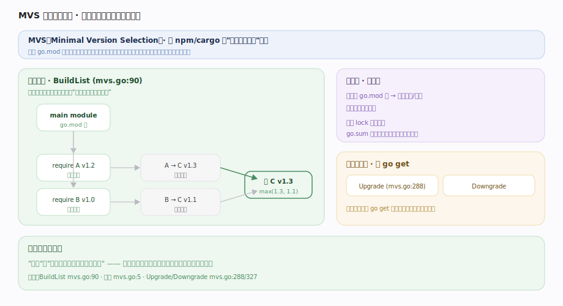
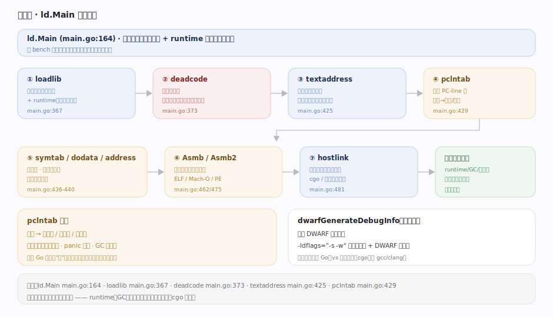
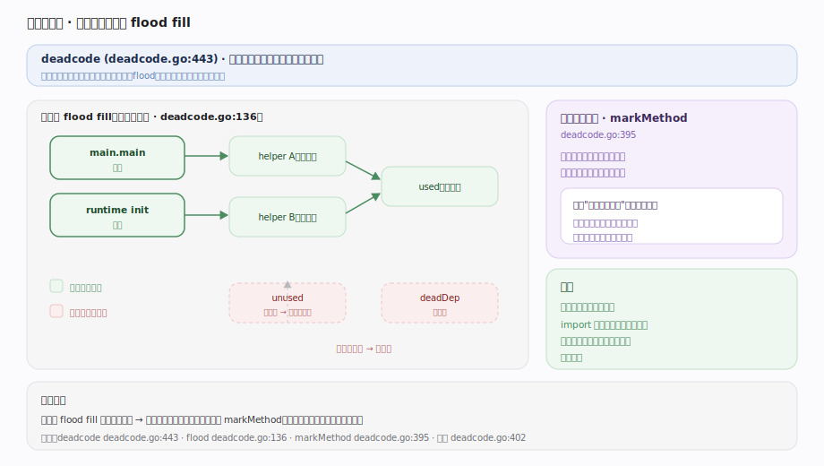

# Go 原理 · go 命令与链接

> **定位**：本篇讲工具链的"驱动者与收尾者"——`go` 命令如何编排构建（Action 图 + 模块解析 MVS），链接器如何把一堆目标文件收成单一可执行文件。属"编译能力域"的两端：`go build` 调度【编译前端】+【SSA后端】编译每个包，链接器把它们 + runtime 拼成二进制。源码基准 **go1.26.4**（`~/workdir/go/src/cmd/go/internal`、`cmd/link/internal/ld`）。

`go build` 不是编译器本身——它是**构建编排器**：解析依赖（模块 + 版本）、把编译/链接任务组织成一张 **Action 图**、并行执行、缓存产物，最后调**链接器**（`ld.Main`）把所有包的目标文件 + runtime 死代码消除后布局成一个**自包含可执行文件**。

---

## 一、go build 全景：从源到二进制

`go build` 主流程：

1. **加载包**（`load`）：解析导入路径、找到所有依赖包的源码（本地 + 模块缓存）。
2. **模块解析**（`modload` + `mvs`）：确定每个依赖用哪个**版本**（MVS，见下节）。
3. **构建 Action 图**（`work`）：把"编译包 A"、"编译包 B"、"链接"等任务组织成有依赖关系的**有向无环图**。
4. **执行**（`Builder.Do` exec.go:76）：拓扑序并行执行 Action——每个"编译包"Action 调 `compile`（前端+后端），"链接"Action 调 `link`。
5. **缓存**：每个 Action 的输入哈希成 build ID，命中缓存则跳过重编（增量构建的核心）。

---

## 二、Action 图：并行构建的调度

`work` 包把构建建模成 **Action 图**（action.go 的 `Action` 结点，exec.go:5 "Action graph execution"）：

- 每个 `Action` = 一个构建步骤（编译某包 / 汇编 / 链接 / 生成),带依赖（`Deps`）——如"链接"依赖所有"编译包"Action。
- `Builder.Do`（exec.go:76）拓扑序执行：无依赖或依赖已完成的 Action 可并行跑（受 `-p` 并行度限制，默认 = CPU 数）。
- **可视化**：`go build -debug-actiongraph=file` dump 整张图（exec.go:106），能看到每个包的编译顺序与并行度。
- 每个 Action 有 **build ID**（buildid.go）——输入（源码 + 依赖 + 编译参数 + Go 版本）的哈希；ID 命中 build cache 则复用产物，实现增量编译。

这就是"改一个文件只重编受影响的包"的机制——Action 图 + 内容哈希缓存。

---

## 三、模块与 MVS：版本怎么定

Go modules 用 **MVS（最小版本选择 / Minimal Version Selection）**（`mvs.BuildList` mvs.go:90，注释 mvs.go:5）确定依赖版本——与 npm/cargo 的"选最新兼容版"相反：

- 每个模块的 `go.mod` 声明它**直接依赖**的模块及**最低版本要求**。
- MVS 的构建列表 = 对依赖图做遍历，每个模块取**所有要求中的最高者**（`BuildList` mvs.go:90）——但仅限"被要求到的版本"，**不会自动升到更新的可用版本**。
- 结果：**可重现、确定性**的版本选择。同样的 go.mod 图，任何时间任何机器解析出同一套版本（无需 lock 文件锚定——go.sum 只校验完整性）。
- `mvs` 还提供 `Upgrade`/`Downgrade`（mvs.go:288/327）供 `go get` 显式升降级。

"最小"指"满足所有要求的最小版本集"，哲学是**稳定优先**：不主动引入未被要求的新版本，避免意外破坏。

---

## 四、链接器：目标文件 → 可执行文件

链接器（`ld.Main` main.go:164）把所有包的目标文件 + runtime 收成一个二进制，主要相位（按 bench 标记）：

1. **loadlib**（main.go:367）：加载所有目标文件（含 runtime、标准库），把符号读进符号表、解析符号引用。
2. **deadcode**（main.go:373）：**死代码消除**（见下节）——只保留可达符号。
3. **dwarfGenerateDebugInfo**：生成 DWARF 调试信息。
4. **textaddress**（main.go:425）：给代码符号分配最终地址（代码布局）。
5. **pclntab**（main.go:429）：生成 **PC-line 表**——地址到"函数名/源码行/栈映射"的映射，支撑运行期栈回溯、panic 打印、GC 栈扫描。
6. **symtab / dodata / address**（main.go:436-440）：符号表、数据段布局、最终地址分配。
7. **Asmb / Asmb2**（main.go:462/475）：把符号编码成目标文件格式（ELF/Mach-O/PE）的字节。
8. **hostlink**（main.go:481）：需要时调外部链接器（cgo、外部链接模式）。

产物：一个**自包含可执行文件**——runtime、GC、调度器、所有依赖全静态链接进去（cgo 除外），部署无需 Go 环境。

---

## 五、死代码消除：flood fill

`deadcode`（deadcode.go:443）把"不可达"的符号剔除，减小二进制体积：

- **可达性 flood fill**（deadcode.go:402 注释）：从入口符号（`main.main`、runtime 初始化、被 `//go:` 指令保留的）出发，**洪泛标记**所有可达符号（`flood` deadcode.go:136 顺着符号引用图走），未被标记的符号不进最终二进制。
- **接口方法的处理**：接口方法可能被动态调用，链接器用 `markMethod`（deadcode.go:395）分析——只有"其接口被用到"的方法才保留，避免把所有类型的所有方法都拖进来。这是 Go 二进制不至于因反射/接口而爆炸的关键。
- 结果：只链接真正用到的代码——import 一个大包但只用一个函数，理想情况下只有那函数及其依赖进二进制。

---

## 拓展 · go 命令与链接要点

| 要点 | 说明 |
|---|---|
| build cache | `$GOCACHE`，按 build ID 内容哈希缓存，增量编译核心 |
| 交叉编译 | `GOOS`/`GOARCH` 环境变量即可跨平台编译（静态链接使之简单） |
| 内部 vs 外部链接 | 纯 Go 用内部链接器；cgo 走外部链接器（gcc/clang） |
| MVS 确定性 | 同 go.mod 图 → 同版本集，无需 lock 文件 |
| go.sum | 校验模块内容完整性（非版本选择） |
| `-ldflags` | 传参给链接器（如 `-s -w` 去符号表减体积、`-X` 注入版本变量） |
| pclntab | 运行期栈回溯/panic/GC 栈扫描的地址→行号/栈图映射 |

## 调优要点（关键开关，均源码核实）

- `go build -p N`：编译并行度（Action 图并行执行）；`-a` 强制全重编。
- `go build -debug-actiongraph=f`：dump Action 图看构建结构。
- `-ldflags="-s -w"`：去符号表 + DWARF，减小二进制（牺牲调试信息）。
- `-trimpath`：去源码路径，可重现构建。
- `-pgo=auto`（1.21+）：启用 PGO；`-race`/`-msan`/`-asan`：插桩构建。
- `GOFLAGS`/`GOCACHE`/`GOMODCACHE`：全局构建行为与缓存位置。

## 常见误区与工程要点

- **误区：Go modules 选最新版本。** 相反——**MVS 选满足所有要求的最小版本**，稳定优先，不主动升级。
- **误区：Go 需要 lock 文件锁版本。** 不。MVS 的确定性使 go.mod 图本身就唯一确定版本集；go.sum 只管完整性校验。
- **误区：import 大包会把整个包链进二进制。** 不。链接器 **死代码消除**（flood fill）只保留可达符号——只用一个函数理想情况只链那部分。
- **误区：Go 二进制大是因为没优化。** Go 二进制含**完整 runtime + GC + 类型信息 + pclntab**（静态自包含的代价），死代码消除已尽力裁剪；换来的是零依赖部署。
- **误区：`go build` 就是编译器。** 不。它是**编排器**——调度 compile（真编译器）+ link，管依赖/版本/缓存/并行。
- 归属提醒：单个包的编译细节在【编译前端】+【SSA后端】；pclntab 服务的栈回溯/扫描在【栈管理】/【GC】；接口方法可达性分析关联【接口与反射】。

## 一句话总纲

**`go build` 是构建编排器而非编译器本身：先 `load` 加载包、`modload`+MVS（最小版本选择 `mvs.BuildList`——取「满足所有 go.mod 要求的最高但不主动升级」的版本，确定性可重现、无需 lock 文件）定依赖版本，再把「编译各包/汇编/链接」组织成 Action 图由 `Builder.Do` 按拓扑序并行执行、每个 Action 以输入内容哈希成 build ID 命中缓存实现增量编译；每个「编译包」Action 调 compile（前端+后端）产目标文件，最后「链接」Action 调链接器 `ld.Main`——经 loadlib 加载所有目标文件+runtime、deadcode 从入口 flood fill 可达性剔除死代码（接口方法按其接口是否被用保留，防二进制爆炸）、textaddress 布局代码、pclntab 生成地址→行号/栈图映射（供栈回溯/panic/GC 扫描）、dodata 布局数据、Asmb 编码成 ELF/Mach-O——收成一个静态自包含可执行文件（runtime/GC/调度器全链入，零依赖部署）。**
