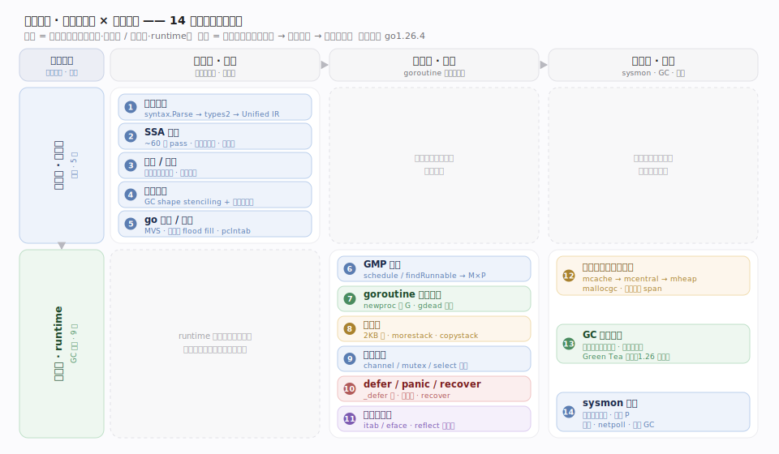
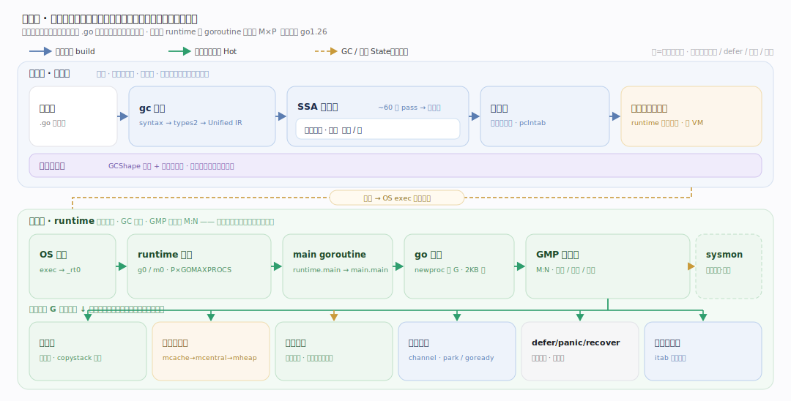
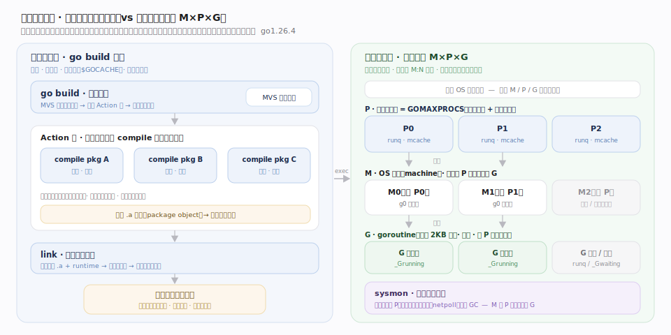

# Go 原理 · 全景主线框架

> **定位**：本篇是全库的地图与总纲。用"双维模型"把 14 条主线归位（**能力域家族 × 执行时机**），给出总架构图、编译/运行两期的物理形态、`接触面 × 能力域` 依赖矩阵，并声明 Go 区别于其他语言实现的三条贯穿性事实。**读全库从这里开始，遇到"某机制属于哪条主线"的疑问回这里查依赖矩阵。** 源码基准 **go1.26.4**（`~/workdir/go`），一切断言以它为准。

Go 不是"某类数据库/查询引擎"，它属**新家族「编程语言运行时 + 工具链」**（判型见 `references/meta-archetype.md` 元模式）。它的接触面是**语言本身（源程序：语法 + 类型系统）与 `go` 命令**；它自己"管"的是**编译产物 + 一个 GC 托管的并发运行时**。这决定了它的主线取法天然裂成两大家族：

- **编译期 · 工具链**（离线，5 篇）：把 `.go` 源程序静态编译成**单一自包含可执行文件**——前端（词法/语法/类型检查/Unified IR）、SSA 后端（~60 遍 pass + 寄存器分配 + 机器码）、逃逸分析与内联、泛型（GC shape stenciling）、`go` 命令与链接器。
- **运行期 · runtime**（在线，8 篇）：编译进每个二进制的那套运行时，承载 goroutine 并发与自动内存管理——GMP 调度、goroutine 生命周期、连续栈、内存分配器、垃圾回收、并发原语、defer/panic/recover、接口与反射。

---

## 一、三条贯穿声明：Go 的实现基调（先立，贯穿每条主线）

理解 Go 前先立三条"它是什么"——它们贯穿全库，是与 JVM/CPython 这类语言实现的根本分野：

1. **静态编译产单一二进制、无独立运行时进程。** `go build` 走 gc 编译器（前端 → SSA → 机器码）+ 链接器，产出一个**自包含可执行文件**：runtime、GC、调度器全部链接进去，无 VM、无解释器、无 JIT、部署无依赖。这是与"JVM 装字节码解释 + JIT"、"CPython 解释执行"的第一分野。

2. **GC 托管、非分代、非压缩、并发的运行时。** 内存由**三级分配器（mcache/mcentral/mheap）+ 并发三色标记清除 GC**管理；GC 与用户 goroutine 并发运行，靠**混合写屏障**维持三色不变式，只在极短的标记开始/终止做 STW。非分代、非压缩——对象地址不动，无 compaction。这是与"分代压缩式 GC（如 HotSpot G1/ZGC 的部分形态）"的第二分野。

3. **CSP 式并发：goroutine + channel，用户态 M:N 调度。** 并发单元是**廉价 goroutine（初始 2KB 连续栈，可增长）**，由 runtime 的 **GMP 调度器**多路复用到少量 OS 线程（M）上；goroutine 间用 **channel** 通信（"不要用共享内存通信，用通信共享内存"）。抢占是**异步信号 + 协作式 morestack** 双机制。这是与"1:1 线程模型 / 显式线程池"的第三分野。

---

## 二、双维模型：14 条主线归位

横轴 = **执行时机**（编译期离线 / 运行期前台 goroutine 执行 / 运行期后台 sysmon·GC·清扫）；纵轴 = **能力域家族**。每条主线落在唯一格子，避免流水账。

---

## 三、总架构：从 `.go` 源到一个 goroutine 在跑

一条纵贯线（全库贯穿视角）：**源程序**经 gc 编译器前端（`syntax.Parse` → `types2` 类型检查 → `noder` 建 Unified IR）→ 中后端（逃逸分析定栈/堆、内联、`buildssa` → ~60 遍 SSA pass → 机器码）→ 链接器（`ld.Main`：死代码 flood fill、符号布局、`pclntab`）→ **单一可执行文件**；运行时该二进制被 OS 加载，runtime 引导（创建 g0/m0、初始化 P、`schedinit`、启动 `sysmon`）→ `main` goroutine 起跑 → `go` 语句经 `newproc` 造 G 入队 → GMP 调度器（`schedule`/`findRunnable`）把 G 派到 M×P 上执行 → 分配走 `mallocgc`、GC 并发回收、channel/锁做同步、panic 沿 defer 链展开。

---

## 四、物理形态：编译期 vs 运行期

- **编译期**：`go build` 驱动一张 **Action 图**（`Builder.Do`），每个包并行编译（`compile` 进程），依赖经 MVS（最小版本选择）解析，最后 `link` 成一个二进制。是**离线、多进程、可缓存**的批处理。
- **运行期**：单进程内 **M（OS 线程）× P（逻辑处理器，数量 = GOMAXPROCS）× G（goroutine）** 三者动态编织——P 是"执行 G 的许可 + 本地资源（runq/mcache）"，M 必须绑定 P 才能跑 G，`sysmon` 是不占 P 的后台监控线程。

---

## 五、依赖矩阵：`能力域 × 能力域`（三角一致性基准）

下表是全库三角一致性的**唯一基准**：每篇"定位"里声称的依赖，必须与本表一致。行 = 依赖方，列 = 被依赖方；● = 强依赖，○ = 弱/间接依赖。

| 依赖方＼被依赖 | 编译前端 | SSA后端 | 逃逸内联 | GMP调度 | 栈管理 | 分配器 | GC | 并发原语 | defer族 | 接口反射 |
|---|---|---|---|---|---|---|---|---|---|---|
| **编译前端** | — | ● | ○ | | | | | | | ● |
| **SSA后端** | ● | — | ● | ○ | ● | ○ | ● | ○ | ● | ● |
| **逃逸内联** | ● | ● | — | | ○ | ● | | | | ○ |
| **泛型实现** | ● | ● | | | | | | | | ● |
| **go命令链接** | ● | ● | | | | | | | | ○ |
| **GMP调度** | | | | — | ● | ○ | ○ | ● | | |
| **goroutine生命周期** | | | | ● | ● | ○ | | ○ | ● | |
| **栈管理** | ○ | ● | | ● | — | ○ | ● | | ● | |
| **分配器** | | | | ○ | | — | ● | | | |
| **GC** | ○ | ● | | ● | ● | ● | — | ○ | | ● |
| **并发原语** | | | | ● | | ○ | ○ | — | | |
| **defer/panic/recover** | ○ | ● | | ○ | ● | ○ | | | — | |
| **接口与反射** | ● | ● | | | | ○ | ● | | | — |

读法举例：**GC** 依赖【分配器】（span 元数据/清扫）、【栈管理】（扫描/收缩栈）、【GMP调度】（STW 停世界、后台标记 worker）、【SSA后端】（编译器插入写屏障）——四个 ● 落点在各自主线正文都要有对应展开。

---

## 六、三条贯穿示例（全库统一追踪）

- **编译期贯穿**：一段含泛型 + 逃逸 + 内联的小程序，看它过 `syntax → types2 → Unified IR → 逃逸/内联 → SSA pass → 机器码 → 链接`。
- **运行期贯穿（一个 goroutine 的一生）**：`go work` → `newproc` 造 G → 入 P 本地 runq → 被 `schedule` 选中执行 → 栈不够触发 `morestack` 增长 → 分配对象走 `mallocgc` → 被 GC 标记 → 阻塞在 channel 上 `gopark` → 就绪 `goready` → `goexit` 回收。
- **同步贯穿**：一次 `ch <- v` / `<-ch`，看它在 channel（`hchan`）、调度器（park/ready）、内存模型（happens-before）三处的形态。

---

## 七、与其他语言实现的关键差异（点明参照系）

| 维度 | Go（go1.26.4） | 参照系（JVM / CPython） |
|---|---|---|
| 交付形态 | 静态编译单一二进制，无运行时进程 | JVM 装字节码解释+JIT / CPython 解释 `.pyc` |
| 并发模型 | goroutine（用户态 M:N，初始 2KB 栈）+ channel | JVM 线程 1:1 映射 OS 线程 / CPython GIL 串行 |
| GC | 并发三色标记清除，非分代非压缩，混合写屏障，Green Tea 扫描器（1.26 默认） | HotSpot 分代/Region、可压缩（G1/ZGC） |
| 抢占 | 异步信号抢占 + 协作式 morestack | JVM safepoint 轮询 |
| 泛型 | GC shape stenciling + 运行期字典（部分单态化） | Java 类型擦除 / C++ 全单态化模板 |
| 栈 | 连续可增长栈（copystack 整体搬移） | 固定大栈 / 分段栈（Go 早期已弃） |

---

## 一句话总纲

**Go 是一套「静态编译产单一自包含二进制 + GC 托管非分代非压缩并发运行时」的语言实现：编译期工具链（gc 前端 `syntax→types2→Unified IR` → 逃逸/内联定栈堆 → `buildssa`+~60 遍 SSA pass → 机器码 → 链接器死代码 flood fill+`pclntab` 布局）把源程序静态编译进二进制；运行期 runtime 以 GMP 用户态 M:N 调度多路复用 goroutine（连续可增长栈）到少量 OS 线程，用三级分配器（mcache/mcentral/mheap）供内存、并发三色标记清除 GC（混合写屏障维持不变式、仅极短 STW）自动回收、channel+sudog 做 CSP 同步、defer 链承载 panic/recover、iface/itab 支撑接口与反射——编译期与运行期靠「编译器插桩（写屏障/栈检查/类型描述符）」缝合成一个整体。**
