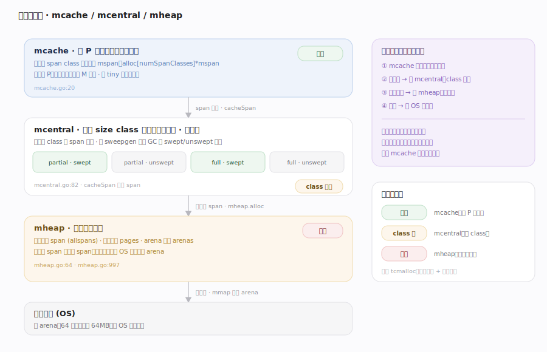
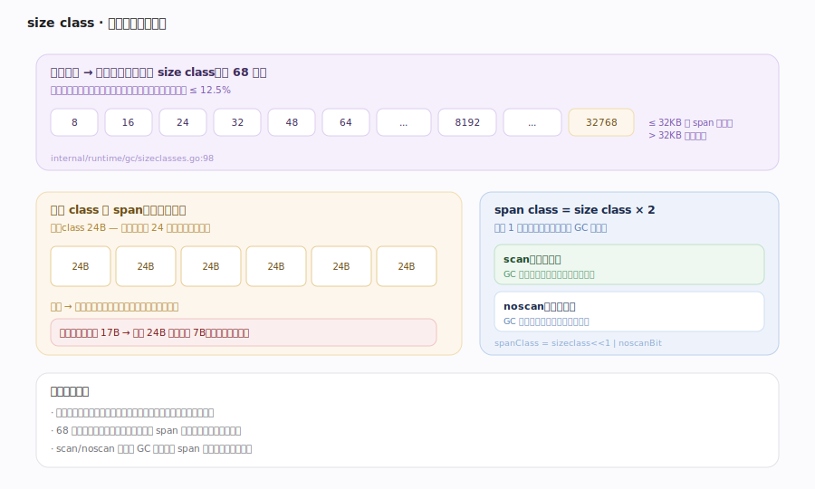
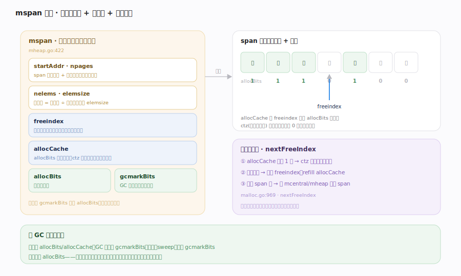
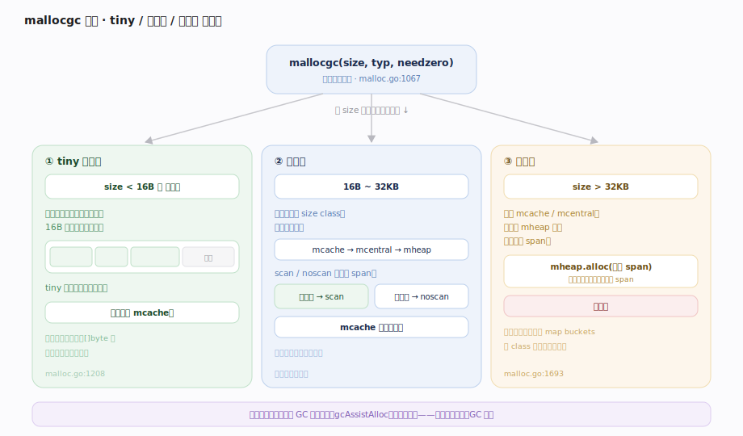
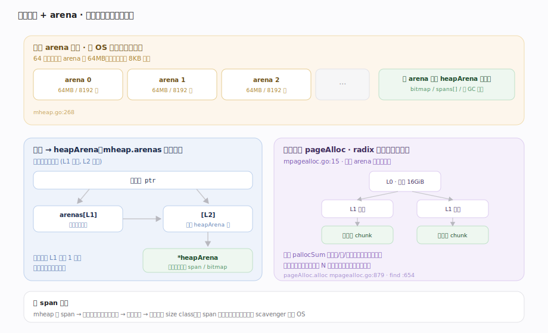

# Go 原理 · 内存分配器

> **定位**：本篇是运行期的"供给侧"——对象在哪、怎么快速分配出来。属"内存能力域"，向上被所有分配（`new`/`make`/字面量/逃逸对象）依赖，向下与【GC】共用 span 元数据（mark bits、清扫复用）、每个 P 持有的 mcache 由【GMP调度】提供无锁上下文。是否走堆由【逃逸分析】在编译期决定，本篇只讲"堆上怎么分"。源码基准 **go1.26.4**（`~/workdir/go/src/runtime`）。

Go 的堆分配器源自 **tcmalloc** 思想（`malloc.go:5`），核心是**多级缓存 + 尺寸分级**：按对象大小分成固定的 **size class**，用 **mcache（每 P 无锁）→ mcentral（每 class 全局）→ mheap（全局堆）** 三级供给，绝大多数小对象分配走无锁的 mcache 快路径。

---

## 一、三级分配层级

- **mcache**（mcache.go:20）：**每 P 一个**，无锁。为每个 span class 缓存一个 `mspan`（`alloc [numSpanClasses]*mspan`）。小对象分配首选这里——因为绑定到 P，同一时刻只有一个 M 访问，**完全无锁**。还含 tiny 分配器状态。
- **mcentral**（mcentral.go:22）：**每个 size class 一个**，全局共享（有锁）。持有该 class 的 span 集合，分 `partial`（有空槽）/`full`（已满）两组 × swept/unswept 两份（按 `sweepgen` 每轮 GC 换角色）。mcache 的 span 用完了来这里 `cacheSpan`（mcentral.go:82）换一个新的。
- **mheap**（mheap.go:64）：**全局唯一**的堆。管理所有 span（`allspans`）、页分配器（`pages`）、arena 映射（`arenas`）。mcentral 没有可用 span 时来这里 `alloc`（mheap.go:997）切新 span；mheap 空间不够则向 OS 申请更多 arena。

分配请求自上而下穿透：mcache 命中最快（无锁）→ 未命中问 mcentral（class 级锁）→ 再未命中问 mheap（堆锁）→ 最后问 OS。**层级越低越慢、加锁越粗**，但命中率也越低。

---

## 二、size class：尺寸分级

小对象（≤ 32KB）按大小归入固定的 **size class**：`SizeClassToSize`（`internal/runtime/gc/sizeclasses.go:98`，1.26 已从 runtime 迁到此包）列出约 68 个档位——8, 16, 24, 32, 48, 64, …, 32768 字节。分配时把请求大小**向上取整**到最近的 size class：

- 好处：同 class 对象等大 → span 内槽位定长 → 分配只需找下一个空槽（`allocCache` 位图 + ctz 找零）、无碎片管理开销、释放只需清位。
- 代价：**内部碎片**——申请 17 字节实占 24 字节的槽。size class 档位是"碎片率 vs class 数量"的精心权衡。
- **span class = size class × 2**：低位区分 **scan/noscan**（含指针 vs 不含指针）。noscan 对象 GC 不必扫描其内部（无指针），单独成 span 能让 GC 跳过整个 span。

---

## 三、mspan：分配的基本单位

`mspan`（mheap.go:422）是**一组连续页**，切成等大槽位供某 size class 使用。关键字段：`startAddr`/`npages`（起址与页数）、`nelems`（槽位总数）、`freeindex`（下一个可能空闲的槽索引）、`allocCache`（allocBits 的补码，用 ctz 快速找空槽）、`allocBits`（分配位图）、`gcmarkBits`（GC 标记位图，与 GC 共用）。

分配就是在 mspan 里找下一个空槽：`nextFreeFast`（malloc.go:969）用 `allocCache` 位运算极速找；找不到则 `nextFree`（malloc.go:996）推进 `freeindex` 或向 mcentral 换 span。GC 清扫时对比 allocBits 与 gcmarkBits 回收未标记槽。

---

## 四、mallocgc：分配入口与快慢路径

`mallocgc`（malloc.go:1067）是所有堆分配的入口。**1.26 已重构为分发器**，按大小 + 是否含指针分派到专门路径：

- **tiny 分配器**（`mallocgcTiny` malloc.go:1208）：**< 16 字节且无指针**的微对象（如小字符串、小结构）。多个 tiny 对象**合并塞进同一个 16 字节块**（mcache 的 `tiny`/`tinyoffset`），大幅减少极小对象的空间浪费。典型如 `[]byte("x")`、小 int 装箱。
- **小对象**（`mallocgcSmallScanHeader`/`mallocgcSmallNoscan` 等）：16B~32KB，走 mcache → mcentral → mheap 三级。含指针（scan）与不含指针（noscan）分开，noscan 免 GC 扫描。
- **大对象**（`mallocgcLarge` malloc.go:1693）：**> 32KB**。**绕过 mcache/mcentral**，直接向 mheap 申请专属 span（一组页）。

分配时若处于 GC 标记相位，新对象直接标黑（`gcBlackenEnabled`）；并累加 mark assist 债务（见【GC】）。

---

## 五、页分配器与 arena：虚存布局

mheap 之下是**页分配器**（`mpagealloc.go`）和 **arena** 虚存布局：

- **arena / heapArena**（mheap.go:268）：堆按固定大小的 **arena**（64位平台通常 64MB）向 OS 申请虚存；`mheap.arenas` 是一张（L1×L2）**arena 映射表**把地址映射到 `heapArena` 元数据（含该 arena 每页的 span 指针 `spans`、GC 标记辅助位）。这让 runtime 能 O(1) 从任意堆地址反查它属于哪个 span/是否堆指针。
- **页分配器**（`pageAlloc` mpagealloc.go:186）：管理 arena 内的**空闲页**。用一棵 **radix 摘要树**（`pallocSum` 摘要，L0 每项覆盖 16GiB）自顶向下快速定位"连续 N 个空闲页"的位置（`pageAlloc.alloc` mpagealloc.go:879 / `find` mpagealloc.go:654）。比线性扫描位图快得多。

于是 mheap 切 span = 页分配器找连续空闲页 → 标记占用 → 关联到某 size class。空 span 归还时页被标空闲、可被 scavenger 归还 OS。

---

## 拓展 · 分配路径速查

| 对象特征 | 路径 | 是否加锁 |
|---|---|---|
| < 16B 且无指针 | tiny 分配器（合并进 16B 块） | 无锁（mcache） |
| 16B~32KB | mcache → (空)mcentral → (空)mheap | mcache 无锁；回退加锁 |
| > 32KB | 直接 mheap.alloc 专属 span | 堆锁 |
| 栈上（未逃逸） | 编译期分配在栈帧，不经分配器 | — |

## 调优要点（关键开关，均源码核实）

- `GODEBUG=allocfreetrace=1`：跟踪每次分配/释放（极慢，调试用）。
- `GODEBUG=madvdontneed=1`：控制归还 OS 的 madvise 策略。
- `runtime.ReadMemStats` 的 `HeapInuse`/`HeapIdle`/`HeapReleased`/`Mallocs`/`Frees`：观测堆用量与分配次数。
- `runtime/pprof` 的 heap profile（`-alloc_space`/`-inuse_space`）：定位分配热点。
- 减少分配的工程手段：`sync.Pool` 复用对象（见【并发原语】）、预分配 slice 容量、避免小对象逃逸（见【逃逸分析】）。

## 常见误区与工程要点

- **误区：Go 每次分配都要加锁。** 不。小对象绝大多数命中 **mcache（每 P 无锁）**，只有回退到 mcentral/mheap 才加锁——这是分配可扩展的关键。
- **误区：size class 无碎片。** 有**内部碎片**——请求向上取整到 class（申请 17B 占 24B）。tcmalloc 式分级是拿碎片换分配速度与无外部碎片。
- **误区：大对象也走 mcache。** 不。> 32KB 直接 mheap，绕过缓存层。
- **误区：`make([]T, n)` 一定在堆。** 不一定。未逃逸的小 slice 由【逃逸分析】判定后分配在栈上，根本不经本分配器。
- **误区：Go 堆会压缩以消碎片。** 不会。GC 非压缩（见【GC】），靠 size class 分级从根上避免外部碎片，而非事后压缩。
- 归属提醒：对象"该不该上堆"由【逃逸分析】定；span 的 mark bits 语义与清扫时机在【GC】；每 P 的 mcache 无锁上下文来自【GMP调度】的 P。

## 一句话总纲

**Go 堆分配器承 tcmalloc 之设计，按 size class 把对象向上取整分级，用「mcache（每 P 无锁，含 tiny 分配器合并 <16B 微对象）→ mcentral（每 class 全局有锁，partial/full × swept/unswept 按 sweepgen 换角色）→ mheap（全局堆，页分配器以 radix 摘要树 O(快) 找连续空闲页、arena 映射表 O(1) 反查堆地址）」三级供给：`mallocgc` 分发器把 <16B 无指针走 tiny、16B~32KB 走三级、>32KB 直分 mheap 专属 span，scan/noscan 分 span 让 GC 跳过无指针对象；对象在 mspan 定长槽里靠 allocCache 位运算极速找空位——绝大多数小对象命中 mcache 无锁快路径，size class 分级从根上免除外部碎片。**
