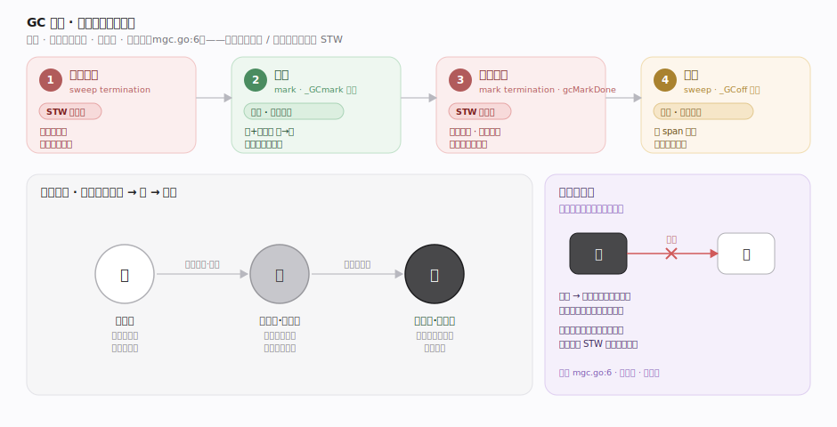
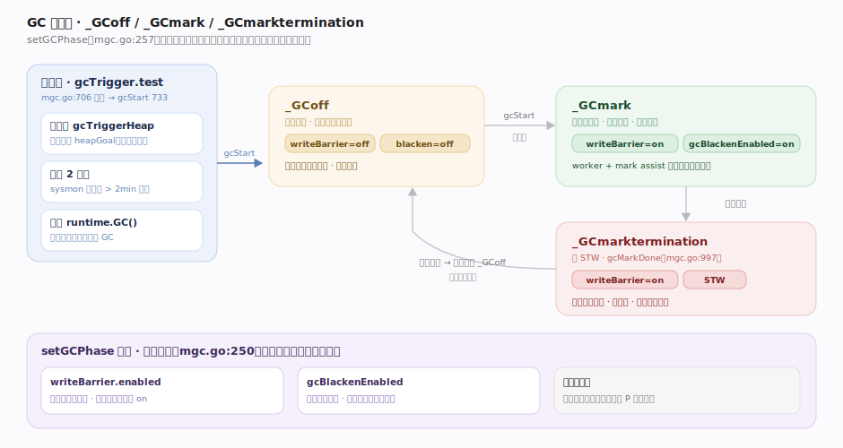
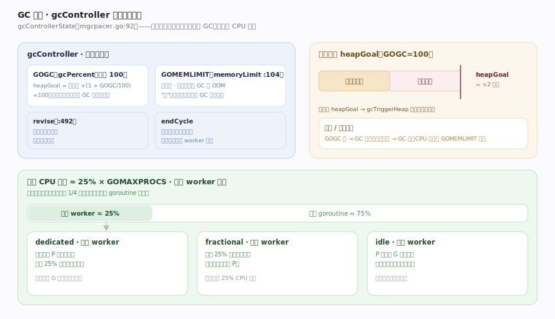
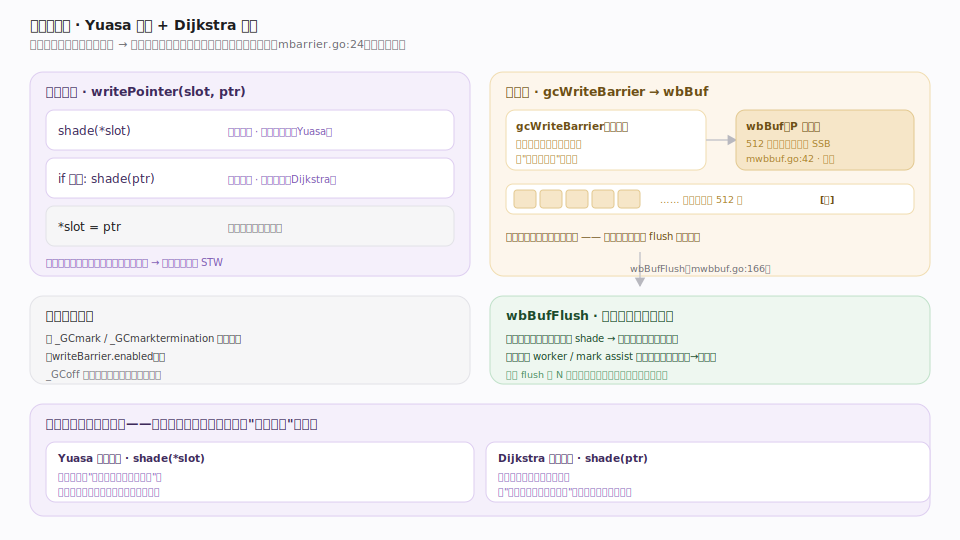
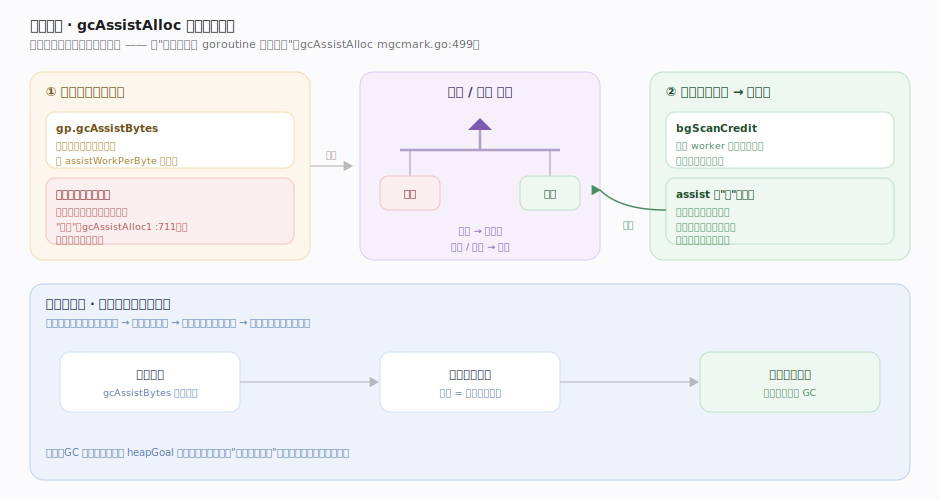
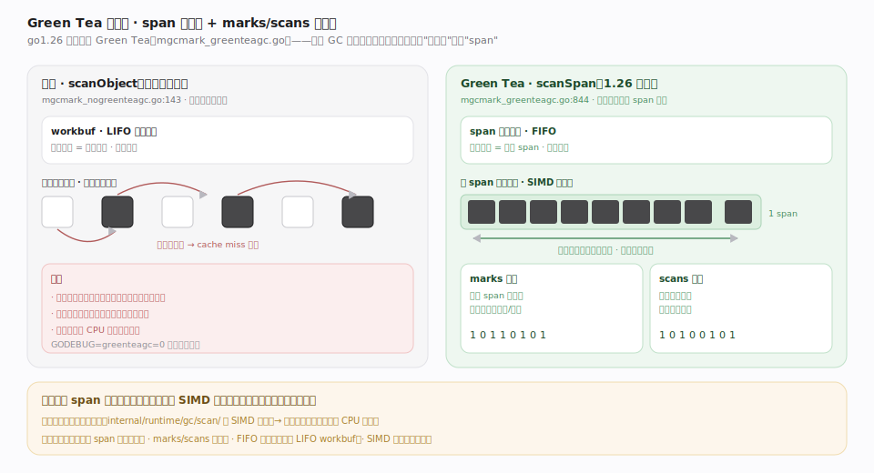
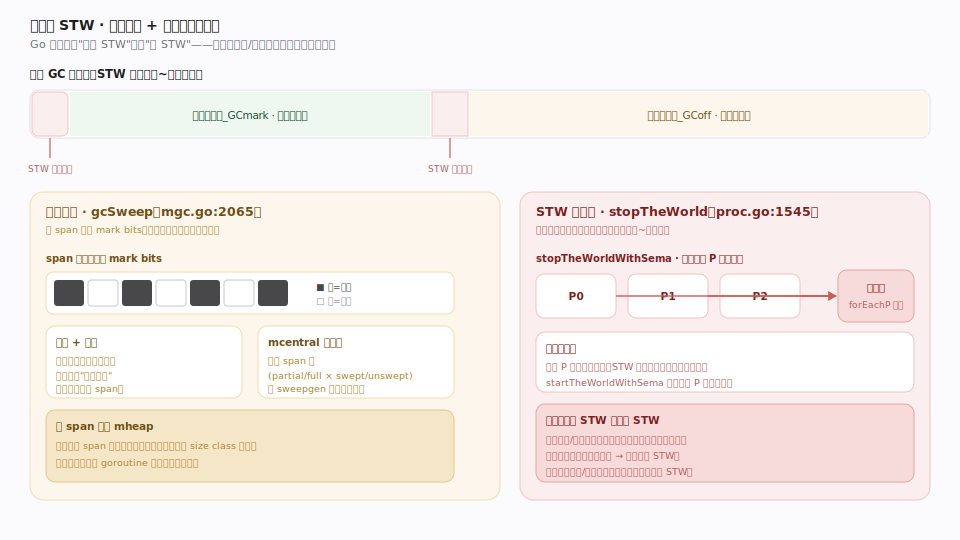

# Go 原理 · 垃圾回收

> **定位**：本篇是**运行期的第二条灵魂主线**——自动内存回收如何与用户 goroutine 并发进行。属"内存能力域"，向下依赖【分配器】（span 的 mark bits、清扫复用）、【栈管理】（扫描/收缩 goroutine 栈找根）、【GMP调度】（STW 停世界、后台标记 worker 占用 P），并依赖【SSA后端】在编译期为每个指针写插入**写屏障**。源码基准 **go1.26.4**（`~/workdir/go/src/runtime`）。

Go 的 GC 是**并发、三色标记清除、非分代、非压缩**（`mgc.go:6` 权威注释）。它与用户 goroutine 并发运行，靠**混合写屏障**在不停止程序的前提下维持三色不变式，只在标记开始/终止做两段极短 STW。**go1.26 起 Green Tea 标记算法默认开启**（`internal/buildcfg/exp.go:86`），是本版最重要的术语变化。

---

## 一、GC 全景：四步与三色



一轮 GC 分四步（`mgc.go` 头注释）：

1. **清扫终止（sweep termination）**：短 STW，确保上一轮清扫全部完成。
2. **标记（mark）**：`_GCmark` 相位。开启写屏障、允许"黑色分配"（新对象直接标黑）；后台标记 worker + 用户 goroutine 的 mark assist 一起把根（栈、全局、finalizer）和堆对象**灰变黑**，直到无灰色对象。
3. **标记终止（mark termination）**：短 STW，`gcMarkDone`（mgc.go:997）确认标记完成、关写屏障、算下一轮触发点。
4. **清扫（sweep）**：`_GCoff` 相位。写屏障关闭，后台并发清扫器逐 span 回收未标记（白色）对象的空间，与用户程序并发。

**三色抽象**：白=未访问（可能垃圾）、灰=已访问但引用未扫描（在工作队列里）、黑=已访问且引用已扫描。不变式：**黑对象不能直接指向白对象**（否则白对象会被漏标误回收）。写屏障就是为维持这个不变式而存在。

---

## 二、GC 相位与触发



三个相位常量（mgc.go:250）：`_GCoff`（写屏障关、后台清扫中）、`_GCmark`（标记中、写屏障开、分配变黑）、`_GCmarktermination`（写屏障开）。`setGCPhase`（mgc.go:257）翻转相位时只设 `writeBarrier.enabled`（写屏障全局开关 = 相位为 `_GCmark`/`_GCmarktermination`）；"黑色分配"开关 `gcBlackenEnabled` 是**另行**置位的——`gcStart`（mgc.go:915）里 `atomic.Store(&gcBlackenEnabled, 1)` 打开、标记终止时清零。

触发（`gcStart` mgc.go:733，由 `gcTrigger.test` mgc.go:706 判定）：

- **堆触发（gcTriggerHeap）**：堆增长到 `gcController` 算出的目标 `heapGoal` 时触发（默认策略）。
- **定时触发**：`sysmon` 检测距上次 GC > 2 分钟强制触发。
- **手动**：`runtime.GC()` 阻塞式触发一轮。

---

## 三、GC 步调：GOGC 与软内存上限



`gcControllerState`（mgcpacer.go:92）是"什么时候该 GC、要投多少 CPU 标记"的控制器——一个反馈控制系统：

- **GOGC**（`gcPercent`，默认 100）：堆目标 = 上轮存活堆 ×(1 + GOGC/100)。GOGC=100 意味着"堆翻倍时触发下一轮"；GOGC 越大 GC 越少但堆越大（时间换空间）。
- **软内存上限 GOMEMLIMIT**（`memoryLimit`，mgcpacer.go:104）：Go 1.19+ 引入。即便按 GOGC 还没到触发点，接近 memoryLimit 也会加频 GC，把总内存压在限额内（防 OOM）。是"软"限——达不到会持续 GC 而非崩溃。
- `revise`（mgcpacer.go:492）在标记期动态修正标记辅助的强度；`endCycle` 在轮末据本轮实际用量校准下轮触发点与 worker 配比。

标记 CPU 目标约占 **25% GOMAXPROCS**：拆成整核 worker（dedicated）+ 分数 worker（fractional）+ 空闲 worker（idle）三种模式。

---

## 四、混合写屏障：并发标记的正确性基石



并发标记时用户程序在改指针，可能把"白对象"藏到"已扫描的黑对象"下导致漏标。Go 用**混合写屏障**（`mbarrier.go:24`）——Yuasa 删除屏障 + Dijkstra 插入屏障的组合：

```
writePointer(slot, ptr):
    shade(*slot)              // 删除屏障：先给被覆盖的旧值染灰
    if 当前 goroutine 栈是灰色: shade(ptr)   // 插入屏障：新值也染灰
    *slot = ptr
```

好处是**标记开始时不必重扫所有栈**：栈一旦扫描变黑就不再变灰（消除了重扫栈的 STW）。实现：

- 快路径是编译器插入的汇编 `gcWriteBarrier`（asm_amd64.s:1378），把"待染色指针"塞进 P 本地的**写屏障缓冲 `wbBuf`**（mwbbuf.go:42，512 项的顺序存储缓冲 SSB）。
- 缓冲满 → `wbBufFlush`（mwbbuf.go:166）批量把这些指针染灰入工作队列。批处理摊薄单次写屏障成本。

> 写屏障只在 `_GCmark`/`_GCmarktermination` 相位开启（`writeBarrier.enabled`）；`_GCoff` 期间指针写无额外开销。

---

## 五、标记辅助：让分配者也干活



若用户 goroutine 分配太快、后台 worker 标记跟不上，堆会在标记完成前爆掉。**mark assist**（`gcAssistAlloc` mgcmark.go:499）让"分配得多的 goroutine 帮忙标记"：

- 每次分配按字节累加"标记债务"（`gp.gcAssistBytes`，按 `assistWorkPerByte` 比例）。
- 债务为负（欠得多）时，分配前必须先标记等量对象"还债"（`gcAssistAlloc1` mgcmark.go:711），否则挂起等信用。
- 后台 worker 超额标记的量存入 `bgScanCredit`，assist 可"借"来抵债，避免每次都真扫。

这是一个自平衡机制：**分配越猛的 goroutine 被拉去标记越多**，从而让标记速度追上分配速度、保证 GC 在堆达标前完成。

---

## 六、Green Tea 标记扫描器（1.26 默认）



go1.26 默认开启 **Green Tea** 标记算法（`mgcmark_greenteagc.go`）——本版 GC 最大的实现变化：

- **经典扫描**（`scanObject` mgcmark_nogreenteagc.go:143，实验关闭时才用）：逐个灰对象扫描其指针，随机访问内存、缓存局部性差。
- **Green Tea**（`scanSpan` mgcmark_greenteagc.go:844，默认）：**延迟扫描以按 span 批量聚集**——工作队列的单元是 span 而非单对象；每个 span 用 **`marks`/`scans` 两个位集**记录哪些对象已标记/已扫描，累积到一批再用 SIMD 扫描路径（`internal/runtime/gc/scan/`）成批处理同 span 内对象。span 工作队列是 **FIFO**（经典 workbuf 是 LIFO）。

好处：同 span 对象在内存上相邻，批量扫描的缓存局部性远好于随机跳指针，在大堆上显著降标记 CPU。

---

## 七、清扫与 STW



- **并发清扫**（`gcSweep` mgc.go:2065）：标记完成后进 `_GCoff`，后台清扫器逐 span 检查 mark bits，回收未标记对象的槽位、把整块空 span 还给 mheap。清扫是**惰性 + 并发**的：也可能在分配时"按需清扫"要用的 span。mcentral 用两组 span 集（partial/full × swept/unswept）按 `sweepgen` 每轮换角色。
- **STW（停世界）**（`stopTheWorld` proc.go:1545）：只在清扫终止、标记终止两处，各停几十~几百微秒。`stopTheWorldWithSema` 抢占所有 P 到安全点（`forEachP` 会合）；`startTheWorldWithSema` 恢复。**Go 追求的是极短 STW，而非零 STW**——大部分标记/清扫都与程序并发。

---

## 拓展 · GC 相关 GODEBUG / 观测

| 手段 | 作用 |
|---|---|
| `GODEBUG=gctrace=1` | 每轮 GC 打印：堆大小、存活量、STW 时长、CPU 占比 |
| `GODEBUG=gcpacertrace=1` | 步调控制器决策细节 |
| `runtime.ReadMemStats` | 读 `MemStats`：HeapAlloc/NextGC/PauseNs/NumGC 等 |
| `runtime/trace` + `go tool trace` | 可视化 GC 相位、STW、标记 worker 时间线 |
| `GODEBUG=greenteagc=0` | 关闭 Green Tea 退回经典扫描（调试对比用） |

## 调优要点（关键开关，均源码核实）

- `GOGC`（默认 100）：堆增长多少百分比触发下轮 GC。调大减 GC 频率增内存；`GOGC=off` 关 GC。
- `GOMEMLIMIT`（软内存上限，默认无限）：把总内存压在限额内，配 `GOGC=off` 可做"纯内存驱动"GC。
- `runtime.GC()`：手动阻塞式触发一轮完整 GC。
- `debug.SetGCPercent` / `debug.SetMemoryLimit`：运行期动态调 GOGC / memoryLimit。
- `runtime.SetFinalizer` / `runtime.AddCleanup`（1.24+）：对象回收前的清理钩子（cleanup 是 finalizer 的更安全替代）。

## 常见误区与工程要点

- **误区：Go GC 是分代的。** 不是。`mgc.go:6` 明写"非分代、非压缩"。无年轻代/老年代，无对象晋升。
- **误区：Go GC 会移动/压缩对象。** 不会。非压缩——对象地址稳定，这也是能安全传裸指针给 cgo（配 pinning）的前提。
- **误区：并发标记要重扫所有栈。** 不用。混合写屏障（删除+插入）的设计目标正是**消除重扫栈的 STW**——栈扫黑后不再变灰。
- **误区：Go 追求零 STW。** 不。是**极短 STW**（标记开始/终止两段、几十微秒），不是零；换来的是不必把整个标记/清扫塞进 STW。
- **误区：GOGC 越小越好。** 不一定。GOGC 小则 GC 频繁、CPU 开销大；大则内存高。是时间/空间权衡，配 GOMEMLIMIT 更稳。
- 归属提醒：写屏障的**编译期插入**在【SSA后端】的 writebarrier pass 展开；栈扫描/收缩在【栈管理】；span 的 mark bits 与清扫复用在【分配器】——本篇讲 GC 算法本身。

## 一句话总纲

**Go 的 GC 是并发三色标记清除、非分代非压缩：`gcController` 按 GOGC（堆翻倍触发）与软上限 GOMEMLIMIT 定堆目标 `heapGoal`，达标即 `gcStart` 进 `_GCmark` 相位（开混合写屏障、分配变黑），后台标记 worker（约 25% CPU）+ 分配过猛的 goroutine 被 `gcAssistAlloc` 拉来「还债」一起把根（栈/全局）与堆对象灰变黑，1.26 默认用 Green Tea 按 span 批处理（marks/scans 双位集 + FIFO 队列 + SIMD）扫描以提升缓存局部性；混合写屏障（Yuasa 删除 `shade(*slot)` + Dijkstra 插入 `shade(ptr)`，经 512 项 wbBuf 批量 flush）维持「黑不指白」不变式从而免去重扫栈；标记完 `gcMarkDone` 短 STW 后进 `_GCoff` 并发清扫回收白对象——全程仅标记开始/终止两段几十微秒级 STW。**
