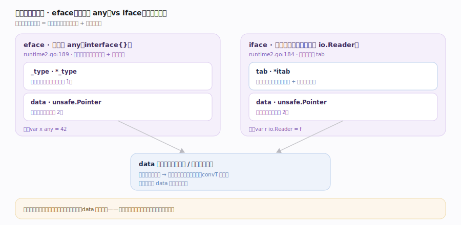
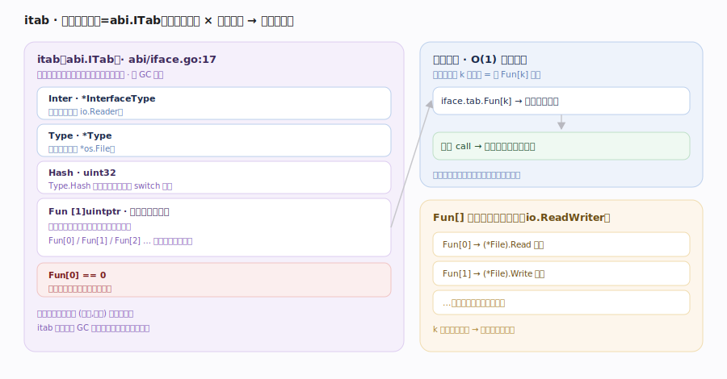
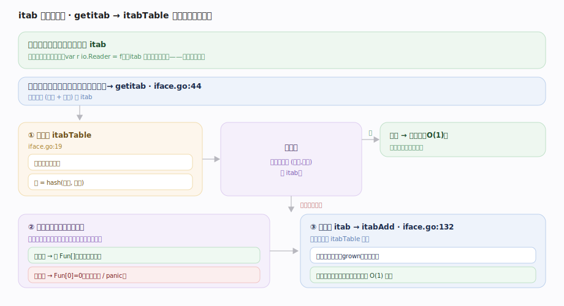
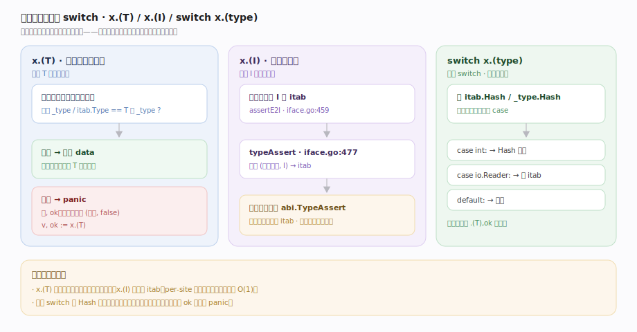
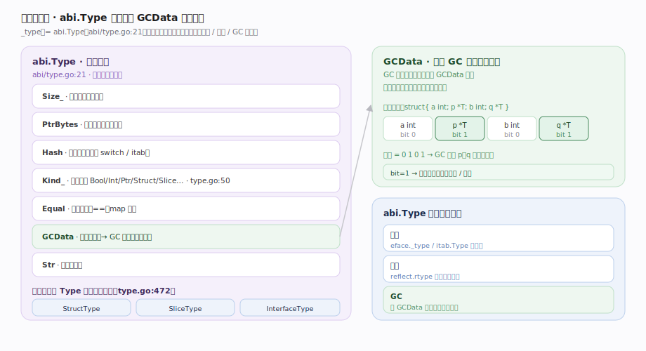
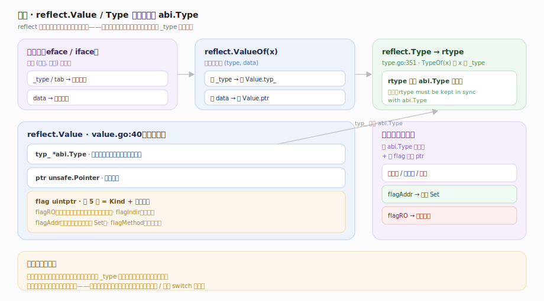

# Go 原理 · 接口与反射

> **定位**：本篇讲 Go 的接口动态派发与反射——`interface` 在内存里长什么样、类型断言怎么查、`reflect` 如何映射到运行时类型信息。属"类型系统运行期能力域"，依赖【编译前端】生成类型描述符与 itab、【SSA后端】布局方法表、被【GC】依赖（类型描述符的 `GCData` 指针位图指导扫描）。源码基准 **go1.26.4**（`~/workdir/go/src/runtime`、`src/reflect`、`src/internal/abi`）。

Go 的接口是**隐式实现**（无 `implements` 关键字）的动态派发机制。运行期一个接口值是"**类型信息 + 数据指针**"的二元组；非空接口用 **itab**（接口方法表）做方法派发。反射（`reflect`）则是把这套运行时类型信息暴露给用户代码的镜像。**1.26 类型描述符统一到 `internal/abi`**：`runtime._type = abi.Type`、`runtime.itab = abi.ITab`。

---

## 一、接口的两种表示：iface 与 eface

Go 接口值在内存里是**两个机器字**：

- **`eface`**（runtime2.go:189）：**空接口 `any`（`interface{}`）**。字段 `_type *_type`（动态类型描述符）+ `data unsafe.Pointer`（数据指针）。因为无方法，只需知道"是什么类型 + 值在哪"。
- **`iface`**（runtime2.go:184）：**非空接口**（有方法的接口，如 `io.Reader`）。字段 `tab *itab`（接口方法表）+ `data unsafe.Pointer`。方法派发靠 `tab`。

`data` 指向实际数据：值较大或不是指针时指向堆/栈上的拷贝；小值经装箱（`convT` 系列）。这意味着**把值装进接口通常会逃逸到堆**（见【逃逸分析】）——接口是常见的逃逸源。

---

## 二、itab：接口方法表

`itab`（`abi.ITab`，abi/iface.go:17）是"**具体类型如何满足某接口**"的运行期表：

- 字段：`Inter *InterfaceType`（接口类型）、`Type *Type`（具体类型）、`Hash`（Type.Hash 的拷贝，用于类型 switch）、`Fun [1]uintptr`（**变长方法指针表**——具体类型实现该接口各方法的函数地址；`Fun[0]==0` 表示该类型**不**实现此接口）。
- **派发**：`iface.tab.Fun[k]` 就是接口第 k 个方法的具体实现地址；调用接口方法 = 取 `Fun[k]` 间接跳转。这是 O(1) 的动态派发，不搜索。
- itab **分配在非 GC 内存**、全局去重缓存。

---

## 三、itab 的查找与缓存

把具体类型赋给接口（`var r io.Reader = f`）时需要对应的 itab：

- 多数情况编译器**静态生成** itab（类型和接口都已知时，直接嵌进二进制）。
- 动态情况（类型断言到接口、反射）走 `getitab`（iface.go:44）：先查全局 **`itabTable`**（iface.go:19，开放寻址哈希，按 接口+类型 哈希）；命中直接用，未命中则检查具体类型的方法集是否满足接口所有方法，构建新 itab 并 `itabAdd`（iface.go:132，原子发布）入表缓存。

于是同一 (接口, 类型) 对的 itab 全程只构建一次，后续查表 O(1)。

---

## 四、类型断言与类型 switch

- **`x.(T)`（断言到具体类型）**：比较接口的 `_type`/`itab.Type` 与目标 T 的类型描述符是否相等；相等取出 data，否则 panic（`, ok` 形式返回 false）。
- **`x.(I)`（断言到接口）**：需要目标接口 I 与 x 动态类型的 itab——走 `assertE2I`（iface.go:459）/`typeAssert`（iface.go:477）。`typeAssert` 用一个**每断言点的缓存**（`abi.TypeAssert`）记住上次命中的 itab，热路径直接比对缓存免查全局表。
- **类型 switch**（`switch v := x.(type)`）：用 `itab.Hash`/`_type.Hash` 快速分派到匹配的 case。

类型断言是接口"向下转型"的唯一安全方式——编译期无法确定的类型关系在此运行期检查。

---

## 五、类型描述符：abi.Type

`_type`（= `abi.Type`，abi/type.go:21）是每个类型的**运行期元数据**，接口/反射/GC 都读它：

- 字段：`Size_`（大小）、`PtrBytes`（含指针的前缀字节数）、`Hash`、`Kind_`（基础种类：Bool/Int/Ptr/Struct/Slice…，abi/type.go:50）、`Equal`（相等函数）、`GCData`（**指针位图**——标记该类型哪些字节是指针，**GC 扫描对象时据此决定扫哪些字段**）、`Str`（类型名偏移）。
- 派生类型有扩展：`StructType`/`SliceType`/`InterfaceType`（abi/type.go:472）等在 `Type` 头后附加字段。

`GCData` 是接口/反射与【GC】的接合点：GC 扫描一个对象时，用其类型的 GCData 位图精确知道哪些字是指针、只扫那些——这是**精确 GC**的类型侧依据。

---

## 六、反射：reflect 映射到运行时

`reflect` 包是运行时类型系统的**用户态镜像**：

- **`reflect.Type`**（type.go:41）：接口，其实现 `rtype`（type.go:351）**就是 `abi.Type` 的包装**（注释明写"rtype must be kept in sync with abi.Type"）——`reflect.TypeOf(x)` 取的正是 x 的 `_type`。
- **`reflect.Value`**（value.go:40）：字段 `typ_ *abi.Type`（类型）、`ptr unsafe.Pointer`（数据）、`flag`（低 5 位是 Kind，高位含只读/间接/可寻址/方法号等标志位 flagRO/flagIndir/flagAddr/flagMethod）。`reflect.ValueOf(x)` 把接口拆成 (type, data) 装进 Value。
- 反射操作（取字段、调方法、改值）都是**读 abi.Type 元数据 + 按 flag 解释 ptr**。`flagAddr`（可寻址）决定能否 `Set`，`flagRO`（来自未导出字段）禁止修改。

反射本质：把编译期擦除的静态类型，通过接口值里保存的 `_type` 在运行期重新"取回"并操作。**慢**（每步查元数据、常伴分配），是"灵活性换性能"。

---

## 拓展 · 接口/反射要点

| 要点 | 说明 |
|---|---|
| 隐式实现 | 无 `implements`；有全部方法即满足接口（鸭子类型的静态版） |
| nil 接口 vs nil 值 | 接口 (type=nil,data=nil) 才 `== nil`；(type=*T,data=nil) **不等于 nil**（经典坑） |
| 值接收者 vs 指针接收者 | 指针接收者方法只进 `*T` 的方法集；值装接口可能触发拷贝/逃逸 |
| 空接口 any | 1.18 起 `any` 是 `interface{}` 的别名 |
| reflect 三定律 | Value↔interface 可互转；Value 可改需可寻址且非只读 |
| unsafe 绕过 | `unsafe.Pointer` 可绕类型系统，但破坏 GC/对齐保证，慎用 |

## 调优要点（关键开关，均源码核实）

- 反射慢：热路径避免 `reflect`；能用代码生成（`go generate`）或类型 switch 替代就替代。
- 接口装箱逃逸：`fmt.Println(x)` 把 x 装进 `any` 常导致逃逸——性能敏感处注意（见【逃逸分析】）。
- 类型 switch 通常比连续 `.(T),ok` 断言快（用 Hash 分派）。
- `-gcflags=-m` 看接口转换是否导致逃逸。

## 常见误区与工程要点

- **误区：装了 nil 指针的接口 == nil。** 错！`var p *T = nil; var i any = p` 时 `i != nil`——接口有类型信息（type=*T）就非 nil。返回 error 时最经典的坑。
- **误区：接口方法派发要搜索方法表。** 不。itab 的 `Fun[k]` 是**预先排好的方法地址数组**，派发是 O(1) 间接跳转。
- **误区：接口值总是零成本。** 不。把值装进接口常触发**逃逸到堆**（data 需指针）+ itab 查找；小值有装箱开销。
- **误区：reflect 能改任何值。** 只能改**可寻址且非只读**的 Value（来自 `reflect.ValueOf(&x).Elem`，且非未导出字段）。
- **误区：Go 泛型出现后接口就没用了。** 不。泛型是编译期参数化，接口是运行期动态派发；两者场景不同（见【泛型实现】）。
- 归属提醒：itab/类型描述符的**静态生成**在【编译前端】/【SSA后端】；GCData 位图指导的扫描在【GC】；接口装箱的逃逸判定在【逃逸分析】。

## 一句话总纲

**Go 接口是隐式实现的动态派发：接口值是两个机器字——空接口 `eface`（`_type` + data）、非空接口 `iface`（`itab` + data）；`itab`（=abi.ITab）以「接口类型 × 具体类型」为键、`Fun[]` 存好各方法的具体地址，派发即 `tab.Fun[k]` O(1) 间接跳转，`getitab` 查全局 `itabTable` 哈希缓存并去重、类型断言 `typeAssert` 用每断言点缓存加速；类型描述符 `_type`（=abi.Type）携 Size/Kind/Equal 与 `GCData` 指针位图（GC 精确扫描的类型侧依据）；`reflect` 是这套运行时类型信息的用户态镜像——`rtype` 就是 abi.Type 的包装、`Value` 用 (typ,ptr,flag) 读元数据并按 flag（可寻址/只读）解释数据，本质是把编译期擦除的静态类型经接口里保存的 `_type` 在运行期取回操作，灵活但慢。**
