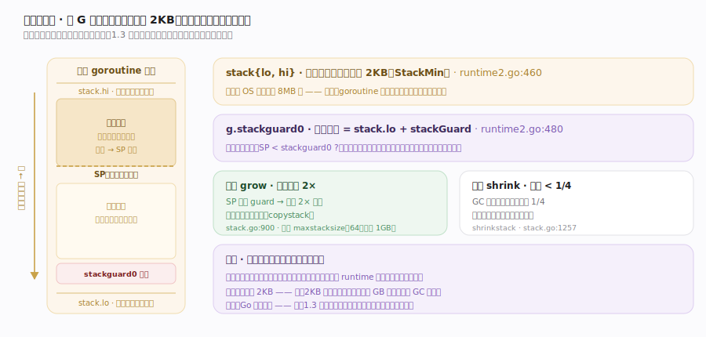
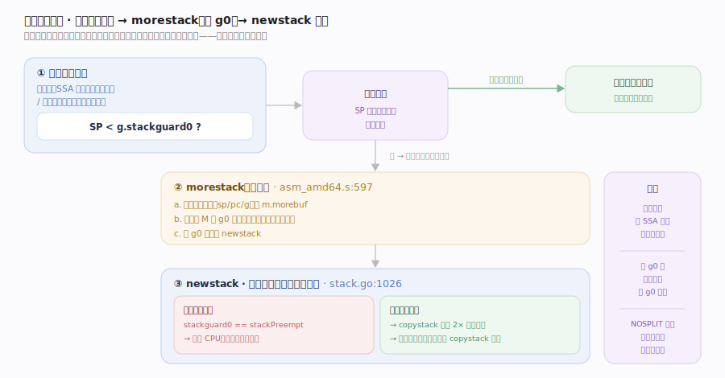
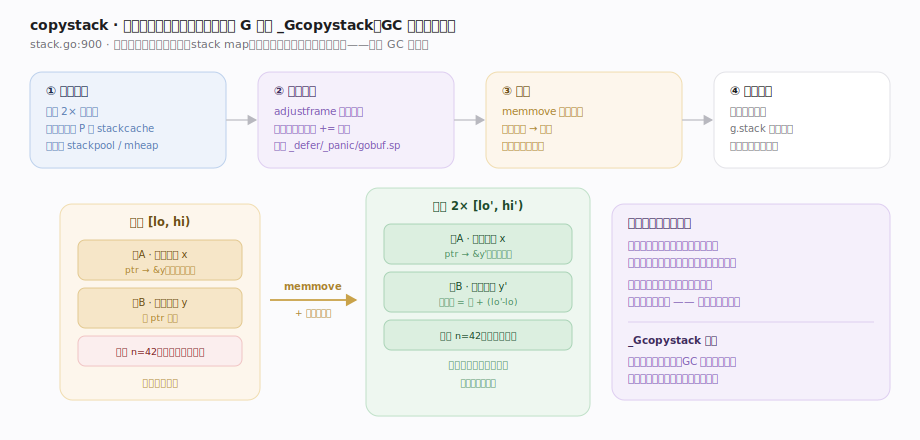
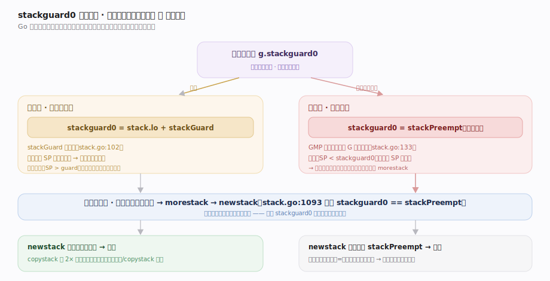

# Go 原理 · 栈管理

> **定位**：本篇讲 goroutine 的**连续可增长栈**——为什么 goroutine 能初始只占 2KB 却不怕栈溢出。属"内存能力域"，与【GMP调度】深度耦合（抢占哨兵借用 `stackguard0`、栈切换在 M 的 g0 上做）、被【GC】依赖（扫描栈找根、收缩栈）、依赖【SSA后端】在函数序言插入栈检查、承载【defer/panic】的栈上记录。源码基准 **go1.26.4**（`~/workdir/go/src/runtime`）。

Go 早期用分段栈（segmented stack），因"热分裂"性能问题在 1.3 后改为**连续栈（contiguous stack）**：goroutine 栈是一段连续内存，不够用时**分配更大的新栈、把旧栈整体拷过去**（copystack）。初始仅 2KB，按需增长/收缩，这是"goroutine 廉价"的物理基础。

---

## 一、连续栈全景：小起步、按需伸缩

- 每个 G 的栈由 `stack{lo, hi}`（runtime2.go:460）界定，初始 2KB。
- 栈**从高地址向低地址生长**（压栈 SP 减小）；`g.stackguard0`（runtime2.go:480）是一个哨兵地址，SP 低于它就该增长（或被抢占）。
- 增长：分配 2× 大小的新栈 → 把旧栈内容整体拷贝到新栈 → 调整所有指向栈内的指针 → 释放旧栈（`copystack` stack.go:900）。
- 收缩：GC 扫描时若发现栈用量 < 1/4，把栈缩小（`shrinkstack` stack.go:1257），省内存。

因为栈会**整体搬移**，Go 里"指向栈变量的指针"在搬移时会被 runtime 自动改写——所以对用户透明。

---

## 二、morestack → newstack：增长的触发

栈增长由**编译器插入的函数序言检查**触发（【SSA后端】的职责）：

1. 每个非叶函数（或栈帧较大的函数）序言处，编译器插入一句 `SP < g.stackguard0 ?` 的比较。
2. 若栈不够（SP 已逼近 guard），跳转到汇编 `morestack`（asm_amd64.s:597）——它保存当前现场到 `m.morebuf`、**切换到 M 的 g0 栈**，调用 `newstack`。
3. `newstack`（stack.go:1026）是增长与抢占的**共同决策点**：先判断是不是抢占请求（见下节），若真是栈不够，就 `copystack` 到 2× 新栈，然后回到原函数重试。

关键：栈增长发生在**函数调用边界**（序言），所以运行中的函数不会"半路栈爆"——序言已保证进入前栈够用。

---

## 三、copystack：栈的整体搬移

`copystack`（stack.go:900）是连续栈的核心操作：

1. **分配新栈**：通常 2× 旧大小（小栈从每 P 的 stackcache 取，大栈从 stackpool/mheap）。
2. **调整指针**（`adjustframe`）：遍历旧栈的每个栈帧，凡指向"旧栈范围内"的指针，加上 `新栈 - 旧栈` 的偏移改写。靠编译器生成的**栈映射（stack map）**知道每帧哪些槽是指针。同时调整 `_defer`/`_panic` 链、`gobuf.sp` 等。
3. **拷贝**：旧栈字节整体 memmove 到新栈。
4. **释放旧栈**。

搬移期间该 G 处于 `_Gcopystack` 状态，GC 不会同时扫描它。因为有精确的栈映射，Go 能把"栈上指针"和"栈上整数"区分开——这也是精确 GC 的基础。

---

## 四、栈与抢占：stackguard0 的双重身份

`stackguard0` 一物两用，这是 Go 一个精巧设计：

- **正常态**：`stackguard0 = stack.lo + stackGuard`（stack.go:102 的 `stackGuard` 常量），序言检查 SP 是否逼近它来决定是否增长。
- **抢占态**：【GMP调度】要协作式抢占某 G 时，把它的 `stackguard0` **改写成哨兵值 `stackPreempt`**（stack.go:133，一个极大的数）。于是**任何**函数序言的栈检查都会"失败"→ 进 `morestack` → `newstack`（stack.go:1093 检测 `stackguard0 == stackPreempt`）→ 让出。

即：抢占**复用了栈检查这条已有路径**，无需额外插桩。代价是紧密循环（无函数调用=无序言检查）逃过协作式抢占——于是才需要【GMP调度】的异步信号抢占兜底。

---

## 拓展 · 栈相关机制

| 机制 | 说明 |
|---|---|
| 栈初始大小 | 2KB（`StackMin`），远小于 OS 线程默认 8MB 栈 |
| 栈增长策略 | 每次翻倍（2×），直到 `maxstacksize`（64位默认 1GB） |
| 栈收缩 | GC 扫描时若用量 < 1/4 触发 `shrinkstack` |
| 栈缓存 | 小栈（≤32KB）走每 P 的 `stackcache` 无锁复用；大栈走 stackpool/mheap |
| 栈映射 | 编译器为每个安全点生成 stack map，标注哪些槽是指针（精确 GC + 指针调整必需） |
| NOSPLIT | 标记不做栈检查的函数（如 morestack 自身、部分 runtime 底层），栈预算受限 |

## 调优要点（关键开关，均源码核实）

- `runtime/debug.SetMaxStack`：设单 goroutine 栈上限（默认 64 位 1GB）；无限递归会撞这个上限而非无限增长。
- `GODEBUG=efence=1` 等调试栈问题；`GOTRACEBACK` 控制 panic 时栈回溯详细度。
- 栈溢出（`runtime: goroutine stack exceeds ... limit`）通常是无限递归——不是"栈太小"，调 SetMaxStack 无用，应修递归。
- 减少栈增长开销：避免深调用链上反复跨越栈边界的热点函数（会反复 copystack）。

## 常见误区与工程要点

- **误区：Go 用分段栈。** 早期是（1.2 及以前），因"热分裂"（hot split：栈边界处反复增减栈段）性能问题，**1.3 起改连续栈**。别再讲分段栈。
- **误区：goroutine 栈固定 2KB。** 2KB 只是**初始值**，会按需增长到 GB 级、也会被 GC 收缩。
- **误区：栈搬移后指针会失效。** 不会。`copystack` 用栈映射精确调整所有栈内指针，对用户透明——这正是连续栈能工作的前提。
- **误区：抢占需要单独的检查插桩。** 协作式抢占**复用**栈检查路径（改 `stackguard0` 为哨兵），零额外插桩；只有异步抢占才用信号。
- 归属提醒：函数序言的栈检查由【SSA后端】编译期插入；抢占的**发起**在【GMP调度】（sysmon/GC 改哨兵、发信号）；栈扫描找根、收缩时机在【GC】——本篇讲栈本身的伸缩机制。

## 一句话总纲

**Go 的 goroutine 用连续可增长栈：初始仅 2KB、从高向低生长，编译器在函数序言插入「SP < g.stackguard0」检查，不够就进 `morestack`（切到 M 的 g0 栈）→ `newstack` 决策 → `copystack` 分配 2× 新栈、按编译器生成的栈映射精确调整所有栈内指针后整体 memmove 搬移（对用户透明）、GC 扫描时用量不足 1/4 则 `shrinkstack` 收缩；`stackguard0` 一物两用——正常是栈边界哨兵，被抢占时被【GMP调度】改写成 `stackPreempt` 让任何序言检查失败从而在函数边界让出（复用栈检查路径、零额外插桩，紧密循环则靠异步信号兜底）——这套「小起步 + 整体搬移」是 goroutine 廉价到可百万并发的物理基础。**
