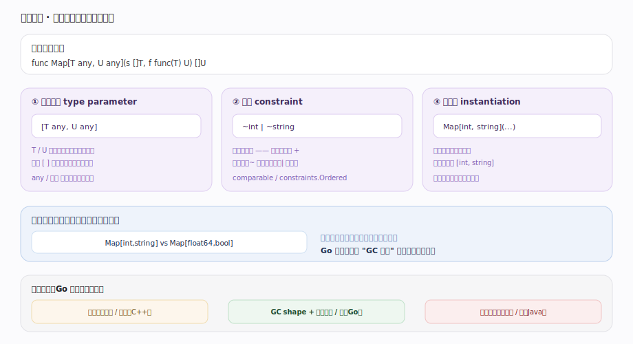
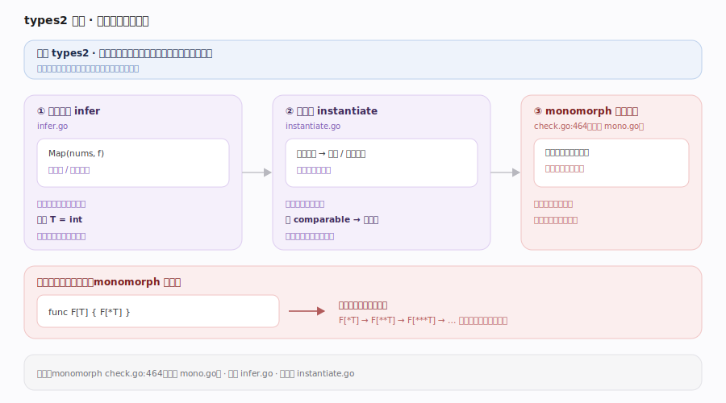
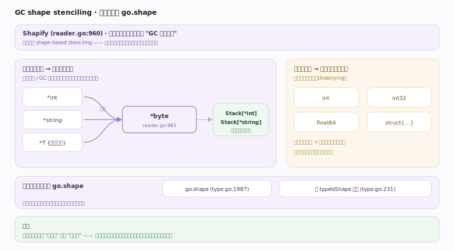
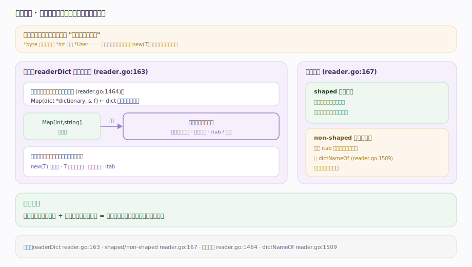
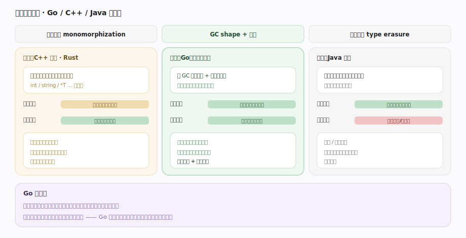

# Go 原理 · 泛型实现

> **定位**：本篇讲 Go 1.18 引入的泛型如何编译——类型参数、约束、以及 **GC shape stenciling + 字典**的混合实现策略。属"编译能力域"，横跨【编译前端】（types2 类型推断/实例化）与【SSA后端】（生成实例化代码），产出的类型信息供【接口与反射】。源码基准 **go1.26.4**（`~/workdir/go/src/cmd/compile/internal/types2`、`noder`）。

Go 泛型的实现在两个极端间取折中：**全单态化**（每个类型实参生成一份专用代码，代码膨胀但最快，如 C++ 模板）vs **全字典/装箱**（一份代码处理所有类型，慢但小)。Go 选 **GC shape stenciling**——按"GC 形状"分组生成代码，加**运行期字典**传递具体类型信息，兼顾代码体积与性能。

---

## 一、泛型全景：类型参数到实例化

- **类型参数**：`func Map[T any, U any](s []T, f func(T) U) []U`——`T`/`U` 是类型参数，`any`/约束限定它们。
- **约束（constraint）**：本质是接口——限定类型参数必须满足的方法集/类型集（`comparable`、`constraints.Ordered` 等）。
- **实例化（instantiation）**：`Map[int, string](...)` 用具体类型替换参数。可**显式**（写出 `[int,string]`）或**推断**（编译器从实参推出，types2 的类型推断）。

编译泛型要回答：`Map[int,string]` 和 `Map[float64,bool]` 是共享一份机器码，还是各生成一份？Go 的答案是"按 GC 形状分组"。

---

## 二、types2 侧：类型推断与实例化

前端 `types2` 负责泛型的**语义正确性**：

- **类型推断**（infer.go）：从调用实参、约束反推未显式给出的类型参数（`Map(nums, f)` 推出 T=int）。用统一算法解类型方程。
- **实例化**（instantiate.go）：把类型参数替换成具体/形状类型，检查是否满足约束（如 `comparable` 要求可比较）。
- **单态化安全检查 `monomorph`**（check.go:464，实现在 mono.go）：检测**非法的递归实例化**——如 `func F[T] { F[*T] }` 会无限生成 `F[*T]`、`F[**T]`… 编译器必须拒绝，否则实例化不终止。

types2 保证泛型代码类型安全后，才交给后端决定怎么生成代码。

---

## 三、GC shape stenciling：按形状分组

核心思想（代码中称"shape-based stenciling" writer.go:811）：**类型实参不必逐个生成代码，而按"GC 形状"归组**——`Shapify`（reader.go:960）把一个类型实参**坍缩成它的形状类型**：

- **所有指针类型共享一个形状**（如 `*int`/`*string`/`*T` 都坍缩成 `*byte`，reader.go:983）——因为它们在内存布局/GC 扫描上一致（都是一个需扫描的指针字）。于是 `Stack[*int]` 和 `Stack[*string]` **共用同一份机器码**。
- 非指针类型按其底层类型（`Underlying`）定形状——`int`/`int32` 等值类型各自成形。
- 形状类型放在**假包 `go.shape`**（type.go:1987），带 `typeIsShape` 标志（type.go:231）。

好处：代码膨胀被**收敛到"形状数"而非"类型数"**——大量指针类型的实例共享一份代码，是全单态化与全装箱的折中。

---

## 四、字典：运行期传递具体类型

形状共享代码丢失了"具体是什么类型"的信息（`*byte` 不知原本是 `*int` 还是 `*User`），但代码里可能需要它（如调用该类型的方法、创建该类型的值、比较）。**字典（dictionary）** 补上这个信息：

- `readerDict`（reader.go:163）是"实例化的**编译期字典**"——记录本次实例化的具体类型参数、派生类型、要用到的 itab/方法等。
- 每个泛型函数被**加一个合成的首参**（reader.go:1464），即指向该实例字典的指针。调用 `Map[int,string]` 时传入对应字典。
- 函数体里凡需要具体类型信息处（`new(T)`、`T` 的方法调用、类型比较），**从字典里取**而非硬编码。
- 字典分 **shaped / non-shaped**（reader.go:167）：形状字典被同形状实例共享，非形状信息（如具体 itab）由 `dictNameOf`（reader.go:1509）为每个真实例生成。

**代码（按形状共享）+ 字典（按实例区分）= 既省代码又保住类型特化能力**。

---

## 五、与其他方案对比

| 方案 | 代码体积 | 运行性能 | 代表 |
|---|---|---|---|
| **全单态化** | 大（每类型一份） | 最快（无间接） | C++ 模板、Rust |
| **类型擦除** | 小（一份，装箱） | 慢（装箱/拆箱、动态派发） | Java 泛型 |
| **GC shape + 字典** | 中（按形状分组） | 中（值类型特化好，指针类型经字典略有间接） | **Go** |

Go 的选择反映其一贯偏好：**编译速度与二进制体积**优先，性能足够即可。指针类型共享代码是最大的体积节省点（Go 里指针极常见）。

---

## 拓展 · 泛型要点

| 要点 | 说明 |
|---|---|
| 约束即接口 | 约束是接口（含方法集 + 类型集 `~int|~string`） |
| `any` / `comparable` | 预声明约束；`any` = `interface{}`，`comparable` 可用 `==` |
| 类型推断 | 多数调用无需写类型实参，编译器推断 |
| 不支持的 | 泛型方法（方法不能自带类型参数）、类型参数上的类型 switch 受限 |
| 形状 = 指针归一 | 所有指针类型坍缩为 `*byte` 共享代码 |
| 字典开销 | 泛型函数多一个隐藏字典参数 |

## 调优要点（关键开关，均源码核实）

- `-gcflags=-m` 观察泛型实例化后的内联/逃逸。
- 泛型 vs 接口的选择：编译期确定类型且性能敏感用泛型（值类型特化、无装箱）；运行期多态用接口。
- 过度泛型化会增编译时间与二进制体积（每形状一份代码）——非必要不泛型。
- `GOSSAFUNC` 可看某泛型实例化后的 SSA。

## 常见误区与工程要点

- **误区：Go 泛型是全单态化（像 C++）。** 不。是 **GC shape stenciling**——按形状分组，指针类型共享代码，比全单态化省体积。
- **误区：Go 泛型是类型擦除（像 Java）。** 也不是。值类型仍特化（不装箱），比擦除快；靠字典保住类型信息。
- **误区：泛型零运行期开销。** 有轻微开销——隐藏字典参数、指针形状经字典的间接。值类型场景开销小。
- **误区：约束是新语法概念。** 约束**就是接口**（扩展了类型集语法 `~T|...`）。
- **误区：能写泛型方法。** 不能。Go 方法不能有自己的类型参数（只有函数和类型可以）——一个刻意的限制。
- 归属提醒：类型推断/实例化的语义检查在 types2（本篇），归【编译前端】的相位；实例化代码的优化/发射在【SSA后端】；字典里的 itab 与【接口与反射】相关。

## 一句话总纲

**Go 泛型在「全单态化（快但膨胀）」与「类型擦除装箱（小但慢）」间取折中——用 GC shape stenciling + 字典：前端 types2 做类型推断、实例化与 `monomorph` 非法递归实例化检查保证类型安全；后端 `Shapify` 把类型实参坍缩成「GC 形状」（所有指针类型归一为 `*byte`、非指针按底层类型，形状放假包 `go.shape`），同形状实例共享一份机器码（体积收敛到形状数而非类型数）；丢失的具体类型信息由「编译期字典 `readerDict`」补回——作为合成首参传入，函数体中 `new(T)`/方法调用/比较等处从字典取具体类型（含 itab），字典分 shaped/non-shaped——「代码按形状共享 + 字典按实例区分」既省二进制体积（Go 指针极多，共享收益大）又保住值类型特化能力。**
