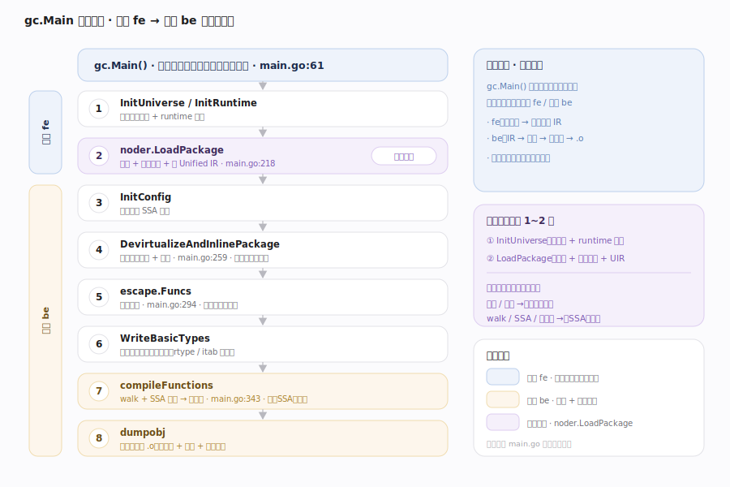
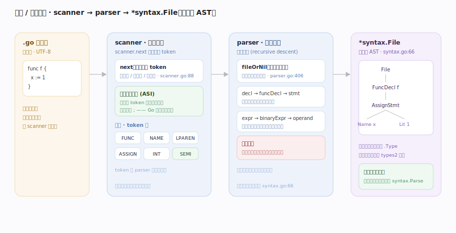
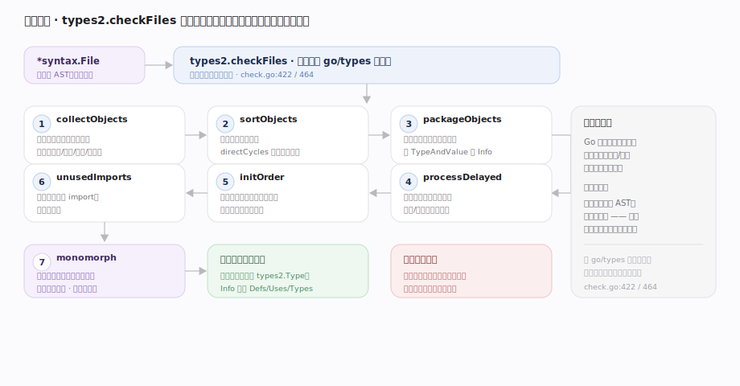
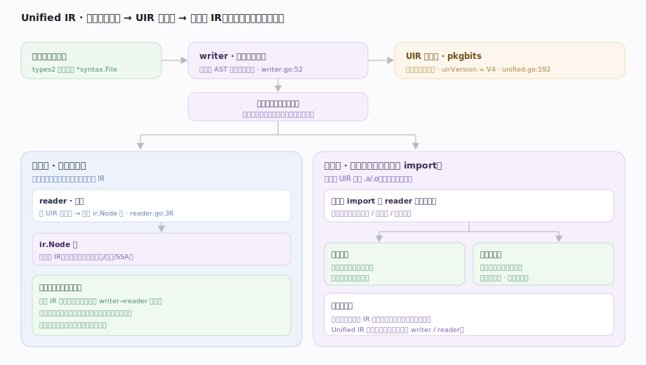

# Go 原理 · 编译前端

> **定位**：本篇是编译期工具链的第一段——把 `.go` 源文本变成类型完备的中间表示（IR）。属"编译能力域"，是【SSA后端】的上游（产出 IR 供其消费），也是【逃逸内联】【泛型】的宿主阶段，生成【接口与反射】所需的类型描述符/itab。统领 `gc.Main` 的相位脊柱。源码基准 **go1.26.4**（`~/workdir/go/src/cmd/compile/internal`）。

Go 的官方编译器 `gc`（非 GCC）前端分三段：**词法/语法分析**（`syntax` 包，源文本 → 语法树）→ **类型检查**（`types2` 包，与标准库 `go/types` 同算法）→ **Unified IR**（`noder` 包，把类型完备的语法树转成编译器 IR）。整个编译由 `gc.Main`（main.go:61）驱动一串有序相位。

---

## 一、gc.Main 相位脊柱

`gc.Main`（main.go:61）按固定顺序跑各相位，用计时器标签分**前端 `fe`** 与**后端 `be`**：

1. `InitUniverse`/`InitRuntime`（预声明标识符 + runtime 符号）
2. **`noder.LoadPackage`**（main.go:218）：解析 + 类型检查 + 建 Unified IR（本篇主体）
3. `InitConfig`（准备后端 SSA 配置）
4. `DevirtualizeAndInlinePackage`（main.go:259）：交织的去虚拟化 + 内联（见【逃逸内联】）
5. `escape.Funcs`（main.go:294）：逃逸分析（见【逃逸内联】）
6. `WriteBasicTypes`：发射运行时类型描述符
7. **`compileFunctions`**（main.go:343）：walk + SSA 后端（见【SSA后端】）
8. `dumpobj`：写目标文件

本篇覆盖第 1~2 步；后续相位分属其他主线。

---

## 二、词法与语法：syntax 包

`syntax` 包把源文本变成**语法树（syntax tree）**：

- **词法（scanner）**：`scanner.next`（scanner.go:88）逐字符扫描，产出 token 流（标识符、字面量、运算符、关键字）。Go 的词法有个特色——**自动分号插入**：行尾若 token 可结束语句则插入分号，所以 Go 不用手写 `;`。
- **语法（parser）**：`parser.fileOrNil`（parser.go:406）递归下降解析 token 流，产出 `*syntax.File`（一个源文件的 AST，节点类型在 nodes.go）。入口 `syntax.Parse`（syntax.go:66）。
- 一个包的多个 `.go` 文件**并行解析**（`noder.LoadPackage` 里 `syntax.Parse` 并发跑），再汇总。

语法树是纯语法结构——此时还没有类型信息，`a + b` 只知道是加法表达式，不知 a/b 是 int 还是 string。

---

## 三、类型检查：types2

`types2`（`Checker.checkFiles` check.go:422）做**语义分析**——为语法树的每个标识符/表达式绑定类型、检查类型规则。它与标准库 `go/types` 同算法（一套代码两处用）。有序阶段：

1. `initFiles` → `collectObjects`（收集包级声明的对象：类型/函数/变量/常量）
2. `sortObjects` → `directCycles`（处理声明间依赖与循环）
3. `packageObjects`（确定所有包级对象的类型）
4. `processDelayed`（**检查所有函数体**——表达式类型、赋值兼容、调用匹配）
5. `initOrder`（包级变量初始化顺序）
6. `unusedImports`（未用 import 报错）
7. `monomorph`（泛型单态化安全检查，见【泛型实现】）

产出：每个表达式的类型、每个标识符指向的对象、常量的值——写进 `types.Info`。类型错误在此报出（"cannot use x (int) as string"）。

---

## 四、Unified IR：语法树 → 编译器 IR

**Unified IR（统一 IR）**（`noder.unified` unified.go:192）是 Go 1.20 定型的关键设计：把类型检查后的信息**序列化**成一种统一的中间格式，再**反序列化**成编译器后端用的 `ir.Node` 树。

- **writer**（writer.go）："单一规范的写者"（writer.go:52）——把类型完备的包信息写成 Unified IR 字节流（`uirVersion = pkgbits.V4`）。
- **reader**（reader.go）：把 UIR 字节流读成 `ir.Node`（IR 节点，node.go:19 的 `Node` 接口 + `Func`/`Name` 等）。
- **为什么"统一"**：同一套 UIR 格式既用于**当前包**的编译（写完立刻读回建 IR），又用作**导出数据**（下游包 import 本包时读 UIR 拿到函数体，支撑**跨包内联**和**泛型实例化**）。以前"编译内表示"与"导出格式"是两套，Unified IR 合一，消除了不一致。

于是"前端产物"= 一棵 `ir.Func`/`ir.Node` 树 + 可跨包传播的 UIR 导出数据，交给中后端。

---

## 拓展 · 前端要点

| 要点 | 说明 |
|---|---|
| gc vs gccgo | `gc` 是官方主编译器（本篇）；gccgo 是 GCC 前端，另一实现 |
| 自动分号 | 词法阶段行尾插入，故 Go 源码不写 `;` |
| types2 vs go/types | 同算法两份代码：types2 给编译器（用 syntax AST），go/types 给工具（用 go/ast AST） |
| UIR 版本 | `uirVersion = pkgbits.V4`；跨版本导出数据需兼容 |
| 并行解析 | 一个包内多文件并发 `syntax.Parse` |
| 错误恢复 | parser 有 `BailErrorStrategy` 式错误恢复，尽量多报错误 |

## 调优要点（关键开关，均源码核实）

- `go build -gcflags=-m`：打印编译器优化决策（逃逸、内联）——虽属后端，但从前端 IR 流下来。
- `-gcflags=-W`：dump 类型检查后的 IR（调试编译器）。
- `-gcflags=-l`：禁内联；`-N`：禁优化（配合 delve 调试）。
- `GODEBUG=gotypesalias=…`：控制类型别名处理（1.22+ 别名类型演进）。
- 编译慢的常见原因：巨型包、大量泛型实例化、cgo——可拆包并行编译（见【go命令与链接】的 Action 图）。

## 常见误区与工程要点

- **误区：Go 有 VM/字节码。** 没有。`gc` 直接编译到机器码；无字节码解释层（区别于 Java/Python）。
- **误区：类型检查在解析时同步做。** 分阶段：先全部解析成语法树（无类型），再统一类型检查——因为要处理跨声明依赖。
- **误区：Unified IR 是又一种字节码。** 不。UIR 是**编译期序列化格式**，用于建 IR + 跨包导出，不在运行期存在。
- **误区：import 一个包会重新编译它的源码。** 不。import 读的是该包已编译产物的 **UIR 导出数据**（含可内联函数体、泛型模板）。
- 归属提醒：内联/逃逸虽在前端之后的相位跑，归【逃逸内联】；泛型的 types2 推断细节归【泛型实现】；walk→SSA→机器码归【SSA后端】。

## 一句话总纲

**Go 官方 `gc` 编译器前端由 `gc.Main` 相位脊柱驱动：`syntax` 包先并行把各 `.go` 文件词法扫描（含自动分号插入）+ 递归下降语法分析成无类型的语法树，`types2`（与 go/types 同算法）经 `checkFiles` 的有序阶段（收集对象→定包级类型→检查所有函数体→初始化顺序→泛型单态化检查）做语义分析、给每个表达式绑定类型并报类型错误，再由 `noder` 建 **Unified IR**——一种统一序列化格式，既写完立即读回建后端 `ir.Node` 树、又作为导出数据支撑下游包的跨包内联与泛型实例化（消除了「编译内表示」与「导出格式」两套的不一致）——前端产物是一棵类型完备的 IR 树 + 可跨包传播的 UIR，交给中后端，全程无字节码、直编机器码。**
