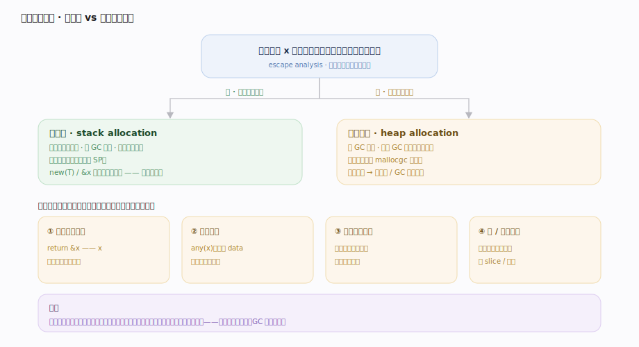
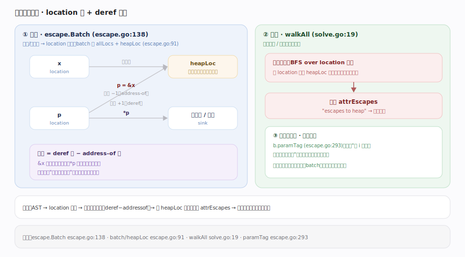
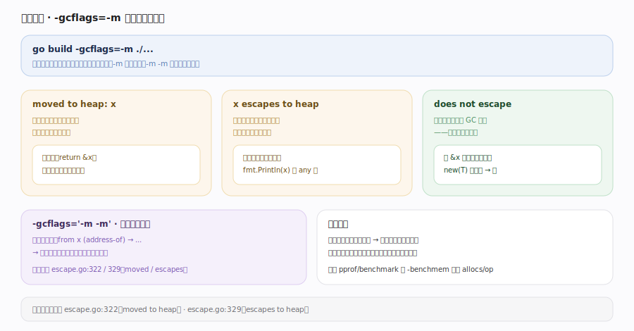
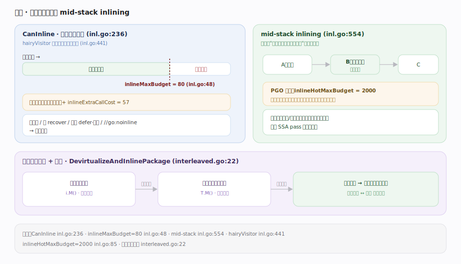
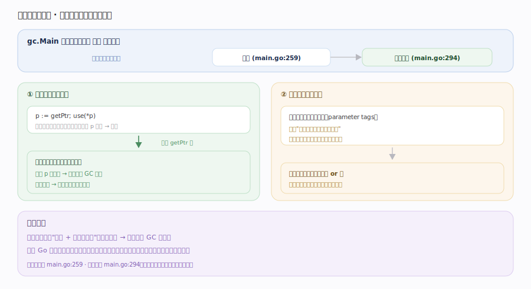

# Go 原理 · 逃逸分析与内联

> **定位**：本篇讲两项决定"分配在哪、调用是否展开"的编译期优化——逃逸分析（栈 vs 堆）与内联。属"编译能力域"，是【编译前端】之后、【SSA后端】优化前的相位（`gc.Main` main.go:259/294）。逃逸分析决定了【分配器】的负载（多少对象上堆），内联影响【SSA后端】的优化机会。两者交织进行。源码基准 **go1.26.4**（`~/workdir/go/src/cmd/compile/internal/escape`、`inline`）。

Go 无需程序员手动 `malloc`/`free`——**逃逸分析**在编译期决定每个变量分配在**栈**（函数返回自动回收、零 GC 压力）还是**堆**（被 GC 管理）。**内联**则把小函数体直接嵌入调用点，省调用开销并打开跨函数优化。两者由 `gc.Main` 交织调度：先去虚拟化+内联，再逃逸分析。

---

## 一、逃逸分析全景：栈还是堆

原则：**一个值若在其定义函数返回后仍可能被引用，就必须"逃逸"到堆**；否则可安全放栈。典型逃逸场景：

- 返回局部变量的**指针**（`return &x`）——x 活过函数，必逃逸。
- 值被存入**接口**（`any(x)`）——接口 data 需指针，常逃逸。
- 值被闭包捕获且闭包逃逸、存入逃逸的容器（切片/map)、传给参数标记为逃逸的函数。
- 大小编译期不确定的对象（大 slice）。

栈分配是"免费"的（随栈帧回收），逃逸到堆则增加 GC 压力——所以逃逸分析直接影响性能。

---

## 二、逃逸分析算法：数据流图

`escape.Batch`（escape.go:138）做的是**基于 AST 的静态数据流分析**（escape.go:21 注释）：

1. 把每个变量/表达式抽象成一个 **location（位置）** 节点（escape.go:91 的 `batch` 持有 `allLocs` + 特殊的 `heapLoc` 堆位置）。
2. 赋值/取址/解引用在 location 间建**有向带权边**，权重 = deref 数 − address-of 数（`&x` 减一层、`*p` 加一层）。
3. **求解**（`walkAll` solve.go:19）：从"已知逃逸的根"（如函数返回值、堆位置）反向传播——若某 location 有到 `heapLoc` 的路径且权重满足条件，标记 `attrEscapes`（"escapes to heap"）。
4. **跨函数摘要**：分析结果存成**参数标签（parameter tags）**（`b.paramTag` escape.go:293）——记录"该函数的第 i 个参数是否会让实参逃逸"，供调用方复用而不必重分析被调函数。

**批处理**：相互递归的函数放一批（batch）一起分析，处理调用环。

---

## 三、逃逸诊断：moved to heap

`go build -gcflags=-m` 打印逃逸决策（诊断字符串在 escape.go:319-329）：

- **`moved to heap: x`**（escape.go:322）：局部变量 x 本可在栈，但因逃逸被移到堆分配。
- **`x escapes to heap`**（escape.go:329）：表达式/参数逃逸。
- **`x does not escape`**：确认留在栈（好事）。
- `-m -m`（两次）打印更详细的逃逸路径推理。

工程用法：对性能热点函数跑 `-m`，看哪些本不该逃逸的对象逃逸了（常见：不必要的指针返回、接口装箱、闭包捕获），针对性优化。

---

## 四、内联：把小函数嵌进调用点

内联把被调函数体直接展开到调用处，省去调用/返回开销，并让调用点的代码能被后续 SSA pass 统一优化。`CanInline`（inl.go:236）用**预算成本模型**判定可内联性：

- 遍历函数体累加"成本"（`hairyVisitor` inl.go:441），每个操作有权重；超过 **`inlineMaxBudget = 80`**（inl.go:48）则太大、不可内联。含调用的函数成本更高（`inlineExtraCallCost = 57`）。
- **mid-stack inlining（中栈内联）**（inl.go:554）：Go 支持内联"包含函数调用的函数"（不只叶子函数），能内联调用链中间的函数——这是 Go 内联的重要能力。
- **PGO 热点**：有性能剖析数据时，热点调用的预算提高到 `inlineHotMaxBudget = 2000`（inl.go:85），更激进地内联热路径。
- **交织去虚拟化+内联**（`DevirtualizeAndInlinePackage` interleaved.go:22）：先把接口方法调用**去虚拟化**成具体调用（若能静态确定具体类型），去虚拟化后的直接调用又可能变得可内联——两者交替进行放大彼此效果。

不可内联的常见原因：函数太大、含 `recover`、某些 `defer`/闭包、`go:noinline` 标记。

---

## 五、两者的协同

内联与逃逸分析**相互增强**，故 `gc.Main` 让内联（main.go:259）先于逃逸分析（main.go:294）：

- **内联打开逃逸优化**：`p := getPtr(); use(*p)` 中 `getPtr` 内联后，编译器能看到指针的完整生命周期，可能判定其不逃逸、留栈。若不内联，跨函数边界只能保守假设逃逸。
- **逃逸信息指导分配**：逃逸分析产出的参数标签，让调用方知道"传进去的实参会不会逃逸"。
- 结果：大量小对象因"内联 + 判定不逃逸"而留在栈上，显著降低 GC 压力——这是 Go 性能的重要来源。

---

## 拓展 · 逃逸/内联要点

| 要点 | 说明 |
|---|---|
| 栈分配优势 | 随栈帧自动回收，零 GC 成本，缓存局部性好 |
| 常见逃逸源 | 返回指针、接口装箱、闭包捕获逃逸、大对象、`fmt` 变参 |
| `//go:noinline` | 强制不内联（基准测试/调试用） |
| mid-stack inlining | 可内联含调用的非叶函数（Go 1.9+） |
| 内联与栈 | 内联使调用者栈帧变大，可能触发更多栈增长 |
| PGO | `-pgo` 用运行剖析数据激进内联热点（1.21+ 默认找 default.pgo） |

## 调优要点（关键开关，均源码核实）

- `-gcflags=-m`（逃逸决策）、`-m -m`（详细路径）——性能优化第一工具。
- `-gcflags=-l`（禁内联）、`//go:noinline`（单函数禁）——基准对比。
- `-gcflags=-d=inlfuncswithclosures=1` 等调内联启发式（高级）。
- `-pgo=auto`（1.21+）：用 `default.pgo` 剖析数据做 PGO 内联/去虚拟化。
- 减少逃逸的手法：返回值而非指针（小结构）、避免不必要的接口装箱、预分配、复用（sync.Pool）。

## 常见误区与工程要点

- **误区：`new`/`&` 一定分配在堆。** 不！`x := new(T)` 或 `&x` 若不逃逸，**分配在栈**——是否上堆由逃逸分析定，不由语法定。这是 Go 与 C++ 的关键差异。
- **误区：逃逸分析是运行时行为。** 不。纯**编译期**静态分析，运行期无逃逸判定开销。
- **误区：内联总是更快。** 不一定。过度内联使代码膨胀、指令缓存压力增、栈帧变大——所以有预算上限（80）。
- **误区：只有叶子函数能内联。** Go 支持 **mid-stack inlining**，含调用的函数也能内联。
- **误区：接口方法调用无法优化。** 去虚拟化能把可静态确定的接口调用变成直接调用，进而可内联。
- 归属提醒：逃逸判定后的**堆分配实现**在【分配器】；内联/逃逸产出的 IR 交【SSA后端】继续优化；接口装箱的运行期表示在【接口与反射】。

## 一句话总纲

**Go 用编译期逃逸分析替代手动内存管理：`escape.Batch` 对 AST 做静态数据流分析——把变量抽象成 location 节点、赋值/取址/解引用建带权（deref−addressof）有向边，从「返回值/堆位置」反向传播标记 `attrEscapes`，并把结果存成跨函数复用的参数标签；「函数返回后仍被引用」（返回指针、接口装箱、闭包捕获逃逸）的值 `moved to heap`、否则留栈（栈分配零 GC 成本，故 `new`/`&` 不必然上堆）；内联由 `CanInline` 按预算成本模型（`hairyVisitor` 累加、上限 `inlineMaxBudget=80`、PGO 热点提到 2000）判定，支持 mid-stack inlining（含调用的非叶函数）并与去虚拟化交织放大；`gc.Main` 让内联先于逃逸分析，因内联打开跨函数视野使更多对象判定不逃逸而留栈——大幅降低 GC 压力，是 Go 性能的重要来源。**
