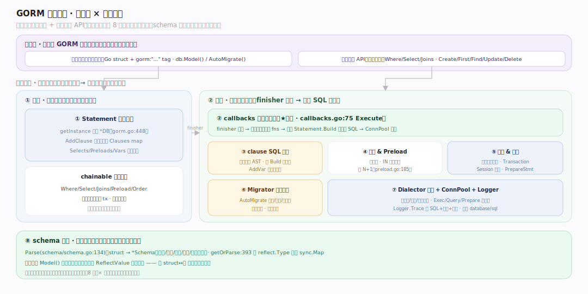
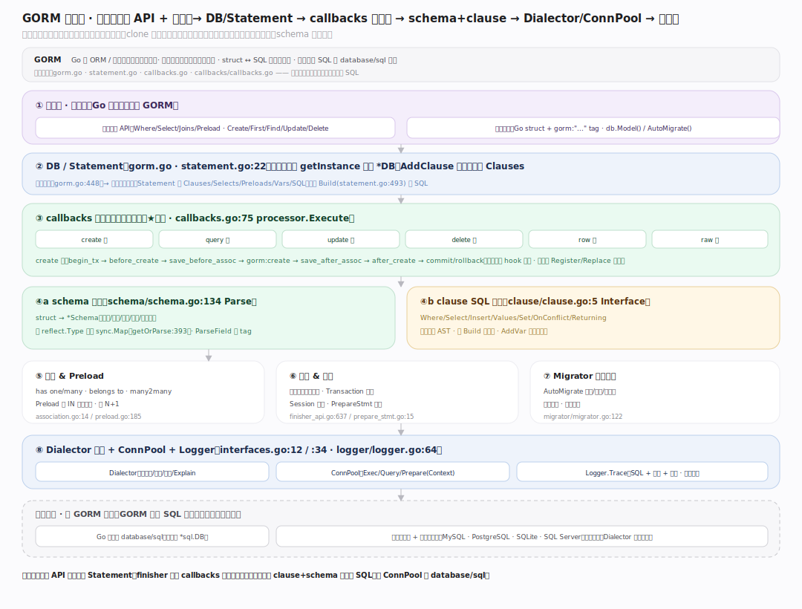
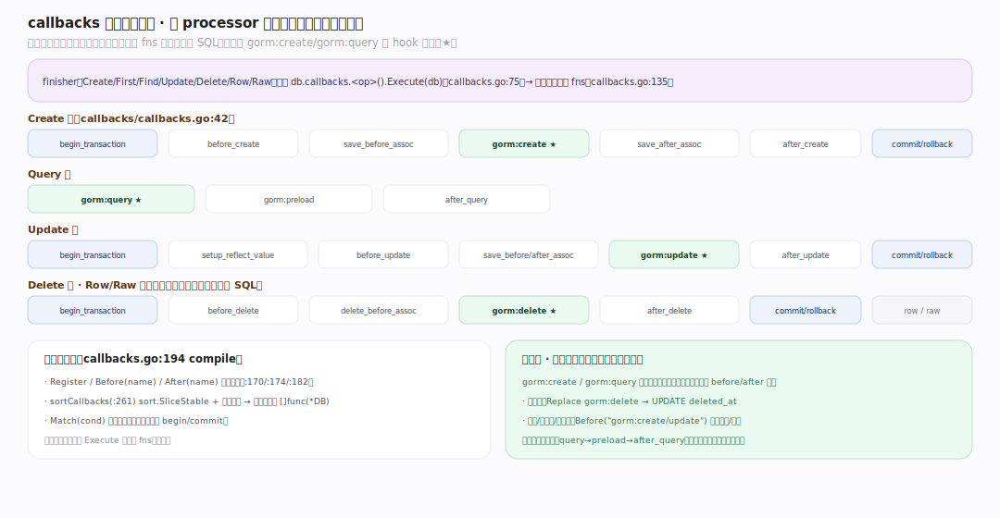
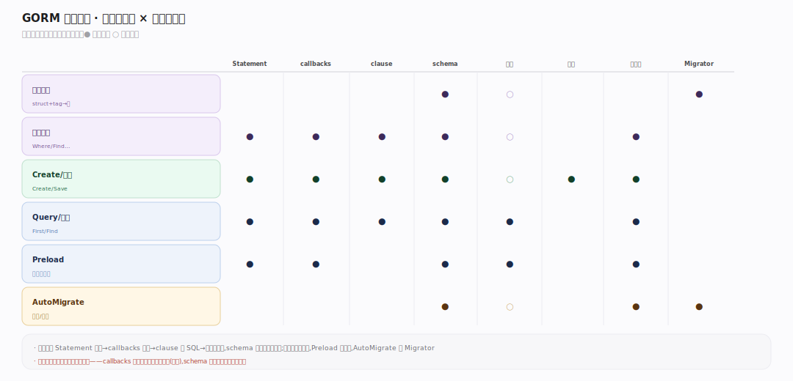

# GORM 核心原理 · 全景主线框架

> **定位**：先读这一篇。GORM = 可嵌入 Go 应用的 **ORM / 数据映射库**（新家族），把 Go struct ↔ SQL 表双向映射、生成方言 SQL、管理关联/事务/迁移。它不拥有网络与进程，链接进宿主应用作为一个包运行；核实基准：`gorm.go`、`statement.go`、`callbacks.go`、`callbacks/callbacks.go`。用**元模式**判型：`接触面（应用怎么调用）× 能力域（内部公共机制）× 时机（同步链式构建 / 回调链执行）`。

## 一、双维模型 · 把主线归位

**判型**：GORM 是链接进应用的库，没有 main/守护进程，接触面是 **Go 方法链 API**（不是 SQL 文本、也不是网络协议）。据元模式拆两维——

- **接触面（应用如何交互）**：① **链式查询 API**（`Where/Select/Joins/Preload/Order/Group` 累积条件 + `Create/First/Find/Save/Update/Delete/Scan/Transaction` 触发执行，见 `chainable_api.go`/`finisher_api.go`）；② **模型定义**（Go struct + `gorm:"..."` tag，`db.Model()`、`db.AutoMigrate()` 声明表结构）。
- **能力域（内部公共机制，8 条）**：`Statement` 与链式构建（`statement.go`）、schema 反射（`schema/`）、clause SQL 构建（`clause/`）、**callbacks 插件化生命周期回调链（★灵魂，`callbacks.go`）**、关联 Association 与 Preload（`association.go`/`callbacks/preload.go`）、事务与会话（`finisher_api.go`/`prepare_stmt.go`）、Migrator 自动迁移（`migrator/`）、Dialector 方言+连接池+Logger（`interfaces.go`/`logger/`）。
- **时机（执行阶段）**：**链式累积期**（每个 `Where/Select` 返回新 `*DB`、把条件塞进 `Statement.Clauses`，还不碰数据库）与 **回调链执行期**（`Create/Find` 等 finisher 触发 `processor.Execute`，跑注册好的回调链，最后一步才 `stmt.Build` 出 SQL 并执行）。

---

## 二、总架构 · 一次 db.Create 的分层旅程

自顶向下五层：**应用**（Go struct + 链式 API）→ **DB/Statement**（`gorm.go:108` DB、`statement.go:22` Statement 累积 clause）→ **callbacks 引擎**（`callbacks.go:75` `processor.Execute` 跑回调链，★灵魂）→ **schema+clause**（`schema.Parse` 反射出字段/主键/关联，`clause` 把 AST 拼成方言 SQL）→ **Dialector+ConnPool**（`interfaces.go:12` 翻译占位符/引号、`:34` ConnPool 执行到 `database/sql`）。**数据流**：`db.Create(&user)` → `getInstance` 克隆 DB（`gorm.go:448`）→ `Create` finisher（`finisher_api.go:19`）触发 `callbacks.Create().Execute()` → 回调链 `before_create → save_before_associations → create → save_after_associations → after_create`（`callbacks/callbacks.go:41`）→ `create` 回调调 `ConvertToCreateValues`（`callbacks/create.go:245`）拼 `clause.Values` → `stmt.Build` 出 `INSERT INTO ...` → `ConnPool.ExecContext` 落库 → 回写自增主键到 struct。

---

## 三、灵魂 · callbacks 生命周期回调链

GORM 的灵魂**不是** SQL 拼接，而是**把每种写/读操作拆成一条有序、可插拔的回调链**。六个 `processor`（create/query/update/delete/row/raw，`callbacks.go:51`）各持一条链；`RegisterDefaultCallbacks`（`callbacks/callbacks.go:23`）按业务语义注册默认回调（如 create 链：`gorm:begin_transaction → gorm:before_create → gorm:save_before_associations → gorm:create → gorm:save_after_associations → gorm:after_create → gorm:commit_or_rollback_transaction`）。回调间用 `Before(name)`/`After(name)` 声明**偏序**，`compile()`（`callbacks.go:194`）经 `sortCallbacks` 拓扑排序（`callbacks.go:261`）拍平成 `[]func(*DB)`。**这是所有 GORM 插件（软删除、乐观锁、多租户、审计）的统一扩展点**——插件只需往某条链插一个回调，不改核心。

---

## 四、依赖矩阵 · 接触面 × 能力域

`接触面 × 能力域` 热力矩阵：链式查询 API 强依赖 Statement 累积、clause 构建、callbacks 执行；模型定义强依赖 schema 反射与 Migrator；关联/Preload 依赖 schema 关联解析 + callbacks；所有写路径经事务能力域包裹。**三条贯穿声明**：① **一切经 callbacks**——查询也是回调链（query/preload/after_query），不存在绕过回调的"裸执行"；② **链式不可变**——每个链式方法 `getInstance` 克隆出新 `*DB`（`gorm.go:448`），条件累积在各自 `Statement.Clauses`，故一个 `*DB` 可安全并发派生多条查询；③ **schema 缓存**——struct→Schema 解析结果按类型缓存进 `sync.Map`（`schema/schema.go:393` getOrParse），反射只做一次。

---

## 深化 · 三原型对照（GORM 属新家族）

| 维度 | GORM（ORM/数据映射库） | 传统 SQL 引擎（Doris/PG） | 说明 |
|---|---|---|---|
| 是否拥有进程 | 否，链接进宿主应用 | 是，独立守护进程 | GORM 是库不是服务 |
| 接触面 | Go 方法链 API + struct tag | SQL 文本（DDL/DML/DQL/DCL） | 无网络协议接触面 |
| 灵魂机制 | callbacks 可插拔回调链 | 查询优化 + 执行引擎 | GORM 不做 CBO |
| SQL 归属 | 生成 SQL，交 database/sql 执行 | 自己解析+执行 SQL | GORM 不执行 SQL，只生成 |
| 存储 | 无，委托底层数据库 | 自管 | GORM 不碰磁盘 |

---

## 调优要点

- 复用 `*gorm.DB` 根实例（内含连接池），不要每次 `Open`；每次链式调用自动克隆，无并发风险。
- `PrepareStmt: true`（Session/Config）缓存预编译语句，高频重复 SQL 显著降开销。
- `SkipDefaultTransaction: true` 关掉单条写默认包裹的事务，批量写吞吐更高。
- 批量 `CreateInBatches` 控制 batchSize，避免单条超长 SQL 触发驱动上限。
- schema 解析有缓存，但首次反射有成本；长生命周期进程无忧，短命 CLI 需留意。

---

## 常见误区

- **GORM 自己执行 SQL**：错。它只生成 SQL 交给 `database/sql` 的 `ConnPool` 执行（`interfaces.go:34`）。
- **链式方法会修改原 DB**：错。`getInstance` 克隆语义，原实例不变（`gorm.go:448`）。
- **回调只用于 hook（BeforeCreate 等）**：以偏概全。整个 create/query/update/delete 的**主逻辑本身**就是链上一个回调，hook 只是链上另几个回调。
- **Model 与 Dest 必须同类型**：`db.Model(&User{}).Find(&results)` 中 Model 提供 schema、Dest 承接结果，可不同（`callbacks.go` assign model values）。

---

## 一句话总纲

**GORM 是链接进 Go 应用的 ORM/数据映射库——接触面是"链式查询 API + struct 模型定义"两维，内部靠 8 条能力域支撑，灵魂是"把每种操作拆成有序可插拔的 callbacks 回调链"：链式方法克隆式累积条件进 Statement，finisher 触发回调链执行，schema 反射出字段/关联、clause 拼出方言 SQL，最终交 database/sql 落库——它生成 SQL 而不执行 SQL、拥有映射逻辑而不拥有存储。**
