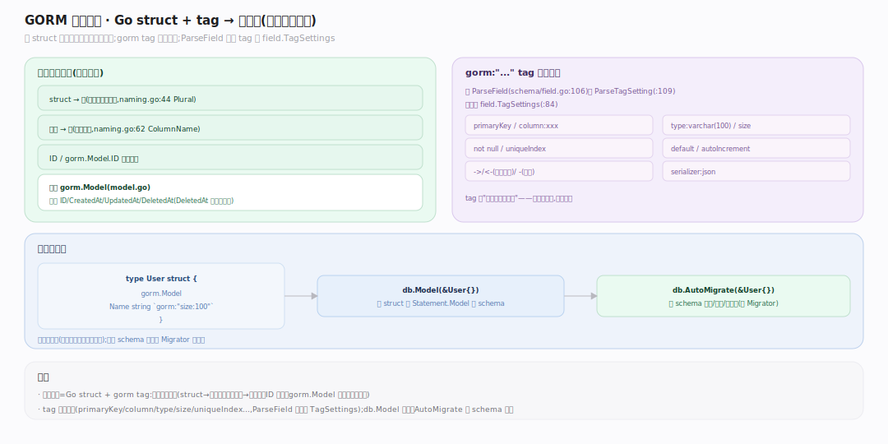

# GORM 核心原理 · 接触面 · 模型定义

> **定位**：应用向 GORM 声明"数据长什么样"的接触面——**Go struct + `gorm:"..."` 结构体标签**，配合 `db.Model()` 绑定、`db.AutoMigrate()` 建表/演进。这是声明式的一维（区别于链式查询的命令式）。核实基准：`model.go`、`schema/field.go:106`（ParseField 读 tag）、`schema/naming.go`（命名策略）、`finisher_api.go`（Model 绑定）。依赖 schema 反射与 Migrator 能力域。

## 一、struct + tag → 表结构声明

**约定优于配置**：一个 struct 默认映射一张表，字段默认映射一列，`ID`/`gorm.Model.ID` 默认主键，表名默认 struct 名的蛇形复数（`schema/naming.go:44` TableName 用 `inflection.Plural`）、列名蛇形（`:62` ColumnName）。**`gorm:"..."` tag 覆盖约定**：`primaryKey`/`column:xxx`/`type:varchar(100)`/`size`/`not null`/`uniqueIndex`/`default`/`autoIncrement`/`->`/`<-`（读写权限）/`-`（忽略）/`serializer:json` 等，由 `ParseField`（`schema/field.go:106`）经 `ParseTagSetting`（`:109`）解析进 `field.TagSettings`（`:84`）。**内嵌 `gorm.Model`**（`model.go`）注入 `ID/CreatedAt/UpdatedAt/DeletedAt` 四标准字段（`DeletedAt` 触发软删除，见事务/callbacks）。**`db.Model(&User{})`** 把 struct 绑给 `Statement.Model` 提供 schema，`AutoMigrate(&User{})` 据 schema 建表/补列/加索引（见 Migrator 篇）。

---

## 拓展 · 常用 gorm tag

| tag | 作用 | 解析处 |
|---|---|---|
| `primaryKey` | 主键 | field.go ParseField |
| `column:name` | 自定义列名 | field.go:109 TagSettings |
| `type:...`/`size:N` | 列类型/长度 | field.go |
| `not null`/`default:x` | 约束/默认值 | field.go |
| `uniqueIndex`/`index` | 索引 | schema/index.go |
| `-` / `->` / `<-` | 忽略 / 只读 / 只写 | field.go 读写权限 |
| `serializer:json` | 序列化器 | field.go:196 GetSerializer |
| `embedded`/`embeddedPrefix` | 内嵌展开 | field.go:156 struct 展开 |

---

## 补充 · 命名策略可插拔

| 项 | 默认 | 覆盖方式 |
|---|---|---|
| 表名 | 蛇形复数 | `TableName()` 方法 / NamingStrategy |
| 列名 | 蛇形 | tag `column` / NamingStrategy |
| 单数表名 | 关 | `SingularTable:true`（naming.go:37） |
| 表前缀 | 无 | `TablePrefix`（naming.go:36） |
| 连接表名 | 蛇形复数 | JoinTableName |

---

## 调优要点

- 显式 `type`/`size` 避免 Migrator 用方言默认类型，跨库结果更可控。
- 冷字段用 `-` 排除，减少反射/扫描；只读派生列用 `->`。
- 大 JSON/结构字段用 `serializer:json`，比手动 Marshal 更省心。
- 统一用内嵌 `gorm.Model` 拿到软删除+时间戳，别手搓四字段。

---

## 常见误区

- **struct 名就是表名**：默认是**蛇形复数**（User→users），非原名；改用 `TableName()` 或 `SingularTable`。
- **所有导出字段都建列**：`-` tag、非导出（小写）字段不映射。
- **tag 写错会报错**：多数未知 tag 被静默忽略，不报错——拼错 `uniqueIndex` 不会有索引却无提示。
- **embedded 会建子表**：错，embedded 是把内嵌 struct 字段**展平进同一张表**，非关联表。

---

## 一句话总纲

**模型定义是 GORM 声明式的接触面：一个 Go struct 按"约定优于配置"默认映射一张蛇形复数表、字段映射蛇形列，`gorm:"..."` tag 逐项覆盖约定（主键/列名/类型/索引/读写权限/序列化器），内嵌 gorm.Model 注入 ID+时间戳+软删除；ParseField 把 tag 解析进 schema，Model() 绑定提供元数据、AutoMigrate 据此建表——它决定了"struct↔表"这条映射的形状，是 schema 反射与 Migrator 的输入。**
