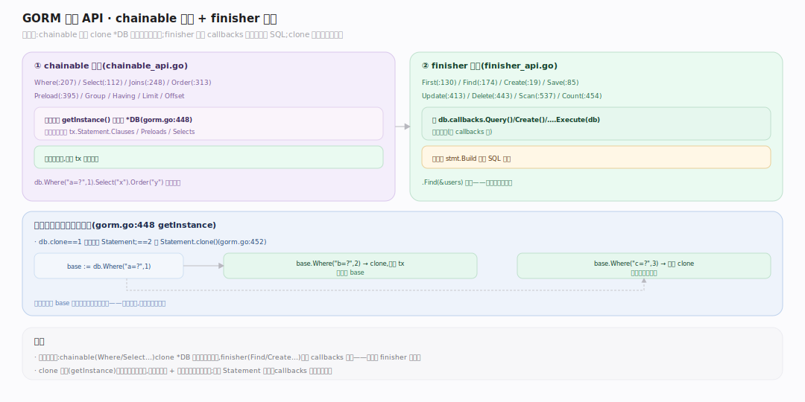

# GORM 核心原理 · 接触面 · 链式查询 API

> **定位**：应用与 GORM 交互的第一入口——**链式方法 API**。分两类：**chainable**（`Where/Select/Joins/Preload/Order/Group/Having/Limit/Offset`，累积条件、返回新 `*DB`）与 **finisher**（`Create/First/Find/Take/Save/Update/Delete/Scan/Count/Row/Transaction`，触发回调链执行）。核实基准：`chainable_api.go`、`finisher_api.go`、`gorm.go:448`（getInstance 克隆）。依赖 Statement 能力域累积、callbacks 能力域执行。

## 一、链式累积 + finisher 触发

**两段式**：① **chainable 累积**——`Where`（`chainable_api.go:207`）、`Select`（`:112`）、`Joins`（`:248`）、`Order`（`:313`）、`Preload`（`:395`）、`Group/Having/Limit/Offset` 都先调 `getInstance()` 克隆出新 `*DB`（`gorm.go:448`），再把条件塞进 `tx.Statement.Clauses` 或 `Statement.Preloads/Selects` 等字段，**不碰数据库**，返回 `tx` 供继续链。② **finisher 触发**——`First`（`finisher_api.go:130`）、`Find`（`:174`）、`Create`（`:19`）、`Save`（`:85`）、`Update`（`:413`）、`Delete`（`:443`）、`Scan`（`:537`）、`Count`（`:454`）调对应 `db.callbacks.Query()/Create()/... .Execute(db)` 跑回调链，链末尾 `stmt.Build` 拼出 SQL 执行。**克隆语义是并发安全的根**：`db.clone==1` 时建全新 Statement、`==2` 时 `Statement.clone()`（`gorm.go:452`），故 `base := db.Where("a=?",1)` 后 `base.Where("b=?",2)` 与 `base.Where("c=?",3)` 互不干扰。

---

## 拓展 · chainable vs finisher

| 类别 | 代表方法 | file:line | 是否触发 SQL |
|---|---|---|---|
| chainable 条件 | `Where` | chainable_api.go:207 | 否，累积 |
| chainable 投影 | `Select`/`Omit` | :112 / :177 | 否，累积 |
| chainable 关联 | `Joins`/`Preload` | :248 / :395 | 否，累积 |
| finisher 读 | `First`/`Find`/`Scan` | finisher_api.go:130/174/537 | 是，跑 query 链 |
| finisher 写 | `Create`/`Save`/`Update`/`Delete` | :19/85/413/443 | 是，跑对应链 |
| finisher 事务 | `Transaction` | :637 | 是，包裹 fc |

---

## 补充 · First/Take/Last 差异

| 方法 | 排序 | 限制 |
|---|---|---|
| `First` | 按主键升序 | LIMIT 1 |
| `Take` | 无排序 | LIMIT 1 |
| `Last` | 按主键降序 | LIMIT 1 |
| `Find` | 无（除非 Order） | 无（全量/切片） |

---

## 调优要点

- 链式方法零 DB 开销，随意组合；开销全在 finisher 触发那一刻。
- `Select` 只取需要的列，减少扫描与反射赋值；宽表尤甚。
- 复用累积到一半的 `*DB` 做分支查询是安全的（克隆语义），可省重复条件拼装。
- `FindInBatches`（`:186`）大结果集分批，避免一次性把全表读进内存。

---

## 常见误区

- **链到一半的 db 会执行 SQL**：错，只有 finisher 才触发。
- **重用 `tx := db.Where(...)` 会串数据**：错，克隆语义隔离，除非显式 `Session(&Session{})` 复用。
- **`First` 不加条件就报错**：不会，它默认按主键排序取第一条；无记录返回 `ErrRecordNotFound`。
- **`Find` 找不到返回 error**：错，`Find` 空结果不报错（`RowsAffected==0`），只有 `First/Take/Last` 才 `ErrRecordNotFound`。

---

## 一句话总纲

**链式查询 API 是 GORM 的用户接触面：chainable 方法（Where/Select/Joins/Preload…）以克隆语义把条件累积进各自的 Statement.Clauses 而不碰库，finisher 方法（Create/First/Find/Update/Delete…）才触发对应 callbacks 回调链执行、在链末拼出方言 SQL 落库——"累积—触发"两段式 + 克隆隔离，让一个 *DB 能安全派生多条独立查询。**
