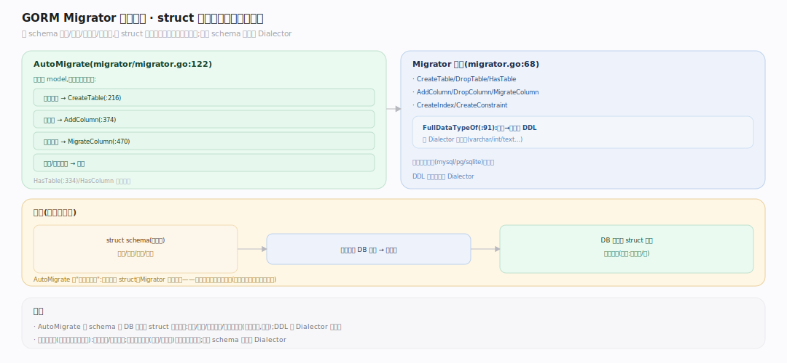

# GORM 核心原理 · 支撑能力域 · Migrator 自动迁移

> **定位**：据 schema 建表/补列/加索引/加约束，把 struct 声明"自动收敛"到数据库结构。核实基准：`migrator.go:68`（Migrator 接口）、`migrator/migrator.go:122`（AutoMigrate）、`:216`（CreateTable）、`:334`（HasTable）、`:374`（AddColumn）、`:470`（MigrateColumn）、`:91`（FullDataTypeOf）。依赖 schema 反射与 Dialector。

## 一、AutoMigrate：声明收敛而非版本迁移

**接口** `Migrator`（`migrator.go:68`）由各 Dialector 实现，基类 `migrator.Migrator`（`migrator/migrator.go`）提供方言无关骨架、方言只覆盖差异。**AutoMigrate**（`:122`）逐 model：`HasTable`（`:334`）不存在→`CreateTable`（`:216`，据 schema 字段 + `FullDataTypeOf`（`:91`）生成列定义、主键、索引、约束）；已存在→**逐字段比对**：缺列 `AddColumn`（`:374`）、类型/大小/可空变化 `MigrateColumn`（`:470`）、缺索引补建、缺外键补建。**关键性质：只增不减**——AutoMigrate **不会删列、不会缩小类型、不改列名**（避免误删数据），故它是"幂等的向前收敛"，不是双向 schema 版本迁移。`RunWithValue`（`:62`）为每个 value 解析 schema 后执行迁移动作。**编程式 DDL**：`CreateTable/DropTable/AddColumn/DropColumn/CreateIndex/CreateConstraint` 等可单独调，用于精细控制或补 AutoMigrate 不做的删除。

---

## 拓展 · Migrator 核心方法

| 方法 | file:line | 作用 |
|---|---|---|
| `AutoMigrate` | migrator.go:122 | 建表/补列/加索引（只增） |
| `CreateTable` | :216 | 据 schema 建表 |
| `HasTable` | :334 | 表是否存在 |
| `AddColumn` | :374 | 补列 |
| `MigrateColumn` | :470 | 列类型/约束演进 |
| `FullDataTypeOf` | :91 | 字段→方言列定义 |
| `RunWithValue` | :62 | 解析 schema 后执行 |

---

## 补充 · AutoMigrate 做与不做

| 会做 | 不会做 |
|---|---|
| 建不存在的表 | 删表 |
| 补缺的列 | 删多余列 |
| 加大类型/长度 | 缩小类型 |
| 补缺的索引/约束 | 改列名 |
| 幂等重复安全 | 双向版本回滚 |

---

## 调优要点

- 生产环境把 AutoMigrate 当"补齐"而非"迁移工具"；破坏性变更（删列/改名）走独立 SQL 脚本。
- 显式在 tag 写 `type`/`size`/`index`，让迁移结果跨方言可预期。
- 大表 AutoMigrate 加列可能锁表，避开高峰或用在线 DDL 工具。
- 用 `Migrator().HasColumn/HasIndex` 编程式条件迁移，避免重复 DDL 报错。

---

## 常见误区

- **AutoMigrate 会删多余列**：不会，只增不减（防误删数据）。
- **AutoMigrate 能改列名**：不能，它把改名看作"新列"，会新增而非重命名。
- **AutoMigrate 是版本化迁移**：不是，它是幂等收敛，无 up/down、无版本表。
- **迁移逻辑各库不同**：骨架方言无关（`migrator/migrator.go`），只有类型/语法差异由 Dialector 覆盖。

---

## 一句话总纲

**Migrator 把 struct 声明自动收敛到数据库结构：AutoMigrate 逐 model 用 HasTable 判存在，无则 CreateTable（FullDataTypeOf 生成列定义/主键/索引/约束），有则逐字段比对补缺列（AddColumn）、演进类型（MigrateColumn）、补索引外键；其"只增不减、不删列不改名"的幂等收敛语义避免误删数据，是补齐工具而非双向版本迁移；方言无关骨架 + Dialector 覆盖差异，让同一份 struct 在各库建出等价表。**
