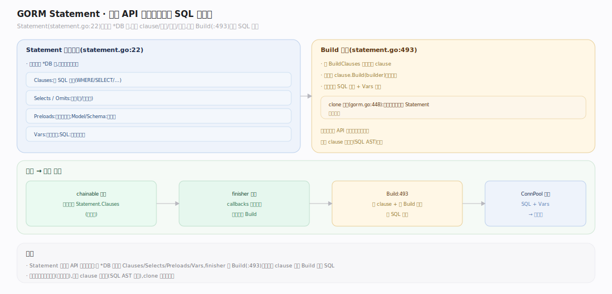

# GORM 核心原理 · 支撑能力域 · Statement 与链式构建

> **定位**：链式 API 的"状态容器"与 SQL 拼装器。`Statement`（`statement.go:22`）挂在每个 `*DB` 上，累积 clause、投影、关联、变量，最终由 `Build`（`statement.go:493`）把选定的 clause 拼成 SQL 文本。核实基准：`statement.go`、`gorm.go:448`（克隆）、`clause`。是链式查询 API 接触面的直接支撑。

## 一、Statement：累积器 + SQL 拼装器

**Statement 结构**（`statement.go:22`）核心字段：`Clauses map[string]clause.Clause`（按名字存 SELECT/FROM/WHERE/... 各子句）、`BuildClauses []string`（本次操作要 Build 的子句名及顺序）、`Selects/Omits`（列投影）、`Joins`、`Preloads`、`Vars`（占位符参数）、`SQL strings.Builder`（成品）、`ReflectValue`（Dest 反射值）、`Schema`（解析出的表结构）。**累积**：链式方法调 `AddClause`（`statement.go:272`）把条件并进 `Clauses` 对应项（同名 clause 的 `MergeClause` 合并，如多个 `Where` 合成一组 AND）；`BuildCondition`（`statement.go:292`）把 `"name=? AND age>?", args` 解析成 `[]clause.Expression`。**拼装**：finisher 触发回调链，回调设置 `stmt.BuildClauses`（如 query 为 `SELECT,FROM,WHERE,GROUP BY,ORDER BY,LIMIT,FOR`），末尾 `stmt.Build(clauses...)`（`statement.go:493`）按顺序遍历、每个 `clause.Build` 写进 `SQL`；`QuoteTo`（`:85`）加方言引号、`AddVar`（`:175`）收占位符与 `Vars`。

---

## 拓展 · Statement 关键字段

| 字段 | 类型 | 作用 |
|---|---|---|
| `Clauses` | `map[string]clause.Clause` | 按名累积各 SQL 子句 |
| `BuildClauses` | `[]string` | 本次 Build 的子句名及顺序 |
| `Selects`/`Omits` | `[]string` | 列白/黑名单 |
| `Vars` | `[]interface{}` | 占位符参数（防注入） |
| `SQL` | `strings.Builder` | 拼装成品 |
| `ReflectValue` | `reflect.Value` | Dest 的反射值，扫描/赋值用 |
| `Schema` | `*schema.Schema` | 解析出的表结构 |

---

## 补充 · 关键方法

| 方法 | file:line | 职责 |
|---|---|---|
| `AddClause` | statement.go:272 | 把 clause 并入 Clauses（MergeClause） |
| `BuildCondition` | statement.go:292 | 字符串/map/struct 条件 → Expression |
| `Build` | statement.go:493 | 按 BuildClauses 顺序拼 SQL |
| `QuoteTo` | statement.go:85 | 方言引号（表名/列名） |
| `AddVar` | statement.go:175 | 收集占位符与参数 |
| `clone` | statement.go | 深拷贝供链式隔离 |

---

## 调优要点

- 参数一律走 `Vars`/`?` 占位符，天然防 SQL 注入；别自己拼字符串。
- 复杂原生条件用 `clause.Expr{SQL, Vars}` 直插，绕过条件解析开销。
- `DryRun`（Session）只 Build 不执行，用于生成/审查 SQL。
- 减少无谓 clause 累积（重复 Order/Where），Build 是线性遍历。

---

## 常见误区

- **Statement 全局共享**：错，每个链式克隆出的 `*DB` 有自己 clone 的 Statement。
- **Build 一次就固定**：`BuildClauses` 每次回调链按操作类型重设（`callbacks.go:87`），Build 后 `resetBuildClauses` 清空。
- **多次 Where 覆盖前者**：错，`MergeClause` 是 **AND 合并**，不是覆盖。
- **Statement 直接执行 SQL**：错，它只拼 `SQL`+`Vars`，执行在回调里交 ConnPool。

---

## 一句话总纲

**Statement 是链式 API 的状态容器兼 SQL 拼装器：链式方法经 AddClause 把条件按名累积进 Clauses（同名 MergeClause 合并成 AND），finisher 触发的回调链设定 BuildClauses 顺序后调 Build 线性遍历各子句拼出 SQL、用 Vars 收占位符防注入——它把"命令式链式调用"翻译成"一份带参数的方言 SQL 文本"，是链式接触面落到 clause/database/sql 的枢纽。**
