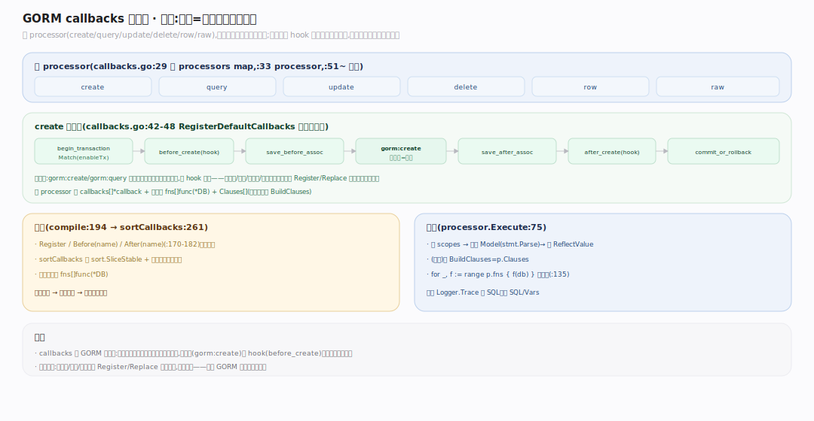

# GORM 核心原理 · 支撑能力域 · callbacks 插件化生命周期回调链（★灵魂）

> **定位**：GORM 的灵魂机制。把 create/query/update/delete/row/raw 每种操作拆成一条**有序、可插拔的回调链**，操作主逻辑与 hook 都是链上的回调，插件靠插回调扩展、不改核心。核实基准：`callbacks.go:29`（callbacks）、`:33`（processor）、`:75`（Execute）、`:194`（compile）、`:261`（sortCallbacks）、`callbacks/callbacks.go:23`（默认注册）。

## 一、六 processor + 有序回调链

**结构**：`callbacks`（`callbacks.go:29`）持 `processors map[string]*processor`；六个 processor——create/query/update/delete/row/raw（`:51`~）。每个 `processor`（`:33`）有 `callbacks []*callback` + 编译后的 `fns []func(*DB)` + `Clauses []string`（该操作默认 BuildClauses）。**注册**（`callbacks/callbacks.go:23` RegisterDefaultCallbacks）按语义排链，如 **create 链**：`gorm:begin_transaction`(`Match(enableTransaction)`) → `gorm:before_create` → `gorm:save_before_associations` → `gorm:create` → `gorm:save_after_associations` → `gorm:after_create` → `gorm:commit_or_rollback_transaction`（`callbacks.go:42-48`）。**排序**：`Register`/`Before(name)`/`After(name)`(`callbacks.go:170-182`) 声明偏序，`compile()`(`:194`) 调 `sortCallbacks`(`:261`) 用 `sort.SliceStable` + 依赖遍历拓扑排序成 `fns`。**执行**：finisher 调 `processor.Execute`(`:75`)——先跑 scopes、解析 Model（`stmt.Parse`）、设 `ReflectValue`、（首次）令 `BuildClauses=p.Clauses`，然后 `for _, f := range p.fns { f(db) }`（`:135`）顺序跑；末尾 Logger.Trace 记 SQL、清 `SQL/Vars`。**灵魂点**：`gorm:create`/`gorm:query` 这些**主逻辑本身就是链上一个回调**，与 hook 平级——这让软删除、审计、多租户、乐观锁等插件只需 `Register`/`Replace` 一个回调即可织入。

---

## 拓展 · 四条主链默认回调（callbacks/callbacks.go）

| 操作 | 回调链（顺序） |
|---|---|
| Create | begin_tx → before_create → save_before_assoc → **create** → save_after_assoc → after_create → commit_or_rollback |
| Query | **query** → preload → after_query |
| Update | begin_tx → setup_reflect_value → before_update → save_before_assoc → **update** → save_after_assoc → after_update → commit_or_rollback |
| Delete | begin_tx → before_delete → delete_before_assoc → **delete** → after_delete → commit_or_rollback |

---

## 补充 · processor 关键方法

| 方法 | file:line | 职责 |
|---|---|---|
| `Execute` | callbacks.go:75 | 跑整条链 fns |
| `Register` | callbacks.go:182 | 追加回调（默认名） |
| `Before`/`After` | callbacks.go:170/174 | 声明相对位置 |
| `Replace` | callbacks.go:190 | 替换同名回调 |
| `Match` | callbacks.go | 条件回调（如仅在开事务时） |
| `compile`/`sortCallbacks` | :194/:261 | 拓扑排序成 fns |

---

## 调优要点

- 自定义插件用 `db.Callback().Create().Before("gorm:create").Register(...)` 精确插位。
- `Replace("gorm:create", fn)` 完全接管主逻辑（少用，高风险）。
- `Match(cond)` 让回调按条件跳过（如仅事务下注册 begin_transaction）。
- 关联多的写路径由 `save_before/after_associations` 递归开销大，无关联可 `Omit(clause.Associations)`。

---

## 常见误区

- **回调只是 BeforeCreate/AfterFind hook**：错，**主逻辑 gorm:create/gorm:query 本身就是回调**，hook 只是链上另几个。
- **回调链顺序随注册顺序**：错，靠 Before/After 偏序 + sortCallbacks 拓扑排序（`:261`）定序。
- **查询不走回调**：错，query 也是 processor（query→preload→after_query）。
- **改核心才能扩展**：错，插件织入靠 Register/Replace，核心零改动——这正是灵魂所在。

---

## 一句话总纲

**callbacks 是 GORM 的灵魂：六个 processor（create/query/update/delete/row/raw）各持一条回调链，操作主逻辑（gorm:create/gorm:query）与 hook（before/after）都是链上平级回调，用 Before/After 声明偏序、compile 经 sortCallbacks 拓扑排序成 fns，finisher 触发 Execute 顺序跑；软删除/审计/多租户等一切扩展只需往链上 Register/Replace 一个回调而不动核心——"把每种操作拆成可插拔的有序回调链"是 GORM 区别于普通 SQL builder 的本质。**
