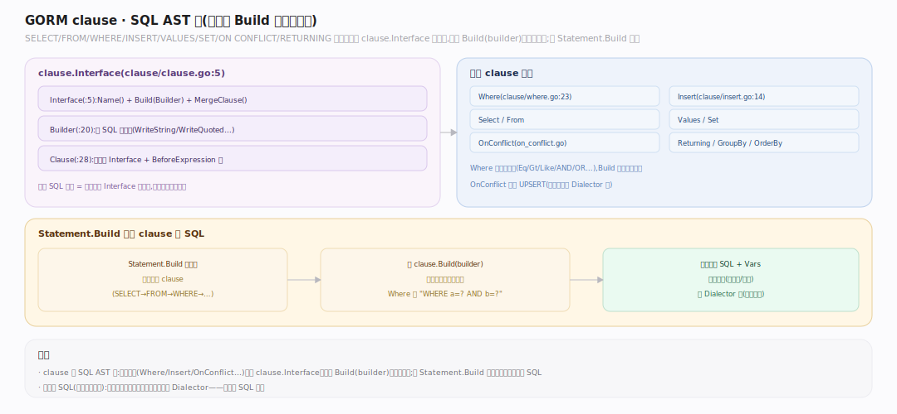

# GORM 核心原理 · 支撑能力域 · clause SQL 构建

> **定位**：GORM 的 SQL AST 层。把 SELECT/FROM/WHERE/INSERT/VALUES/SET/ON CONFLICT/RETURNING 等抽象成实现 `clause.Interface` 的结构，各自 `Build(builder)` 写出对应方言片段。核实基准：`clause/clause.go:5`（Interface）、`:20`（Builder）、`:28`（Clause）、`clause/where.go:23`、`clause/insert.go:14`、`clause/on_conflict.go`。被 Statement.Build 驱动。

## 一、clause：可组合的 SQL AST

**接口三件套**（`clause/clause.go`）：`Interface`（`:5`，`Name()`+`Build(Builder)`+`MergeClause(*Clause)`）、`Builder`（`:20`，暴露 `WriteString/WriteQuoted/AddVar` 供子句写 SQL+收参数）、`Clause`（`:28`，包装某具体子句 + 其 Expression 列表）。**每个 SQL 部件是一个 clause 结构**：`Where`（`where.go:13`，`Build`→`:23` 遍历 Expression 拼 `AND/OR`；`MergeClause`→`:92` 合并多次 Where）、`Select`、`From`、`Insert`（`insert.go:14`）、`Values`（`values.go:14`）、`Set`（`set.go:21`，UPDATE 赋值）、`Returning`（`returning.go:13`）、`OnConflict`（`on_conflict.go:3`，Upsert：`DoNothing`/`DoUpdates`→`:42`）、`Limit/OrderBy/GroupBy/Joins/Locking`。**表达式** `Expression`：`Expr{SQL,Vars}` 原生片段、`Eq/Gt/IN/Like` 等结构化条件。**方言无关性**：clause 只调 Builder 的抽象写方法，具体引号/占位符（`?` vs `$1`）由 Dialector 在 Builder 实现里定，故同一套 clause 出 MySQL/PG/SQLite SQL。

---

## 拓展 · 主要 clause 结构

| clause | file:line | 对应 SQL |
|---|---|---|
| `Where` | where.go:23 | WHERE ... AND/OR |
| `Select`/`From` | select.go/from.go | SELECT cols / FROM t |
| `Insert`/`Values` | insert.go:14 / values.go:14 | INSERT INTO / VALUES |
| `Set` | set.go:21 | UPDATE ... SET |
| `OnConflict` | on_conflict.go:42 | ON CONFLICT / UPSERT |
| `Returning` | returning.go:13 | RETURNING cols |
| `Locking` | locking.go | FOR UPDATE/SHARE |

---

## 补充 · Expression 家族

| 表达式 | 生成 |
|---|---|
| `Expr{SQL,Vars}` | 原生片段 + 占位参数 |
| `Eq/Neq/Gt/Lt` | `col = ?` 等 |
| `IN` | `col IN (?,?)` |
| `Like` | `col LIKE ?` |
| `AndConditions/OrConditions` | 括号分组 |

---

## 调优要点

- 复杂条件用 `clause.Expr` 直插原生 SQL + Vars，避免多层 Expression 组装。
- Upsert 用 `clause.OnConflict{DoUpdates:...}` 一条 SQL 完成插入或更新。
- `clause.Locking{Strength:"UPDATE"}` 做悲观锁，别用应用层轮询。
- `Returning` 一次拿回写入后的列（PG/SQLite），省二次查询。

---

## 常见误区

- **clause 绑定某数据库**：错，clause 方言无关，占位符/引号由 Dialector 决定。
- **多个 Where 是 OR**：默认 **AND 合并**（`where.go:92` MergeClause）；OR 要显式 `Or`。
- **拼 SQL 会注入**：clause 一律经 `AddVar` 走占位符，参数与 SQL 分离。
- **clause 顺序随写随定**：Build 顺序由 `Statement.BuildClauses` 控制，不是 clause 自排。

---

## 一句话总纲

**clause 是 GORM 的方言无关 SQL AST：每个 SQL 部件（Where/Select/Insert/Values/Set/OnConflict/Returning/Locking）是一个实现 Interface 的结构、各自 Build 写片段，多次同名子句经 MergeClause 合并（Where 合成 AND），条件由 Expression 家族表达、参数一律经 Builder.AddVar 走占位符防注入；具体引号与占位符风格交 Dialector——同一套 clause 树因此能生成 MySQL/PG/SQLite 各家 SQL。**
