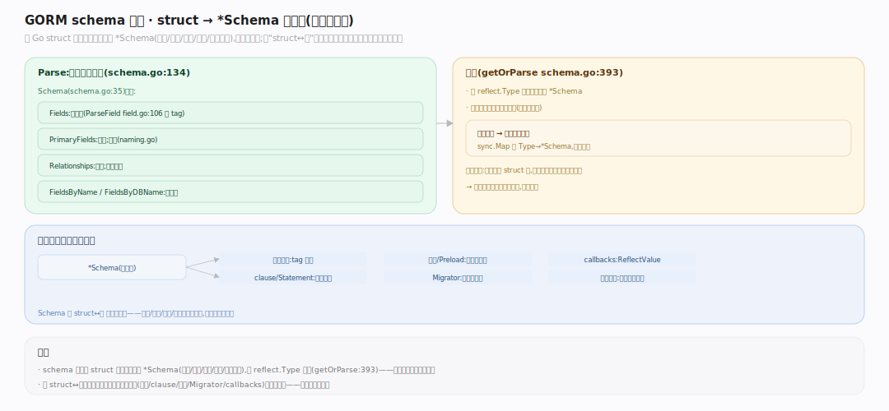

# GORM 核心原理 · 支撑能力域 · schema 反射

> **定位**：把 Go struct 一次性反射解析成 `*Schema`（字段/主键/命名/关联/序列化器），并按类型缓存。是"struct↔表"映射的元数据源，所有能力域的公共底座。核实基准：`schema/schema.go:35`（Schema）、`:134`（Parse）、`:393`（getOrParse 缓存）、`schema/field.go:106`（ParseField）、`schema/naming.go`（命名）。

## 一、Parse：struct → Schema（带缓存）

**入口** `Parse`（`schema/schema.go:134`）→ `getOrParse`（`:393`）：先查 `cacheStore *sync.Map`（按 `reflect.Type` 缓存），命中直接返回，未命中才反射。**解析产物** `Schema`（`:35`）：`Name/Table`（经 `Namer` 命名策略生成，`naming.go:44`）、`Fields []*Field`、`PrimaryFields`、`FieldsByName/FieldsByDBName` 索引、`Relationships`（关联，见关联篇）、生命周期 hook 标记（BeforeCreate 等是否实现）。**逐字段** `ParseField`（`field.go:106`）：读 `gorm:"..."` tag（`ParseTagSetting`，`:109`）填 `TagSettings`（`:84`）；推断 `DataType`（Bool/Int/String/Time/Bytes，`field.go:43`）；识别内嵌 struct 展平（`:156`）、序列化器（实现 `SerializerInterface` 或 `serializer:` tag → `field.go:187`）；生成 `ValueOf/ReflectValueOf` 存取器闭包（供扫描/赋值时零成本读写字段）。**并发安全**：`sync.Map` 缓存 + 首次解析加锁，长生命周期进程只反射一次/类型。

---

## 拓展 · Schema 关键产物

| 产物 | 字段 | 用途 |
|---|---|---|
| 表名 | `Schema.Table` | FROM/INSERT 目标 |
| 全字段 | `Fields` | 列映射 |
| 主键 | `PrimaryFields` | WHERE 主键、回写自增 |
| 名字索引 | `FieldsByDBName` | 扫描时列→字段 |
| 关联 | `Relationships` | Preload/Association |
| hook 标记 | `BeforeCreate` 等 | 回调链是否触发 hook |

---

## 补充 · Field 关键属性

| 属性 | file:line | 含义 |
|---|---|---|
| `TagSettings` | field.go:84 | 解析后的 gorm tag |
| `DataType` | field.go:43 | 归一化数据类型 |
| `Serializer` | field.go:91 | 序列化器实例 |
| `PrimaryKey`/`AutoIncrement` | field.go | 主键/自增标记 |
| `ValueOf`/`ReflectValueOf` | field.go | 字段存取闭包 |

---

## 调优要点

- schema 有类型级缓存，热路径零反射；无需自建缓存。
- 字段多的宽表首次 Parse 略慢，短命进程可预热（提前 `db.Model(&T{}).Statement.Parse`）。
- 用 `FieldsByDBName` 而非线性查字段（GORM 内部已做索引）。
- 序列化器在 Parse 期绑定，运行期直接调，比每次反射判断快。

---

## 常见误区

- **每次查询都反射解析**：错，首次后走 `sync.Map` 缓存（`schema.go:393`）。
- **Schema 能反向精确还原 struct**：`SchemaName` 不保证是 TableName 的严格逆（`naming.go` 注释明说）。
- **匿名内嵌一定是关联**：内嵌 struct 默认**展平进本表**，除非有关联 tag。
- **未导出字段也解析**：只解析可导出字段。

---

## 一句话总纲

**schema 反射是"struct↔表"映射的元数据源：Parse 经 getOrParse 按类型缓存进 sync.Map，未命中才反射出 Schema——表名（命名策略）、字段列表、主键、名字索引、关联、hook 标记，逐字段 ParseField 读 gorm tag、推断 DataType、绑定序列化器、生成存取闭包；一次解析全程复用，是 clause 拼 SQL、扫描赋值、Migrator 建表、关联解析共同的底座。**
