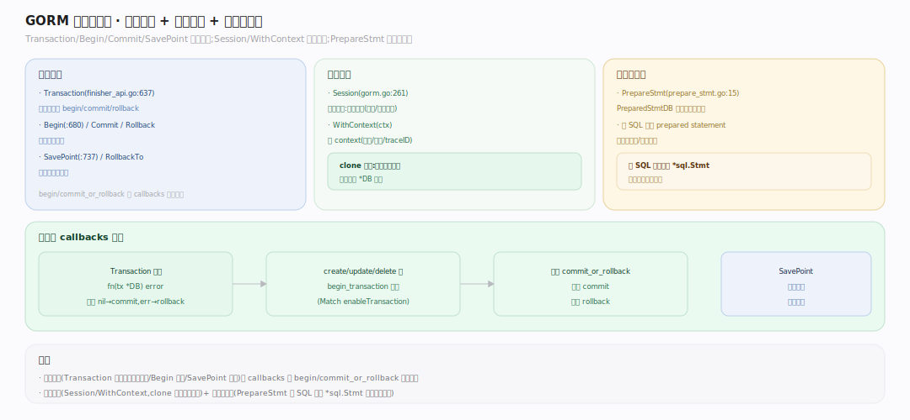

# GORM 核心原理 · 支撑能力域 · 事务与会话

> **定位**：事务边界（`Transaction`/`Begin`/`Commit`/`SavePoint`）、会话隔离（`Session`/`WithContext`）与预编译缓存（`PrepareStmt`）。核实基准：`finisher_api.go:637`（Transaction）、`:680`（Begin）、`:737`（SavePoint）、`gorm.go:261`（Session）、`prepare_stmt.go:15`（PreparedStmtDB）、`callbacks.go`（begin/commit_or_rollback 回调）。

## 一、事务 / 会话 / 预编译

**默认单条事务**：每条写操作默认被 `gorm:begin_transaction` 与 `gorm:commit_or_rollback_transaction` 回调（`Match(enableTransaction)`）包裹，出错自动回滚；`SkipDefaultTransaction`/`Session{SkipDefaultTransaction}` 关掉以提吞吐。**闭包事务** `Transaction(fc)`（`finisher_api.go:637`）：`Begin` → 跑 `fc(tx)` → 返回 nil 则 `Commit`、返回 err 或 panic 则 `Rollback`；**嵌套事务**用 SavePoint（`:737`）实现子事务回滚点，`DisableNestedTransaction` 可关。**手动事务** `Begin`(`:680`)/`Commit`(`:716`)/`Rollback`(`:726`)。**会话** `Session(&Session{...})`（`gorm.go:261`）从当前 `*DB` 派生一个带配置的新会话（`DryRun/PrepareStmt/SkipHooks/NewDB/Context/Logger/NowFunc/CreateBatchSize` 等，`gorm.go:117`），`WithContext`(`:363`) 绑 ctx（超时/取消透传到 `database/sql`）。**预编译缓存** `PrepareStmt`：`Config`/`Session` 开启后包一层 `PreparedStmtDB`（`prepare_stmt.go:15`），`prepare`(`:66`) 把 SQL→`*sql.Stmt` 缓存（LRU + TTL，`Config.PrepareStmtMaxSize/TTL`，`gorm.go:46`），重复 SQL 复用预编译语句，`ExecContext`(`:109`) 走缓存。

---

## 拓展 · 事务方法

| 方法 | file:line | 语义 |
|---|---|---|
| `Transaction(fc)` | finisher_api.go:637 | 闭包事务，自动提交/回滚 |
| `Begin` | :680 | 手动开启 |
| `Commit`/`Rollback` | :716/:726 | 手动提交/回滚 |
| `SavePoint(name)` | :737 | 保存点（嵌套事务） |
| `RollbackTo(name)` | :760 | 回滚到保存点 |

---

## 补充 · Session 配置（gorm.go:117）

| 配置 | 作用 |
|---|---|
| `DryRun` | 只生成 SQL 不执行 |
| `PrepareStmt` | 预编译缓存 |
| `SkipHooks` | 跳过 before/after 回调 |
| `SkipDefaultTransaction` | 关默认单条事务 |
| `NewDB` | 从干净状态派生 |
| `NowFunc` | 覆盖时间戳来源 |
| `CreateBatchSize` | 批量插入分批大小 |

---

## 调优要点

- 高频重复 SQL 开 `PrepareStmt: true`，省重复解析；配 `PrepareStmtMaxSize/TTL` 控缓存。
- 批量写关默认事务（`SkipDefaultTransaction`），或用一个大 `Transaction` 包住多条写。
- 长请求务必 `WithContext(ctx)` 传超时，避免慢查询挂死连接。
- 嵌套逻辑用 SavePoint 做局部回滚，别整体回滚重来。

---

## 常见误区

- **GORM 不自动开事务**：错，单条写**默认**包在事务里（除非 SkipDefaultTransaction）。
- **Session 会改原 DB**：错，Session 派生**新** `*DB`，原实例配置不变。
- **PrepareStmt 无上限**：有 LRU + TTL（`PrepareStmtMaxSize/TTL`，`gorm.go:46`）。
- **panic 不回滚**：`Transaction` 用 defer recover，panic 也回滚（`finisher_api.go:637`）。

---

## 一句话总纲

**事务与会话能力域管执行的边界与隔离：写操作默认由 begin/commit_or_rollback 回调包成单条事务、出错或 panic 自动回滚，Transaction 闭包 + SavePoint 支持嵌套；Session 从当前 *DB 派生带配置（DryRun/SkipHooks/PrepareStmt/NowFunc…）的新会话、WithContext 透传超时取消；PrepareStmt 用带 LRU+TTL 的 PreparedStmtDB 缓存预编译语句复用——它决定"一组操作如何原子、如何隔离、如何高效复用连接与语句"。**
