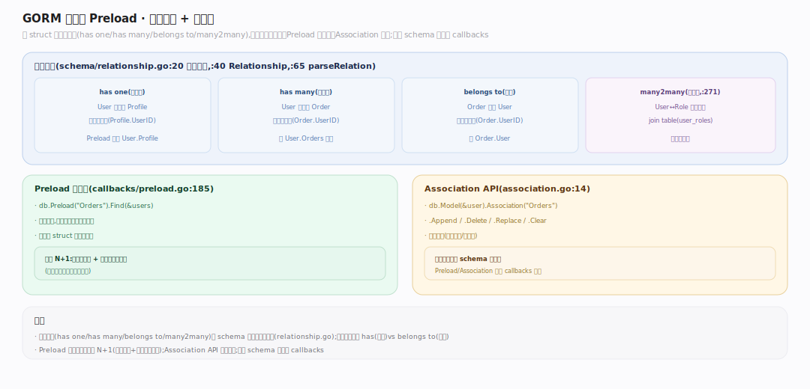

# GORM 核心原理 · 支撑能力域 · 关联 Association 与 Preload

> **定位**：管理 struct 之间的四种关系（has one / has many / belongs to / many2many）——解析关联元数据、`Preload` 预加载、`Association` API 增删关联。核实基准：`schema/relationship.go:40`（Relationship）、`:20`（四类型常量）、`:65`（parseRelation）、`:271`（many2many）、`association.go:14`、`callbacks/preload.go:185`。依赖 schema 反射与 callbacks。

## 一、四种关系 + 预加载 + Association

**关联解析**：`Schema.Relationships`（`relationship.go:28`）分四桶——`HasOne/HasMany/BelongsTo/Many2Many`（类型常量 `:20`：`has_one/has_many/belongs_to/many_to_many`）。`parseRelation`（`:65`）据字段类型 + tag（`foreignKey`/`references`/`many2many:表名`）推断外键归属：**belongs to** 外键在本表、**has one/many** 外键在对方表、**many2many** 经中间连接表（`buildMany2ManyRelation`，`:271`）；多态关联走 `buildPolymorphicRelation`（`:195`）。**Preload（预加载，读侧）**：`db.Preload("Orders")` 累积进 `Statement.Preloads`，query 链的 `gorm:preload` 回调触发 `preload`（`preload.go:185`）——**独立发一条 IN 查询**（`SELECT * FROM orders WHERE user_id IN (主键集)`）再按外键把结果**归位**到父对象，故 N 条父记录只 1+M 次查询（M=关联数），避免 N+1。**Association（写侧）**：`db.Model(&user).Association("Orders")` 返回 `*Association`（`association.go:14`），`Append`(`:58`)/`Replace`(`:75`)/`Delete`(`:199`)/`Clear`(`:367`)/`Count`(`:371`)/`Find`(`:51`) 增删改查关联记录（含维护连接表）。写路径的关联保存由回调 `save_before/after_associations` 自动完成。

---

## 拓展 · 四种关系

| 关系 | 外键位置 | tag | 典型 |
|---|---|---|---|
| belongs to | 本表 | `foreignKey` | User.CompanyID → Company |
| has one | 对方表 | `foreignKey` | User → CreditCard |
| has many | 对方表 | `foreignKey` | User → []Order |
| many2many | 连接表 | `many2many:表` | User ↔ Language |

---

## 补充 · Association API（association.go）

| 方法 | file:line | 作用 |
|---|---|---|
| `Find` | :51 | 查关联记录 |
| `Append` | :58 | 新增关联 |
| `Replace` | :75 | 全量替换 |
| `Delete` | :199 | 移除指定关联 |
| `Clear` | :367 | 清空关联（不删主记录） |
| `Count` | :371 | 关联计数 |

---

## 调优要点

- 用 `Preload` 而非循环里查关联，杜绝 N+1；关联多时用嵌套 `Preload("A.B")`。
- 大关联集用 `Preload("Orders", func(db) { return db.Where(...) })` 加条件裁剪。
- 只读关联字段可用 `Joins("Orders")`（单条 JOIN，适合一对一）替代 Preload（多条查询）。
- 不需要级联保存关联时 `Omit(clause.Associations)`，省 save_associations 递归。

---

## 常见误区

- **Preload 是 JOIN**：错，Preload 是**额外的 IN 查询**再归位；Joins 才是 JOIN。
- **has many 外键在本表**：错，has one/has many 外键在**对方表**，belongs to 才在本表。
- **Association.Clear 删关联记录**：Clear 只**解除关联**（清外键/连接表行），不删对方主记录。
- **many2many 要手建连接表**：AutoMigrate 会据 `many2many:` tag 自动建连接表。

---

## 一句话总纲

**关联能力域管四种 struct 关系：parseRelation 据类型+tag 推断外键归属（belongs to 在本表、has one/many 在对方表、many2many 走连接表）；读侧 Preload 由 gorm:preload 回调发独立 IN 查询再按外键归位、以 1+M 次查询消灭 N+1；写侧 Association API（Append/Replace/Delete/Clear）增删关联并维护连接表，级联保存由 save_before/after_associations 回调自动完成——它把对象图的关系映射成 SQL 的外键与连接表。**
