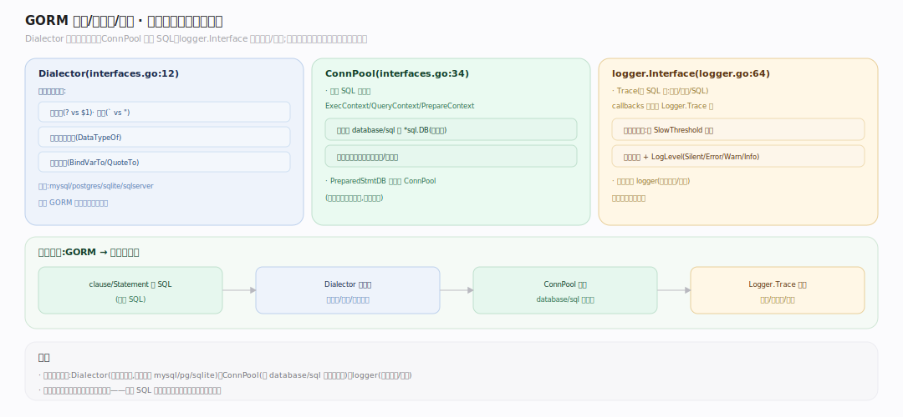

# GORM 核心原理 · 支撑能力域 · Dialector 方言 + 连接池 + Logger

> **定位**：GORM 与具体数据库、`database/sql`、日志系统的边界抽象。`Dialector`（`interfaces.go:12`）翻译方言差异（占位符/引号/类型/子句）、`ConnPool`（`:34`）执行 SQL、`logger.Interface`（`logger/logger.go:64`）记录慢查询与错误。核实基准：`interfaces.go`、`logger/logger.go`、`callbacks.go`（Logger.Trace）。是所有能力域落到真实数据库的出口。

## 一、方言抽象 / 连接池 / 日志

**Dialector**（`interfaces.go:12`）由 mysql/postgres/sqlite/sqlserver 等驱动包实现，接口方法：`Name()`、`Initialize(*DB)`（注册方言专属 callbacks + ConnPool）、`Migrator(*DB)`（返回方言 Migrator）、`DataTypeOf(*schema.Field)`（Go 类型→方言列类型）、`DefaultValueOf`、`BindVarTo`（写占位符：MySQL `?`、PG `$1`）、`QuoteTo`（写引号：`` ` `` vs `"`）、`Explain(sql, vars)`（回填参数供日志/DryRun）。**ConnPool**（`:34`）= `database/sql` 的执行面抽象：`PrepareContext/ExecContext/QueryContext/QueryRowContext`；`ConnPoolBeginner`（`:53`）开事务、`TxCommitter`（`:58`）提交回滚——GORM 把 `*sql.DB`/`*sql.Tx`/`PreparedStmtDB` 统一成 ConnPool，回调链末尾就调它执行。**Logger**（`logger/logger.go:64`）：`LogMode/Info/Warn/Error/Trace`；`Trace(ctx, begin, fc, err)` 在 `Execute` 末尾（`callbacks.go`）被调，记 SQL + 耗时 + 影响行数，超 `SlowThreshold` 标慢查询；`LogLevel`（`:36`：Silent/Error/Warn/Info）控噪。**连接池调优**经 `db.DB()` 拿底层 `*sql.DB` 设 `SetMaxOpenConns/SetMaxIdleConns/SetConnMaxLifetime`。

---

## 拓展 · Dialector 接口（interfaces.go:12）

| 方法 | 职责 |
|---|---|
| `Initialize` | 注册方言 callbacks + ConnPool |
| `Migrator` | 方言迁移器 |
| `DataTypeOf` | Go 类型→列类型 |
| `BindVarTo` | 占位符风格（? / $1） |
| `QuoteTo` | 标识符引号 |
| `Explain` | 回填参数供日志/DryRun |

---

## 补充 · ConnPool 与 Logger

| 抽象 | file:line | 要点 |
|---|---|---|
| `ConnPool` | interfaces.go:34 | Exec/Query/Prepare(Context) |
| `ConnPoolBeginner` | :53 | BeginTx |
| `TxCommitter` | :58 | Commit/Rollback |
| `logger.Interface` | logger/logger.go:64 | Trace/Info/Warn/Error |
| `LogLevel` | :36 | Silent/Error/Warn/Info |

---

## 调优要点

- 经 `db.DB()` 设连接池参数（MaxOpen/MaxIdle/ConnMaxLifetime），匹配数据库上限。
- 生产 `LogLevel: Warn` + 合理 `SlowThreshold`，只暴慢查询与错误。
- 换库只换 Dialector（import 驱动 + `gorm.Open(mysql.Open(dsn))`），上层代码不动。
- `Explain` 输出可用于审计/复现，但含明文参数，注意脱敏（`ParamsFilter`）。

---

## 常见误区

- **GORM 自带连接池**：错，连接池是 `database/sql` 的 `*sql.DB`，GORM 经 ConnPool 复用它。
- **换数据库要改业务代码**：基本不用，换 Dialector 即可（方言差异被抽象）。
- **占位符各库一样**：不一样，MySQL `?`、PG `$1`，由 `BindVarTo` 决定。
- **Logger 只打印**：`Trace` 还统计耗时/行数、标慢查询，是可观测入口。

---

## 一句话总纲

**Dialector+连接池+Logger 是 GORM 落到真实数据库的出口：Dialector 抽象方言差异（占位符 BindVarTo、引号 QuoteTo、类型 DataTypeOf、Explain 回填），Initialize 时注册方言 callbacks 与 ConnPool；ConnPool 把 *sql.DB/*sql.Tx/PreparedStmtDB 统一成执行面（Exec/Query/Prepare），回调链末尾调它执行；Logger.Trace 在执行后记 SQL+耗时+行数、标慢查询——换库只换 Dialector、连接池调优走底层 *sql.DB，上层链式代码零改动。**
