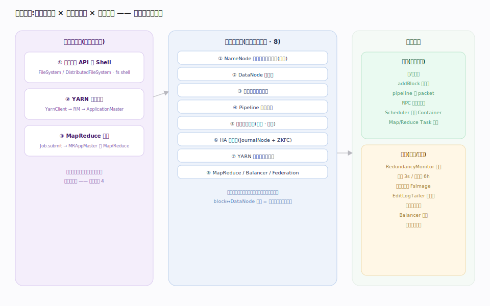
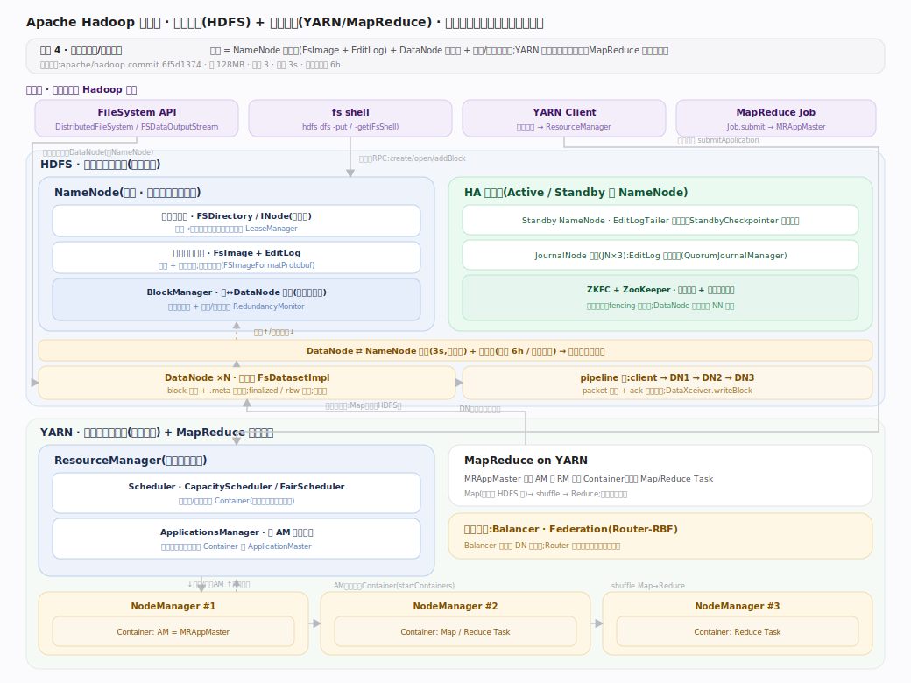
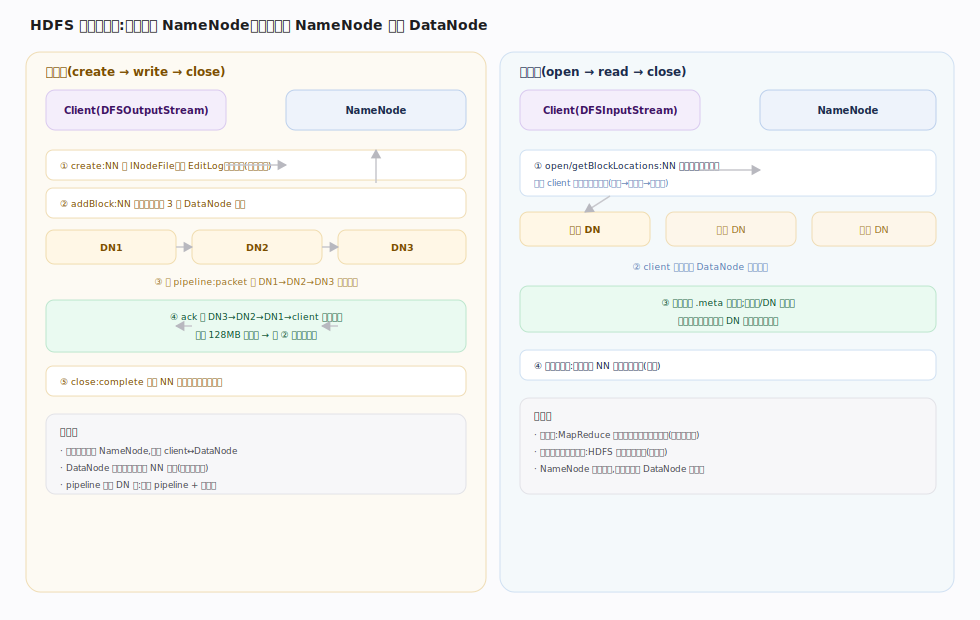
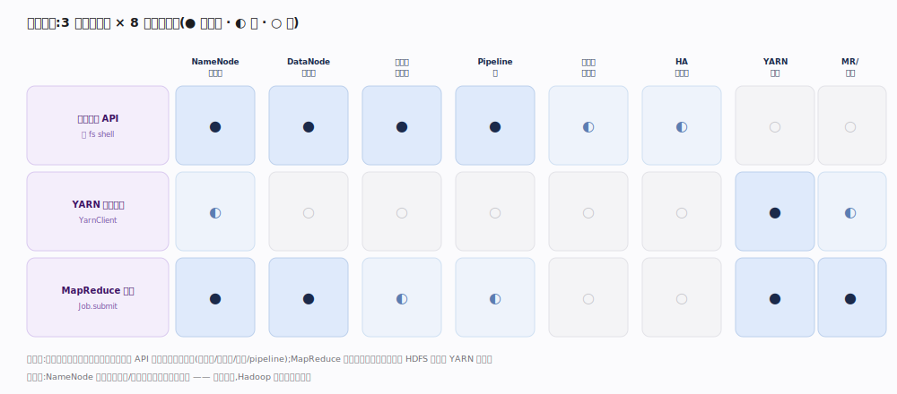

# 全景主线框架 · 从接触面到能力域

> **定位**：一张地图看懂 Apache Hadoop。用「接触面主线 × 支撑能力域 × 执行时机」三维模型把每条主线归位——它属于**家族 4 分布式存储/文件系统**（范例即 HDFS）：数据分块跨节点、主控（NameNode）管元数据、多副本容错；YARN 在存储之上做资源调度、MapReduce 是其上的一种计算范式。本篇是索引页，其余 11 篇是各主线的展开。核实基准：apache/hadoop commit `6f5d1374`。

## 双维模型 · 把每条主线归位

判型两问定家族：①**外部怎么和它交互**——通过 `FileSystem` 编程 API 与 `hdfs dfs` shell 读写文件、通过 YarnClient 提交应用；②**它自己管什么**——管命名空间元数据（NameNode）、管块的物理副本（DataNode）、管集群资源（ResourceManager）。据此判为**家族 4**。三维模型把 3 条接触面主线（文件系统 API/Shell、YARN 应用提交、MapReduce 作业）与 8 条支撑能力域正交排开，每个源码核心概念都能唯一归属：`INodeFile`→NameNode 元数据、`block↔DataNode` 映射→块放置、`packet` 流水→pipeline 写、`Container`→YARN 调度。

灵魂主线是 **NameNode 元数据（FsImage + EditLog）** 与 **心跳/块汇报对账**——前者是「文件系统长什么样」的唯一权威，后者是「块实际在哪」的持续校准。漏了这两条，Hadoop 文档就是散的。

## 总架构 · 存储平面 + 计算平面

物理上分两个平面：**存储平面 HDFS**（NameNode 主控 + DataNode×N + HA 三件套 JournalNode/ZKFC/Standby）与**计算平面 YARN**（ResourceManager 仲裁 + NodeManager×N 承载 Container，MapReduce 的 MRAppMaster 作为一种 AM 跑在其上）。关键分工：`NameNode`（`FSNamesystem.java:389`）只持有元数据全内存镜像，`block↔DataNode` 的映射不持久化、靠块汇报在内存重建；数据带宽全部由 DataNode 群提供，NameNode 只发「位置」不碰数据字节。

这张图也是交互图谱的**导航底图**：点任意模块即下钻到对应主线。

## 读写数据流 · 元数据与数据分离

一条贯穿声明：**元数据走 NameNode、数据不经 NameNode 直连 DataNode**。写路径 `create`→`addBlock`→pipeline 传 packet→`complete`（`DistributedFileSystem.java:603` → `DFSClient.java` → `DFSOutputStream.java:96` + `DataStreamer.java:119`）；读路径 `open`/`getBlockLocations`→client 直连最近副本 DataNode（`DFSInputStream.java:103`，`blockSeekTo:609`）。HDFS 是「一次写入、多次读取」模型：不支持随机写，只支持追加。

## 依赖矩阵 · 谁依赖谁

读横行=某接触面依赖哪些能力域。文件系统 API 强依赖存储四件套（元数据/块存储/放置/pipeline）；MapReduce 因**数据本地性**同时强依赖 HDFS 存储与 YARN 调度。灵魂列 NameNode 元数据、心跳/块汇报被最多接触面依赖，与「双维模型」里的灵魂判定三角一致。

## 深化 · 三条贯穿声明

| 贯穿声明 | 含义 | 源码落点 |
|---|---|---|
| 元数据与数据分离 | NameNode 只管命名空间元数据；数据字节永不经过 NameNode | `FSNamesystem.java:389`、`DFSOutputStream.java:96` |
| 块映射内存重建 | `block↔DataNode` 映射不写盘，靠 DataNode 块汇报在内存 `blocksMap` 重建 | `BlockManager.java:340`（blocksMap）、`:3278`（processFirstBlockReport） |
| 期望态 vs 实际态对账 | NameNode 记「块应有几副本」，靠心跳+块汇报持续与 DataNode 实际态对账，欠则复制、多则删 | `HeartbeatManager.java:441`、`BlockManager.java:5388`（RedundancyMonitor） |

## 深化 · 关键默认值（回目标版本源码取值）

| 常量 | 默认值 | 源码 |
|---|---|---|
| 块大小 `dfs.blocksize` | 128 MB | `HdfsClientConfigKeys.java:32` |
| 副本数 `dfs.replication` | 3 | `HdfsClientConfigKeys.java:34` |
| 心跳间隔 `dfs.heartbeat.interval` | 3 秒 | `DFSConfigKeys.java:1029` |
| 全量块汇报 `dfs.blockreport.intervalMsec` | 6 小时 | `DFSConfigKeys.java:1116` |
| 检查点周期 `dfs.namenode.checkpoint.period` | 3600 秒 | `DFSConfigKeys.java:257` |
| 检查点事务阈值 `dfs.namenode.checkpoint.txns` | 100 万 | `DFSConfigKeys.java:259` |

## 调优要点

- **NameNode 内存是命名空间上限**：全部 INode 与块驻内存，海量小文件会撑爆堆——用 HAR/合并或 Federation 横向扩命名空间。
- **块大小按访问模式调**：大文件顺序读用大块（256MB/512MB）减少块数与 NameNode 压力；小文件不因大块受益。
- **副本数权衡可靠性与成本**：热数据 3 副本，冷数据可用纠删码（EC）把存储开销从 200% 降到约 50%。
- **机架拓扑必须配对**：`net.topology.script`/表未配时全集群视作一个机架，放置策略退化、跨机架容错失效。

## 常见误区

- **误以为 NameNode 存数据**：它只存元数据；数据字节在 DataNode，读写带宽由 DataNode 群提供。
- **误以为块映射持久化在 FsImage**：`block→DataNode` 位置**不写盘**，重启后靠块汇报重建（安全模式即等汇报到阈值）。
- **误以为 HDFS 支持随机写**：只支持一次写入 + 追加（append），不支持覆盖中间字节。
- **误把 Secondary NameNode 当热备**：它只帮做检查点合并，不是 HA；真正的热备是 Standby NameNode + JournalNode。

## 一句话总纲

**Hadoop = 一张全内存的命名空间地图（NameNode）+ 一群只管块字节的搬运工（DataNode）+ 持续对账的心跳/块汇报，YARN 在其上租借资源、MapReduce 就近计算——元数据与数据始终分离。**
