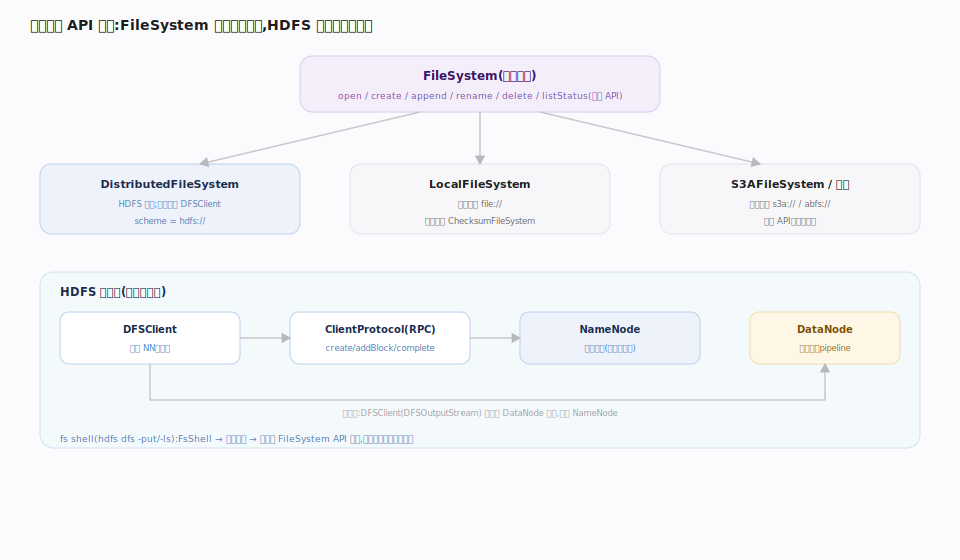

# 接触面 · FileSystem API 与 fs shell

> **定位**：Hadoop 面向用户的第一层门面。`FileSystem` 是一个**可插拔抽象基类**，HDFS 只是它的一种实现（`DistributedFileSystem`），本地盘、S3、ABFS 是另外的实现——同一套 `open/create/append/rename/delete/listStatus` API 屏蔽后端差异。`hdfs dfs` 命令行（`FsShell`）不过是这套 API 的一层 CLI 包装。上承用户程序与运维脚本，下启 NameNode 元数据操作与 DataNode 数据传输。

## FileSystem 抽象与实现

`FileSystem`（`hadoop-common-project/hadoop-common/src/main/java/org/apache/hadoop/fs/FileSystem.java:172`）是抽象基类，定义统一文件操作契约。`FileSystem.get(conf)`（`:268`）按 URI scheme（`hdfs://` / `file://` / `s3a://`）从配置查实现类并实例化，且带一层进程级 `CACHE`（`:205`）复用连接。

HDFS 的实现是 `DistributedFileSystem`（`hadoop-hdfs-project/hadoop-hdfs-client/src/main/java/org/apache/hadoop/hdfs/DistributedFileSystem.java:154`，`getScheme:178` 返回 `hdfs`）。它自己不实现协议，而是**委托内部的 `DFSClient`**（`:160` 持有 `DFSClient dfs`）。`create()`（`:603`）与 `open()`（`:340`）都转成 `DFSClient` 调用。`DFSClient`（`hadoop-hdfs-client/.../DFSClient.java:215`）通过 `ClientProtocol namenode`（`:222`）这个 RPC 代理与 NameNode 通信，`getLocatedBlocks`（`:907`）取块位置。

## fs shell 与 ClientProtocol RPC

`hdfs dfs -put/-get/-ls` 走 `FsShell`（`hadoop-common/.../fs/FsShell.java:45`），它是一个 `Tool`：`registerCommands`（`:111`）注册命令表，把参数解析成 `Command` 对象后**同样经 `FileSystem` API 落地**——与编程接口共用一条路，没有捷径。

元数据操作（create/mkdir/rename/delete/addBlock/complete）经 `ClientProtocol` 这一 RPC 接口打到 NameNode，只改命名空间；数据字节则由 `DFSClient` 直连 DataNode（见 pipeline 写主线）。这就是「元数据走 NameNode、数据不经 NameNode」在接触面层的体现。

## 深化 · FileSystem 家族实现对照

| 实现类 | scheme | 后端 | 特点 |
|---|---|---|---|
| DistributedFileSystem | hdfs:// | HDFS 集群 | 委托 DFSClient；块+副本+pipeline |
| LocalFileSystem | file:// | 本地磁盘 | ChecksumFileSystem 带 .crc 校验 |
| S3AFileSystem | s3a:// | AWS S3 对象存储 | 无真正目录/rename 昂贵；最终一致语义 |
| AzureBlobFileSystem | abfs:// | Azure Data Lake | 同一 API、异构后端 |
| ViewFileSystem | viewfs:// | 挂载表 | 客户端挂载多命名空间（Federation） |

## 调优要点

- **复用 FileSystem 实例**：`FileSystem.get` 有 `CACHE`，同 URI+conf 返回同一实例；频繁 `newInstance` 会泄漏连接。用完 `close()` 或用带 disable-cache 配置隔离。
- **fs shell 批量操作合并**：逐文件 `-put` 每次一次 RPC；用 `-put` 一个目录或 `distcp` 并行，减少 NameNode RPC 压力。
- **短路读（short-circuit）**：client 与 DataNode 同机时开 `dfs.client.read.shortcircuit`，绕过 TCP 直接读本地块文件。

## 常见误区

- **误以为 rename 在所有实现里都是原子 O(1)**：HDFS 上是元数据原子改；S3A 上 rename = 复制+删除，昂贵且非原子。
- **误以为 shell 命令有特殊通道**：`hdfs dfs` 与 Java API 完全同路，性能特征一致。
- **误把 `hadoop fs` 与 `hdfs dfs` 当不同能力**：`hadoop fs` 面向任意 FileSystem，`hdfs dfs` 等价但语义限定 HDFS，二者底层同一 `FsShell`。

## 一句话总纲

**FileSystem 是可插拔门面、HDFS 只是其一种实现；fs shell 是 API 的 CLI 皮肤——所有入口最终都分成两股：元数据 RPC 打 NameNode、数据字节直连 DataNode。**
