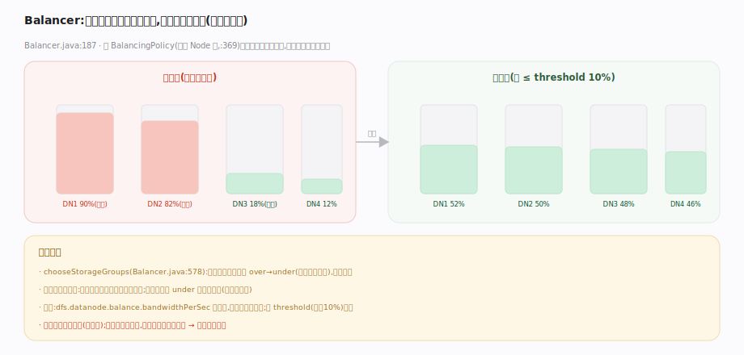

# 支撑 · Balancer 与 Federation

> **定位**：两项让 HDFS 长期健康、横向扩展的运维/架构能力。**Balancer** 解决「各 DataNode 磁盘利用率不均」——把块从满节点搬到空节点，不改副本数、不停服；**Federation（含 Router-based RBF）** 解决「单 NameNode 命名空间与内存上限」——用多个独立 NameNode 各管一部分命名空间，Router 提供统一挂载视图。二者都属后台/扩展能力，被大规模生产集群依赖。

## Balancer · 磁盘利用率均衡

`Balancer`（`.../hdfs/server/balancer/Balancer.java:187`）是一个可随时运行的客户端工具（非常驻）。它按 `BalancingPolicy`（`:369`，默认 Node 级）计算集群平均利用率，把节点分为**过载（over）/欠载（under）/正常**四类，`chooseStorageGroups`（`:578`）优先配对**同机架**的 over→under（省跨机架带宽），再跨机架。随后调度块移动：从 over 节点选块，在保证**放置策略不被破坏**（不能把两副本挪到同机架冲突）的前提下复制到 under 节点，成功后删原副本。

移动带宽受 `dfs.datanode.balance.bandwidthPerSec` 限流，避免影响正常读写。每轮达到阈值（`threshold`，默认 10%，即各节点利用率与集群均值差 ≤10%）即停。

## Federation 与 Router（RBF）

单 NameNode 的命名空间受限于其内存（所有 INode+块驻堆）。**Federation** 用**多个互相独立的 NameNode**，各管一个 namespace（如 `/user`、`/data`），共享同一批 DataNode（每个 DataNode 向所有 NameNode 汇报，块池 BlockPool 隔离）。

客户端如何用统一视图？两种：① ViewFileSystem 客户端挂载表（`viewfs://`）——挂载点配置在客户端；② **Router-based Federation（RBF）**——一层无状态 Router 服务把统一命名空间挂载到各 NameNode，挂载表存在 State Store，客户端只连 Router、由 Router 转发到正确的 NameNode。RBF 把挂载逻辑从客户端移到服务端，运维更集中。

## 深化 · Balancer vs Federation

| 能力 | Balancer | Federation/RBF |
|---|---|---|
| 解决什么 | DataNode 磁盘利用率不均 | 单 NameNode 命名空间/内存上限 |
| 改动对象 | 块的物理分布（不改副本数） | 命名空间水平拆分 |
| 形态 | 按需运行的工具 | 多 NameNode + Router 架构 |
| 关键约束 | 不破坏块放置策略 | 各 NN 独立、共享 DataNode |
| 源码 | `Balancer.java:187` | ViewFs / RBF Router |

## 调优要点

- **Balancer 限带宽 + 低峰跑**：`dfs.datanode.balance.bandwidthPerSec` 与 `dfs.balancer.max-size-to-move` 控制影响面；扩容后必跑一次。
- **threshold 按需求设**：默认 10%；追求更均衡设小，但收敛慢、搬得多。
- **Federation 按业务/热度拆命名空间**：把高频小文件目录单独一个 NameNode，隔离内存压力。
- **RBF Router 无状态可多实例**：前置负载均衡横向扩 Router，State Store（ZK/内嵌）存挂载表与配额。

## 常见误区

- **误以为 Balancer 改副本数**：只搬块位置使利用率均衡，副本数不变。
- **误以为 Federation 是 HA**：Federation 是命名空间水平扩展，与 HA（主备容错）正交，可叠加使用。
- **误以为多 NameNode 共享命名空间**：各 NameNode 命名空间**独立不重叠**，靠客户端/Router 挂载拼成统一视图。
- **误以为 Balancer 一次跑完永久均衡**：新写入会再打破均衡，需周期性运行。

## 一句话总纲

**Balancer 在不改副本数的前提下把块从满节点搬到空节点、按机架就近配对求均衡；Federation 用多个独立 NameNode 各管一段命名空间、Router（RBF）拼出统一视图——一个治「数据倾斜」、一个治「命名空间上限」，都与 HA 正交可叠加。**
