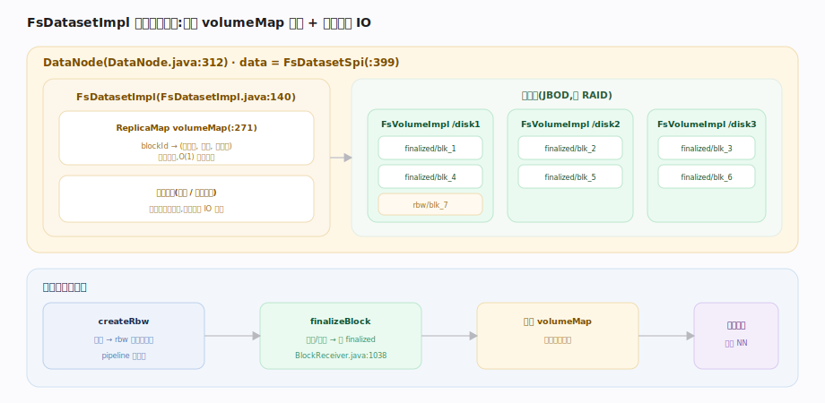

# 支撑 · DataNode 块存储

> **定位**：HDFS 的「体力劳动者」。DataNode 只做一件事——把块（block）的字节存到本地磁盘、按需读出，并向 NameNode 汇报自己有哪些块。它不认识文件、不认识目录，只认识块 id。一个块在磁盘上落成两个文件：数据文件 `blk_<id>` + 校验和文件 `blk_<id>_<gs>.meta`。上承 pipeline 写入的字节流，下启本地文件系统；被文件系统 API、pipeline 写、心跳块汇报强依赖。

## 块的物理布局 · block + .meta

DataNode 主类 `DataNode`（`hadoop-hdfs-project/hadoop-hdfs/src/main/java/org/apache/hadoop/hdfs/server/datanode/DataNode.java:312`）通过 `FsDatasetSpi data`（`:399`）操作块存储。每个块在磁盘上是**一对文件**：`blk_<blockId>`（纯数据）+ `blk_<blockId>_<genStamp>.meta`（校验和头 + 每 512 字节一个 CRC，`dfs.bytes-per-checksum` 默认 512，`HdfsClientConfigKeys.java:135`）。读时用 .meta 逐 chunk 校验，损坏则报坏块并切副本。

块按生命周期放不同目录：正在写入的在 `rbw`（replica being written）、写完的在 `finalized`。`genStamp`（generation stamp，代际戳）随 pipeline 恢复递增，用于识别过期副本。

## FsDatasetImpl 与卷管理

`FsDatasetImpl`（`.../datanode/fsdataset/impl/FsDatasetImpl.java:140`）是 `FsDatasetSpi` 的默认实现，管理本节点所有磁盘（卷 `FsVolumeImpl`）上的块。核心是 `ReplicaMap volumeMap`（`:271`）——内存里 blockId→副本元信息（所在卷、状态、字节数）的映射。多块盘时按选卷策略（轮询/可用空间）分散块，充分利用多轴 IO 带宽。

写入时先在某卷 `rbw` 目录 `createRbw` 建临时副本，写满或关闭后 `finalizeBlock`（由 `BlockReceiver.java:1038` 触发）移到 `finalized` 并加入 `volumeMap`，随后经增量块汇报告诉 NameNode「我这里多了个块」。后台还有块扫描线程周期校验 .meta 检出静默损坏（bit rot）。

## 深化 · 块存储关键机制

| 机制 | 作用 | 源码 |
|---|---|---|
| block + .meta 双文件 | 数据与 CRC 校验和分离，读时逐 chunk 验 | `dfs.bytes-per-checksum=512` |
| rbw / finalized 目录 | 区分在写副本与已完成副本 | `BlockReceiver.java:986` |
| genStamp 代际戳 | 识别 pipeline 恢复后的过期副本 | `BlockReceiver.java` |
| ReplicaMap volumeMap | 内存 blockId→副本位置索引 | `FsDatasetImpl.java:271` |
| 块扫描 | 后台校验和巡检检出 bit rot | DataBlockScanner |

## 调优要点

- **多盘 JBOD 而非 RAID**：HDFS 副本已提供冗余，用 JBOD 让每块盘独立提供 IO 带宽；RAID 反而浪费空间且限速。
- **卷选择策略按可用空间**：盘容量不均时用 AvailableSpaceVolumeChoosingPolicy，避免某盘先满。
- **保留空间给非 HDFS**：`dfs.datanode.du.reserved` 预留系统/临时空间，防写满磁盘。
- **块扫描周期**：`dfs.datanode.scan.period.hours`（默认 3 周）过长则坏块发现慢，过短增 IO。

## 常见误区

- **误以为 DataNode 懂文件**：它只认块 id，文件→块的映射在 NameNode。
- **误以为一个块占满 128MB 磁盘**：块是上限；50MB 文件的块只占 50MB，不预分配。
- **误以为副本损坏要人工修**：读时校验发现坏块→上报 NameNode→自动从好副本复制补齐，无需干预。

## 一句话总纲

**DataNode 只认块不认文件——把每个块存成「数据 + 校验和」一对文件，靠 FsDatasetImpl 的内存 volumeMap 索引多盘副本，写完即增量汇报给 NameNode，坏块靠校验和巡检自愈。**
