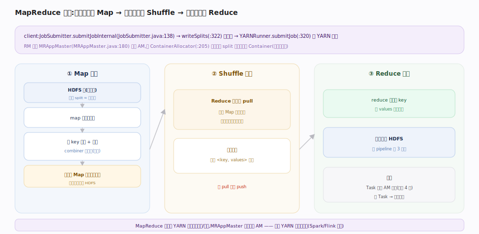

# 支撑 · MapReduce 执行

> **定位**：Hadoop 原生的分布式计算范式，也是「计算贴着数据跑」的典范。一个 MapReduce 作业在 YARN 上表现为一个应用：`MRAppMaster` 作为 AM 向 RM 申请 Container、把作业切成 Map/Reduce Task 调度执行；Map 阶段就近读 HDFS 块、Reduce 阶段经 shuffle 汇聚。它演示了接触面（YARN 提交）+ 存储（HDFS 本地性）+ 调度（YARN）三者如何协同。

## 作业执行流程 · Map → Shuffle → Reduce

client 侧 `JobSubmitter.submitJobInternal`（`hadoop-mapreduce-client-core/.../mapreduce/JobSubmitter.java:138`）先 `writeSplits`（`:322`）计算输入分片（一个 split 通常对应一个 HDFS 块），把 jar/配置/split 信息上传到提交目录，再经 `YARNRunner.submitJob`（`hadoop-mapreduce-client-jobclient/.../mapred/YARNRunner.java:320`）→`createApplicationSubmissionContext`（`:574`）把作业变成 YARN 应用提交。

RM 启动 `MRAppMaster`（`hadoop-mapreduce-client-app/.../v2/app/MRAppMaster.java:180`）作为 AM。它 `createOutputCommitter`（`:311`）、通过 `ContainerAllocator`（`:205`）向 RM 申请 Container（**优先申请 split 所在节点**，实现数据本地性），拿到后调度：

1. **Map**：每个 split 一个 Map Task，在数据所在（或同机架）节点启动，读块→执行 map→按 key 分区、排序、溢写本地磁盘。
2. **Shuffle**：Reduce 端从各 Map 节点**拉取**属于自己分区的中间数据，归并排序。
3. **Reduce**：对每个 key 的值集合执行 reduce→输出写回 HDFS（经 pipeline 写，3 副本）。

Task 失败由 AM 重试（默认 4 次）；慢 Task 触发**推测执行**（在别的节点跑副本，谁先完成用谁）。

## 深化 · MapReduce 三阶段

| 阶段 | 输入 | 处理 | 输出去向 |
|---|---|---|---|
| Map | HDFS 块（本地读） | map + 分区 + 排序 + 溢写 | Map 节点本地磁盘 |
| Shuffle | 各 Map 的分区数据 | 网络拉取 + 归并排序 | Reduce 节点内存/磁盘 |
| Reduce | 排序后的 <key, values> | reduce | HDFS（pipeline 写 3 副本） |

## 调优要点

- **split 对齐块大小**：一个 split ≈ 一个块，太多小 split 起太多 Map（调度开销），太大丢并行度。
- **combiner 减 shuffle 量**：map 端预聚合（如求和/计数），大幅降低网络传输。
- **推测执行按集群定**：异构/易掉队集群开启治慢节点；资源紧张时关闭省资源。
- **reduce 数量**：太少 reduce 端倾斜，太多小文件多 + 调度开销；按数据量与并行度估。

## 常见误区

- **误以为 Map 数由用户设**：Map 数由输入 split 数决定（≈块数），不是直接配置。
- **误以为 shuffle 是 push**：是 Reduce 端主动 pull 各 Map 的中间结果。
- **误把 MapReduce 当 YARN 的一部分**：MapReduce 是跑在 YARN 上的**一个应用/框架**，MRAppMaster 只是一种 AM；Spark/Flink 同样是 AM。
- **误以为中间数据进 HDFS**：Map 中间输出在本地磁盘，只有最终 Reduce 结果写 HDFS。

## 一句话总纲

**MapReduce 把作业切成「就近读块的 Map + 拉取归并的 Shuffle + 汇聚输出的 Reduce」，由 MRAppMaster 作为 YARN 上的一个 AM 申请 Container 调度执行——它是计算贴着 HDFS 数据跑的范式样板，而非 YARN 的内建能力。**
