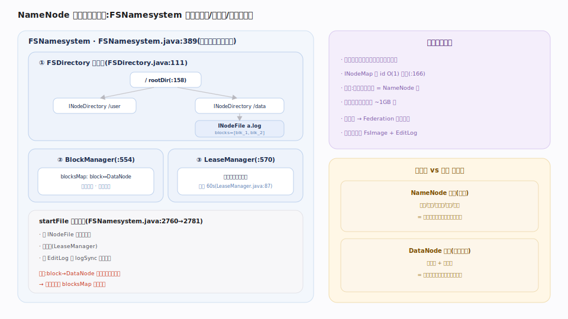
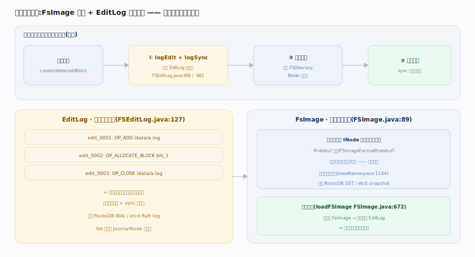
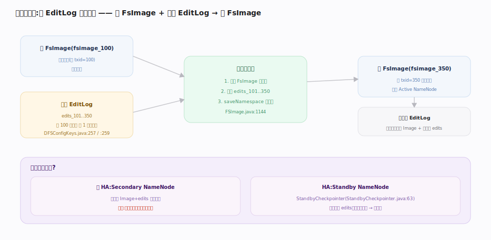

# 支撑 · NameNode 命名空间与元数据（FsImage + EditLog）★灵魂

> **定位**：整个 HDFS 的「大脑」与单一权威。NameNode 在内存里持有**完整命名空间树**（目录/文件/块列表/权限/租约），并用 **FsImage（周期快照）+ EditLog（预写日志）**这对组合把它持久化——这是家族 4 与计算引擎家族（Doris FE、etcd Raft 日志）高度同构的「元数据 = 快照 + 增量日志」模式。灵魂之处：文件系统「长什么样」的唯一真相在这里；一旦丢失且无 HA，集群即不可用。被文件系统 API、块管理、HA 三条主线强依赖。

## 命名空间树与 INode

`FSNamesystem`（`hadoop-hdfs-project/hadoop-hdfs/src/main/java/org/apache/hadoop/hdfs/server/namenode/FSNamesystem.java:389`）是命名空间的容器与并发协调者，持有三大件：目录树 `FSDirectory dir`（`:553`）、块管理 `BlockManager blockManager`（`:554`）、租约管理 `LeaseManager leaseManager`（`:570`）。所有元数据读写经全局读写锁串行化（`dir.writeLock`）。

`FSDirectory`（`FSDirectory.java:111`）维护 `INodeDirectory rootDir`（`:158`）为根的**全内存 INode 树**，并用 `INodeMap inodeMap`（`:166`）按 id 快速索引。文件是 `INodeFile`，持有它的块列表（`BlockInfo[]`）；目录是 `INodeDirectory`。`startFile`（`FSNamesystem.java:2760`→`startFileInt:2781`）创建文件时建 `INodeFile`、授租约、写 EditLog。

关键点：**`block→DataNode` 的物理位置不在这棵树里**——树只记「文件由哪些块组成」，块「在哪台机器」靠块汇报在 `BlockManager` 的内存 `blocksMap` 重建。

## FsImage + EditLog 双档持久化

内存树必须能崩溃恢复，靠两个档案：

- **EditLog**（`FSEditLog.java:127`）——预写日志。每个变更操作（创建、删除、addBlock…）先 `logEdit`（`:466`）追加一条 `FSEditLogOp`，再 `logSync`（`:661`）刷盘后才对客户端返回成功。`logOpenFile`（`:830`）即记一次文件创建。它是「自上次快照以来发生了什么」的增量。
- **FsImage**（`FSImage.java:89`）——某时刻整棵命名空间树的序列化快照（Protobuf 格式）。启动时 `loadFSImage`（`:672`）先载最新 FsImage、再重放其后的 EditLog，恢复到崩溃前状态。

写路径的顺序是铁律：**先写 EditLog 并 sync、后改内存**（预写日志保证崩溃不丢已确认操作）。

## 检查点合并 · 防 EditLog 无限膨胀

EditLog 不断增长会拖慢重启（重放耗时）。**检查点（checkpoint）**周期性地：载入旧 FsImage + 重放累积的 EditLog → 得到新的内存树 → `saveNamespace`（`FSImage.java:1144`）序列化为新 FsImage → 截断旧 EditLog。默认每 3600 秒（`DFSConfigKeys.java:257`）或累积 100 万条事务（`:259`）触发其一即做。

谁来做？非 HA 时是 Secondary NameNode；**HA 时由 Standby NameNode 的 `StandbyCheckpointer` 承担**（见 HA 主线）——Standby 本就在追 EditLog、内存已有最新树，做检查点顺手，还能减轻 Active 负担。

## 深化 · FsImage vs EditLog

| 维度 | FsImage | EditLog |
|---|---|---|
| 形态 | 整棵命名空间树的 Protobuf 快照 | 追加式操作日志（FSEditLogOp 序列） |
| 写入时机 | 检查点时整体写 | 每次元数据变更即时追加 + sync |
| 恢复角色 | 恢复起点（载入基线） | 在基线上重放到最新 |
| 类比 | RocksDB SST / etcd snapshot | RocksDB WAL / etcd Raft log |
| 源码 | `FSImage.java:89` | `FSEditLog.java:127` |

## 深化 · 关键默认值

| 配置 | 默认值 | 源码 |
|---|---|---|
| `dfs.namenode.checkpoint.period` | 3600 秒 | `DFSConfigKeys.java:257` |
| `dfs.namenode.checkpoint.txns` | 100 万事务 | `DFSConfigKeys.java:259` |
| 租约软限制 | 60 秒（超时可被抢占续约） | `LeaseManager.java:87` |

## 调优要点

- **EditLog 放独立高速盘**：`dfs.namenode.edits.dir` 与 FsImage 目录分离，logSync 是写路径关键延迟点。
- **检查点频率权衡**：太稀则重启慢、EditLog 大；太频则 IO 抖动。默认 1 小时/100 万事务多数场景合适。
- **NameNode 堆按 INode+块数估**：经验约每百万对象 ~1GB 堆；预留 GC 空间，用 G1/ZGC 降停顿。

## 常见误区

- **误以为块位置存在 FsImage 里**：FsImage/EditLog 只有命名空间与块列表，`block→DataNode` 位置从不持久化，靠块汇报重建（重启进安全模式即等汇报）。
- **误以为 Secondary NameNode 是备份/热备**：它只帮合并检查点、回传 FsImage，不持有可切换的服务状态。
- **误以为改内存就算成功**：客户端可见的成功必须在 EditLog sync 之后；这是不丢数据的根基。

## 一句话总纲

**NameNode 把整个文件系统装进内存，用「FsImage 快照 + EditLog 预写日志 + 周期检查点合并」保证崩溃可恢复——写元数据先落日志再改内存，而块的物理位置永不入档、靠块汇报重建。**
